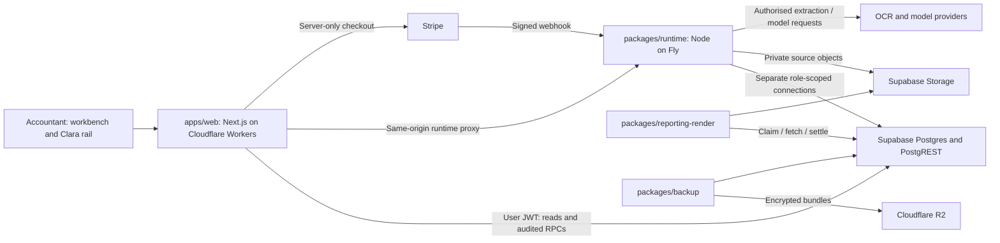

# Clara — Architecture

This is the technical companion to the [PRD](PRD.md). It describes implemented boundaries and
their reasons. Package READMEs own setup and operating procedures. [Work](WORK.md) links
accepted design decisions, proposals and their evidence; an accepted target is not an
implemented boundary. Correct current-source findings here when verified, and update affected
architecture in the same change as its implementation. Keep local checks and hosted observations
distinct. Domain vocabulary and applicable decision records follow the repository's domain-doc
convention.

## System shape

Postgres holds accounting state, authority, receipts and durable workflow state. Object storage
holds original evidence and generated bytes. The web app and agent use that shared state; neither
keeps a competing ledger. Pre-firm admission is a separate access domain because its applicant
does not yet belong to a firm.

## Repository map and stack

| Path | Responsibility |
|---|---|
| `apps/web` | Next.js App Router, React, TypeScript, Tailwind, Base UI/shadcn, next-intl and Supabase cookie auth. OpenNext packages the app for Cloudflare Workers. |
| `packages/runtime` | AI SDK model/tool loop, Workflow SDK Postgres world, Nitro server build, document intake, event consumers, reconciliation and SSE. Long-running Fly process. |
| `packages/db` | Ordered SQL migrations, reference seeds, audited accounting functions, tenant isolation, test rigs and backup/restore tools. |
| `packages/reporting-render` | Independently imaged deterministic report renderer and artifact delivery support. |
| `packages/backup` | Independently imaged encrypted off-site backup job. |
| `scripts` | Repository verification and operating helpers used by package scripts or CI. |
| `.github` | GitHub Actions: source checks, database estate tests, upgrade/replay drills and release evidence. |
| `.claude`, `.agents`, `.codex` | Repository skills originate in `.claude/skills`; `.agents/skills` holds local Codex copies and local-only additions. Hook and MCP configuration stay with their tools. Product requirements live in the PRD. |

Read manifests and lockfiles for exact versions. The workspace defaults to Node 20 and pnpm;
`apps/web` declares a package-managed Node 22 runtime for its scripts and Cloudflare tooling.
Backup and renderer are outside the pnpm workspace and have their own image/dependency lifecycle.
The dashboard and spike are retired.

Cloudflare's official API MCP supplies agent-facing documentation and account operations through
project MCP configuration. OpenNext and the package-pinned Wrangler CLI own local web builds,
version uploads and release promotion. These are engineering tools, separate from Clara's
accounting-agent tools. Setup and authentication are described in the web README.

The key choices are a single RLS-isolated database rather than a project per firm, durable work
independent of the browser, a long-running workflow host, and thin clients over audited domain
operations. AI SDK separates model access from persisted workflow steps and interruptions. These
choices do not establish complete product coverage: the gaps in Work still apply.

## Frontend and identity boundary

`apps/web/app` separates entry/auth routes, firm routes and full-screen surfaces. The client URL
selects the workspace. `components` contains workbenches, dialogs, the Clara rail and card readers;
`lib` contains domain adapters, session/scope handling and read/write boundaries; `messages` owns
localised copy; `app/globals.css` supplies shared visual tokens.

Supabase SSR clients manage cookies. Server session resolution obtains a verified caller context;
database functions consult current membership so an old JWT does not preserve a removed role.
UI capability checks improve navigation, but database authorisation is decisive.

`lib/read.ts` (`getRows`) performs authenticated PostgREST reads; `lib/doors.ts` (`callDoor`)
invokes audited RPCs and returns typed refusals. Financial rows are not mutated optimistically.
After an operation, the UI re-reads state, keeps a failed action visible and renders money from
exact minor units. Large identifiers must survive JSON without JavaScript number rounding; the
remaining freeform-read exception is tracked in Work.

The browser reaches the runtime through `app/api/runtime/[...path]/route.ts`. This same-origin
proxy reads its target at request time and forwards an allowlisted header set, including the
session bearer. It supports chat, task streams, interviews, intake and document bytes. Runs
continue without an SSE client. The stream route rechecks task access on each poll and emits
revocation when authority is lost.

Service credentials belong in runtime/server-only handlers. The web server has narrowly needed
credentials for checkout and invitation delivery; the browser holds public configuration and its
user session. `NEXT_PUBLIC_*` is never a secret channel. `wrangler.jsonc` owns the Worker's
plain-text deployment variables; secrets are configured separately.

The parts catalog is a discriminated contract between runtime emissions and web readers. It
supports hydration of past actions as well as live replies. Current parity checks cover kinds,
not full field schemas or independently deployed versions; several parts still have only
identifier-level readers. These are implementation gaps.

## Database authority and accounting

Clara can choose and execute accounting work. `wake_post_entry` and the agent posting core admit
agent-authored postings with model/version attribution. The acceptance boundary is the audited
operation: it validates accounting meaning, authority and evidence as well as input shape.

- **Isolation:** firm-scoped tables enforce `firm_id` RLS. Application writers have EXECUTE on
  named functions rather than unrestricted DML. Definer functions validate context and scope;
  ownership, search path and grants are part of the boundary.
- **Separate privileges:** human, agent read/write, freeform, bank, webhook and auth-wall
  connections have distinct purposes. A read connection cannot obtain write authority by
  wrapping a writer in `SELECT`. Read-only session settings supplement grants; changing role is
  not the same as starting a new login session.
- **Managed catalog limit:** the public-schema ACL baseline cannot revoke provider-owned
  `pg_catalog` functions on hosted Supabase. Public access to notification, advisory-lock,
  sleep and XML helper families is a recorded residual, not a closed privilege boundary.
  Freeform-read policy and timeouts need their own evidence against that surface.
- **Attribution and evidence:** client-scoped document actions require a persisted resolution.
  The current function accepts human, rule and judgement origins. Its numeric confidence
  predicate remains in SQL; judgement resolutions are minted at 1.0. This is not a model
  self-assessment knob. Document-backed entries bind to an ingested document and its source hash.
- **Exact accounting:** money uses integer minor units, with DB balance and rounding rules.
  Approval is revision-bound; posted history is immutable, corrected by reversal/supersession.
  Account relationships and domain checks protect the books beyond the JSON/schema shape.
- **Atomic consequences:** `_subledger_on_approve` keeps open items with GL posting; settlement
  and asset operations maintain their domain state and audit events in the transaction. Wiki and
  other projections follow committed events asynchronously.
- **Reconciliation transaction scope:** complete one reconciliation per transaction. The deferred
  settled-authority check carries one receipt; any future bulk-completion path must first remove
  that limitation. The current UI follows the supported shape.
- **Retries:** insert-style operations accept idempotency keys. A lost response or replay must
  return the prior effect. Actor binding is also necessary; inconsistent wrapper conventions
  remain in Work.

The current human approval core still contains high-amount maker/checker and attestation gates.
Migration 0106 excludes agent calls from that branch; unattended posting instead enters through
its own credential, evidence and current-books checks. The refresh revalidates human ceremonies
against the automation contract. Removing a web threshold control did not remove its DB gate.

Migrations are ordered, checksum-checked deployment inputs. Read the latest replacement of a
function, not only its first definition. Historical migrations and retained workflow versions are
executable upgrade/recovery dependencies; document cleanup does not justify deleting them.

## Admission and operator support

Signup and recovery use Supabase Auth mail through configured SMTP. Staff invitations use the
server-only Resend courier with a token generated through Supabase. Confirmation is a code flow;
recovery is a link/code-exchange flow. Delivery, rate limits and sender configuration are hosted
behaviour, not consequences of a successful API response.

Admission uses versioned legal bytes/signatures, registration rate events, checkout intents,
Stripe Checkout and a signature-verified webhook. Stripe events retain an allowlisted projection
of reconciliation fields. A successful claim creates the firm in one transaction; there is no
separate admission-token handoff. Checkout and webhook check their declared Stripe mode. Beta
uses test mode and unpriced trial plans.

Pre-firm tables cannot use an existing firm's RLS scope. Restricted grants, owner-role policies
and audited definer doors isolate applicants and operator actions. The webhook has a narrow role
pair. `is_operator` grants registration/payment-support access and the estate wake-source switch,
with an additional owner floor; it opens no other firm's books. At most one firm may carry it.

Separate Terms acceptance, the firm consent declaration, paid tiers and metering are unfinished.
Existing DPA signatures or test Checkout success do not prove those features.

## Durable runtime and events

The runtime starts its Postgres world only when configured. Runs/steps/hooks live in the engine
schema; `clara.agent_tasks`, interruptions, receipts and outboxes expose scoped product state.
A local intake spool buffers work; it is not canonical document storage.

`packages/runtime/workflows/registry.ts` selects versions for new work and retains older exports
for in-flight runs. Frozen workflow bodies and their relative-import closures are hash-checked
by `scripts/check-frozen-workflows.mjs`. Behaviour changes need a successor and registry repoint;
rollback must support every non-terminal run's version. Step replay plus database idempotency
protects against repeated delivery.

Audited writes append events and outbox entries in the same commit. Consumers maintain checkpoints
and projections, with retries/dead letters and advisory-lock coordination. Context packs gather
client facts, period, accounts, documents, open items, questions and knowledge with a books-version
token. Consequential operations validate their expected basis rather than treating an old chat
response as current state.

The reconciler repairs stranded state and runs daily SST-watch, wiki-lint, asset and adjustment
belts. Their signed-authority/ramp rules still exist in current implementations. Coding/bank
rule-execution machines are retired. The universal wake registry has `bank_agent` and `close_prep`
sources, shipped disabled by default. Their bodies exist; producer/activation/retention work is
unfinished. Held disabled-source rows are visible posture, not automatically failed tasks.
Notification-only proactive credentials remain distinct from acting wakes.

Tools are versioned, hand-authored workflow registrations with roster checks. Generating the
catalog from the DB registry remains a target. Prompts do not substitute for DB privileges,
provenance or replay protection.

## Documents and knowledge

Intake validates media, scans it, buffers encrypted bytes and establishes private storage custody.
Documents can remain unassigned. OCR supplies text and coordinates; classification resolves kind
before downstream semantic processing. Field regions fuel the evidence viewer and provenance.

The source baseline through migration 0176 can admit classification before extraction finishes.
The local 0177 candidate and its facts-gate consumer defer a null-kind PDF/image until OCR or
structured parsing is `done`, then use `document.extraction_completed` to revisit the gate and
task dedupe to admit classification. [Local validation](plan/active/refresh-2026-09-08-ocr-fix-validation.md)
does not yet prove the full database chain or hosted rollout. Deploying that candidate requires
the extraction-aware consumer before the database gate migration. Its rollback restores the
database body through a new append-only migration before reverting the consumer; reverting the
consumer first can checkpoint completion events and strand documents.

Invoice/statement extraction uses two model reads, one from OCR text and one from source images,
persisted with model/version stamps and checked for agreement and arithmetic identities.
Statement processing also normalises institution identity and derives declared monthly period
bounds where needed. The local structured lane parses inbound UBL XML. CSV/OFX parsers exist;
the OFX field battery and office-document semantics remain incomplete.

`coding_kind` describes the control-account consequence, not the document's visual class. Typed
lanes are supplier bill, sales invoice, sales credit note, customer receipt and supplier payment.
Other admissible bookkeeping uses the generic lane. Statements feed bank lines; identity,
knowledge and opening documents feed their own workflows. The codeability predicate excludes
non-accounting documents from coding and close counts.

Client/firm consents, purpose activations and prepared dispatch authorisations govern external
processing. Grant and activation are distinct. The wiki path consumes a bound authorisation
immediately before model dispatch; remaining document/firm egress gaps are in Work. The approved
DPA-stage declaration is not yet integrated into onboarding.

The client wiki has a DB index/version/citation model. Model-generated counterparty pages are
also uploaded to content-addressed Storage; deterministic source and seeding lanes publish DB
content directly. Event-driven ingest, synthesis and stale-citation updates maintain versions.
Current publishers supply empty cross-reference lists, and contradiction/stale-claim lint expects
subject metadata the inspected production writers do not emit, limiting those checks. The chat
pack uses a fixed priority/recency budget rather than question-conditioned retrieval. Wiki informs
agent judgement as untrusted data; permission, evaluator and identity checks remain outside it.

Typed client facts retain asserted basis and supersession history; their admin-only human write
door is not currently wired into the inspected web/runtime callers. The client Knowledge panel
reads these facts, while wiki retirement is exposed separately in Reports. Current source-page
ingest publishes fixed text plus an opaque document ID, not a document summary. A separate
`approved_coding_patterns` pack block is recomputed from unreversed approved books on read and
remains advisory. Current chat v17 reuses a loader that catches every pack-preload failure and
continues with null context; this does not waive the accounting tools' separate checks, but it
does not distinguish unavailable knowledge from an empty pack. The refresh's unified knowledge
capture, retrieval and correction contract is a target described in PRD, not the current wiring.

## Close, reporting and tax

Opening balances use an explicit seed, targets, items and approval with a trial-balance tie-out.
Carry-forward is idempotent and reads respect close segments. Close operations serialise by client
and enforce order across years. Beginning a close freezes the relevant period to book writers
until finalised or abandoned. Bank settlement therefore precedes beginning the close; the web
README describes this sequence.

Formal reporting follows open → evaluate → seal → render. Snapshots and versioned evaluators
derive figures; numeric placeholders resolve to recorded cells, and the renderer consumes their
display text rather than a model-retyped amount. Template wording, basis, versions, permissions
and artifact hashes support reproducibility. Evaluator manifests and DB deploy/freeze verification
protect calculation definitions as well as workflow code.

The renderer's current worker serves the sealed lane. A sandbox layout and DB primitives exist,
but a sandbox worker does not. Analysis stays marked non-authoritative and cannot enter the seal
chain. A usable management template and publish/render compatibility still need completion;
downloaded bytes and a restore/re-render drill are separate acceptance work.

SST-watch screening, schedules and tax foundations exist in SQL. The beta interface shows the
watch/classification surface; it does not issue returns or computations. Treatment approval, tax
completion, the payroll calendar and activation remain deferred. Rates, thresholds and legal text
are verified effective-dated inputs, not cached facts in this document.

## Operation and verification

`/health` reports liveness; `/ready` reports dependencies and consumer state. Idle pool errors
log/recycle connections; relay-pool counters surface warnings. The leader's dedicated session
detects failure, releases its advisory lock and reconnects. Lane probes are asynchronous:
`pending` is unmeasured, `stalled` is a warning, and a missing optional DSN differs from a failing
configured connection. Hard readiness for all configured lanes and storage remains unfinished.

The deployment uses one always-on Fly machine and a local spool; it is not HA. Source/report
objects live elsewhere. Backup tools support encrypted full profiles with schema/data,
role/ACL evidence and object inventories. Restore and rendering need real drills; a manifest
does not prove a hosted backup can be decrypted.

Schema, runtime image and web versions are coordinated releases. Writer-body changes need a
quiescent window and post-deploy evidence; bootstrap/re-migration risks are tracked. Web
`/api/build-info` exposes its source SHA and configured runtime URL. Runtime `/api/build-info`
(also reached through web `/api/runtime/build-info`) exposes its SHA/image/workflow exports and DB
frontier. Renderer identity needs a separate check. Vendor
trace export is off; durable task and audit history stay in Clara-controlled storage.

CI covers lint/security/freeze checks, types, builds, DB/runtime estate tests and historical
upgrade/replay drills. Web fixture/unit tests and browser E2E prove different things; browser smoke
is not yet required CI. Frozen files and migrations retain dated comments where changing bytes
would alter verification contracts. Current instructions live here and in package READMEs.

Official references: [PostgreSQL RLS](https://www.postgresql.org/docs/current/ddl-rowsecurity.html),
[Supabase SSR](https://supabase.com/docs/guides/auth/server-side/creating-a-client?queryGroups=framework&framework=nextjs),
[Workflow Postgres world](https://workflow-sdk.dev/worlds/postgres),
[OpenNext Cloudflare](https://opennext.js.org/cloudflare). Check them against the installed version
before changing an integration; this cleanup does not upgrade dependencies.
