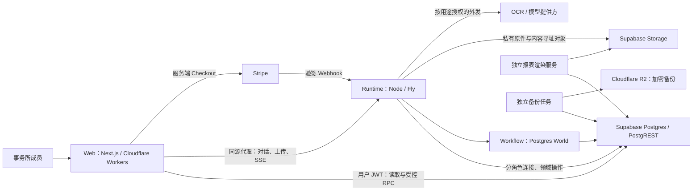
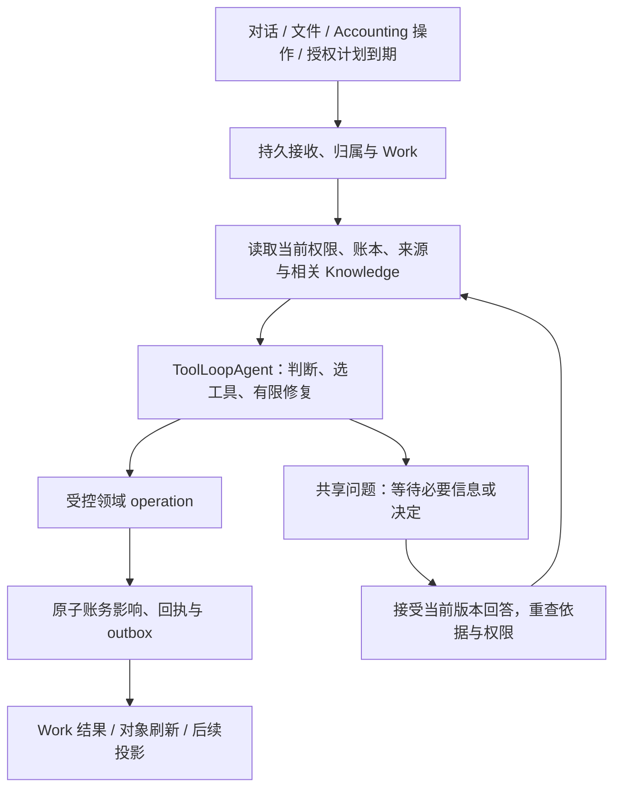

# Clara — 技术架构蓝图

本文是 Clara 持续维护的最高层技术蓝图：解释技术栈及选择原因、系统边界、模块职责、依赖、
主要数据流，以及保证会计正确性、可恢复性和隔离性的技术取舍。
[PRD](PRD.md) 定义产品为何存在、服务谁、应如何工作；[Context](../CONTEXT.md) 统一领域用语。
具体 API、表结构和函数以源码为准，codebase-memory-mcp 帮助定位；包级 README 负责运行与部署操作。

本文同时记录**当前实现**和**已接受、尚待实现的目标**，不能把设计决定写成上线事实。
明确标注目标的部分尚未完整交付；其余当前结构以 2026-09-09 的仓库源码为依据，
不代表已逐项复核线上部署。文末集中说明主要迁移差距。
当前目标来源于已接受的 [Clara refresh spec](https://github.com/BELCORT-SDN-BHD/clara/issues/612)。
Spec 保存一次建设的验收合同；本文持续反映仍然有效的技术方向，不随那次建设结束而失效。
Wayfinder／spec 接受技术方向变化时更新目标及理由；实现变化时同步更新当前边界和迁移说明。

## 1. 系统形态与部署边界

Postgres 保存账务、身份、权限、业务回执和持久运行记录；Storage 保存原始证据与生成文件。
浏览器、Clara 和报表读取同一套会计状态，不各自维护一本账。
Web 的请求生命周期与会计工作的生命周期分开，关闭页面不会终止后台执行。
尚未加入事务所的申请人处于独立准入域，不能假设其已具有 firm 身份。

当前部署配置是一台持续运行的 Fly machine，使用本地临时上传 spool；这不是高可用部署。
数据库持久化能支持恢复，但本身不能证明多机分发、spool 转移和恢复流程已可用。

## 2. 技术栈与选择理由

| 层 | 当前选择 | 对 Clara 的作用与取舍 |
|---|---|---|
| Web | Next.js 16、React 19、TypeScript；OpenNext 部署 Cloudflare Workers | 统一路由、服务端会话和交互界面；需要验证 OpenNext／Workers 兼容性及独立部署的接口兼容性。 |
| UI | Tailwind 4、Base UI、shadcn、next-intl | 用可维护的组件源码、交互基础和共享 tokens 构建密集会计界面；安装组件不等于完成业务状态、无障碍或恢复交互。 |
| 数据与身份 | Supabase Postgres、PostgREST、Auth、Storage | 在一套数据库内完成事务、RLS 隔离、版本和审计；受控函数承担业务边界，需要认真维护 SQL、grants 与迁移。 |
| Agent | Vercel AI SDK 7.0.77，当前流程使用显式 model/tool loop | 模型调用与业务领域分离；模型提出行动，通过受控工具执行，不能直接取得数据库任意写权限。 |
| 持久执行 | Workflow 4.8.4、Postgres World 4.3.4 | 将步骤、等待、重试和流持久化在自管 Postgres；需自行验证宿主、运行版本、并发与恢复边界。 |
| Runtime 宿主 | Node、Nitro 构建、Fly 常驻进程 | 承担长时间执行、事件消费者、扫描与恢复；与 Web 独立发布，避免把后台工作绑定到浏览器请求。 |
| 报表 | 版本化计算定义、独立渲染服务 | 从固定数据生成可复现的数字和文件；增加版本／制品管理，但避免模型重写正式金额。 |
| 工程 | pnpm workspace、GitHub Actions、独立 renderer／backup images | 应用与数据接口一起验证，同时隔离渲染和备份的依赖生命周期。 |

精确依赖由 [根 manifest](../package.json)、[Web manifest](../apps/web/package.json)、
[Runtime manifest](../packages/runtime/package.json) 与 [lockfile](../pnpm-lock.yaml) 固定。
根 engine（`>=22.11 <23`）、`.nvmrc`、CI toolchain 与 runtime Docker 两个 stage 现已统一为 Node 22.23.2；
Web 通过 `devEngines.runtime` 声明同一版本。Node 20 已于 2026-04-30 停止维护。
当前 Workflow 4.8.4、Postgres World 4.3.4、AI SDK 7.0.77 组合在 Node 22 上完成本地 typecheck、
Nitro build、全量 DB／runtime 测试与持久 World e2e；Linux image 与 hosted 证据以 #616 记录为准。

**已接受目标：**以该 Node 22 宿主与同一组依赖构建首个 ToolLoopAgent successor。
选择这条路线是沿用已调查的数据库和执行基础，并减少手写 loop 的职责；没有宣称它是所有产品的最优栈。
WorkflowAgent v1 能与 Workflow 4 配合，但其精确的较旧 AI 依赖和 stream retry 维护是已记录的取舍。
Workflow 5 是另一组需整体验证的候选依赖，本次目标未采用；换路线需要更新架构决定及等价验证。

## 3. 模块职责、依赖与事实所有权

| 模块 | 负责 | 不应承担 |
|---|---|---|
| `apps/web` | 会话与 scope、导航、业务读取、受控提交、实时消息和对象详情 | 在浏览器重建账务规则、预测已入账金额、持有后台服务密钥。 |
| `packages/runtime` | 接收工作、构建上下文、模型／工具协调、Workflow 接入、外发、事件和恢复 | 通过 prompt 自创权限，或把一次模型回复当作会计提交记录。 |
| `packages/db` | 会计状态、租户隔离、当前授权、事务、幂等、回执、事件和持久业务控制 | 持有 UI 临时布局状态，或把知识叙述当作可执行授权。 |
| `packages/reporting-render` | 领取任务、读取封存数据、生成并保存制品、结算渲染状态 | 修改账本或自行推断正式报表数字。 |
| `packages/backup` | 生成加密异地备份及恢复所需清单 | 用备份成功消息替代实际恢复证明。 |

**目标领域模型**明确区分以下记录；现有 task／chat／interruption 是迁移基础，并不已等同于完整 Work 模型。

| 记录 | 保存的事实 |
|---|---|
| Accounting Work | 客户归属、业务意图、发起人与授权依据、来源、依赖、问题、结果和回执。 |
| Conversation | 普通对话及上下文边界；多段对话可讨论同一 Work。 |
| Workflow run | 某个执行版本的一次运行；同一 Work 可有多次运行或恢复尝试。 |
| Question／answer | 需要的事实或决定、问题与依据版本、被接受的回答、回答者。 |
| Accounting operation／receipt | 一次逻辑业务行动及其已提交的完整影响；区别于工具调用尝试。 |
| JE 与领域对象 | JE 保存总账金额；open items、allocations、assets、plans、periods 保存额外业务关系。 |
| Knowledge 与 source | 可追溯的事实、身份、偏好、政策、经验及来源版本；搜索和 wiki 可重建。 |

Firm workspace 可以查询获准客户并组织批量工作；每一笔会计执行仍绑定一个明确客户。
Portfolio 不是合并账本。未能确定客户的输入可以先持久接收为待归属请求，不能猜造 client ID。

## 4. 数据库、会计与权限边界

应用通过明确的领域函数执行会计操作。当前已有人工 RPC、agent posting core、
`wake_post_entry`、结算、资产和关账函数；agent 调用保留其身份与 model/version 归因。
目标是让人工入口、上传和对话共享业务含义及必要影响，而不是为每个 UI 再实现一份会计引擎。

关键约束位于可信服务和数据库边界：

- firm RLS、client 归属、当前 membership／delegation 和 operation scope 必须成立。
  UI capability 只控制交互；旧 JWT、旧上下文或用户回答不能维持已撤销的权限。
- 人工与 agent 的会计写入只经授予的领域函数；human、agent read/write、freeform、bank、webhook、auth-wall
  连接按职责分权。Definer 函数的 owner、search path、grants 与参数校验共同组成边界。
- 金额使用整数最小货币单位，执行余额、舍入、期间及关联对象检查。
  大整数经过 JSON 和前端时必须保留精度；已有 freeform 路径的精度差距仍需修复。
- 来源、所审修订、当前账本依据与合法身份共同决定操作是否可接受；schema 正确不代表会计解释正确。
  用户明确提供的事实也是目标接受的依据，但不得伪造文件或声称独立核实。
- 已入账历史不可原地改写。更正是有来源关联的冲销／替代操作，还必须修正受影响的分配和明细。

**完整影响是事务边界。**确认一张发票需要相应总账和 open item；收款分配必须维护余额；
购置资产要同时保留资产记录。当前 `_subledger_on_approve` 等机制已承担部分耦合影响。
增加一个科目或配置计划可能不产生 JE；把已记录付款分配给发票也不能再创造现金分录。
同一 Work 的独立步骤可以分别提交，必须一起成立的账务关系在同一事务内成立。

**重试语义的目标：**服务器分配稳定的逻辑 operation identity，绑定 firm／client／Work／intent；
请求 payload、依据修订和执行 bundle digest 另行记录。未产生效果前可以受控重算；提交后更换参数
不能得到第二次效果。恢复返回获准读取的原回执或冲突，更正另建关联操作。
现有幂等函数是基础，wrapper 的 actor／key 约定尚未完全统一。

普通人工入账仍有历史 maker/checker 和 attestation 分支；已接受目标移除这些默认额外仪式，
保留实际角色与会计约束。人类专属法律签署、close evidence exception 不能由 agent 冒充完成。
当前 reconciliation 完成路径每事务只支持一个 reconciliation；未来批量操作不能直接假设可复用该形状。

## 5. 一个 Clara，分层负责推理与执行

**目标**是一个对外一致的 Clara，共享指令、会计能力、工具与澄清合同；内部仍可以有提取、
检索、计算、渲染等专门模块。减少用户面对的碎片化，不意味着把所有代码和数据塞进一个 prompt。

这张图描述目标统一入口。当前 registry 仍分别选择 chatTurn v17、autoDraft、facts、bank、close 等流程。
工具是手工版本化注册，已有 roster 检查；统一能力目录和显式 product-agent bundle 尚待实现。

产品 agent 的 instructions、accounting skills、tool schemas／implementations、context builder、
model 和预算组成显式加载、可追溯的版本 bundle。仓库给编程 agent 的 AGENTS.md／skills 不会自动
进入 Clara 的上下文。工具集合由服务器按实际能力与 scope 提供，文件内容不能注册工具或扩权。

ToolLoopAgent 管理模型／工具／修复循环；Workflow 管理 checkpoint、等待 hook、重试与持久 stream；
Clara 数据库决定业务接收、答案、取消顺序、授权和已提交事实。不可序列化的客户端在服务器重新获取。
一个 segment 可以重跑，因此模型结果和副作用不能仅靠内存去重。

保留确定性代码，是为了独立保证金额恒等式、身份、授权、重放及报表可复现；
classifier 用于识别证据形态和选能力。重复判断或过时 gate 可以淘汰，但要确认其独立保证有正确归属。
不能因为 LLM 能生成合法 JSON，就去掉数据库的业务检查。

修复按原因分流：格式或选择错误可在预算内改正；可安全重算的状态冲突重新读取；基础设施失败有限退避；
缺事实或决定才问用户。权限、锁期或业务拒绝不能靠换参数无限尝试。内部不变量失败成为可见故障。
每段模型／工具／重算／重试预算有限且被记录，耗尽后保留可恢复状态；必要 Knowledge 读取失败不能伪装为空。

## 6. Work、澄清、取消与对话生命周期

目标接收边界先幂等地持久化请求，再确认已接收；若在 enqueue／绑定引擎 run 前崩溃，由恢复机制补齐。
Work 成功由完整业务结果决定，不能按工具调用数、stream 结束或任务表的一个状态猜测。
批次记录每个子项与依赖：95 份可独立处理的文件继续，5 份缺资料的文件及其依赖等待。

共享问题具有稳定身份和问题／依据版本。Work 详情、Needs you、chat rail 展示并回答同一个问题。
数据库只接受当前获准的第一份答案；重复提交回放同一结果，旧版本或竞争失败的回答看到当前状态。
当前 `answer_interruption` 已有行锁、过期检查和幂等；完整版本比较及投递约束是目标扩展。

答案接收与向 Workflow hook 投递是两回事。投递只使用数据库接受的 payload，允许至少一次尝试；
结算必须绑定有效 claimant／lease token，崩溃后核对真实 hook／run 状态。
当前 control listener 的 `HookNotFound` 假设和不带 claimant 条件的结算不足以证明正确投递。
技术 hook 过期不是业务 Work 自动完成或消失的理由。

取消与新的业务操作在共享数据库边界确定先后。取消获准后不得接收新的会计行动；此前已接收的原子操作
结算并保留回执，界面在最终边界明确前显示正在停止。取消不冲销已入账结果。
当前 abort／settle 机制仍需补齐这套端到端排序，不能由一个 AbortSignal 代替。

新对话清空对话上下文；归档改变历史可见性；真正删除普通文字必须传播到可搜索投影和恢复上下文。
只保留必要、可读的工作依据、明确声明、被接受的答案、来源引用与回执，不能把完整旧 transcript 改名保留。
Knowledge 撤回、证据生命周期、Work 取消和账务更正各有独立语义；备份保留边界需如实说明。

SSE 传递解释和状态，不拥有执行。当前 stream 会在轮询时重新检查访问权。
目标重连使用稳定 run／attempt／part 身份，合并持久结果、替换未完成段落，避免重复消息或重复成果。
最终会计结论来自回执与当前对象读取；停止回复生成与取消 Work 是不同操作。

## 7. 文件、来源与 Client Knowledge

文件流先验证媒体、扫描、建立私有保管和 source hash，再提取字节／文字与坐标。
目标要求依赖文本的分类在提取成功后执行，随后生成该类型的结构化事实并交给适用 operation。
发票／账单、银行月结单、员工报销等有各自 schema，银行 lines 不应被强行走通用发票 posting 路径。
保管、提取、事实校验、Work 与入账状态正交；能够上传不代表能够理解或完成会计执行。

当前发票／月结单的 witness lane 使用 OCR 文本与原始文件视觉两路读取，保留来源 hash、
模型版本和一致性／算术校验；已有 Azure／结构化路径并存，并非所有输入统一经过 witness。
UBL XML 已有结构化路径，CSV／OFX 及其他格式的业务覆盖程度不同。
已接受目标用能力目录明确每一层支持程度，并补齐范围内缺失 executor，不能用 placeholder 缩减产品承诺。
原件版本、字段来源区域、duplicate／refile／supersede 关系必须保留，改来源后重新评估受影响工作。
异步 gate 的迁移必须保持消费契约：0177（成功提取后才进入 classify lane）要求先部署具备
extraction-completed 消费能力的 facts_gate consumer 再切换 gate；回退先用新的 append-only 迁移恢复相容数据库行为，
再回退 consumer，避免完成事件被忽略并推进 checkpoint 后永久漏处理。0177 已在本地 PG17 全链验证并合入 main；
hosted 发布与真实上传旅程仍待 #606 记录。

**Knowledge 目标：**一个受治理的服务和产品入口，下层保留 typed canonical facts、稳定身份、
来源、声明、修订与依赖关系；wiki、搜索、索引和可读 OKF bundle 是可重建投影。
采用维护中的 OKF v0.2 可读交换语义及 source → wiki → ingest/query/lint 的维护思路，
不引入独立 Google Knowledge Catalog 产品，不把外部文件标注的“verified”视作认证事实。

明确的长期资料／偏好自动保存，注明 actor、scope 和有效条件；提取事实绑定具体来源版本；
模型假设和历史经验保持 advisory。一次成功或反复出现不能升级为政策，也不能授权未来分录计划。
默认局限于当前客户，明确且有权限时才推广 firm default，并保留客户例外及不同 AR／AP 角色。

身份不再要求人先手动 binding；Clara 从证据维护身份与 alias，但保留稳定 counterparty ID 和历史引用。
改名不改身份，merge 保留来源及原始引用；没有历史 lineage 时不承诺任意 unmerge。
按客户、期间和工作目的渐进检索，记录实际使用的版本，并提供读取具体来源和账务对象的工具。

修订、来源变化、完成工作和更正生成可去重事件，只更新受影响概念、引用、经验及索引。
实质冲突触发共享问题；明确、范围充分的更正无需再次确认。相关变化使待执行 Work 重查，
无关 KB 修订不阻塞全客户。投影失败不回滚已完成账务；已入账错误仍走会计更正流程。
当前 facts、wiki、coding-pattern pack 和 UI 尚未统一，不能把此目标理解为现有接线。

## 8. 计划、关账、指标与正式报表

目标 Accounting plan 保存金额／计算依据、时间区、有效期、频率、授权和版本，occurrence 记录独立执行。
到期事件启动 Work，产生的分录仍经过当前权限与期间检查；重复扫描不能重复入账。
新计划及历史补提需要明确授权范围，暂停／结束阻止未来接收。观察到重复扣款不自动创建计划，
也不代表产品具有发起银行付款或管理 mandate 的权限。

Close 按客户及期间组织准备、证据覆盖、恒等式、最终检查和锁定。
目标区分不可豁免的会计恒等式、人可明确接受的某项缺证据例外和 advisory 信息；
尚未测量的检查保持 pending。按时开始不等于准备完成，Clara 不能自行豁免证据或硬约束。
当前 beginning-close 会冻结期间，银行结算须在该边界前完成；close 按年度顺序串行，carry-forward 幂等。
目标自动执行须明确接入现有 period／authority 约束；迟到资料的重开或后续期间调整仍依赖用户决定。

首页数字来自一致数据库视图下的 versioned metric pack，携带 unit／currency、period／as-of、
computed-at、定义版本、source watermark 和 coverage；无权限、缺覆盖、失败不能变成零。
金额计算与 AR／AP 归桶在可信数据层定义，chart 和表格读取相同账务范围与金额，不各自重算。
Work 的 attention 计数独立于财务期间选择，图表可追到其账务来源。该统一指标合同是目标建设。

正式报表遵循 open → evaluate → seal → render：封存输入和定义，确定性计算数字，
数值占位符绑定记录的 cell，renderer 使用已确定的 display text，不让模型重打金额。
模板／框架、版本、权限和文件 hash 支持复现；封存快照及生成 bytes 不可静默替换。
目标更正流程使受影响报告过时或被替代，保留原 basis 与文件，并在授权下生成新版。
探索性分析可以使用模型，但必须与正式制品区分，不能越过 seal 链。
SST watch、税务期间与计算基础已存在部分 SQL 能力；beta Tax 仍未激活，不能把基础表等同于可用申报服务。
税率、阈值和法律文字是有生效日期的外部输入，在实现或启用相应能力时验证，不固化为架构常量。

## 9. 前端和 Agent UI 的技术合同

Web 路由区分入门／认证、firm、client 与独立全屏对象；`components` 承担界面，`lib` 承担 scope、
领域适配和读写边界，`messages` 管理文案，`app/globals.css` 管理共享语义 tokens。
`getRows` 使用用户会话读取 PostgREST，`callDoor` 提交受控 RPC；提交后重新读取权威对象，
表单草稿可以保存在本地，但金融结果不能乐观伪造。Runtime 通过同源 allowlisted-header proxy 访问。

目标采用 A Home 的轻量玻璃与财务布局、B Work 的列表／详情；Sidebar 组织主导航，
Accounting 分组业务对象，Work 展示执行，Reports 展示输出。稳定 URL、返回行为和 scope 都是合同。
共享 Shell、字段、金额、日期、空／忙／错状态及 typed parts 供各旅程复用，页面拥有自己的业务组合。
Sheet／Dialog／Tabs 等只承担适合的交互，不能把完整对象生命周期塞进无地址的临时弹层。

生成式界面是服务器注册的 typed part schema 与 Web reader 的协议，关联 Work／question／object／receipt。
目标让历史 hydration 与实时渲染复用同一合同，独立发布时验证字段、版本和旧 reader 的处理方式。
当前 parts parity 主要检查 kind，部分 reader 只有 ID；完整协议兼容仍未实现。
shadcn 核心组件、AI helpers 与外部 registry 分别记录来源；Message／Questionnaire／Attachment／shimmer
等组件只能呈现真实状态，不能替代持久对话、答案接收或执行控制。

目标保留阅读位置、jump-to-latest、单一 transcript announcement、键盘与焦点返回；支持窄屏、200% zoom、
reduced motion 和 chart 可访问数值。所有业务页都要有适用的 partial／stale／denied／retry／recovery 状态。
共用组件检查和单页视觉原型不能代替完整旅程的真实数据与恢复验证。

## 10. 安全、发布、恢复与验证

Supabase SSR 会话与实时 membership 检查共同处理身份。服务密钥只存在服务端；`NEXT_PUBLIC_*`
不能装秘密。受限 freeform 读是单独授权的只读能力，不能通过 `SELECT` 包装写函数得到写权限。
托管 Supabase 的 provider-owned `pg_catalog` ACL 不完全由项目控制；notification、advisory lock、
sleep、XML helper 等残余能力需要独立限制和验证，不能仅凭 public schema grants 宣称全部封闭。

文件、OCR、KB 和外部内容都是不可信数据，不能改变系统指令或权限。
外发需要 client／firm、purpose activation 与 dispatch authorisation；准备授权和实际消耗是不同边界。
当前 wiki 在模型调用前消耗绑定授权，其他外发路径尚未完全统一。Vendor trace export 当前关闭。

准入使用版本化法律内容／签署、rate events、checkout intents 和 Stripe 验签 webhook；
firm claim 在事务内完成。Supabase Auth 负责 signup／recovery 邮件，staff invite 使用服务端 Resend courier。
Operator 仅有获准的注册／支付支持和 estate wake-source 管理，不因此取得其他事务所账本。
Beta test Checkout、已有 DPA 签署不能证明付费计量、完整法律接受或生产邮件送达已完成。

业务提交同事务写事件及 outbox；消费者用 checkpoint、去重、重试／dead letter 推进投影。
LISTEN 是及时通知，持久队列与轮询保证可恢复扫描。投影记录 lag，不能把已提交账务和界面刷新混为一件事。
`/health` 表达进程存活，`/ready` 表达配置依赖和消费者状况；缺少可选配置与已配置但失败必须区分。

连接故障的现行契约（as built）：Idle pool errors log/recycle connections;
relay-pool counters surface warnings. The leader's dedicated session
detects failure, releases its advisory lock and reconnects. Lane probes are asynchronous:
`pending` 表示尚未测量，`stalled` 是警告；不可把尚未完成的探测当成健康证明。
所有已配置连接通道和存储的完整硬性 readiness 检查仍未完成。

Workflow registry 决定新接收的版本，旧非终态运行继续拥有其原 body 与相容依赖。
目前 frozen closure 有 hash 检查；目标进一步固定 instruction／skill／tool registry manifest、
schema 和依赖解析。发布新 successor 时保留旧导出，rollback 也必须支持全部非终态 bundle 或先验证 drain。
SQL 迁移是有顺序、校验和的追加输入；回退使用相容发布或新迁移，不改写历史 migration。

Web、runtime、DB frontier 和 renderer 分别记录发布身份；源代码通过不能替代已部署版本证据。
备份需要账务／schema、角色与 ACL、对象清单和可解密制品，且必须实际恢复并核对账与重渲染结果。
现有单机与本地 spool 约束不能由一次 Postgres restart 测试推导出 HA。

主要验证入口是“用户发起 Accounting Work → 完整业务结果”，辅以真实 DB／Workflow 的竞争、
重启、权限变化、答案投递、取消及两版本迁移验证。数字使用可核对的 exact-cent fixtures；
前端验证全部接受的旅程与键盘／窄屏／恢复；托管环境再验证真实依赖、来源和制品。
单元测试、数据库证明、合成原型与 hosted journey 各自说明证据范围，不互相冒充。

## 11. 当前实现与已接受目标的分界

| 领域 | 当前实现的事实／限制 | 已接受目标 |
|---|---|---|
| Agent 与宿主 | 分散冻结流程，chatTurn v17；根／CI／runtime image 已统一 Node 22.23.2（#616，本地验证；hosted 发布待记录）。 | 首个 ToolLoopAgent successor 与显式版本 bundle；保留旧运行。 |
| Work 与控制 | tasks、interruptions、回执、SSE、租约已有；版本答案、正确投递和取消排序仍有差距。 | 统一业务 Work，共享问题与稳定操作身份，真实重启／竞争下保持完整结果。 |
| 会计能力 | JE、subledger、结算、资产、close 基础存在；入口能力及人工／agent 行为不一致。 | 全范围领域操作与必要关联影响；去掉普通入账额外仪式，保留实际权限与硬约束。 |
| 文件 | 0177 与 extraction-aware facts_gate consumer 已合入 main 并在本地 PG17 全链验证：未知 kind 的 PDF／图片在成功提取前返回 awaiting_extraction；hosted 发布待记录。 | 能力分层与 source／facts／operation 状态一致；hosted 上传旅程验收。 |
| Knowledge | facts、wiki 与 advisory pattern pack 分开；检索偏固定 priority／recency；部分 claim metadata 缺失，chat pack 错误会降为 null。 | 统一捕获、身份、版本、按需检索、纠正和投影；必需知识不可用时诚实暂停。 |
| 自动计划与 close | 日常 reconciler／资产／调整机制已有；bank_agent／close_prep wake sources 默认关闭，生产／激活链路不完整。 | 显式授权计划到期产生 Work，普通自主执行含满足条件的 recon／close；技术开关不成为用户 opt-in。 |
| 财务界面与输出 | 旧工作台和 card readers；sealed renderer 已有，sandbox worker、完整管理模板和交付验证仍不齐。 | 完整旅程、统一 metric pack、可靠 AI UI、可复现且可下载的报表。 |
| 准入与运行保障 | beta 准入、部分法律／外发机制、备份工具、单机部署；完整 readiness 与恢复证据仍有边界。 | 合同与实现一致的准入／外发、协调版本发布及代表性 hosted／restore 验证。 |

以上是持续有效的架构分界，不是项目进度清单。具体切片、依赖、故障证据与完成状态由 GitHub
spec／implementation issues 承担；技术目标变化后维护本文件，不能让历史 spec 覆盖已接受的新方向。
