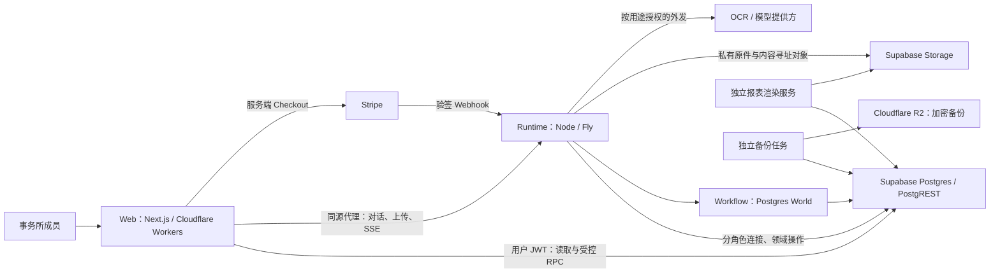
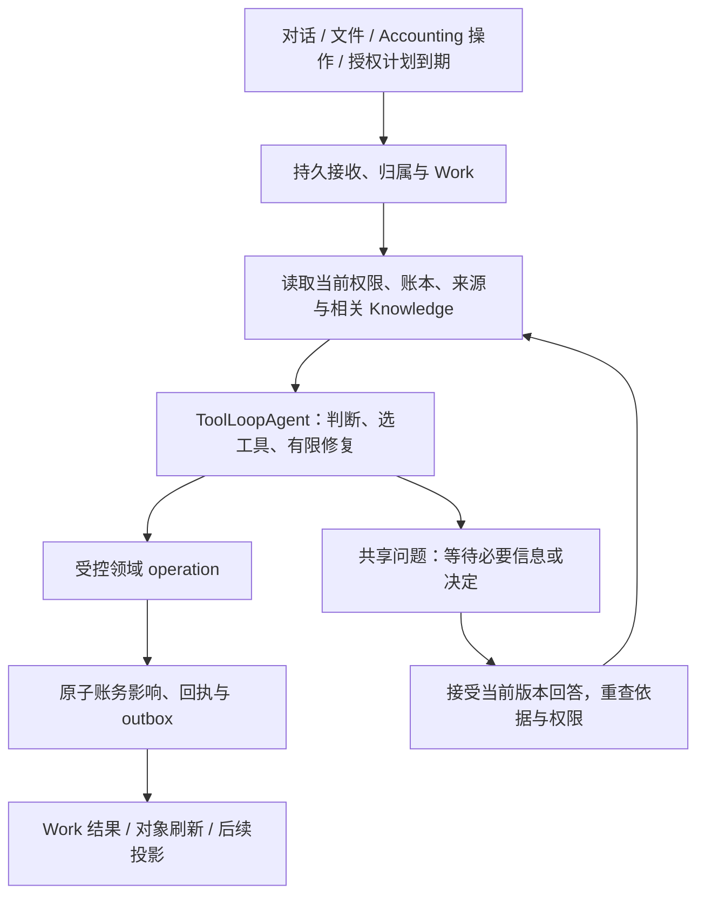

# Clara — 技术架构蓝图

本文是 Clara 持续维护的最高层技术蓝图：解释技术栈及选择原因、系统边界、模块职责、依赖、
主要数据流，以及保证会计正确性、可恢复性和隔离性的技术取舍。
[PRD](PRD.md) 定义产品为何存在、服务谁、应如何工作；[Context](../CONTEXT.md) 统一领域用语。
具体 API、表结构和函数以源码为准，codebase-memory-mcp 帮助定位；包级 README 负责运行与部署操作。

本文同时记录**当前实现**和**已接受、尚待实现的目标**，不能把设计决定写成上线事实。
明确标注目标的部分尚未完整交付；其余当前结构以 2026-09-09 的仓库源码为依据，
不代表已逐项复核线上部署。文末集中说明主要迁移差距。
当前目标来源于已接受的 [Clara refresh spec](https://github.com/BELCORT-SDN-BHD/clara/issues/612)。
Spec 保存一次建设的验收合同；本文持续反映仍然有效的技术方向，不随那次建设结束而失效。
Wayfinder／spec 接受技术方向变化时更新目标及理由；实现变化时同步更新当前边界和迁移说明。

## 1. 系统形态与部署边界

Postgres 保存账务、身份、权限、业务回执和持久运行记录；Storage 保存原始证据与生成文件。
浏览器、Clara 和报表读取同一套会计状态，不各自维护一本账。
Web 的请求生命周期与会计工作的生命周期分开，关闭页面不会终止后台执行。
尚未加入事务所的申请人处于独立准入域，不能假设其已具有 firm 身份。

当前部署配置是一台持续运行的 Fly machine，使用本地临时上传 spool；这不是高可用部署。
数据库持久化能支持恢复，但本身不能证明多机分发、spool 转移和恢复流程已可用。

## 2. 技术栈与选择理由

| 层 | 当前选择 | 对 Clara 的作用与取舍 |
|---|---|---|
| Web | Next.js 16、React 19、TypeScript；OpenNext 部署 Cloudflare Workers | 统一路由、服务端会话和交互界面；需要验证 OpenNext／Workers 兼容性及独立部署的接口兼容性。 |
| UI | Tailwind 4、Base UI、shadcn、next-intl | 用可维护的组件源码、交互基础和共享 tokens 构建密集会计界面；安装组件不等于完成业务状态、无障碍或恢复交互。 |
| 数据与身份 | Supabase Postgres、PostgREST、Auth、Storage | 在一套数据库内完成事务、RLS 隔离、版本和审计；受控函数承担业务边界，需要认真维护 SQL、grants 与迁移。 |
| Agent | Vercel AI SDK 7.0.77，当前流程使用显式 model/tool loop | 模型调用与业务领域分离；模型提出行动，通过受控工具执行，不能直接取得数据库任意写权限。 |
| 持久执行 | Workflow 4.8.4、Postgres World 4.3.4 | 将步骤、等待、重试和流持久化在自管 Postgres；需自行验证宿主、运行版本、并发与恢复边界。 |
| Runtime 宿主 | Node、Nitro 构建、Fly 常驻进程 | 承担长时间执行、事件消费者、扫描与恢复；与 Web 独立发布，避免把后台工作绑定到浏览器请求。 |
| 报表 | 版本化计算定义、独立渲染服务 | 从固定数据生成可复现的数字和文件；增加版本／制品管理，但避免模型重写正式金额。 |
| 工程 | pnpm workspace、GitHub Actions、独立 renderer／backup images | 应用与数据接口一起验证，同时隔离渲染和备份的依赖生命周期。 |

精确依赖由 [根 manifest](../package.json)、[Web manifest](../apps/web/package.json)、
[Runtime manifest](../packages/runtime/package.json) 与 [lockfile](../pnpm-lock.yaml) 固定。
根 engine（`>=22.11 <23`）、`.nvmrc`、CI toolchain 与 runtime Docker 两个 stage 现已统一为 Node 22.23.2；
Web 通过 `devEngines.runtime` 声明同一版本。Node 20 已于 2026-04-30 停止维护。
当前 Workflow 4.8.4、Postgres World 4.3.4、AI SDK 7.0.77 组合在 Node 22 上完成本地 typecheck、
Nitro build、全量 DB／runtime 测试与持久 World e2e；Linux image 与 hosted 证据以 #616 记录为准。

**已接受目标：**以该 Node 22 宿主与同一组依赖构建首个 ToolLoopAgent successor。
选择这条路线是沿用已调查的数据库和执行基础，并减少手写 loop 的职责；没有宣称它是所有产品的最优栈。
WorkflowAgent v1 能与 Workflow 4 配合，但其精确的较旧 AI 依赖和 stream retry 维护是已记录的取舍。
Workflow 5 是另一组需整体验证的候选依赖，本次目标未采用；换路线需要更新架构决定及等价验证。

## 3. 模块职责、依赖与事实所有权

| 模块 | 负责 | 不应承担 |
|---|---|---|
| `apps/web` | 会话与 scope、导航、业务读取、受控提交、实时消息和对象详情 | 在浏览器重建账务规则、预测已入账金额、持有后台服务密钥。 |
| `packages/runtime` | 接收工作、构建上下文、模型／工具协调、Workflow 接入、外发、事件和恢复 | 通过 prompt 自创权限，或把一次模型回复当作会计提交记录。 |
| `packages/db` | 会计状态、租户隔离、当前授权、事务、幂等、回执、事件和持久业务控制 | 持有 UI 临时布局状态，或把知识叙述当作可执行授权。 |
| `packages/reporting-render` | 领取任务、读取封存数据、生成并保存制品、结算渲染状态 | 修改账本或自行推断正式报表数字。 |
| `packages/backup` | 生成加密异地备份及恢复所需清单 | 用备份成功消息替代实际恢复证明。 |

**目标领域模型**明确区分以下记录；现有 task／chat／interruption 是迁移基础，并不已等同于完整 Work 模型。

| 记录 | 保存的事实 |
|---|---|
| Accounting Work | 客户归属、业务意图、发起人与授权依据、来源、依赖、问题、结果和回执。 |
| Conversation | 普通对话及上下文边界；多段对话可讨论同一 Work。 |
| Workflow run | 某个执行版本的一次运行；同一 Work 可有多次运行或恢复尝试。 |
| Question／answer | 需要的事实或决定、问题与依据版本、被接受的回答、回答者。 |
| Accounting operation／receipt | 一次逻辑业务行动及其已提交的完整影响；区别于工具调用尝试。 |
| JE 与领域对象 | JE 保存总账金额；open items、allocations、assets、plans、periods 保存额外业务关系。 |
| Knowledge 与 source | 可追溯的事实、身份、偏好、政策、经验及来源版本；搜索和 wiki 可重建。 |

Firm workspace 可以查询获准客户并组织批量工作；每一笔会计执行仍绑定一个明确客户。
Portfolio 不是合并账本。未能确定客户的输入可以先持久接收为待归属请求，不能猜造 client ID。

## 4. 数据库、会计与权限边界

应用通过明确的领域函数执行会计操作。当前已有人工 RPC、agent posting core、
`wake_post_entry`、结算、资产和关账函数；agent 调用保留其身份与 model/version 归因。
目标是让人工入口、上传和对话共享业务含义及必要影响，而不是为每个 UI 再实现一份会计引擎。

关键约束位于可信服务和数据库边界：

- firm RLS、client 归属、当前 membership／delegation 和 operation scope 必须成立。
  UI capability 只控制交互；旧 JWT、旧上下文或用户回答不能维持已撤销的权限。
- 人工与 agent 的会计写入只经授予的领域函数；human、agent read/write、freeform、bank、webhook、auth-wall
  连接按职责分权。Definer 函数的 owner、search path、grants 与参数校验共同组成边界。
- 金额使用整数最小货币单位，执行余额、舍入、期间及关联对象检查。
  大整数经过 JSON 和前端时必须保留精度；已有 freeform 路径的精度差距仍需修复。
- 来源、所审修订、当前账本依据与合法身份共同决定操作是否可接受；schema 正确不代表会计解释正确。
  用户明确提供的事实也是目标接受的依据，但不得伪造文件或声称独立核实。
- 已入账历史不可原地改写。更正是有来源关联的冲销／替代操作，还必须修正受影响的分配和明细。

**完整影响是事务边界。**确认一张发票需要相应总账和 open item；收款分配必须维护余额；
购置资产要同时保留资产记录。当前 `_subledger_on_approve` 等机制已承担部分耦合影响。
增加一个科目或配置计划可能不产生 JE；把已记录付款分配给发票也不能再创造现金分录。
同一 Work 的独立步骤可以分别提交，必须一起成立的账务关系在同一事务内成立。

**重试语义的目标：**服务器分配稳定的逻辑 operation identity，绑定 firm／client／Work／intent；
请求 payload、依据修订和执行 bundle digest 另行记录。未产生效果前可以受控重算；提交后更换参数
不能得到第二次效果。恢复返回获准读取的原回执或冲突，更正另建关联操作。
现有幂等函数是基础，wrapper 的 actor／key 约定尚未完全统一。
#623 首次落地了这个形状：`clara.accounting_work` 在准入时分配 `logical_op_id = work:<id>:journal_entry:1`，`intent_key` 以 (firm, client) 为幂等范围；`clara.wake_record_journal_entry` 只允许 client-pinned、OBO 发起人本人的 `interactive_client` 凭证调用，提交时重读发起人当前 membership、client 状态、期间锁、科目与 generic 分录禁止控制科目 leg，以 draft→approved 的常规转换写入普通 `journal_entries`（maker／checker 为 agent identity，origin `agent`），同一事务写入一条 `clara.operation_receipts`（每个逻辑身份至多一条 committed 回执），同 key 同 payload 重放原回执、同 key 不同 payload 是类型化 conflict；agent-post 回执墙已扩展为接受两种回执形态之一；`settle_work_run` 在已有 committed 回执时强制结算为 completed（取消／失败不能覆盖已入账事实）并级联取消待答问题。
#634（0182）在此形状上加了可选与迟到的凭据：一次 Work 可以在准入时指定至多一份已归档到该客户、字节已核实的文件（`source_refs` 的 `document` 元素，逐元素校验并给出 1-based `field`；重放分支先于可变的归档检查），提交时再读一次（`source_conflict`）；凭据落在新的仅追加关系 `clara.entry_evidence_links`，而不是 `journal_entries.document_id`——已入账分录不可原地改写（`clara._tf_entry_immutable` 的 approved→approved 白名单只有 `{reversed_by, reversal_reason, updated_at}`），且该列属于文件编码车道的 `ck_je_doc_pair`／`ck_je_document_filing_pair` 三元组。一份文件在全事务所范围内至多支撑一条**在世**的已过账分录（`released_at is null` 的部分唯一索引；冲销由 `t_entry_evidence_release` 释放链接，更正分录可再引用同一文件）；重复指定在准入即 CLR13 `source_already_posted`（附冲突分录 id），提交时为 `source_conflict`，并发插入也重抛同一类型化拒绝而非裸 23505。迟到指定走人工门 `clara.attach_entry_evidence`（bookkeeper+，op_key 幂等，`p_expected_revision` 只作过期闸——触发器禁止推进 revision，无任何财务效果，不写 `operation_receipts`，因该表结构上是 agent run 回执）；`clara.list_entry_links` 为 Journals 表提供 purpose／basis origin／来源／Work／回执／冲销链。意图幂等的载荷比较扩展为「basis digest + 规范化 source refs」两半（basis digest 公式不变；chat 车道的 refs 规范化为 `{"kind":"chat_task"}`）。已知单向缺口：文件编码车道的 `_draft_entry_core` 仍不回看凭据链接（#718）。
#728（0183）让 Activity 摘掉 sweep 心跳的噪音同时保住可核查性：一条 `sweep.run_completed` 回执若其 run 未产生任何效果（`drafted_count + posted_count = 0`；`refused_count`／`skipped_count` 各自已有可归因面，刻意不计入"效果"）即整条从该 firm 的 Activity 摘除，保留的回执改标 `kind='agent'`、actor 置空，web 端渲染为"Clara (system)"。排除判定是一次集合读而非逐行判定：`clara._sweep_events_with_effect()`（feed 用，取该 firm 有效果的回执 id 全集）与 `clara._sweep_event_has_effect(uuid)`（detail 门用，单条判定）——两个 SECURITY DEFINER 函数、bookkeeper 门槛内置、按 firm 双向校验（含 run 自身归属的 firm）、对 `payload->>'run_id'` 不做 uuid cast（一行脏数据只匹配不到任何行，不拖垮整个 firm 的 feed）。两函数各自恰好一种固定查询形状，且连同两扇门 `list_activity`／`get_activity_event` 在函数级声明 `set plan_cache_mode = force_custom_plan`——这是本次立下的估值规则而非枝节：plpgsql 语句在会话内第 6 次执行起会换成 generic plan，而 generic plan 把多租户表上的 firm 谓词估成"每 firm 平均值"；第一版（一条带 `x is null or …` 谓词、两个调用方共用的语句）实测调用 1–5 约 18–46 ms、调用 6–10 骤降为 13.5–16.4 秒，拆成两个固定形状的函数后 helper 仍因 `c.firm` 参数在第 6 次翻转（0.5–3 秒），最后门自身也翻转（30,000 条 operation_receipts 时 145 ms → 2.0–2.8 秒；0181 继承的位点）；四个函数钉住 custom plan 后十次连续调用全程持平，由 0183 的 tail 拒绝缺钉、`activity-feed.test.mjs` af.20／af.23 以自植 1,500-firm 偏斜的十次序列钉住。PostgREST 长连接池意味着这类翻转在生产里表现为"用一会儿就变慢、换个连接又好了"。成本以 KEPT 集为界而非 firm 的 sweep 历史：`ix_sweep_runs_firm_effect`（`firm_id`，限定 `drafted_count+posted_count>0`）驱动、复合 partial index `ix_domain_events_sweep_run`（`(firm_id, payload->>'run_id')`，限定 `sweep.run_completed`）逐条探测、LATERAL 子查询以 `offset 0` 作优化栅栏（无栅栏 planner 会把探测拍平成对全历史的 Merge Join）——1,000／6,000／30,000 条历史下均为 1.6–1.9 ms。KEPT 集本身仍随 kept 历史线性增长（每千条约 3.8 ms），按读取窗口收窄需先把 run 时钟与事件时钟关联，记为后续。深链到一条被排除心跳的详情，与其它拒绝共用同一个无存在预言的 `activity_event_not_found`。`clara.list_spoken_for_documents(p_client)` 是新增的 bookkeeper+ ADVISORY 读：归并一份文件在全 firm 范围内的两种在世绑定（0182 的 `entry_evidence_links` 在世链接 rank 0，文件编码车道已过账未冲销的绑定 rank 1，同文件取并列时链接优先），返回 claimant client；composer／late-attach 的选择器据此在选项上禁用该文件并链接到 claimant 的分录，`source_conflict`／`source_already_posted` 的门槛拒绝不因这个建议性读而改变或放松。
#630（0184）把 `accounting_work.initiator` 拆成两列：`initiated_by`（谁提出，不可变，加入冻结集）与 `initiator`（Work 当前以谁的实时权限执行——deploy-lock 的 claraWork 闭包按这一列铸取凭据，所以交接只能移动它）。移动被不可变触发器设墙：只能交给本事务所在职的 bookkeeper+，否则 CLR04 `responsible_not_authorised`。`clara.take_over_accounting_work`（story 29）是唯一的移动者：负责人已失权（实时重读 membership）的终态 Work 可被在职同事接手；已复职的负责人保有其 Work（CLR13 `not_takeable`）；`clara_interpreted` 的 basis 必须回带 digest 确认（CLR10 `basis_confirmation_required`，UI 内渲染 basis 供确认）；新 run 由同一个 `clara.retry_accounting_work` 创建，交接不复制一份第二套起跑逻辑；写入 `work.taken_over` 时间线事件；`get_activity_event` 同时投影 `initiated_by`。凭据铸造对失权负责人的拒绝类型化为 `authority_lost`（`mint_wake_credential` 重切，与 `claraWork.v2` 的 `recheckAuthorityStep` 用同一个词）。撤权后的读取由既有的 `clara.jwt_firm()`（只认在职 membership，本次未改策略）封闭：被撤权者对本所 `accounting_work` 读到零行，`work-cancel.test.mjs` §A6 在活的策略上实测。

普通人工入账仍有历史 maker/checker 和 attestation 分支；已接受目标移除这些默认额外仪式，
保留实际角色与会计约束（#623 的无附件分录 operation 已按此形状实现：无 attestation，无第二人，只重查当前授权与硬约束；旧 journals 工作台的 compose 仪式已由 #634 删除——伪造的 client resolution 与第二人 attestation 不再存在，Journals 页的主行动指向唯一的 C3 路由；文件来源的 autodraft 审阅队列不变）。人类专属法律签署、close evidence exception 不能由 agent 冒充完成。
当前 reconciliation 完成路径每事务只支持一个 reconciliation；未来批量操作不能直接假设可复用该形状。

## 5. 一个 Clara，分层负责推理与执行

**目标**是一个对外一致的 Clara，共享指令、会计能力、工具与澄清合同；内部仍可以有提取、
检索、计算、渲染等专门模块。减少用户面对的碎片化，不意味着把所有代码和数据塞进一个 prompt。

这张图描述目标统一入口。当前 registry 选择 chatTurn v18、claraWork v2、autoDraft、facts、bank、close 等流程。
#629 把 `claraWork` 重指向 `claraWork_v2`（`packages/runtime/workflows/claraWork.v2.*`，冻结的新闭包，v1 保留给在途 run）：`ask_question` 带 reason、1..6 个类型化 fields（text／money／date／choice／account）与可选 supporting source，经 `clara.open_work_question` 停靠；答案以「answer + 回答者角色 + 时间 + question_version」作为工具结果回到同一 segment，续跑前 `recheckAuthorityStep` 重读发起人当前 membership／角色与 client 状态（失去授权结算为不可恢复的 `refused/authority_lost`；Work 行不可读则可恢复）。v2 自带错误表 `claraWork.v2.errors.ts`——委托 v1 名册并只覆盖具名的 (errcode, reason) 对，把 0182 在提交时抛出的 `(CLR13, source_conflict)` 归类为终态可恢复 refusal——这是一个冻结闭包在不改动已部署闭包的前提下学会新拒绝对的方式。bundle `clara-work/v2` 的 digest 与 v1 一样由单元测试钉死并写入 world 启动日志。
#623 落地了首个持久 successor：`claraWork_v1`（`packages/runtime/workflows/claraWork.v1.*`）在一个 `"use step"` 内运行 AI SDK 7.0.77 `ToolLoopAgent`，显式加载冻结的 bundle `clara-work/v1`（instructions、skill、server-owned tools `list_accounts`／`record_journal_entry`／`ask_question`，有限的 segment／model／tool／replan／retry 预算；canonical-JSON sha256 digest 由单元测试钉死，记录在 Work 的 bundle 清单、回执、world 启动日志与 `/api/build-info`）。错误按 0178 的 (errcode, detail.reason) 名册分类为 invalid_input／state_changed／conflict／transient／refusal／cancelled／invariant，refusal 与 conflict 对模型是终态（不得改参重试），预算耗尽结算为可恢复的 `failed/limit`。`chatTurn_v18` 只增加 `start_journal_work` 工具与 `work_accepted` part。其余流程仍是手工版本化注册；统一能力目录尚待实现。

产品 agent 的 instructions、accounting skills、tool schemas／implementations、context builder、
model 和预算组成显式加载、可追溯的版本 bundle。仓库给编程 agent 的 AGENTS.md／skills 不会自动
进入 Clara 的上下文。工具集合由服务器按实际能力与 scope 提供，文件内容不能注册工具或扩权。

ToolLoopAgent 管理模型／工具／修复循环；Workflow 管理 checkpoint、等待 hook、重试与持久 stream；
Clara 数据库决定业务接收、答案、取消顺序、授权和已提交事实。不可序列化的客户端在服务器重新获取。
一个 segment 可以重跑，因此模型结果和副作用不能仅靠内存去重。

保留确定性代码，是为了独立保证金额恒等式、身份、授权、重放及报表可复现；
classifier 用于识别证据形态和选能力。重复判断或过时 gate 可以淘汰，但要确认其独立保证有正确归属。
不能因为 LLM 能生成合法 JSON，就去掉数据库的业务检查。

修复按原因分流：格式或选择错误可在预算内改正；可安全重算的状态冲突重新读取；基础设施失败有限退避；
缺事实或决定才问用户。权限、锁期或业务拒绝不能靠换参数无限尝试。内部不变量失败成为可见故障。
每段模型／工具／重算／重试预算有限且被记录，耗尽后保留可恢复状态；必要 Knowledge 读取失败不能伪装为空。

## 6. Work、澄清、取消与对话生命周期

目标接收边界先幂等地持久化请求，再确认已接收；若在 enqueue／绑定引擎 run 前崩溃，由恢复机制补齐。
Work 成功由完整业务结果决定，不能按工具调用数、stream 结束或任务表的一个状态猜测。
批次记录每个子项与依赖：95 份可独立处理的文件继续，5 份缺资料的文件及其依赖等待。

当前实现（#623）：第一个持久 Accounting Work 记录 `clara.accounting_work`（purpose、client、initiator 与准入时角色快照、`intent_key`、`logical_op_id`、canonical basis 与 digest、`basis_origin`=user_direct／clara_interpreted、`source_refs`、当前 run、bundle 清单、result／error）与 `clara.operation_receipts`；`agent_tasks` 新增 kind `accounting_work` 并以 `work_id` 双向绑定，任务状态镜像到 Work（running／awaiting_input），终态由 `settle_work_run` 写回；同一 Work 可有多次 run（retry 保留逻辑身份）。入口：`POST /api/work/journal`（C3 composer）与 `chatTurn_v18` 的 `start_journal_work`（B6），两者产生同一 basis digest；reconciler 为该 kind 提供 re-enqueue 与按 kind 分派的 cancel-settle；`GET /api/tasks/:id/stream` 对 accounting_work 任务按 firm 成员放行。取消排序的当前实现见下文（#630）。

共享问题具有稳定身份和问题／依据版本。Work 详情、Needs you、chat rail 展示并回答同一个问题。
数据库只接受当前获准的第一份答案；重复提交回放同一结果，旧版本或竞争失败的回答看到当前状态。
当前实现（#629，0180）：一个 Work question 是 `clara.agent_interruptions` 上的一行（新增 `work_id`／`client_id`、单调的 `question_version`、提问时的 `basis_digest`、类型化 `fields`、`reason`、`source_ref`、回答归因与 `delivery_state`／`delivery_state_at`），一个 Work 同时至多一个待答问题（work 范围线性化 + Work 行锁 + `(work_id, question_version)` 部分唯一索引，冲突重抛类型化 CLR13）；第二条不可变触发器冻结问题身份与内容，并在结算后锁定答案。`clara.answer_work_question` 是首答闸门：`_reserve_op` 先于任何效果、先锁行再比对期限、按字段种类校验（money 为整数分、date 为 ISO 日期、choice 属选项、account 属客户科目表）、重读客户状态与角色，类型化的 converge 拒绝（already_answered／stale_question／expired／cancelled／basis_changed／state_changed）携带 `detail.current` 让失败方看到权威记录；`get_work_question`／`get_work_pending_question` 是 B3／B4／B6 共同渲染的唯一记录；`list_review_queue` 以追加拼接（0146／0168 惯例，非重切——其在世函数体早已被 0017…0168 拼接）获得 `work_question` 行种类。bookkeeper 门槛只是人体工学：0006 的 firm 可见 select 策略让 viewer 也能直接读同一行。

答案接收与向 Workflow hook 投递是两回事。投递只使用数据库接受的 payload，允许至少一次尝试；
结算必须绑定有效 claimant／lease token，崩溃后核对真实 hook／run 状态。
当前实现（#629）：control listener 的 delivered 戳以 `claimed_by = me and claim_lease_until > now()` 为条件，慢投递按半租期续租并有上限；Work question 的 `HookNotFound` 不再视为已投递——按 task／run 的真实状态核对，run 已推进则戳 delivered，否则停在 `delivery_state='hook_missing'`，由 Work reconciler 在宽限期之后、再探测一次（task 仍停靠、问题仍不可达、run 仍在途）才结算为可恢复的 `expired/question_unreachable`（hook 被消费与 `markRunningStep` 之间的窗口是真实的）；`expire_due_interruptions` 首次让 14 天期限对 Work question 生效（Retry 产生新 run、再问一次、版本 +1）。chat 车道的 clarify 仍保留旧假设且无过期执行者（#720）。技术 hook 过期不是业务 Work 自动完成或消失的理由。

取消与新的业务操作在共享数据库边界确定先后。取消获准后不得接收新的会计行动；此前已接收的原子操作
结算并保留回执，界面在最终边界明确前显示正在停止。取消不冲销已入账结果。
当前实现（#630，0184）：`clara.accounting_work` 的行锁是准入与取消的唯一排序边界。`clara._record_journal_entry_core` 以 `for update` 读取 Work 并在 `_reserve_op` 之前按名拒绝 `work_cancelled`／`work_settled`（CLR13），但当该 Work 已持有 committed receipt 时整段跳过（崩溃后的重放必须仍能取回自己的回执）；同一事务内先以 `for key share` 持有 firm 行、再以 `for share` 持有负责人的 membership 行（顺序与撤权写入的顺序对齐，实测把原本 40P01 可达的死锁变成决定好的先后），使撤权与入账在提交时串行化（C79.2）。全局取锁顺序 **accounting_work → agent_tasks → agent_interruptions**，由 `cancel_accounting_work`、`take_over_accounting_work`、`settle_work_run`、`claim_work_run`、`_record_journal_entry_core`，以及本轮重切为遵守同一顺序的 `cancel_agent_task`（0133）与 `open_work_question`（0180）对 accounting-work 任务统一遵守（此前两门先锁 task 后锁 Work，方向相反，会把一次 /activity 取消与一次 Work 级取消实测撞成裸 40P01/500）；`40P01`／`40001` 到达 web 时是类型化的 transient 409，不是裸 500。`clara.cancel_accounting_work` 是 Work 级取消门（runtime 车道、bookkeeper+、op_key 幂等、无存在性预言），依锁定顺序依次判定：已有 committed receipt → `already_completed`（带 receipt 与 entry id；取消永不冲销已入账分录，仍请求引擎中止）；Work 已终态、或 run 已终态但 Work 未及听闻（经 `_converge_work_terminal` 收敛后回答）→ `already_terminal`；已在停止中 → `already_stopping`（不重复 NOTIFY，不覆盖首个请求者）；否则真正发起取消——run 为 `queued`／`held` 或压根没有 run，经 `settle_work_run` 直接终结为 `cancelled`；run 存活则把 task 置 `cancel_requested`、Work 状态镜像为新引入的 `stopping`，并发 `clara_runtime_ctl` NOTIFY。`clara.settle_work_run` 在数据库侧做取消翻译：一个 `cancel_requested` 且无回执的 run，无论请求结果是 `failed`／`refused`／`expired`，一律结算为 `cancelled`，原请求保留在 `error.superseded`；已有回执的情形仍压过取消翻译，强制结算为 `completed`。翻译放在数据库而非 runtime，是因为 `claraWork.v1/v2.errors.ts` 已 deploy-lock——两者把 0184 才出现的 CLR13 `work_cancelled` 归类为未识别对的默认兜底 `state_changed`；教会闭包这一对新词只能等下一个 successor（`claraWork_v3`，#631 承接；此前记为 #737）。一个终态 run 永远不会把在世的 Work 搁浅：状态镜像、取消门与 `_converge_work_terminal` 共享同一条回执法则，且只对**当前** run 生效——被 retry 或 takeover 换下的旧 run 的迟到重放，`current_task_id` 已不指向它，什么都不写（`settle_work_run` 回答 `stale_task`）。同一轮把 `clara.cancel_agent_task`（chat-turn 任务的取消门）的答案加上 `changed`／`transition`（`cancel_requested`／`cancelled`／`already_terminal`／`already_requested`）判别——对一个还在 `queued` 的回合，"刚刚终结它"与"它早已终态"的 `status` 字面相同，界面不得再从 `status` 推断"这条回复早已结束"。Rail 的 Stop reply 是一台显式状态机（`idle → pending → stopped | failed{denied|finished|refused|transport}`）：`pending` 不宣告 Stopped；被拒绝的 stop 不清空实时缓冲并重新接上读取；回合时钟随回合一起退场；连续三次读不到 run 行时进入有界的 "lost sight" 状态（撤下控件与时钟，保留 task id、缓冲与待答问题，一次成功读取即清除），而不是把"行不可见"当作"回合已结束"。

新对话清空对话上下文；归档改变历史可见性；真正删除普通文字必须传播到可搜索投影和恢复上下文。
只保留必要、可读的工作依据、明确声明、被接受的答案、来源引用与回执，不能把完整旧 transcript 改名保留。
Knowledge 撤回、证据生命周期、Work 取消和账务更正各有独立语义；备份保留边界需如实说明。

SSE 传递解释和状态，不拥有执行。当前 stream 会在轮询时重新检查访问权。
目标重连使用稳定 run／attempt／part 身份，合并持久结果、替换未完成段落，避免重复消息或重复成果。
最终会计结论来自回执与当前对象读取；停止回复生成与取消 Work 是不同操作。

## 7. 文件、来源与 Client Knowledge

文件流先验证媒体、扫描、建立私有保管和 source hash，再提取字节／文字与坐标。
目标要求依赖文本的分类在提取成功后执行，随后生成该类型的结构化事实并交给适用 operation。
发票／账单、银行月结单、员工报销等有各自 schema，银行 lines 不应被强行走通用发票 posting 路径。
保管、提取、事实校验、Work 与入账状态正交；能够上传不代表能够理解或完成会计执行。

当前发票／月结单的 witness lane 使用 OCR 文本与原始文件视觉两路读取，保留来源 hash、
模型版本和一致性／算术校验；已有 Azure／结构化路径并存，并非所有输入统一经过 witness。
UBL XML 已有结构化路径，CSV／OFX 及其他格式的业务覆盖程度不同。
已接受目标用能力目录明确每一层支持程度，并补齐范围内缺失 executor，不能用 placeholder 缩减产品承诺。
原件版本、字段来源区域、duplicate／refile／supersede 关系必须保留，改来源后重新评估受影响工作。
异步 gate 的迁移必须保持消费契约：0177（成功提取后才进入 classify lane）要求先部署具备
extraction-completed 消费能力的 facts_gate consumer 再切换 gate；回退先用新的 append-only 迁移恢复相容数据库行为，
再回退 consumer，避免完成事件被忽略并推进 checkpoint 后永久漏处理。0177 已在本地 PG17 全链验证并合入 main；
hosted 发布也按同一顺序完成：先发布具备 extraction-completed 消费能力的 consumer，再把 0177 落到线上数据库（frontier 0177），
真实上传旅程与逐项 hosted 证据由 #606 记录——classify 任务在 document.extraction_completed 之后 98 ms 才创建，
一份文件一个 classify 任务，下游 facts 恰好一次。

**Knowledge 目标：**一个受治理的服务和产品入口，下层保留 typed canonical facts、稳定身份、
来源、声明、修订与依赖关系；wiki、搜索、索引和可读 OKF bundle 是可重建投影。
采用维护中的 OKF v0.2 可读交换语义及 source → wiki → ingest/query/lint 的维护思路，
不引入独立 Google Knowledge Catalog 产品，不把外部文件标注的“verified”视作认证事实。

明确的长期资料／偏好自动保存，注明 actor、scope 和有效条件；提取事实绑定具体来源版本；
模型假设和历史经验保持 advisory。一次成功或反复出现不能升级为政策，也不能授权未来分录计划。
默认局限于当前客户，明确且有权限时才推广 firm default，并保留客户例外及不同 AR／AP 角色。

身份不再要求人先手动 binding；Clara 从证据维护身份与 alias，但保留稳定 counterparty ID 和历史引用。
改名不改身份，merge 保留来源及原始引用；没有历史 lineage 时不承诺任意 unmerge。
按客户、期间和工作目的渐进检索，记录实际使用的版本，并提供读取具体来源和账务对象的工具。

修订、来源变化、完成工作和更正生成可去重事件，只更新受影响概念、引用、经验及索引。
实质冲突触发共享问题；明确、范围充分的更正无需再次确认。相关变化使待执行 Work 重查，
无关 KB 修订不阻塞全客户。投影失败不回滚已完成账务；已入账错误仍走会计更正流程。
当前 facts、wiki、coding-pattern pack 和 UI 尚未统一，不能把此目标理解为现有接线。

## 8. 计划、关账、指标与正式报表

目标 Accounting plan 保存金额／计算依据、时间区、有效期、频率、授权和版本，occurrence 记录独立执行。
到期事件启动 Work，产生的分录仍经过当前权限与期间检查；重复扫描不能重复入账。
新计划及历史补提需要明确授权范围，暂停／结束阻止未来接收。观察到重复扣款不自动创建计划，
也不代表产品具有发起银行付款或管理 mandate 的权限。

Close 按客户及期间组织准备、证据覆盖、恒等式、最终检查和锁定。
目标区分不可豁免的会计恒等式、人可明确接受的某项缺证据例外和 advisory 信息；
尚未测量的检查保持 pending。按时开始不等于准备完成，Clara 不能自行豁免证据或硬约束。
当前 beginning-close 会冻结期间，银行结算须在该边界前完成；close 按年度顺序串行，carry-forward 幂等。
目标自动执行须明确接入现有 period／authority 约束；迟到资料的重开或后续期间调整仍依赖用户决定。

首页数字来自一致数据库视图下的 versioned metric pack，携带 unit／currency、period／as-of、
computed-at、定义版本、source watermark 和 coverage；无权限、缺覆盖、失败不能变成零。
金额计算与 AR／AP 归桶在可信数据层定义，chart 和表格读取相同账务范围与金额，不各自重算。
Work 的 attention 计数独立于财务期间选择，图表可追到其账务来源。该统一指标合同是目标建设。

正式报表遵循 open → evaluate → seal → render：封存输入和定义，确定性计算数字，
数值占位符绑定记录的 cell，renderer 使用已确定的 display text，不让模型重打金额。
模板／框架、版本、权限和文件 hash 支持复现；封存快照及生成 bytes 不可静默替换。
目标更正流程使受影响报告过时或被替代，保留原 basis 与文件，并在授权下生成新版。
探索性分析可以使用模型，但必须与正式制品区分，不能越过 seal 链。
SST watch、税务期间与计算基础已存在部分 SQL 能力；beta Tax 仍未激活，不能把基础表等同于可用申报服务。
税率、阈值和法律文字是有生效日期的外部输入，在实现或启用相应能力时验证，不固化为架构常量。

## 9. 前端和 Agent UI 的技术合同

Web 路由区分入门／认证、firm、client 与独立全屏对象；`components` 承担界面，`lib` 承担 scope、
领域适配和读写边界，`messages` 管理文案，`app/globals.css` 管理共享语义 tokens。
`getRows` 使用用户会话读取 PostgREST，`callDoor` 提交受控 RPC；提交后重新读取权威对象，
表单草稿可以保存在本地，但金融结果不能乐观伪造。Runtime 通过同源 allowlisted-header proxy 访问。

目标采用 A Home 的轻量玻璃与财务布局、B Work 的列表／详情；Sidebar 组织主导航，
Accounting 分组业务对象，Work 展示执行，Reports 展示输出。稳定 URL、返回行为和 scope 都是合同。
共享 Shell、字段、金额、日期、空／忙／错状态及 typed parts 供各旅程复用，页面拥有自己的业务组合。
Sheet／Dialog／Tabs 等只承担适合的交互，不能把完整对象生命周期塞进无地址的临时弹层。

现行实现（#614）：`app/(firm)/layout.tsx` 渲染唯一的导航面——shadcn／Base UI Sidebar（桌面停靠、
窄屏为一个 Sheet）、sidebar 头部的 scope switcher 与顶栏 Breadcrumb；全部目的地、角色下限、当前项解析、
面包屑祖先与切换客户时"保留目的地种类"都来自 `lib/navigation/tree.ts` 一份注册表，⌘K 的 Go 行由同一注册表派生。
Firm 层为 Home／Clients／Work／Activity／Settings（Needs you 是 `/work?view=needs-you` 的保存视图，
运行中的 agent task 也在 Work，Activity 自 #632 起是可过滤的归因事件流），Client 层为 Home／Work／Documents／Accounting
（Journals／Bank／应收应付／Assets／Plans／Accounts／Close／Tax，后四者深链接到 Registers 的 `?tab=`）／Knowledge／Reports；
客户对象 URL 保持稳定，旧 `/needs-you` 与 `/admin/*` 以 307 迁移到 `/work`／`/settings/*`
（`lib/navigation/legacy-routes.ts` 经 `next.config.ts` 挂载），不可见或错 scope 的客户在壳内显示明确的
not-found 而非跳回首页。client epoch／remount 边界不变；未发送的 Clara 草稿按 (altitude, thread) 存在
threadStore，切换客户或关闭 rail 不会丢失也不会跨客户携带。A Home 仪表、B Work 列表／详情与 Settings 各分区的
真实内容仍是目标，由 #641／#650／#659／#626／#635 承接；这里的证据是本地单元与浏览器套件，hosted 证据以 #614 记录为准。#623 增加了 `/clients/:id/accounting/journal/new`（C3 composer：精确分位、平衡校验、首个无效字段聚焦、memo／description 上限、草稿按 user／firm／client 保存并携带 intentKey、丢失应答后同 key 重放、409 链接到已存在的 Work）、`/clients/:id/work/:workId`（B3 Work detail：queued／running／awaiting_input（显示待答问题）／completed／refused／failed／unavailable／denied／not-found，basis 来源、bundle 版本、60 秒延迟提示、Retry 保留逻辑身份、"Edit as new draft" 以新 intentKey 预填）与 `work_accepted`／`work_status`／`work_result` 卡片（B6）；`work_status`／`work_result` 目前只在 run 的 live stream 上，持久面是 `accounting_work.result` 的轮询读取。
#629 让同一个 Work question 在三处以同一记录、同一表单、同一道门出现：B3 Work detail 在 `awaiting_input` 时内联渲染 `WorkQuestionPanel`（`get_work_pending_question` 按 Work 取记录；单一事实用 Field，2..6 个字段用本地分步的 stepper——shadcn AI Questionnaire 在此 Base UI 项目中不可安装，故以项目自身 Field 组合；money 走唯一的 `parseAmountToCents`／`MoneyInput`，date 为 ISO 输入，choice 为 RadioGroup，account 为客户科目表的 Select；草稿按 user／firm／client／question／version 保存；converge 状态重读权威记录并保留草稿；`operation_in_flight` 是暂态而非收敛；已接受答案按字段种类格式化后替代表单），B4 Needs-you 以第十种 row kind `work_question` 内联同一表单（回答后焦点落到区段标题而非 body），B6 的 `work_question` 卡片与 `work_status`（awaiting_input）卡片以 `announce="none"` 挂载同一表单（一个 announcement owner——transcript）。`work_question` part 与其它两种一样只在 live stream 上（#641 议题）。
#632 让 `/activity` 成为真实的事件流：`clara.list_activity`（0181，SECURITY INVOKER 的三源 union——`firm_timeline_visible`／`agent_receipts_visible`／`operation_receipts`——inline bookkeeper 门槛、封闭的 kind 集合 documents／journal／close／report／agent／work、按 `(occurred_at desc, id desc)` 的不透明 keyset cursor 与逐臂 top-k 合并、`until` 为排他上界）与 `get_activity_event`（无 oracle 的详情）；页面把筛选写入 URL（`?client=&kinds=&since=&until=&event=<source>:<id>`，client 经形状守卫），Sheet 详情由 `?event=` 定址（Title／初始焦点／Escape／Back 保留筛选与位置），loading／首次为空／筛选无结果／更多可加载／刷新保留旧行的 stale／首次读取失败／denied（含 401）／去重 八种状态各自独立，corrections 双向链接到 Journals 的 `?entry=`；coverage note 由未接线的 receipt-kind 名册驱动（report 尚无生产者，#672）。
#634 让 C3 composer 有可选「Evidence」选择器（客户已核实归档的文件，显式 "No document"，选择随草稿在同一 intentKey 下持久化；`source_already_posted` 为带链接的持久 Alert，主 Submit 在该相位禁用），B3 Work detail 有「Attach evidence」对话框（每个已观测结果一个 op_key、Escape 归还焦点、`linksUnavailable` 与 "No document" 是不同状态）并显示 purpose，Journals 表暴露 Recorded by／Evidence／Memo 筛选、`?tab=`／`?entry=` 定址、行内 purpose／basis origin／来源与绑定车道／Work／回执（可复制）／冲销链；旧 compose Dialog 已删除。三者的证据都是本地单元／DB／浏览器套件 + CI；hosted 证据以各 ticket 记录为准。

#727 把实时回合的时钟定为一条身份法则：任何以默认参数注入的时钟／加载器／会话（`now`／`load`／`session`）都必须经 ref 读取，绝不直接进入 hook 依赖——默认参数每次渲染都产生新身份，若该身份既是 effect 依赖又在 effect 体内 setState，流式回合的每个 delta 都会重新排一次更新，直到 React 的 nested-update 上限抛出 #185；该抛出发生在 `claraThreadStore.emit()`（`applyStreamEvent` 内）→ `runClaraTaskStream` 的 `onEvent` 内（`lib/clara/stream.ts:376`，无 catch），抛出使 stream promise 被拒绝，`useClaraThread` 的 `.catch` 记为 `markSendFailed("stream error: …")`，把一次纯渲染故障误报成"发送失败"（该误报路径已钉住到 stream 的拒绝为止；最后一环——把这类渲染故障与真实发送失败分开呈现——由 #734 跟进）。现行实现：`TurnProgress` 一个回合只装一个计时器，由 `thread-live-stream-stability.test.tsx`（单元）与 `chat-parity-walk.spec.ts` 的浏览器计时器计数（fix 前实测 536，fix 后钉在 ≤1）钉住；Work detail 路由的 hydration 由 `journal-work-walk.spec.ts` 的 console／pageerror 采集器钉住（空存储与带上次访问状态两种面）；hosted 曾读到的三次 `React #418`（hydration 不匹配）本地未复现，记为未结（#727 保持打开只为此项）。

#728 在 Activity 之上补了三处观测缺口：`ActivityActorLine`（`components/firm/activity/activity-actor-line.tsx`，row 与 Sheet 复用同一组件）在 actor 为空的已留存 sweep 回执上渲染"Clara (system)"，而非把空 actor 与"Clara on behalf of <name>"混同；Attach evidence 对话框的迟到指定成功后把焦点交回 B3 Work detail 的"What was recorded"地标，拒绝或悬空时把焦点交回选择器本身，不再掉到 `<body>`；Activity Sheet 的 Back 依来源（页内点击 vs 直接深链）回到发起行或 feed 标题，而不是一概离开应用。

#630 把 Work 取消／交接接入现有 workRoutes 类型化映射：`POST /api/work/:workId/cancel`（200，取消门的 jsonb 原样透出）与 `POST /api/work/:workId/take-over`（202，新 run 同一逻辑身份）；`basis_confirmation_required` 映射 400（带 digest），`not_takeable`／`work_cancelled`／`work_settled` 映射 409（带 status），`40P01`／`40001` 映射 409 `transient`（`sendAdmissionError` 统一处理，不再是裸 500）。Web 侧：B3 Work detail 的 Cancel Work（`work-cancel-dialog.tsx`，确认 Dialog、`stopping` 面、superseded 原因展示、完成后的回执链接、bookkeeper+ 门槛）与 Take responsibility 走同一取消／交接 API；B6 卡片轮询同一状态直至终态。B7 rail 的 **Stop reply** 与 Cancel Work 是两个不同的操作：Stop reply 只中止这次 SSE 读取并取消 chat-turn 的 `agent_tasks` 行（`idle → pending → stopped｜failed` 的显式状态机，`pending` 是意图而非结局，绝不在 pending 期间宣称"Stopped"）；两者落在不同的 `agent_tasks` 行且数据库不建立级联（实测），关闭 rail 两者都不触发。

生成式界面是服务器注册的 typed part schema 与 Web reader 的协议，关联 Work／question／object／receipt。
目标让历史 hydration 与实时渲染复用同一合同，独立发布时验证字段、版本和旧 reader 的处理方式。
当前 parts parity 主要检查 kind，部分 reader 只有 ID；完整协议兼容仍未实现。
shadcn 核心组件、AI helpers 与外部 registry 分别记录来源；Message／Questionnaire／Attachment／shimmer
等组件只能呈现真实状态，不能替代持久对话、答案接收或执行控制。

目标保留阅读位置、jump-to-latest、单一 transcript announcement、键盘与焦点返回；支持窄屏、200% zoom、
reduced motion 和 chart 可访问数值。所有业务页都要有适用的 partial／stale／denied／retry／recovery 状态。
共用组件检查和单页视觉原型不能代替完整旅程的真实数据与恢复验证。

## 10. 安全、发布、恢复与验证

Supabase SSR 会话与实时 membership 检查共同处理身份。服务密钥只存在服务端；`NEXT_PUBLIC_*`
不能装秘密。受限 freeform 读是单独授权的只读能力，不能通过 `SELECT` 包装写函数得到写权限。
托管 Supabase 的 provider-owned `pg_catalog` ACL 不完全由项目控制；notification、advisory lock、
sleep、XML helper 等残余能力需要独立限制和验证，不能仅凭 public schema grants 宣称全部封闭。

文件、OCR、KB 和外部内容都是不可信数据，不能改变系统指令或权限。
外发需要 client／firm、purpose activation 与 dispatch authorisation；准备授权和实际消耗是不同边界。
当前 wiki 在模型调用前消耗绑定授权，其他外发路径尚未完全统一。Vendor trace export 当前关闭。

准入使用版本化法律内容／签署、rate events、checkout intents 和 Stripe 验签 webhook；
firm claim 在事务内完成。Supabase Auth 负责 signup／recovery 邮件，staff invite 使用服务端 Resend courier。
Operator 仅有获准的注册／支付支持和 estate wake-source 管理，不因此取得其他事务所账本。
Beta test Checkout、已有 DPA 签署不能证明付费计量、完整法律接受或生产邮件送达已完成。
当前实现（#621，0185）：法律接受是一套不带正式文本的版本化机制。`clara.legal_documents`（kind `terms`／`dpa`，status `draft`／`published`／`superseded`，整数 version 按 kind 递增，`body_sha256` 由 CHECK 重算）与仅追加的 `clara.legal_acceptances`（user、kind、version、hash、accepted_at、op_key；复合外键指向精确字节）取代 0158 的 `dpa_documents`／`dpa_signatures`（旧表降为只读历史，已有签名按原 id 迁入；`sign_dpa`／`get_current_dpa_document`／`get_own_dpa_signature` 保留为委托包装，供迁移与 web 发布之间的旧版 web 使用）。只有 `published` 的文本可以被接受：`clara.accept_legal_document` 对草稿拒绝 CLR09 `not_published`、对非当前版本拒绝 `stale_version`、哈希不符拒绝 CLR10 `hash_mismatch`，按 (user, kind, version) 与 op_key 双重幂等并回放原 `accepted_at`；`clara.publish_legal_document`（operator 事务所的 owner）在 per-kind advisory lock 下分配下一个版本并取代当前发布版；`open_checkout_intent` 在同一把 per-kind 锁下要求两种文本都已按当前发布版接受（CLR09 `legal_not_accepted` 带 `missing`），并把 `terms_version`／`dpa_version` 一起钉在 intent 上；`claim_paid_firm` 按钉住的版本复查（0185 之前已 stamp 的 intent 其 `terms_version` 为 NULL，仍可认领，避免线上中途的申请人搁浅）。0158 的占位 DPA（正文自称待律师审阅）在迁移中降为 `draft`，因此在 owner 通过 door 或后续迁移发布 v1 文本之前，`/signup` 的法律阶段把两份文本显示为"尚未最终"且不可继续——正式措辞是明确的外部发布输入，仓库不 seed 任何法律文本；发布文本的操作界面由 #615／#635 承接。验证码重发经 web 的 `POST /auth/confirm/resend` 转 runtime 的 `POST /api/auth-wall/resend`，与验证尝试共用同一 C1／C2 预算（每次重发结算为一次 rejected 尝试，界面如实说明），浏览器从不直接调用 Supabase 发信；web 的验证码输入接受粘贴并归一化。

业务提交同事务写事件及 outbox；消费者用 checkpoint、去重、重试／dead letter 推进投影。
LISTEN 是及时通知，持久队列与轮询保证可恢复扫描。投影记录 lag，不能把已提交账务和界面刷新混为一件事。
`/health` 表达进程存活，`/ready` 表达配置依赖和消费者状况；缺少可选配置与已配置但失败必须区分。
现行实现（#617）把每项检查读成三种以上答案而不是两种：已测量健康、已测量失败、尚未测量
（`pending`／`measured:false`／`unavailable:true`／`firmsUncheckpointed`），以及未配置
（`skipped`）。存储探测的冷启动不再报 `ok:true`；未配置存储与已配置但失败是不同字段和不同告警。
消费者健康另外分出 `deadLetters.exhausted`（超过该消费者自身重试上限、只能靠 redrive 清除）
与 `stranded`（卡在 running 超过该 lane 自身阈值），与 lag、pending 分开计数；健康查询本身抛错
会给出显式 `unavailable` 条目而不是缺键。/ready 只输出变量名与经过清洗的标识符码，不含 DSN、
证书路径或原始数据库文本。

连接故障的现行契约（as built）：Idle pool errors log/recycle connections;
relay-pool counters surface warnings. 每条专用 login lane 的后台连接错误也按 lane 计数
（`checks.pool_errors`），未构造的 lazy pool 表示为缺席而不是零。The leader's dedicated session
detects failure, releases its advisory lock and reconnects；其 acquire／lost／re-acquire 与
halt 记录在 `checks.leader`（halt 在调用 onHalt 之前写入），held:false 是告警，halt 使该项
`ok:false`，但都不改变 /ready 的硬失败集合。启动时的 DSN TLS posture 以变量名形式出现在
`checks.tls`，未运行该断言时报 `measured:false`。Lane probes are asynchronous:
`pending` 表示尚未测量，`stalled` 是警告；不可把尚未完成的探测当成健康证明。
所有已配置连接通道和存储的完整硬性 readiness 检查仍未完成；上述新增读数全部是告警级别。

Workflow registry 决定新接收的版本，旧非终态运行继续拥有其原 body 与相容依赖。
目前 frozen closure 有 hash 检查；目标进一步固定 instruction／skill／tool registry manifest、
schema 和依赖解析。发布新 successor 时保留旧导出，rollback 也必须支持全部非终态 bundle 或先验证 drain。
SQL 迁移是有顺序、校验和的追加输入；回退使用相容发布或新迁移，不改写历史 migration。

Web、runtime、DB frontier 和 renderer 分别记录发布身份；源代码通过不能替代已部署版本证据。
备份需要账务／schema、角色与 ACL、对象清单和可解密制品，且必须实际恢复并核对账与重渲染结果。
现有单机与本地 spool 约束不能由一次 Postgres restart 测试推导出 HA。

主要验证入口是“用户发起 Accounting Work → 完整业务结果”，辅以真实 DB／Workflow 的竞争、
重启、权限变化、答案投递、取消及两版本迁移验证。数字使用可核对的 exact-cent fixtures；
前端验证全部接受的旅程与键盘／窄屏／恢复；托管环境再验证真实依赖、来源和制品。
单元测试、数据库证明、合成原型与 hosted journey 各自说明证据范围，不互相冒充。

## 11. 当前实现与已接受目标的分界

| 领域 | 当前实现的事实／限制 | 已接受目标 |
|---|---|---|
| Agent 与宿主 | #623 已合入：`claraWork_v1`（ToolLoopAgent + 冻结 bundle `clara-work/v1`）与 `chatTurn_v18`；本地证据：runtime suite 2211／2209 pass／1 fail（Windows-only EICAR）／1 skip，world／version-cutover／work-journal e2e 在真实 Postgres World 上通过（含 commit 后、checkpoint 前 SIGKILL 重放恰好一条分录一条回执，及真实 chatTurn_v18 回合准入同一 basis）；hosted 证据以 #623 记录为准。#629 已合入 `claraWork_v2`（registry 重指向；v1 保留；`claraWork.v2.errors.ts` 委托 v1 名册并覆盖 `(CLR13, source_conflict)`；冻结清单相对 main 仅追加 7 项；本地：runtime suite 2233／2226 pass／1 fail（EICAR）／6 skip，world／version-cutover／work-journal／work-question e2e 全部通过——后者 7 条腿含两个 worker 竞争一个过期租约、resume 前崩溃、commit 后 checkpoint 前崩溃、过期→Retry→版本 2、角色丢失；CI `db-live-gates` 绿）。其余仍是分散冻结流程；根／CI／runtime image 已统一 Node 22.23.2（#616 已关闭，本地 + hosted 证据：Linux runners CI 绿，image `refresh-10b99a73` 以 v76 发布于 `clara-runtime`，`/ready` 200 且镜像内 Node v22.23.2）；`packages/backup` 已随 #686 改为 `node:22-bookworm-slim`（镜像尚未部署），`packages/reporting-render` 仍按 digest 钉 Node 20 基底，属独立待决事项（#691）。 | 首个 ToolLoopAgent successor 与显式版本 bundle；保留旧运行。 |
| Work 与控制 | tasks、interruptions、回执、SSE、租约已有；#623（0178）加入 `accounting_work`／`operation_receipts`、逻辑操作身份、client 范围的 intent 幂等、retry 保留身份、任务状态镜像、receipt-aware 结算与待答问题级联（本地 db suite 4152／4058 pass／0 fail／94 skip）；#629（0180）加入共享 Work question（`agent_interruptions` 上的 Work 链接、单调版本、类型化字段、依据 digest、回答归因、带时间戳的 delivery state；一个 Work 至多一个待答问题；首答闸门 `answer_work_question`；读门 `get_work_question`／`get_work_pending_question`；`list_review_queue` 的 `work_question` 行）与正确投递（claimant+租约条件的 delivered 戳、续租、HookNotFound 按真实 run 状态核对、`hook_missing` 静置 + 宽限 + 二次探测后才结算 `expired`、14 天期限的执行者）；本地 db suite 4208／4114 pass／0 fail／94 skip；CI 绿。取消排序仍由 #630 承接；chat 车道的 clarify 期限与 HookNotFound 假设未变（#720）；答案不能补全不完整的 basis（#721）。 | 统一业务 Work，共享问题与稳定操作身份，真实重启／竞争下保持完整结果。 |
| 会计能力 | JE、subledger、结算、资产、close 基础存在；#623 的无附件手工分录已是完整 operation（`wake_record_journal_entry`：无 attestation 仪式、当前授权与硬约束在提交时重查、回执墙接受两种回执形态）；#634（0182）使该 operation 的凭据可选且可迟到而不改写已入账历史（`entry_evidence_links`、全事务所一份文件一条在世分录、冲销释放、`attach_entry_evidence`、`list_entry_links`；`admit_journal_work`／`_record_journal_entry_core` 全文重切，0178 各拒绝臂逐一保留并经文本 diff 核对；本地 db suite 4193／4099 pass／0 fail／94 skip，work-journal e2e 第 8 条腿；CI 待记录）；文件编码车道仍不回看凭据链接（#718）。其余入口能力及人工／agent 行为仍不一致。 | 全范围领域操作与必要关联影响；去掉普通入账额外仪式，保留实际权限与硬约束。 |
| 文件 | 0177 与 extraction-aware facts_gate consumer 已合入 main 并在本地 PG17 全链验证：未知 kind 的 PDF／图片在成功提取前返回 awaiting_extraction；hosted 发布已由 #606 记录（consumer v76 先行、0177 落地 live DB（frontier 0177）、runtime v77，真实上传旅程中 classify 任务在 extraction 完成后 98 ms 创建）。 | 能力分层与 source／facts／operation 状态一致；提取失败不产生分类目前只有本地证据，hosted 证据仍待补。 |
| Knowledge | facts、wiki 与 advisory pattern pack 分开；检索偏固定 priority／recency；部分 claim metadata 缺失，chat pack 错误会降为 null。 | 统一捕获、身份、版本、按需检索、纠正和投影；必需知识不可用时诚实暂停。 |
| 自动计划与 close | 日常 reconciler／资产／调整机制已有；bank_agent／close_prep wake sources 默认关闭，生产／激活链路不完整。 | 显式授权计划到期产生 Work，普通自主执行含满足条件的 recon／close；技术开关不成为用户 opt-in。 |
| 财务界面与输出 | 统一导航壳已实现（#614：注册表驱动的 Sidebar／scope switcher／Breadcrumb，Work／Settings／Accounting 目的地，旧链接 307 迁移；本地单元与浏览器证据，hosted：clara-web 版本 5dcee6d8（3f4c5f8b，含畸形 client id 的 not-found 守卫）已推广，登录 smoke、旧链接 307 矩阵与 owner 登录后的 shell 旅程在线验证）；#623 的 C3 composer／B3 Work detail／B6 Work 卡片已落地（本地：web unit 2923／2923、browser 152 passed／0 failed／7 fixture-gated skips；hosted 证据以 #623 记录为准）。#626 的 `/settings/account`（账户、界面与通知偏好）已落地：`clara.user_preferences`／`get_my_preferences`／`save_my_preferences`（0179_user_preferences.sql，PATCH 语义、CLR06 乐观并发、CLR10 校验、op_key 重放，own-row RLS）落库，界面偏好集刻意收窄为两个有真实消费者的项（motion 驱动 `data-motion` 属性叠加 OS `prefers-reduced-motion`；sidebarDefault 写回既有 `sidebar_state` cookie），通知偏好尚无消费者、页面如实呈现"尚未配置"而非死控件；本地 DB／单元／浏览器套件验证，hosted 证据未补；A Home 仪表、B Work 列表／详情与 Settings 其余分区仍是目标，由 #641／#650／#659／#635 承接。#629 的 B3／B4／B6 共享问题面、#632 的 `/activity` 事件流（CB-AE2E-018 已解除）与 #634 的 composer 凭据选择器／Attach evidence 对话框／Journals 表链接与筛选已落地（本地：web unit 3003／3003（#629）、3001／3002（#632，1 个已知负载 flake）、2995／2995（#634）；浏览器全套 186／1、183／3、182／1，失败项均为未触及的负载敏感 spec 并单独通过；各自的 walk 全绿；hosted 证据以各 ticket 记录为准）。Journals／Documents／Reports 的条目级深链接仍缺（#719）。工作台与 card readers 仍是旧形态；sealed renderer 已有，sandbox worker、完整管理模板和交付验证仍不齐。 | 完整旅程、统一 metric pack、可靠 AI UI、可复现且可下载的报表。 |
| 准入与运行保障 | beta 准入；#621（0185）已合入版本化 Terms／DPA 接受机制与走墙的验证码重发（本地 DB／runtime／web 套件证据；hosted 未发布，且线上需 owner 先发布 v1 法律文本，否则准入的法律阶段停在"尚未最终"）；部分外发机制、备份工具、单机部署；/ready 已区分未测量／未配置／已配置失败，并按 lane 计连接错误、暴露 leader 与 TLS posture，附可执行恢复清单（#617，本地 PG17 全链验证，并已有 hosted 证据：clara-runtime v76／v77 在真实宿主上暴露该 readiness 面，七条 lane DSN 已全部改为对镜像所带 pooler CA 的 `verify-full`，`/ready` 的 `checks.tls` 报 pinned ×7、validated）；完整硬性 readiness 与恢复证据仍有边界，生产上的强制 lane 断连与 leader kill 演练尚未执行。 | 合同与实现一致的准入／外发、协调版本发布及代表性 hosted／restore 验证。 |

以上是持续有效的架构分界，不是项目进度清单。具体切片、依赖、故障证据与完成状态由 GitHub
spec／implementation issues 承担；技术目标变化后维护本文件，不能让历史 spec 覆盖已接受的新方向。
