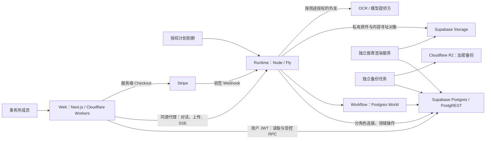

# Clara — 技术蓝图（Architecture）

> **维护约定（供未来的 wayfinder / to-spec session）**：本文件是技术蓝图，只在 wayfinder 或 to-spec 敲定新的技术决定后刷新；刷新时**覆盖旧内容而不是追加**，保持简洁。不记录 ticket 编号、"哪张票做了什么"或逐条测试证据——那些在 GitHub issue、代码、各模块 README 和 `docs/plan/` 的 runbook／report 里。已实现与已接受但未实现的目标要分开标记。每次刷新只回答：**技术栈及选择原因、系统边界、模块职责（含各模块 README 索引）、依赖关系、主要数据流、关键技术取舍**。

[PRD](PRD.md) 定义产品为何存在、服务谁、应如何工作；[CONTEXT](../CONTEXT.md) 统一领域用语；
本文只回答"技术上怎么成立"。精确 API、表结构与函数以源码为准（`codebase-memory-mcp` 帮助定位），
运行与部署操作以各模块 README 为准。标注 **[已实现]** 的部分可在仓库中逐条核对；
标注 **[目标]** 的部分是已接受的技术方向，尚未完整交付，集中列在 §7。

---

## 1. 技术栈及选择原因

| 层 | 当前选择 | 对 Clara 的作用与取舍 |
|---|---|---|
| Web | Next.js 16、React 19、TypeScript 5；OpenNext 部署 Cloudflare Workers（wrangler） | 统一路由、服务端会话与交互界面；边缘部署减少自维护面，代价是 OpenNext／Workers 的兼容边界要自己验证。[已实现] `apps/web/package.json` |
| UI | Tailwind 4、Base UI、shadcn、next-intl | 以可维护的组件源码与共享 tokens 构建密集会计界面；装上组件不等于完成业务状态、无障碍与恢复交互。[已实现] `apps/web/package.json` |
| 数据与身份 | Supabase Postgres + PostgREST + Auth + Storage（`@supabase/ssr`、`@supabase/supabase-js`） | 在一套数据库内完成事务、RLS 隔离、版本与审计；**受控函数承担业务边界**，因此 SQL、grants 与迁移是承重结构而非附属品。[已实现] |
| Agent | Vercel AI SDK 7（`ai`、`@ai-sdk/openai`）、zod 4 | 模型调用与业务领域分离：模型提出行动，受控工具执行，模型拿不到数据库任意写权限。[已实现] `packages/runtime/package.json` |
| 持久执行 | Workflow 4 + `@workflow/world-postgres` 4 | 把步骤、等待、重试与持久 stream 落在自管 Postgres 里；宿主、并发与恢复边界须自行验证，不是托管服务。[已实现] |
| Runtime 宿主 | Node 22、Nitro 3 构建、Express 5、Fly.io 常驻机器 | 承担长时执行、事件消费者、扫描与恢复；与 Web 独立发布，后台工作不绑定浏览器请求生命周期。[已实现] `packages/runtime/package.json`、`packages/runtime/fly.toml` |
| 报表 | 版本化计算定义 + 独立确定性渲染服务 | 从固定数据生成可复现的数字与文件；增加版本／制品管理，但避免模型重写正式金额。[服务已实现，覆盖面与首次部署见 §7] `packages/reporting-render/` |
| 备份 | 独立批处理任务，age 加密后上传 Cloudflare R2 | 异地副本与恢复清单独立于主运行路径。[代码已实现，部署与恢复证明见 §7] `packages/backup/README.md` |
| 工程 | pnpm 10 workspace、GitHub Actions 单一 `ci.yml`、renderer／backup 独立镜像 | 应用与数据接口一起验证，同时隔离渲染与备份的依赖生命周期。[已实现] `pnpm-workspace.yaml`、`.github/workflows/ci.yml` |

**版本钉在 manifest，不钉在本文。** 精确依赖由 `package.json`（根）、`apps/web/package.json`、
`packages/runtime/package.json` 与 `pnpm-lock.yaml` 固定；本文只解释选择理由。
Node 版本本身是承重约束，由根 `engines`（`>=22.11 <23`）与 `apps/web` 的 `devEngines.runtime`（22.23.2）共同限定。

`packages/backup` 与 `packages/reporting-render` 被 `pnpm-workspace.yaml` 以 `!` **刻意排除**在
workspace 之外：它们是各自独立成像、独立部署的批处理应用，依赖装在自己的 Docker 镜像里；
排除后 CI 首步的 `pnpm install --frozen-lockfile` 不会因为一个没有 lockfile 条目的 importer 而红。

---

## 2. 系统边界

**事实归属。** Postgres 保存账务、身份、权限、业务回执与持久运行记录；Storage 保存原始证据与生成文件。
浏览器、Clara 与报表读取同一套会计状态，不各自维护一本账。
Web 的请求生命周期与会计工作的生命周期分开——关闭页面不会终止后台执行。
尚未加入事务所的申请人处于独立准入域，不能假设其已具有 firm 身份。

**四个部署单元的形态。** 状态逐行标注，当前线上版本见 `docs/PROGRESS.md`：

| 单元 | 形态 | 关键约束 | 状态 |
|---|---|---|---|
| `clara-web` | Cloudflare Worker（`apps/web/wrangler.jsonc`） | 非机密配置在 `vars` 里提交（`CLARA_RUNTIME_URL`、`CLARA_PUBLIC_ORIGINS`、`CLARA_STRIPE_LIVEMODE`、`CLARA_TRUSTED_CLIENT_IP_HEADER` 共四项——最后一项是一堵墙的输入，只能取边缘自己写的头，绝不能取客户端可写的 `X-Forwarded-For`）；凭据是 Worker secret；当前未声明任何 KV／R2／D1／service binding | [已实现并部署] |
| `clara-runtime` | Fly app，`sin`，**单台常驻机器**（`min_machines_running = 1`、`auto_stop_machines = false`） | 挂载本地 spool 卷；`/ready`（依赖就绪）与 `/health`（存活）分离；secrets 由 `fly secrets set` 带入，不进文件 | [已实现并部署] |
| `clara-render` | Fly batch app，`sin`，无 HTTP 监听 | 由 runtime 的 `packages/runtime/lib/reconciler-render.mjs` 按需启动 | [配置已就位、镜像未部署，见 §7] |
| `clara-backup` | Fly batch app，`sin`，无 HTTP 服务 | 定时任务，以 dead-man switch 监控而非健康端点监控 | [配置已就位、镜像未部署，见 §7] |

**明确不是高可用。** 当前部署是一台持续运行的 Fly machine + 本地临时上传 spool；
`packages/runtime/fly.toml` 自己写明不得扩容或挂第二台机器。
数据库持久化能支持恢复，但本身不能证明多机分发、spool 转移与恢复流程已可用。[已实现的限制，见 §7]

---

## 3. 模块职责

| 模块 | 负责 | 不应承担 |
|---|---|---|
| `apps/web` | 会话与 scope、导航、业务读取、受控提交、实时消息与对象详情 | 在浏览器重建账务规则、预测已入账金额、持有后台服务密钥 |
| `packages/runtime` | 接收工作、构建上下文、模型／工具协调、Workflow 接入、外发、事件与恢复 | 通过 prompt 自创权限，或把一次模型回复当作会计提交记录 |
| `packages/db` | 会计状态、租户隔离、当前授权、事务、幂等、回执、事件与持久业务控制 | 持有 UI 临时布局状态，或把知识叙述当作可执行授权 |
| `packages/reporting-render` | 领取任务、读取封存数据、生成并保存制品、结算渲染状态 | 修改账本或自行推断正式报表数字 |
| `packages/backup` | 生成加密异地备份及恢复所需清单 | 用"备份成功"消息替代实际恢复证明 |

**`apps/web`** 是唯一的人机面。它以用户自身 JWT 直连 PostgREST 做读取与受控 RPC；
需要长时执行的能力（对话、上传、SSE）一律经同源代理 `apps/web/app/api/runtime/[...path]/route.ts`
转发到 runtime——这是一条请求期路由并显式 allowlist 转发头，不是构建期 rewrite，
因此 runtime 源在配置里可见可换，Web 也不必持有 runtime 的服务凭据。
生成式界面是"服务器注册的 typed part schema × Web reader"的协议；web 与 runtime 是两个独立发布单元，
因此字段与版本的兼容是一项发布义务而非同仓假设——当前 parity 校验主要比对 kind，完整协议兼容仍未实现（§7）。
README：`apps/web/README.md`。

**`packages/runtime`** 是长时执行的宿主：durable workflow、文件入库、agent 执行、HTTP/SSE。
它按用途分角色连接数据库（§4），驱动 Postgres World 引擎，写 Storage 的私有原件，
并在按用途授权下调用外部 OCR／模型提供方。单 leader 负责路由、drain 与 reconcile。
README：`packages/runtime/README.md`。

**`packages/db`** 是会计权威：迁移链、合成种子、DB 测试、备份／恢复工具。
表默认 FORCE RLS，应用角色不能直接触达；一切写入经固定 `search_path`、按角色授权的
SECURITY DEFINER 领域函数。迁移是**追加式**的：文件名为 `NNNN_name.sql`，已应用字节不可变，
当前 frontier 只能从 `clara.schema_migrations` 账本读出——绿色 exit 或 `OK` notice 都不等于已落地。
README：`packages/db/README.md`。

**`packages/reporting-render`** 是独立成像的批处理 worker，读封存数据生成确定性 PDF；
它直接读 DB 与 Storage，不经 runtime 的请求路径，也从不安装进 `@clara/runtime`。
README：`packages/reporting-render/README.md`。

**`packages/backup`** 是独立成像的定时任务：从 DB 取转储、以 age 加密、上传 R2，并留下恢复所需清单。
**文件对象镜像**是增量的（additive），快照过期由 R2 生命周期规则处理而不是由它删除，
默认滚动 DR 窗口 30 天。它不建立法定保存期，也不证明一份备份可被恢复。
README：`packages/backup/README.md`。

**目标领域模型 [目标]。** 蓝图区分以下记录；现有 task／chat／interruption 表是迁移基础，
尚不等同于完整 Work 模型：Accounting Work（客户归属、业务意图、发起人与授权依据、来源、依赖、问题、结果与回执）、
Conversation（对话及上下文边界，多段对话可讨论同一 Work）、Workflow run（某执行版本的一次运行）、
Question／answer（需要的事实或决定、问题与依据版本、被接受的回答与回答者）、
Accounting operation／receipt（一次逻辑业务行动及其已提交的完整影响）、
JE 与领域对象（JE 保存总账金额，open items／allocations／assets／plans／periods 保存额外业务关系）、
Knowledge 与 source（可追溯的事实、身份、偏好、政策、经验及来源版本）。
Firm workspace 可查询获准客户并组织批量工作，但**每一笔会计执行仍绑定一个明确客户**；
portfolio 不是合并账本，未能确定客户的输入可先持久接收为待归属请求，不能猜造 client ID。

### README 索引

| 路径 | 负责说明 |
|---|---|
| `apps/web/README.md` | Web 应用的安装、本地运行与 Cloudflare 部署；应用地图与关账／银行操作顺序 |
| `apps/web/e2e/live-stack/README.md` | 以真实一次性 Postgres／PostgREST／runtime 栈跑生产 web bundle 的两个 runner；对非一次性目标有拒绝闸门 |
| `packages/runtime/README.md` | 结构、本地命令、连接与服务配置、健康与 TLS、恢复清单、启动普查、部署与回退、评测 |
| `packages/db/README.md` | 迁移与部署行为、连接与破坏性操作、`interactive_client` wake kind、Storage grant/policy battery、operation-contract census、备份与恢复 |
| `packages/db/tests/README.md` | DB 测试套件：迁移链、租户隔离、审计写入者、会计约束、文件处理、准入、关账／报表、运维工具 |
| `packages/db/storage-battery/README.md` | 针对 `deploy/storage-provision.sql` 的允许／拒绝电池，跑在真实 Supabase Storage 上 |
| `packages/reporting-render/README.md` | 独立 Fly batch worker：确定性封存报表 PDF；排除在 pnpm workspace 之外 |
| `packages/backup/README.md` | 独立 Fly batch app：加密异地 DR 副本；排除在 pnpm workspace 之外 |

---

## 4. 依赖关系

**调用方向。** [已实现]

- `apps/web` → `packages/db`：用户 JWT 经 PostgREST 做读取与受控 RPC。Web 不向 runtime 要业务数据。
- `apps/web` → `packages/runtime`：只经同源代理（对话、上传、SSE）。
- `packages/runtime` → `packages/db`：按用途分角色的登录连接，执行领域操作。
- `packages/runtime` → Workflow／Postgres World 引擎；引擎自身也写同一个数据库。
- `packages/runtime` → Supabase Storage（私有原件与内容寻址对象）、→ 外部 OCR／模型提供方（按用途授权）。
- `packages/reporting-render` → `packages/db` + Storage，**不经** runtime。
- `packages/backup` → `packages/db`（读）+ Cloudflare R2（写）。
- `apps/web` → Stripe（服务端 Checkout）；Stripe → `packages/runtime`（验签 webhook）。

**连接按职责分权，不共用一个应用角色。** `packages/db/deploy/roles-bootstrap.sql`（DR 角色重建仪式，
其头部登记了对应的迁移来源）给出当前角色册：11 个 NOLOGIN 组角色
（`clara_fn_owner`、`clara_authenticated`、`clara_agent_ro`、`clara_wake_interactive`、`clara_wake_proactive`、
`clara_runtime`、`clara_freeform_ro`、`clara_wake_bank`、`clara_wake_filing`、`clara_stripe_webhook`、`clara_auth_wall`），
7 个登录壳（`clara_runtime_login`、`clara_agent_read_login`、`clara_wake_write_login`、`clara_freeform_login`、
`clara_wake_bank_login`、`clara_stripe_webhook_login`、`clara_auth_wall_login`；在仓库与 DR 仪式里是 NOLOGIN，
只在实际集群上带外翻成 LOGIN），外加一个只做存储的凭据 `clara_storage_docs`
（NOINHERIT，只授予 `authenticator` 供 Storage 自己 `SET ROLE`，对 `storage.objects` 只有 select+insert，
范围由 `packages/db/deploy/storage-provision.sql` 的 RLS 策略限定，UPDATE／DELETE 从未授予）。
人工与 agent 的会计写入只经被授予的领域函数；definer 函数的 owner、`search_path`、grants
与参数校验共同组成这道边界。

**跨表写入的全局取锁顺序**是 **accounting_plans → accounting_work → agent_tasks → agent_interruptions**，
任何新门都必须按这个方向取锁——方向相反的两扇门会把一次任务级取消与一次 Work 级取消撞成实测可达的死锁。
`40P01`／`40001` 到达 web 时是类型化的 transient 409，不是裸 500。[已实现]

**版本钉子。** 运行侧的"这镜像能跑什么"由 `packages/runtime/workflows/registry.ts` 单一来源决定：
`workflowBodies`（本镜像能运行的全部 body 标识符，当前 51 个）与 `workflowPins`（class → body）
都是冻结的字符串字面量，不是函数引用；当前 pin 为 `chatTurn → chatTurn_v19`、`claraWork → claraWork_v3`。
同一份名册被三个面读取且不得互相矛盾：world 启动的 provenance 日志、`/api/build-info`、
以及回退预检 `packages/runtime/lib/rollback-preflight.mjs`。

---

## 5. 主要数据流

### A. 文件入库 → 类型化事实 → 会计工作 → 过账 → 关账 → 报表

上传先落 runtime 本地 spool，检查媒体类型与恶意软件，再写成不可变私有对象并按内容 hash 建立保管。
保管提交前的任何失败（含 Storage 瞬时故障）不留 `clara.documents` 行、把 intake 终态化为失败、
删除已 spool 的字节——重新上传是唯一恢复路径，没有半成品。[已实现]

OCR／结构化抽取对发票与月结单走文本 + 图像双 witness，保留来源 hash、模型版本与一致性／算术校验；
不同格式的覆盖程度不同，由数据库里的能力目录 `clara.document_capabilities` 如实声明
（custody / byte_extraction / typed_facts / business_operation 四个正交轴，全局而非按租户，
未知方向取诚实默认而不是乐观默认）。[已实现，覆盖面见 §7]

金额一律是**整数最小货币单位**（DB 侧 bigint `*_cents`），余额、舍入、期间与关联对象检查都在这个单位上执行；
大整数穿过 JSON 与前端时必须保留精度——freeform 读路径已知的精度缺口仍未修（§7）。[已实现]

类型化事实进入 Accounting Work：准入分配稳定的逻辑操作身份（绑定 firm／client／Work／intent），
run 在冻结 bundle 下执行，调用受控领域 operation，**在同一事务内**提交完整会计影响 +
`clara.operation_receipts` + outbox。"完整影响是事务边界"是核心约束：确认一张发票需要相应总账与 open item，
收款分配必须维护余额，购置资产要同时保留资产记录。已入账历史不可原地改写——更正是有来源关联的
冲销／替代操作。同 key 同 payload 重放取回原回执，同 key 不同 payload 是类型化 conflict。[已实现]

关账按年度顺序串行，carry-forward 幂等，beginning-close 冻结期间内银行结算须先完成。
报表走 open → evaluate → seal → render：确定性计算、封存快照、独立渲染服务出文件，模型不重打金额。
指标携带 unit／currency、period／as-of、computed-at、定义版本、source watermark 与 coverage；
**无权限、缺覆盖、读取失败都必须如实表达，不能读成零**。探索性分析可以使用模型，
但必须与正式制品区分开，不得越过 seal 链。[部分已实现，见 §7]

### B. Chat turn（含澄清与知识捕获）

`chatTurn` class 在 registry 里始终指向最新 body（当前 `chatTurn_v19`），每次演进以新 `_vN` 交付
（v19 相对 v18 加了两个工具、一个 wire kind 与一个**并列的**新 step，而不是加宽一个已部署的旧 step），
旧版本保留导出供在途 run。对话可以发起会计 Work（与直接表单走同一扇准入门，不是第二套会计引擎），
也可以捕获客户知识——知识以服务器登记的 key 写入，trust 由来源种类派生，
对话车道只开放"用户陈述"与"模型推断"两档，读不到知识与没有知识必须被区分开。知识包 `clara.get_knowledge_pack`
只对 runtime 开门，人读原始登记簿（`list_client_knowledge`）；撤回知识是人类专属动作，runtime 没有撤回门——
两条均为 owner 2026-09-15 裁定（#783、#785）。[已实现]

共享问题有稳定身份与问题／依据版本：一个 Work 同时至多一个待答问题，数据库只接受当前获准的第一份答案，
重复提交回放同一结果；期限到期后问题失效而不是 Work 静默完成。
Work 详情、Needs you 与 chat rail 展示并回答**同一个**问题记录。[已实现]

**模型侧的修复与预算合同**由每个 successor 重新实现，不随冻结正文自动继承：错误按 (errcode, reason)
名册分为 invalid_input／state_changed／conflict／transient／refusal／cancelled／invariant 七档；
**refusal 与 conflict 对模型是终态，不得改参重试**；可安全重算的状态冲突重读，基础设施失败有限退避，
缺事实或决定才提问；每段模型／工具／重算／重试预算有限且被记录，耗尽结算为可恢复的 `failed/limit`。
具体名册以 `packages/runtime/workflows/claraWork.v*.errors.ts` 为准。[已实现]

### C. Wake／控制循环与心跳

控制监听器以 `LISTEN clara_runtime_ctl` + 轮询双保险，租约式投递澄清（exactly-once-or-provably-delivered），
取消走 abort-then-settle（取锁顺序见 §4），崩溃由 reconciler 修复
（`packages/runtime/lib/control.mjs`、`lib/reconciler*.mjs`）。
单一 leader 负责路由／drain／reconcile；`world` 心跳由**独立计时器**写入、从不由 leader 写，
因此 leader 状态不闸 `/ready`（`packages/runtime/plugins/startWorld.ts`）。
wake 任务的 workflow class 由数据库逐行决定而非静态硬编码，因此启停某条心跳是数据决定而非发版决定。
`/health`（存活）与 `/ready`（依赖与配置就绪）分离，且就绪读数是三态加"未配置"第四态——
"没测过"不得被读成"健康"。[已实现]

### D. 授权计划到期 → Work

计划授权是**库内可解析的显式指令**：计划行指向本库中一条 Work 或任务作为授权依据，开门时必须真的解析到——
Knowledge 偏好、计算政策与"观察到的重复扣款"都解析不到，按名拒绝。计划的三张关系不授予任何应用角色权限，
人类门（建立／修订／暂停／恢复／结束／补提／读取）与**唯一**的 runtime 扫描门分开授予；
术语见 [CONTEXT](../CONTEXT.md)。[已实现]

到期扫描**每个 leader cycle 跑一次**，每个计划每次只取一个到期事件；"计划 + 到期日"与
"计划 + leg + 会计期间"两条唯一键共同收敛重复扫描与改期修订，转回必须等本期计提**已入账**且该分录仍在世。
暂停只阻止未来接收，从不取消已接收的 Work；错过的期间一律走显式补提，扫描从不回填。
runtime 皮带不自行推导任何日期，也不读任何 operator 开关——**不存在"全局开启自动执行"开关**，
迁移尾部的普查对在世函数体断言了这一点。[已实现]

### E. 模型外发（按用途授权 + 执行轨迹）

外发是类型化的 client 用途家族：prepare／consume 两阶段、单次使用、短 TTL、多项重绑定检查。
**Work 车道**的授权不是一个 per-client 开关，而是**推导**出来的：事务所当前接受的 Terms + DPA
且该 client 在世活跃；撤销可逆，且对已消耗的 dispatch 是追溯的——账务核心在提交时会再读一次授权是否仍在世。
其余五个 typed purpose 仍走人工 grant + activation（`clara.grant_client_egress_purpose`／
`activate_client_egress_purpose`），两套并存尚未统一。[已实现；激活基础由 owner 于 2026-09-15 确认（#825）]

执行轨迹表没有 payload 列、每列有文法校验、写入方做脱敏，且任何应用角色对它连 SELECT 都没有
（FORCE RLS + 无 policy）。承担轨迹与能力目录这两件事的模块随冻结版本一起锁定：
`packages/runtime/lib/work-trace.mjs` 是冻结正文的动态 import 入口，
`lib/capability-registry.mjs` 由它静态 import 带入闭包，两者都在闭包哈希内。
（`lib/egress.mjs` **不**在冻结闭包里：它是 OCR 提供方的适配器，兼一张 purpose 查表——
按它自己的注释是文档与查表、从不是授权；授权只由数据库动词判定。）
轨迹**没有导出路由**（by absence）：view-only，保留期由 prune lane 决定（owner 2026-09-15 确认，#802）；
对 `work-trace.mjs` 脱敏逻辑的任何加固只能随下一个冻结版本（`claraWork_v4`）交付，不做原地修改
（owner 2026-09-15 裁定，#815）。[已实现]

### F. 发布与回退

迁移运行器用会话连接 + 会话级 advisory lock + 每迁移一事务；已应用字节不可变，只能追加后继迁移；
部分迁移会**倒转**默认顺序（先部署 consumer 再迁移），该义务写在迁移文件头部。
唯一权威是 `clara.schema_migrations` 账本。[已实现，`packages/db/README.md`]

**版本、冻结与回退。** `scripts/check-frozen-workflows.mjs` 对冻结正文及其相对 import 闭包做 append-only
哈希校验；deploy-lock 是发布之后单独的一次仪式，与代码合并分开。法条三句：
**(a)** 已部署的 body 不可变，行为变更以新的 `_vN` 导出发布；**(b)** 入队站点经 registry 解析，
因此永远指向当前 pin；**(c)** 带在途 run 的导出不可改名或删除。
历史上冻结的 body 在自己的文件头引用"ARCHITECTURE Appendix A"；本仓库没有、也不会有 Appendix A——
那些文件是冻结的，**其引用永远不能被修改**，所以取代它的不是一次改名，而是本小节这个锚点
`#workflow-versioning-and-rollback`：任何读到该引用的人应当读这里（freeze-lint 失败时打印给人看的也是这一行）。[已实现]

回退预检 `packages/runtime/lib/rollback-preflight.mjs` 回答三问：(1) 非终态 run 的 body 普查；
(2) 绑不到 run 的在世任务普查（未知 kind fail-closed）；(3) 数据库自身对目标镜像的 body 要求
（某些迁移之后，目标镜像必须携带指定 body，且这一条不能靠 drain 清除）。该 frontier 规则与 0195 的
pre-v3 grandfather arm 已实现并上线；owner 于 2026-09-15 裁定（#826）：beta 期间托管用户与数据均为测试数据，
停泊在 pre-v3 body 上的 Work 无需保全、经 Work 取消门清理即可（#820），两条规则保持已上线形状不动，
下一次 wall-raising 迁移采用 grandfather 还是 drain 届时再裁。World 启动前另有一道 stranded-body 普查闸门：
发现缺口即拒绝启动 durable world（HTTP 仍服务，`/ready` 503），只能由显式操作者覆盖。该拒绝是
**database-wide** 的——同一个库上任何 lane 停泊的未导出 body 都会拒绝之后每一个 runtime 进程——owner 于
2026-09-15 确认为既定取舍（#793）；CI 因此给不能容忍他人停泊 run 的 leg 各自一份模板复制库，
按 lane 收窄留待 #792 的 park-and-warn。[已实现]

发布仪式的实际形状（写前备份 → probe 机器只读预检 → 按 digest 发布 runtime → 发布 web → 静默窗口内迁移 →
校验启动日志顺序 → smoke → 只读演示回退预检 → 事后单独锁定冻结清单）记在
`docs/plan/active/refresh-wave-2026-09-14/RELEASE-RUNBOOK.md`，不在本文。

---

## 6. 关键技术取舍

- **追加式迁移 + prestate 钉子 + tail 普查。** 已应用文件字节不可变，行为变化只加新迁移；
  被**重切**的受控函数须在同一迁移的 prestate 里以 **pre-image sha256** 钉住其在世函数体（漂移即拒绝应用），
  tail 再重读 owner／SECURITY DEFINER／固定 `search_path`／逐字 ACL 证明"没动别的"。
  取舍：牺牲编辑便利换可审计与可回退，代价是必须守 writer-quiescence 窗口纪律。
- **FORCE RLS + 受治理的 SECURITY DEFINER 门。** 应用角色不能直连表，一切经固定 `search_path`、
  按角色授权的门；`packages/db/scripts/operation-census.mjs` 对整个 `clara` schema 的 owner／definer／ACL／
  错误码／调用点做交叉校验。取舍：新增能力必须走门，开发成本更高，换来**"应用角色不能直连 clara 表"
  这一条**能被机器证明——可被证明的也只是这一条：托管 Supabase 的 provider-owned `pg_catalog` ACL
  不完全由项目控制，notification／advisory lock／sleep／XML helper 等残余能力经 PUBLIC grant 到达，
  逐角色 `REVOKE EXECUTE` 实测无效（唯一有效的关法需要 pg_catalog 所有权，属 owner 仪式而非迁移），
  因此不能仅凭 public schema grants 宣称全部封闭。受限 freeform 读是单独授权的**只读**能力，
  不能通过 `SELECT` 包装写函数取得写权限。
- **冻结不可变 workflow body + 钉住的 registry。** 入队点只解析 registry；行为变化发新 `_vN`。
  取舍：body 数量单调增长（当前 51 个），换来 replay 安全与可控回退。
- **单台 Fly machine + 常驻 Postgres World + 单 leader。** leader 崩溃即整进程退出由 Fly 重启（crash-only）。
  取舍：简单与成本优先，代价是没有多机分发与 spool 转移的证明。
- **Web 经 OpenNext 部署 Cloudflare Workers，且从不持有 runtime 服务凭据。** 读走用户自己的 JWT，
  长时能力走同源 allowlisted-header 代理。取舍：边缘部署减小自维护面，但 OpenNext／Workers 的兼容边界仍需自验。
- **文件字节读取只用代理，不用签名 URL。** 代价是每次请求重读在世 membership，换来即时可撤销性。
- **刻意不做的事：**
  - 没有 per-client 的 AI 开关（Work 车道的外发授权由事务所级 Terms／DPA 接受与 client 活跃状态推导）；
  - 会计计划的建立／修订／补提以 bookkeeper 为下限，不复制 0045 调整模板的两签仪式——两条 lane 是不同产品
    （owner 2026-09-15 确认，#790）；
  - 没有"全局开启自动执行"开关；观察到重复扣款不自动创建计划，也不代表产品具有发起银行付款或管理 mandate 的权限；
  - 不承诺高可用；
  - 不发明税率、门槛或员工计算——税率、阈值与法律文字是**有生效日期的外部输入**，
    在实现或启用相应能力时验证，不固化为架构常量；算术只用来核对会计师自己供的数字；
  - 不把知识叙述当作可执行授权（知识记录里的 policy 是描述性的，不改变入账行为）；
  - 法律文本签署与 close evidence exception 是**人类专属动作**，结构上只对 `clara_authenticated` 开门，
    agent 车道永远取不到——收紧或放宽都要同时改这句话与对应的 grant。

---

## 7. 已接受但未实现的目标

各项的交付范围、依赖与完成证据由 GitHub 上的 delivery spec 与票承接；本表只记"与当前实现的差别"。
曾待 owner 裁定的两项语义（#825、#826）已于 2026-09-15 裁定，记在 §5 E／F；本表不再单列。

| 目标 | 与当前实现的差别 |
|---|---|
| 完整 Accounting Work 领域模型（Work／Conversation／run／Q&A／receipt／JE 与领域对象／Knowledge） | `clara.accounting_work` + `operation_receipts` 已是该形状的首个持久化实现，但 Conversation 与 Knowledge 侧仍部分依赖既有 task／chat／interruption 表 |
| 统一能力目录覆盖全部 lane | `packages/runtime/lib/capability-registry.mjs` 已为 Work lane 落地并写入执行轨迹；documents／bank／close 三条 lane 尚未纳入 |
| 按操作粒度的外发 token 与配额 | 当前只有一个粗粒度的 `accounting_work` 用途 token，没有配额；firm-narrow 外发家族还缺 consume 动词 |
| 全量硬性 readiness 门（覆盖所有已配置连接通道与存储） | `/ready` 已分离依赖检查并支持三态读数，但尚未对每条已配置通道强制闸门 |
| 报表 metric pack 与 chart／表格读同一定义 | 渲染服务与封存流程存在；"金额／AR-AP 归桶在受信数据层统一定义"尚未全面落地 |
| typed part 的完整协议兼容（字段与版本，不只 kind） | web 与 runtime 是两个独立发布单元，当前 parity 校验主要比对 kind，部分 reader 只有 ID |
| freeform 读路径的大整数精度 | 金额在 DB 与领域函数里是整数最小货币单位；freeform 只读路径经 JSON 到前端的精度缺口仍未修 |
| 发票行项目（line items）的类型化事实 | 能力目录中显式标为 planned，当前不抽取行项目 |
| 批次 Work（95/5 部分推进）的完整 UI | 目标是"95 份可独立处理的继续、5 份等待"；生产者尚不存在时 UI 如实降级，不伪造 Batch 标签页 |
| SST／税务申报服务 | 税务期间与 watch 的基础结构存在，beta Tax 未激活；参考表不等于可用申报服务 |
| 异地备份的首次真实部署与恢复演练 | 脚本、age 加密与清单已实现，镜像未部署，restore 从未被证明（`packages/backup/README.md` 自己写明这一点） |
| 渲染器首次真实部署的验收门槛 | 镜像已统一 Node 22 并有确定性 drill，但"真实排队任务完成、内容哈希一致、manifest 记录实际镜像、替换前保留前一镜像"仍是待兑现义务 |
| 多机部署、spool 转移与恢复演练 | 当前明确是单机 + 本地 spool；数据库持久化能支持恢复，但流程未被证明可用 |
| 若干已知的单向缺口（期初余额车道的凭据绑定方向、chat 车道 `HookNotFound` 的投递语义） | 两处的主路径都已串行化或已覆盖，各剩一个方向／一个状态未收口，由 GitHub 票承接 |
