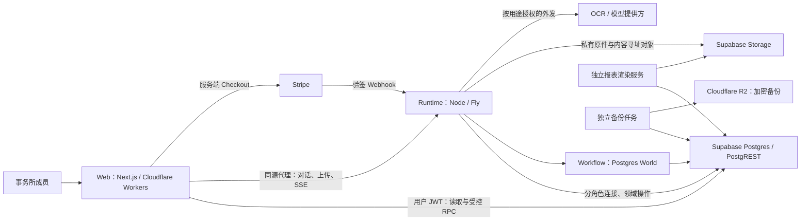
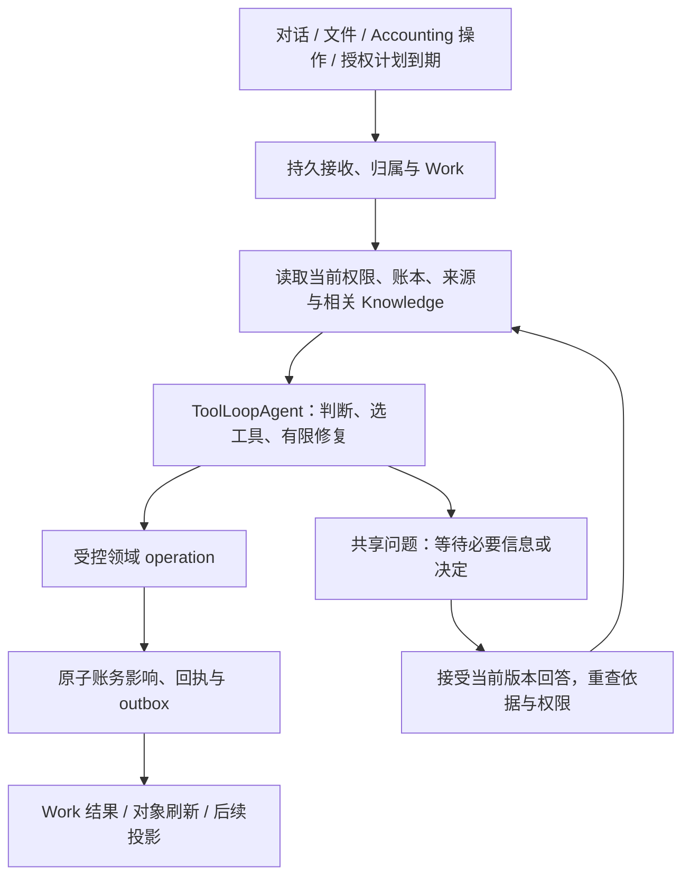

# Clara — 技术架构蓝图

本文是 Clara 持续维护的最高层技术蓝图：解释技术栈及选择原因、系统边界、模块职责、依赖、
主要数据流，以及保证会计正确性、可恢复性和隔离性的技术取舍。
[PRD](PRD.md) 定义产品为何存在、服务谁、应如何工作；[Context](../CONTEXT.md) 统一领域用语。
具体 API、表结构和函数以源码为准，codebase-memory-mcp 帮助定位；包级 README 负责运行与部署操作。

本文同时记录**当前实现**和**已接受、尚待实现的目标**，不能把设计决定写成上线事实。
明确标注目标的部分尚未完整交付；其余当前结构以 2026-09-09 的仓库源码为依据，
不代表已逐项复核线上部署。文末集中说明主要迁移差距。
当前目标来源于已接受的 [Clara refresh spec](https://github.com/BELCORT-SDN-BHD/clara/issues/612)。
Spec 保存一次建设的验收合同；本文持续反映仍然有效的技术方向，不随那次建设结束而失效。
Wayfinder／spec 接受技术方向变化时更新目标及理由；实现变化时同步更新当前边界和迁移说明。

## 1. 系统形态与部署边界

Postgres 保存账务、身份、权限、业务回执和持久运行记录；Storage 保存原始证据与生成文件。
浏览器、Clara 和报表读取同一套会计状态，不各自维护一本账。
Web 的请求生命周期与会计工作的生命周期分开，关闭页面不会终止后台执行。
尚未加入事务所的申请人处于独立准入域，不能假设其已具有 firm 身份。

当前部署配置是一台持续运行的 Fly machine，使用本地临时上传 spool；这不是高可用部署。
数据库持久化能支持恢复，但本身不能证明多机分发、spool 转移和恢复流程已可用。

## 2. 技术栈与选择理由

| 层 | 当前选择 | 对 Clara 的作用与取舍 |
|---|---|---|
| Web | Next.js 16、React 19、TypeScript；OpenNext 部署 Cloudflare Workers | 统一路由、服务端会话和交互界面；需要验证 OpenNext／Workers 兼容性及独立部署的接口兼容性。 |
| UI | Tailwind 4、Base UI、shadcn、next-intl | 用可维护的组件源码、交互基础和共享 tokens 构建密集会计界面；安装组件不等于完成业务状态、无障碍或恢复交互。 |
| 数据与身份 | Supabase Postgres、PostgREST、Auth、Storage | 在一套数据库内完成事务、RLS 隔离、版本和审计；受控函数承担业务边界，需要认真维护 SQL、grants 与迁移。 |
| Agent | Vercel AI SDK 7.0.77，当前流程使用显式 model/tool loop | 模型调用与业务领域分离；模型提出行动，通过受控工具执行，不能直接取得数据库任意写权限。 |
| 持久执行 | Workflow 4.8.4、Postgres World 4.3.4 | 将步骤、等待、重试和流持久化在自管 Postgres；需自行验证宿主、运行版本、并发与恢复边界。 |
| Runtime 宿主 | Node、Nitro 构建、Fly 常驻进程 | 承担长时间执行、事件消费者、扫描与恢复；与 Web 独立发布，避免把后台工作绑定到浏览器请求。 |
| 报表 | 版本化计算定义、独立渲染服务 | 从固定数据生成可复现的数字和文件；增加版本／制品管理，但避免模型重写正式金额。 |
| 工程 | pnpm workspace、GitHub Actions、独立 renderer／backup images | 应用与数据接口一起验证，同时隔离渲染和备份的依赖生命周期。 |

精确依赖由 [根 manifest](../package.json)、[Web manifest](../apps/web/package.json)、
[Runtime manifest](../packages/runtime/package.json) 与 [lockfile](../pnpm-lock.yaml) 固定。
根 engine（`>=22.11 <23`）、`.nvmrc`、CI toolchain 与 runtime Docker 两个 stage 现已统一为 Node 22.23.2；
Web 通过 `devEngines.runtime` 声明同一版本。Node 20 已于 2026-04-30 停止维护。
当前 Workflow 4.8.4、Postgres World 4.3.4、AI SDK 7.0.77 组合在 Node 22 上完成本地 typecheck、
Nitro build、全量 DB／runtime 测试与持久 World e2e；Linux image 与 hosted 证据以 #616 记录为准。

**已接受目标：**以该 Node 22 宿主与同一组依赖构建首个 ToolLoopAgent successor。
选择这条路线是沿用已调查的数据库和执行基础，并减少手写 loop 的职责；没有宣称它是所有产品的最优栈。
WorkflowAgent v1 能与 Workflow 4 配合，但其精确的较旧 AI 依赖和 stream retry 维护是已记录的取舍。
Workflow 5 是另一组需整体验证的候选依赖，本次目标未采用；换路线需要更新架构决定及等价验证。

## 3. 模块职责、依赖与事实所有权

| 模块 | 负责 | 不应承担 |
|---|---|---|
| `apps/web` | 会话与 scope、导航、业务读取、受控提交、实时消息和对象详情 | 在浏览器重建账务规则、预测已入账金额、持有后台服务密钥。 |
| `packages/runtime` | 接收工作、构建上下文、模型／工具协调、Workflow 接入、外发、事件和恢复 | 通过 prompt 自创权限，或把一次模型回复当作会计提交记录。 |
| `packages/db` | 会计状态、租户隔离、当前授权、事务、幂等、回执、事件和持久业务控制 | 持有 UI 临时布局状态，或把知识叙述当作可执行授权。 |
| `packages/reporting-render` | 领取任务、读取封存数据、生成并保存制品、结算渲染状态 | 修改账本或自行推断正式报表数字。 |
| `packages/backup` | 生成加密异地备份及恢复所需清单 | 用备份成功消息替代实际恢复证明。 |

**目标领域模型**明确区分以下记录；现有 task／chat／interruption 是迁移基础，并不已等同于完整 Work 模型。

| 记录 | 保存的事实 |
|---|---|
| Accounting Work | 客户归属、业务意图、发起人与授权依据、来源、依赖、问题、结果和回执。 |
| Conversation | 普通对话及上下文边界；多段对话可讨论同一 Work。 |
| Workflow run | 某个执行版本的一次运行；同一 Work 可有多次运行或恢复尝试。 |
| Question／answer | 需要的事实或决定、问题与依据版本、被接受的回答、回答者。 |
| Accounting operation／receipt | 一次逻辑业务行动及其已提交的完整影响；区别于工具调用尝试。 |
| JE 与领域对象 | JE 保存总账金额；open items、allocations、assets、plans、periods 保存额外业务关系。 |
| Knowledge 与 source | 可追溯的事实、身份、偏好、政策、经验及来源版本；搜索和 wiki 可重建。 |

Firm workspace 可以查询获准客户并组织批量工作；每一笔会计执行仍绑定一个明确客户。
Portfolio 不是合并账本。未能确定客户的输入可以先持久接收为待归属请求，不能猜造 client ID。

## 4. 数据库、会计与权限边界

应用通过明确的领域函数执行会计操作。当前已有人工 RPC、agent posting core、
`wake_post_entry`、结算、资产和关账函数；agent 调用保留其身份与 model/version 归因。
目标是让人工入口、上传和对话共享业务含义及必要影响，而不是为每个 UI 再实现一份会计引擎。

关键约束位于可信服务和数据库边界：

- firm RLS、client 归属、当前 membership／delegation 和 operation scope 必须成立。
  UI capability 只控制交互；旧 JWT、旧上下文或用户回答不能维持已撤销的权限。
- 人工与 agent 的会计写入只经授予的领域函数；human、agent read/write、freeform、bank、webhook、auth-wall
  连接按职责分权。Definer 函数的 owner、search path、grants 与参数校验共同组成边界。
- 金额使用整数最小货币单位，执行余额、舍入、期间及关联对象检查。
  大整数经过 JSON 和前端时必须保留精度；已有 freeform 路径的精度差距仍需修复。
- 来源、所审修订、当前账本依据与合法身份共同决定操作是否可接受；schema 正确不代表会计解释正确。
  用户明确提供的事实也是目标接受的依据，但不得伪造文件或声称独立核实。
- 已入账历史不可原地改写。更正是有来源关联的冲销／替代操作，还必须修正受影响的分配和明细。

**完整影响是事务边界。**确认一张发票需要相应总账和 open item；收款分配必须维护余额；
购置资产要同时保留资产记录。当前 `_subledger_on_approve` 等机制已承担部分耦合影响。
增加一个科目或配置计划可能不产生 JE；把已记录付款分配给发票也不能再创造现金分录。
同一 Work 的独立步骤可以分别提交，必须一起成立的账务关系在同一事务内成立。

**重试语义的目标：**服务器分配稳定的逻辑 operation identity，绑定 firm／client／Work／intent；
请求 payload、依据修订和执行 bundle digest 另行记录。未产生效果前可以受控重算；提交后更换参数
不能得到第二次效果。恢复返回获准读取的原回执或冲突，更正另建关联操作。
现有幂等函数是基础，wrapper 的 actor／key 约定尚未完全统一。
#623 首次落地了这个形状：`clara.accounting_work` 在准入时分配 `logical_op_id = work:<id>:journal_entry:1`，`intent_key` 以 (firm, client) 为幂等范围；`clara.wake_record_journal_entry` 只允许 client-pinned、OBO 发起人本人的 `interactive_client` 凭证调用，提交时重读发起人当前 membership、client 状态、期间锁、科目与 generic 分录禁止控制科目 leg，以 draft→approved 的常规转换写入普通 `journal_entries`（maker／checker 为 agent identity，origin `agent`），同一事务写入一条 `clara.operation_receipts`（每个逻辑身份至多一条 committed 回执），同 key 同 payload 重放原回执、同 key 不同 payload 是类型化 conflict；agent-post 回执墙已扩展为接受两种回执形态之一；`settle_work_run` 在已有 committed 回执时强制结算为 completed（取消／失败不能覆盖已入账事实）并级联取消待答问题。
#634（0182）在此形状上加了可选与迟到的凭据：一次 Work 可以在准入时指定至多一份已归档到该客户、字节已核实的文件（`source_refs` 的 `document` 元素，逐元素校验并给出 1-based `field`；重放分支先于可变的归档检查），提交时再读一次（`source_conflict`）；凭据落在新的仅追加关系 `clara.entry_evidence_links`，而不是 `journal_entries.document_id`——已入账分录不可原地改写（`clara._tf_entry_immutable` 的 approved→approved 白名单只有 `{reversed_by, reversal_reason, updated_at}`），且该列属于文件编码车道的 `ck_je_doc_pair`／`ck_je_document_filing_pair` 三元组。一份文件在全事务所范围内至多支撑一条**在世**的已过账分录（`released_at is null` 的部分唯一索引；冲销由 `t_entry_evidence_release` 释放链接，更正分录可再引用同一文件）；重复指定在准入即 CLR13 `source_already_posted`（附冲突分录 id），提交时为 `source_conflict`，并发插入也重抛同一类型化拒绝而非裸 23505。迟到指定走人工门 `clara.attach_entry_evidence`（bookkeeper+，op_key 幂等，`p_expected_revision` 只作过期闸——触发器禁止推进 revision，无任何财务效果，不写 `operation_receipts`，因该表结构上是 agent run 回执）；`clara.list_entry_links` 为 Journals 表提供 purpose／basis origin／来源／Work／回执／冲销链。意图幂等的载荷比较扩展为「basis digest + 规范化 source refs」两半（basis digest 公式不变；chat 车道的 refs 规范化为 `{"kind":"chat_task"}`）。已知单向缺口：文件编码车道的 `_draft_entry_core` 仍不回看凭据链接（#718）。
#728（0183）让 Activity 摘掉 sweep 心跳的噪音同时保住可核查性：一条 `sweep.run_completed` 回执若其 run 未产生任何效果（`drafted_count + posted_count = 0`；`refused_count`／`skipped_count` 各自已有可归因面，刻意不计入"效果"）即整条从该 firm 的 Activity 摘除，保留的回执改标 `kind='agent'`、actor 置空，web 端渲染为"Clara (system)"。排除判定是一次集合读而非逐行判定：`clara._sweep_events_with_effect()`（feed 用，取该 firm 有效果的回执 id 全集）与 `clara._sweep_event_has_effect(uuid)`（detail 门用，单条判定）——两个 SECURITY DEFINER 函数、bookkeeper 门槛内置、按 firm 双向校验（含 run 自身归属的 firm）、对 `payload->>'run_id'` 不做 uuid cast（一行脏数据只匹配不到任何行，不拖垮整个 firm 的 feed）。两函数各自恰好一种固定查询形状，且连同两扇门 `list_activity`／`get_activity_event` 在函数级声明 `set plan_cache_mode = force_custom_plan`——这是本次立下的估值规则而非枝节：plpgsql 语句在会话内第 6 次执行起会换成 generic plan，而 generic plan 把多租户表上的 firm 谓词估成"每 firm 平均值"；第一版（一条带 `x is null or …` 谓词、两个调用方共用的语句）实测调用 1–5 约 18–46 ms、调用 6–10 骤降为 13.5–16.4 秒，拆成两个固定形状的函数后 helper 仍因 `c.firm` 参数在第 6 次翻转（0.5–3 秒），最后门自身也翻转（30,000 条 operation_receipts 时 145 ms → 2.0–2.8 秒；0181 继承的位点）；四个函数钉住 custom plan 后十次连续调用全程持平，由 0183 的 tail 拒绝缺钉、`activity-feed.test.mjs` af.20／af.23 以自植 1,500-firm 偏斜的十次序列钉住。PostgREST 长连接池意味着这类翻转在生产里表现为"用一会儿就变慢、换个连接又好了"。成本以 KEPT 集为界而非 firm 的 sweep 历史：`ix_sweep_runs_firm_effect`（`firm_id`，限定 `drafted_count+posted_count>0`）驱动、复合 partial index `ix_domain_events_sweep_run`（`(firm_id, payload->>'run_id')`，限定 `sweep.run_completed`）逐条探测、LATERAL 子查询以 `offset 0` 作优化栅栏（无栅栏 planner 会把探测拍平成对全历史的 Merge Join）——1,000／6,000／30,000 条历史下均为 1.6–1.9 ms。KEPT 集本身仍随 kept 历史线性增长（每千条约 3.8 ms，30,000 条时每页 187–231 ms，无断崖）。裁定（#744，owner 2026-09-13，选项 c）：接受这个线性成本，不加约束、不加索引、不改查询。三点记录在案：（1）sweep run 的 `finalized_at` 与其 `sweep.run_completed` 事件的 `created_at` 一致，只是今天唯一写者 `clara.reconcile_sweep_runs`（0011）在同一事务里同时写两者的构造结果，feed 刻意不依赖它——`list_activity`／`_sweep_events_with_effect` 只按事件的 `created_at` 排序与开窗；（2）在 `sweep_runs.finalized_at` 上加 driver 侧时间下界只会加速带 `since`／`until` 的读取，默认首页的成本不变；（3）重新审视的触发条件是某家真实事务所 kept 历史很大且**日期过滤**读取实测变慢，而不是 kept 计数本身。`activity-feed.test.mjs` af.24 从目录读出"恰好一个函数体写 `finalized_at`、恰好一个追加 `sweep.run_completed`"，并以回滚事务内的临时第二写者证明它会变红。深链到一条被排除心跳的详情，与其它拒绝共用同一个无存在预言的 `activity_event_not_found`。`clara.list_spoken_for_documents(p_client)` 是新增的 bookkeeper+ ADVISORY 读：归并一份文件在全 firm 范围内的两种在世绑定（0182 的 `entry_evidence_links` 在世链接 rank 0，文件编码车道已过账未冲销的绑定 rank 1，同文件取并列时链接优先），返回 claimant client；composer／late-attach 的选择器据此在选项上禁用该文件并链接到 claimant 的分录，`source_conflict`／`source_already_posted` 的门槛拒绝不因这个建议性读而改变或放松。
#630（0184）把 `accounting_work.initiator` 拆成两列：`initiated_by`（谁提出，不可变，加入冻结集）与 `initiator`（Work 当前以谁的实时权限执行——deploy-lock 的 claraWork 闭包按这一列铸取凭据，所以交接只能移动它）。移动被不可变触发器设墙：只能交给本事务所在职的 bookkeeper+，否则 CLR04 `responsible_not_authorised`。`clara.take_over_accounting_work`（story 29）是唯一的移动者：负责人已失权（实时重读 membership）的终态 Work 可被在职同事接手；已复职的负责人保有其 Work（CLR13 `not_takeable`）；`clara_interpreted` 的 basis 必须回带 digest 确认（CLR10 `basis_confirmation_required`，UI 内渲染 basis 供确认）；新 run 由同一个 `clara.retry_accounting_work` 创建，交接不复制一份第二套起跑逻辑；写入 `work.taken_over` 时间线事件；`get_activity_event` 同时投影 `initiated_by`。凭据铸造对失权负责人的拒绝类型化为 `authority_lost`（`mint_wake_credential` 重切，与 `claraWork.v2` 的 `recheckAuthorityStep` 用同一个词）。撤权后的读取由既有的 `clara.jwt_firm()`（只认在职 membership，本次未改策略）封闭：被撤权者对本所 `accounting_work` 读到零行，`work-cancel.test.mjs` §A6 在活的策略上实测。

普通人工入账仍有历史 maker/checker 和 attestation 分支；已接受目标移除这些默认额外仪式，
保留实际角色与会计约束（#623 的无附件分录 operation 已按此形状实现：无 attestation，无第二人，只重查当前授权与硬约束；旧 journals 工作台的 compose 仪式已由 #634 删除——伪造的 client resolution 与第二人 attestation 不再存在，Journals 页的主行动指向唯一的 C3 路由；文件来源的 autodraft 审阅队列不变）。人类专属法律签署、close evidence exception 不能由 agent 冒充完成。
当前 reconciliation 完成路径每事务只支持一个 reconciliation；未来批量操作不能直接假设可复用该形状。

## 5. 一个 Clara，分层负责推理与执行

**目标**是一个对外一致的 Clara，共享指令、会计能力、工具与澄清合同；内部仍可以有提取、
检索、计算、渲染等专门模块。减少用户面对的碎片化，不意味着把所有代码和数据塞进一个 prompt。

这张图描述目标统一入口。当前 registry 选择 chatTurn v18、claraWork v2、autoDraft、facts、bank、close 等流程。
#629 把 `claraWork` 重指向 `claraWork_v2`（`packages/runtime/workflows/claraWork.v2.*`，冻结的新闭包，v1 保留给在途 run）：`ask_question` 带 reason、1..6 个类型化 fields（text／money／date／choice／account）与可选 supporting source，经 `clara.open_work_question` 停靠；答案以「answer + 回答者角色 + 时间 + question_version」作为工具结果回到同一 segment，续跑前 `recheckAuthorityStep` 重读发起人当前 membership／角色与 client 状态（失去授权结算为不可恢复的 `refused/authority_lost`；Work 行不可读则可恢复）。v2 自带错误表 `claraWork.v2.errors.ts`——委托 v1 名册并只覆盖具名的 (errcode, reason) 对，把 0182 在提交时抛出的 `(CLR13, source_conflict)` 归类为终态可恢复 refusal——这是一个冻结闭包在不改动已部署闭包的前提下学会新拒绝对的方式。bundle `clara-work/v2` 的 digest 与 v1 一样由单元测试钉死并写入 world 启动日志。
#623 落地了首个持久 successor：`claraWork_v1`（`packages/runtime/workflows/claraWork.v1.*`）在一个 `"use step"` 内运行 AI SDK 7.0.77 `ToolLoopAgent`，显式加载冻结的 bundle `clara-work/v1`（instructions、skill、server-owned tools `list_accounts`／`record_journal_entry`／`ask_question`，有限的 segment／model／tool／replan／retry 预算；canonical-JSON sha256 digest 由单元测试钉死，记录在 Work 的 bundle 清单、回执、world 启动日志与 `/api/build-info`）。错误按 0178 的 (errcode, detail.reason) 名册分类为 invalid_input／state_changed／conflict／transient／refusal／cancelled／invariant，refusal 与 conflict 对模型是终态（不得改参重试），预算耗尽结算为可恢复的 `failed/limit`。`chatTurn_v18` 只增加 `start_journal_work` 工具与 `work_accepted` part。其余流程仍是手工版本化注册；统一能力目录尚待实现。

产品 agent 的 instructions、accounting skills、tool schemas／implementations、context builder、
model 和预算组成显式加载、可追溯的版本 bundle。仓库给编程 agent 的 AGENTS.md／skills 不会自动
进入 Clara 的上下文。工具集合由服务器按实际能力与 scope 提供，文件内容不能注册工具或扩权。

ToolLoopAgent 管理模型／工具／修复循环；Workflow 管理 checkpoint、等待 hook、重试与持久 stream；
Clara 数据库决定业务接收、答案、取消顺序、授权和已提交事实。不可序列化的客户端在服务器重新获取。
一个 segment 可以重跑，因此模型结果和副作用不能仅靠内存去重。

保留确定性代码，是为了独立保证金额恒等式、身份、授权、重放及报表可复现；
classifier 用于识别证据形态和选能力。重复判断或过时 gate 可以淘汰，但要确认其独立保证有正确归属。
不能因为 LLM 能生成合法 JSON，就去掉数据库的业务检查。

修复按原因分流：格式或选择错误可在预算内改正；可安全重算的状态冲突重新读取；基础设施失败有限退避；
缺事实或决定才问用户。权限、锁期或业务拒绝不能靠换参数无限尝试。内部不变量失败成为可见故障。
每段模型／工具／重算／重试预算有限且被记录，耗尽后保留可恢复状态；必要 Knowledge 读取失败不能伪装为空。

## 6. Work、澄清、取消与对话生命周期

目标接收边界先幂等地持久化请求，再确认已接收；若在 enqueue／绑定引擎 run 前崩溃，由恢复机制补齐。
Work 成功由完整业务结果决定，不能按工具调用数、stream 结束或任务表的一个状态猜测。
批次记录每个子项与依赖：95 份可独立处理的文件继续，5 份缺资料的文件及其依赖等待。

当前实现（#623）：第一个持久 Accounting Work 记录 `clara.accounting_work`（purpose、client、initiator 与准入时角色快照、`intent_key`、`logical_op_id`、canonical basis 与 digest、`basis_origin`=user_direct／clara_interpreted、`source_refs`、当前 run、bundle 清单、result／error）与 `clara.operation_receipts`；`agent_tasks` 新增 kind `accounting_work` 并以 `work_id` 双向绑定，任务状态镜像到 Work（running／awaiting_input），终态由 `settle_work_run` 写回；同一 Work 可有多次 run（retry 保留逻辑身份）。入口：`POST /api/work/journal`（C3 composer）与 `chatTurn_v18` 的 `start_journal_work`（B6），两者产生同一 basis digest；reconciler 为该 kind 提供 re-enqueue 与按 kind 分派的 cancel-settle；`GET /api/tasks/:id/stream` 对 accounting_work 任务按 firm 成员放行。取消排序的当前实现见下文（#630）。

共享问题具有稳定身份和问题／依据版本。Work 详情、Needs you、chat rail 展示并回答同一个问题。
数据库只接受当前获准的第一份答案；重复提交回放同一结果，旧版本或竞争失败的回答看到当前状态。
当前实现（#629，0180）：一个 Work question 是 `clara.agent_interruptions` 上的一行（新增 `work_id`／`client_id`、单调的 `question_version`、提问时的 `basis_digest`、类型化 `fields`、`reason`、`source_ref`、回答归因与 `delivery_state`／`delivery_state_at`），一个 Work 同时至多一个待答问题（work 范围线性化 + Work 行锁 + `(work_id, question_version)` 部分唯一索引，冲突重抛类型化 CLR13）；第二条不可变触发器冻结问题身份与内容，并在结算后锁定答案。`clara.answer_work_question` 是首答闸门：`_reserve_op` 先于任何效果、先锁行再比对期限、按字段种类校验（money 为整数分、date 为 ISO 日期、choice 属选项、account 属客户科目表）、重读客户状态与角色，类型化的 converge 拒绝（already_answered／stale_question／expired／cancelled／basis_changed／state_changed）携带 `detail.current` 让失败方看到权威记录；`get_work_question`／`get_work_pending_question` 是 B3／B4／B6 共同渲染的唯一记录；`list_review_queue` 以追加拼接（0146／0168 惯例，非重切——其在世函数体早已被 0017…0168 拼接）获得 `work_question` 行种类。bookkeeper 门槛只是人体工学：0006 的 firm 可见 select 策略让 viewer 也能直接读同一行。

答案接收与向 Workflow hook 投递是两回事。投递只使用数据库接受的 payload，允许至少一次尝试；
结算必须绑定有效 claimant／lease token，崩溃后核对真实 hook／run 状态。
当前实现（#629）：control listener 的 delivered 戳以 `claimed_by = me and claim_lease_until > now()` 为条件，慢投递按半租期续租并有上限；Work question 的 `HookNotFound` 不再视为已投递——按 task／run 的真实状态核对，run 已推进则戳 delivered，否则停在 `delivery_state='hook_missing'`，由 Work reconciler 在宽限期之后、再探测一次（task 仍停靠、问题仍不可达、run 仍在途）才结算为可恢复的 `expired/question_unreachable`（hook 被消费与 `markRunningStep` 之间的窗口是真实的）；`expire_due_interruptions` 首次让 14 天期限对 Work question 生效（Retry 产生新 run、再问一次、版本 +1）。chat 车道的 clarify 仍保留旧假设且无过期执行者（#720）。技术 hook 过期不是业务 Work 自动完成或消失的理由。

取消与新的业务操作在共享数据库边界确定先后。取消获准后不得接收新的会计行动；此前已接收的原子操作
结算并保留回执，界面在最终边界明确前显示正在停止。取消不冲销已入账结果。
当前实现（#630，0184）：`clara.accounting_work` 的行锁是准入与取消的唯一排序边界。`clara._record_journal_entry_core` 以 `for update` 读取 Work 并在 `_reserve_op` 之前按名拒绝 `work_cancelled`／`work_settled`（CLR13），但当该 Work 已持有 committed receipt 时整段跳过（崩溃后的重放必须仍能取回自己的回执）；同一事务内先以 `for key share` 持有 firm 行、再以 `for share` 持有负责人的 membership 行（顺序与撤权写入的顺序对齐，实测把原本 40P01 可达的死锁变成决定好的先后），使撤权与入账在提交时串行化（C79.2）。全局取锁顺序 **accounting_work → agent_tasks → agent_interruptions**，由 `cancel_accounting_work`、`take_over_accounting_work`、`settle_work_run`、`claim_work_run`、`_record_journal_entry_core`，以及本轮重切为遵守同一顺序的 `cancel_agent_task`（0133）与 `open_work_question`（0180）对 accounting-work 任务统一遵守（此前两门先锁 task 后锁 Work，方向相反，会把一次 /activity 取消与一次 Work 级取消实测撞成裸 40P01/500）；`40P01`／`40001` 到达 web 时是类型化的 transient 409，不是裸 500。`clara.cancel_accounting_work` 是 Work 级取消门（runtime 车道、bookkeeper+、op_key 幂等、无存在性预言），依锁定顺序依次判定：已有 committed receipt → `already_completed`（带 receipt 与 entry id；取消永不冲销已入账分录，仍请求引擎中止）；Work 已终态、或 run 已终态但 Work 未及听闻（经 `_converge_work_terminal` 收敛后回答）→ `already_terminal`；已在停止中 → `already_stopping`（不重复 NOTIFY，不覆盖首个请求者）；否则真正发起取消——run 为 `queued`／`held` 或压根没有 run，经 `settle_work_run` 直接终结为 `cancelled`；run 存活则把 task 置 `cancel_requested`、Work 状态镜像为新引入的 `stopping`，并发 `clara_runtime_ctl` NOTIFY。`clara.settle_work_run` 在数据库侧做取消翻译：一个 `cancel_requested` 且无回执的 run，无论请求结果是 `failed`／`refused`／`expired`，一律结算为 `cancelled`，原请求保留在 `error.superseded`；已有回执的情形仍压过取消翻译，强制结算为 `completed`。翻译放在数据库而非 runtime，是因为 `claraWork.v1/v2.errors.ts` 已 deploy-lock——两者把 0184 才出现的 CLR13 `work_cancelled` 归类为未识别对的默认兜底 `state_changed`；教会闭包这一对新词只能等下一个 successor（`claraWork_v3`，#631 承接；此前记为 #737）。一个终态 run 永远不会把在世的 Work 搁浅：状态镜像、取消门与 `_converge_work_terminal` 共享同一条回执法则，且只对**当前** run 生效——被 retry 或 takeover 换下的旧 run 的迟到重放，`current_task_id` 已不指向它，什么都不写（`settle_work_run` 回答 `stale_task`）。同一轮把 `clara.cancel_agent_task`（chat-turn 任务的取消门）的答案加上 `changed`／`transition`（`cancel_requested`／`cancelled`／`already_terminal`／`already_requested`）判别——对一个还在 `queued` 的回合，"刚刚终结它"与"它早已终态"的 `status` 字面相同，界面不得再从 `status` 推断"这条回复早已结束"。Rail 的 Stop reply 是一台显式状态机（`idle → pending → stopped | failed{denied|finished|refused|transport}`）：`pending` 不宣告 Stopped；被拒绝的 stop 不清空实时缓冲并重新接上读取；回合时钟随回合一起退场；连续三次读不到 run 行时进入有界的 "lost sight" 状态（撤下控件与时钟，保留 task id、缓冲与待答问题，一次成功读取即清除），而不是把"行不可见"当作"回合已结束"。

新对话清空对话上下文；归档改变历史可见性；真正删除普通文字必须传播到可搜索投影和恢复上下文。
只保留必要、可读的工作依据、明确声明、被接受的答案、来源引用与回执，不能把完整旧 transcript 改名保留。
Knowledge 撤回、证据生命周期、Work 取消和账务更正各有独立语义；备份保留边界需如实说明。

SSE 传递解释和状态，不拥有执行。当前 stream 会在轮询时重新检查访问权。
目标重连使用稳定 run／attempt／part 身份，合并持久结果、替换未完成段落，避免重复消息或重复成果。
最终会计结论来自回执与当前对象读取；停止回复生成与取消 Work 是不同操作。

## 7. 文件、来源与 Client Knowledge

文件流先验证媒体、扫描、建立私有保管和 source hash，再提取字节／文字与坐标。
目标要求依赖文本的分类在提取成功后执行，随后生成该类型的结构化事实并交给适用 operation。
发票／账单、银行月结单、员工报销等有各自 schema，银行 lines 不应被强行走通用发票 posting 路径。
保管、提取、事实校验、Work 与入账状态正交；能够上传不代表能够理解或完成会计执行。

当前发票／月结单的 witness lane 使用 OCR 文本与原始文件视觉两路读取，保留来源 hash、
模型版本和一致性／算术校验；已有 Azure／结构化路径并存，并非所有输入统一经过 witness。
UBL XML 已有结构化路径，CSV／OFX 及其他格式的业务覆盖程度不同。
已接受目标用能力目录明确每一层支持程度，并补齐范围内缺失 executor，不能用 placeholder 缩减产品承诺。
原件版本、字段来源区域、duplicate／refile／supersede 关系必须保留，改来源后重新评估受影响工作。
异步 gate 的迁移必须保持消费契约：0177（成功提取后才进入 classify lane）要求先部署具备
extraction-completed 消费能力的 facts_gate consumer 再切换 gate；回退先用新的 append-only 迁移恢复相容数据库行为，
再回退 consumer，避免完成事件被忽略并推进 checkpoint 后永久漏处理。0177 已在本地 PG17 全链验证并合入 main；
hosted 发布也按同一顺序完成：先发布具备 extraction-completed 消费能力的 consumer，再把 0177 落到线上数据库（frontier 0177），
真实上传旅程与逐项 hosted 证据由 #606 记录——classify 任务在 document.extraction_completed 之后 98 ms 才创建，
一份文件一个 classify 任务，下游 facts 恰好一次。

**Knowledge 目标：**一个受治理的服务和产品入口，下层保留 typed canonical facts、稳定身份、
来源、声明、修订与依赖关系；wiki、搜索、索引和可读 OKF bundle 是可重建投影。
采用维护中的 OKF v0.2 可读交换语义及 source → wiki → ingest/query/lint 的维护思路，
不引入独立 Google Knowledge Catalog 产品，不把外部文件标注的“verified”视作认证事实。

明确的长期资料／偏好自动保存，注明 actor、scope 和有效条件；提取事实绑定具体来源版本；
模型假设和历史经验保持 advisory。一次成功或反复出现不能升级为政策，也不能授权未来分录计划。
默认局限于当前客户，明确且有权限时才推广 firm default，并保留客户例外及不同 AR／AP 角色。

身份不再要求人先手动 binding；Clara 从证据维护身份与 alias，但保留稳定 counterparty ID 和历史引用。
改名不改身份，merge 保留来源及原始引用；没有历史 lineage 时不承诺任意 unmerge。
按客户、期间和工作目的渐进检索，记录实际使用的版本，并提供读取具体来源和账务对象的工具。

修订、来源变化、完成工作和更正生成可去重事件，只更新受影响概念、引用、经验及索引。
实质冲突触发共享问题；明确、范围充分的更正无需再次确认。相关变化使待执行 Work 重查，
无关 KB 修订不阻塞全客户。投影失败不回滚已完成账务；已入账错误仍走会计更正流程。
当前 facts、wiki、coding-pattern pack 和 UI 尚未统一，不能把此目标理解为现有接线。

#620（0190）给来源文件字节加了保管与最小权限的第二道门。写路径的凭据形状是 vendor 已文档化模式（Storage
JWT 的 `role` claim 携一枚专用 Postgres 角色）的严格子集：`clara_storage_docs` 是 `nologin noinherit`，
部署脚本对每一个升级位取反断言、任一为真即整段中止（storage-provision.sql:39-55），仅被 `grant` 给
`authenticator` 以满足 Storage 自身对 JWT `role` claim 的 `SET ROLE`（:60），只 `grant select, insert on
storage.objects`（:62-64），两条策略都以 `bucket_id='firm-docs'` 加内容寻址 key 正则收口（:67-80），
UPDATE／DELETE 永不授予（:82-83）。边界因此是两段而非一段，storage-battery 也照此分两半断言：vendor 明
载 Postgres 先判表级 grant、再套 RLS，两种失败形状不同（缺 grant 报权限错误、策略不匹配返回空集；
supabase.com/docs/guides/getting-started/api-keys §"Postgres roles and Row Level Security"，2026-09-13
经 Context7 复核），所以 B10 既断言 `has_table_privilege` 矩阵（insert／select 为真，update／delete／
truncate／references／trigger 为假），也断言 `pg_policy` 上恰好那两条策略的谓词文本。同一页也是排除
`service_role` 的依据：它带 `BYPASSRLS`，策略对它根本不生效，用它做保管凭据等于没有边界。vendor 配方里的 `grant anon to <role>` 被省略，但这是纵深防御的卫生
做法，不是防线本身——`clara_storage_docs` 本已 `NOLOGIN NOINHERIT`，真正拒绝该角色继承 anon 更宽权限的
是这个角色属性，缺那条 grant 与之无关（角色成员的 INHERIT 未指定时取新成员自身的继承属性，不取被继承角
色的）。2026-07-26 有一次可作前车之鉴的误诊：把一次用 **PUT**（Storage 的 replace／UPDATE 端点，
`putCanonical` 从不调用的动词）探测到的 403 误读为需要授予 UPDATE，当日回退（wave-b-storage-update-
amendment-REVERT.sql:3-24），真正根因是 Cloudflare Pages 构建缺 `NEXT_PUBLIC_CLARA_RUNTIME_URL`；此后任
何"该不该多给这枚角色一点权限"的判断都必须先用运行时实际调用的动词重放，而不是重读一段可信但未必对的注
释。端读侧维持代理、拒绝 signed URL：后者一经签出、到期前不可吊销，代理换来的是逐请求重读 live
membership 的即时吊销（authz.mjs:146-152，无缓存）；"expired link"因此被定义为会话 JWT 中途过期，而非
某种链接机制。0190 新增的 successor 门 `clara.get_document_for_human_read_v2(uuid,uuid,uuid,text)`
（0190_document_byte_door_v2.sql:176-269）在 v1 的 firm-membership 谓词之外加了三样：可选 `p_client`
只认该文件在同一 firm 下 `retired_at is null` 的 ACTIVE filing，未命中并入与"不存在"相同的 CLR11 形状，
不新增 existence oracle（:214-239）；`storage_path`／`bytes_verified_at` 任一为空答 CLR13
`custody_pending`——唯一被允许与"不存在"区分的拒绝，因为文件确实是调用者自己的（:246-249）；每次成功在
返回前写一行 `clara._audit`（:256-257），这是 v1 从未做、而 0162 的 artifact 门一直做的对称。**刻意没
有加第四样：职级门槛。** 来源字节的读取门槛仍是"该 firm 在职成员"，与 v1 一致——viewer 读得到，
`rig-docs-download-door.test.mjs` D1.2 正面钉住这一点。这是一次明确的裁定而非疏漏：本票据把范围收在
firm＋client 两层，per-user 的文件 ACL 属另一张票，而把 bookkeeper+ 悄悄装进一扇读门会让"谁能看见这份
文件"变成两套互不知情的规则。若日后要收紧，改动点就是这句话与 D1.2。函数钉
`plan_cache_mode=force_custom_plan`（0183 纪律，从 proconfig 断言而非 prosrc，:357-363），只 `grant
execute` 给 `clara_runtime`（:284-285），尾部对 8 条 walled role 逐一反向断言不可执行，v1 的函数体与
EXECUTE 授权都以运行本迁移前 pin 的字面量 sha／ACL 核对未变（:126-143,421-441）。AC3『versioned』
条款在此裁定为默认值（owner 可重新裁定）：对来源字节而言，『versioned』＝内容寻址不可变性——不同字节即
不同对象、写路径 `x-upsert:false`（storage.mjs:178）、UPDATE／DELETE 永不授予（见上，storage-
provision.sql:82-83）、`clara._tf_documents_immutable` 只放行 `storage_path`／`bytes_verified_at`
同时改变恰好一次（0007_document_pipeline.sql:923-949）——叠加 `clara.document_filings`
（0007_document_pipeline.sql:63-98）与 `document_extractions.superseded_by` 的更正链
（0007_document_pipeline.sql:190,663-674）；schema 级别的单文档版本表不在 #620 范围内，留给后续
ticket。路由
`GET /api/documents/:id/bytes`（documentRoutes.ts）以 `?client=<uuid>`（可选）与
`?disposition=inline|attachment`（默认 inline）为 query，顺序是 JWT（401 `unauthenticated`，零次 DB
往返）→ id／client 形状（404，同一不存在形状，故意不用 400 以免把"文件 id 合法"泄成第二种信号）→
disposition（400 `invalid_input`）→ 一次 `clara_runtime` 事务内的 v2 门读（:161-231）；门的三种拒绝映射
404 `not_found`（CLR11/CLR03）、409 `custody_pending`（CLR13）、400 `invalid_input`（CLR10），Storage 侧
再分出 `object_missing`／`credential_refused`／`unavailable`／`unconfigured` 四种 reason
（storage.mjs:236-261）与独立的 502 `checksum_mismatch`；成功响应的 `ETag` 是内容地址本身的 sha256、
`Content-Disposition` 为 `inline` 或按 RFC 5987 转义的 `attachment; filename*=UTF-8''…`、
`Cache-Control: private, no-store`（documentRoutes.ts:241-252），同源代理已把 `etag` 补进响应头白名单
以配合（route.ts:113-120）。Web 侧的状态梯子不与 coarse wire kind 混同，`?document=<uuid>` 以 Activity
的 push／replace 历史纪律定址并在关闭时把焦点交回触发行（url-state.ts；#719 的 Documents 半并入此处一并
解决）：

- `unauthenticated`（会话中途过期，指向重新登录，不是某种链接机制）
- `denied`（403 no_membership，不重试）
- `not_found`（404，absent／跨 firm／跨 client 同一形状，不重试）
- `custody_pending`（409，调用者自己的文件，字节尚未核实，可重试）
- `storage_unavailable`（502/503 `storage_error`，可重试）
- `integrity`（502 `checksum_mismatch`，不重试——下一次读到的仍是错的字节）
- `malformed`／`transport`／`server_error`（响应形状或传输本身的失败，后两者可重试）

（bytes.ts:122-155）诚实的局限：Storage RLS 只按 bucket 加 key 形状收口，从不比较调用者与 key 里的 firm
UUID，因此这枚凭据能读到任何 firm 名下合规 key 的对象——firm 隔离完全压在这一枚 definer 函数上。这不是推
测，是 storage-battery 用真实 Supabase Storage 正面证明的：B9 断言另一 firm 命名空间下的合规 key 对这枚
凭据可写可读（packages/db/storage-battery/README.md:31,54-60）。这枚凭据也不止一个消费者：
reporting-render 的字体／logo 读取复用同一 docs key family 与同一 credential，明确设计为"no new storage
role"（fonts.mjs:22-31）；backup 持有 service_role（BYPASSRLS，Supabase 最宽凭据），其"firm-docs
LIST/READ"边界目前只是注释约定而非授权（storage-mirror.mjs:15,31）；runtime 自身还有第三个此前未被列
出的消费者——reconciler 的粗粒度完整性巡检用同一凭据下载并重新哈希最多 10 份文件，不做任何 firm／
membership 检查（reconciler-documents.mjs:37,498-503）。#620 不在本票据内为这两个卫星重新铸造角色，把
追踪结论记在此处作为书面风险接受，移交给已把这两枚角色列为自己范围的 #672（renderer，issue 明文
Blocked by #620）与 #674（backup，AC1 明文列 roles and ACLs）。

## 8. 计划、关账、指标与正式报表

目标 Accounting plan 保存金额／计算依据、时间区、有效期、频率、授权和版本，occurrence 记录独立执行。
到期事件启动 Work，产生的分录仍经过当前权限与期间检查；重复扫描不能重复入账。
新计划及历史补提需要明确授权范围，暂停／结束阻止未来接收。观察到重复扣款不自动创建计划，
也不代表产品具有发起银行付款或管理 mandate 的权限。

Close 按客户及期间组织准备、证据覆盖、恒等式、最终检查和锁定。
目标区分不可豁免的会计恒等式、人可明确接受的某项缺证据例外和 advisory 信息；
尚未测量的检查保持 pending。按时开始不等于准备完成，Clara 不能自行豁免证据或硬约束。
当前 beginning-close 会冻结期间，银行结算须在该边界前完成；close 按年度顺序串行，carry-forward 幂等。
目标自动执行须明确接入现有 period／authority 约束；迟到资料的重开或后续期间调整仍依赖用户决定。

首页数字来自一致数据库视图下的 versioned metric pack，携带 unit／currency、period／as-of、
computed-at、定义版本、source watermark 和 coverage；无权限、缺覆盖、失败不能变成零。
金额计算与 AR／AP 归桶在可信数据层定义，chart 和表格读取相同账务范围与金额，不各自重算。
Work 的 attention 计数独立于财务期间选择，图表可追到其账务来源。该统一指标合同是目标建设。

正式报表遵循 open → evaluate → seal → render：封存输入和定义，确定性计算数字，
数值占位符绑定记录的 cell，renderer 使用已确定的 display text，不让模型重打金额。
模板／框架、版本、权限和文件 hash 支持复现；封存快照及生成 bytes 不可静默替换。
目标更正流程使受影响报告过时或被替代，保留原 basis 与文件，并在授权下生成新版。
探索性分析可以使用模型，但必须与正式制品区分，不能越过 seal 链。
SST watch、税务期间与计算基础已存在部分 SQL 能力；beta Tax 仍未激活，不能把基础表等同于可用申报服务。
税率、阈值和法律文字是有生效日期的外部输入，在实现或启用相应能力时验证，不固化为架构常量。

## 9. 前端和 Agent UI 的技术合同

Web 路由区分入门／认证、firm、client 与独立全屏对象；`components` 承担界面，`lib` 承担 scope、
领域适配和读写边界，`messages` 管理文案，`app/globals.css` 管理共享语义 tokens。
`getRows` 使用用户会话读取 PostgREST，`callDoor` 提交受控 RPC；提交后重新读取权威对象，
表单草稿可以保存在本地，但金融结果不能乐观伪造。Runtime 通过同源 allowlisted-header proxy 访问。

目标采用 A Home 的轻量玻璃与财务布局、B Work 的列表／详情；Sidebar 组织主导航，
Accounting 分组业务对象，Work 展示执行，Reports 展示输出。稳定 URL、返回行为和 scope 都是合同。
共享 Shell、字段、金额、日期、空／忙／错状态及 typed parts 供各旅程复用，页面拥有自己的业务组合。
Sheet／Dialog／Tabs 等只承担适合的交互，不能把完整对象生命周期塞进无地址的临时弹层。

现行实现（#614）：`app/(firm)/layout.tsx` 渲染唯一的导航面——shadcn／Base UI Sidebar（桌面停靠、
窄屏为一个 Sheet）、sidebar 头部的 scope switcher 与顶栏 Breadcrumb；全部目的地、角色下限、当前项解析、
面包屑祖先与切换客户时"保留目的地种类"都来自 `lib/navigation/tree.ts` 一份注册表，⌘K 的 Go 行由同一注册表派生。
Firm 层为 Home／Clients／Work／Activity／Operator／Settings（Needs you 是 `/work?view=needs-you` 的保存视图，
运行中的 agent task 也在 Work，Activity 自 #632 起是可过滤的归因事件流，Operator 自 #615 起是 operator 事务所 owner 专属的准入支持目的地），Client 层为 Home／Work／Documents／Accounting
（Journals／Bank／应收应付／Assets／Plans／Accounts／Close／Tax，后四者深链接到 Registers 的 `?tab=`）／Knowledge／Reports；
客户对象 URL 保持稳定，旧 `/needs-you` 与 `/admin/*` 以 307 迁移到 `/work`／`/settings/*`（#615 起 `/admin/registrations` 与 `/settings/registrations` 都直接指向 `/operator`——Next 每个请求只匹配一条规则、不会对自己的 destination 再跑一遍表，所以两跳写成两行而非串联）
（`lib/navigation/legacy-routes.ts` 经 `next.config.ts` 挂载），不可见或错 scope 的客户在壳内显示明确的
not-found 而非跳回首页。client epoch／remount 边界不变；未发送的 Clara 草稿按 (altitude, thread) 存在
threadStore，切换客户或关闭 rail 不会丢失也不会跨客户携带。A Home 仪表与 Settings 各分区的真实内容仍是目标，由 #650／#659／#626／#635 承接（B Work 列表／详情已由 #641 落地，见下）；这里的证据是本地单元与浏览器套件，hosted 证据以 #614 记录为准。#623 增加了 `/clients/:id/accounting/journal/new`（C3 composer：精确分位、平衡校验、首个无效字段聚焦、memo／description 上限、草稿按 user／firm／client 保存并携带 intentKey、丢失应答后同 key 重放、409 链接到已存在的 Work）、`/clients/:id/work/:workId`（B3 Work detail：queued／running／awaiting_input（显示待答问题）／completed／refused／failed／unavailable／denied／not-found，basis 来源、bundle 版本、60 秒延迟提示、Retry 保留逻辑身份、"Edit as new draft" 以新 intentKey 预填）与 `work_accepted`／`work_status`／`work_result` 卡片（B6）；`work_status`／`work_result` 目前只在 run 的 live stream 上，持久面是 `accounting_work.result` 的轮询读取。
#629 让同一个 Work question 在三处以同一记录、同一表单、同一道门出现：B3 Work detail 在 `awaiting_input` 时内联渲染 `WorkQuestionPanel`（`get_work_pending_question` 按 Work 取记录；单一事实用 Field，2..6 个字段用本地分步的 stepper——shadcn AI Questionnaire 在此 Base UI 项目中不可安装，故以项目自身 Field 组合；money 走唯一的 `parseAmountToCents`／`MoneyInput`，date 为 ISO 输入，choice 为 RadioGroup，account 为客户科目表的 Select；草稿按 user／firm／client／question／version 保存；converge 状态重读权威记录并保留草稿；`operation_in_flight` 是暂态而非收敛；已接受答案按字段种类格式化后替代表单），B4 Needs-you 以第十种 row kind `work_question` 内联同一表单（回答后焦点落到区段标题而非 body），B6 的 `work_question` 卡片与 `work_status`（awaiting_input）卡片以 `announce="none"` 挂载同一表单（一个 announcement owner——transcript）。`work_question` part 与其它两种一样只在 live stream 上（#641 议题）。
#632 让 `/activity` 成为真实的事件流：`clara.list_activity`（0181，SECURITY INVOKER 的三源 union——`firm_timeline_visible`／`agent_receipts_visible`／`operation_receipts`——inline bookkeeper 门槛、封闭的 kind 集合 documents／journal／close／report／agent／work、按 `(occurred_at desc, id desc)` 的不透明 keyset cursor 与逐臂 top-k 合并、`until` 为排他上界）与 `get_activity_event`（无 oracle 的详情）；页面把筛选写入 URL（`?client=&kinds=&since=&until=&event=<source>:<id>`，client 经形状守卫），Sheet 详情由 `?event=` 定址（Title／初始焦点／Escape／Back 保留筛选与位置），loading／首次为空／筛选无结果／更多可加载／刷新保留旧行的 stale／首次读取失败／denied（含 401）／去重 八种状态各自独立，corrections 双向链接到 Journals 的 `?entry=`；coverage note 由未接线的 receipt-kind 名册驱动（report 尚无生产者，#672）。
#634 让 C3 composer 有可选「Evidence」选择器（客户已核实归档的文件，显式 "No document"，选择随草稿在同一 intentKey 下持久化；`source_already_posted` 为带链接的持久 Alert，主 Submit 在该相位禁用），B3 Work detail 有「Attach evidence」对话框（每个已观测结果一个 op_key、Escape 归还焦点、`linksUnavailable` 与 "No document" 是不同状态）并显示 purpose，Journals 表暴露 Recorded by／Evidence／Memo 筛选、`?tab=`／`?entry=` 定址、行内 purpose／basis origin／来源与绑定车道／Work／回执（可复制）／冲销链；旧 compose Dialog 已删除。三者的证据都是本地单元／DB／浏览器套件 + CI；hosted 证据以各 ticket 记录为准。

#641 让 B 风格的 Work 列表成为两个高度上的同一份真实清单：`clara.list_accounting_work`（0189，SECURITY INVOKER 覆盖三个已授予 `clara_authenticated` 且带 firm-scoped RLS 的来源——`accounting_work`／`agent_interruptions`／`clients`——inline bookkeeper 门槛、按 `(created_at desc, id desc)` 的不透明 base64 keyset cursor、`p_limit` 钳制 1..100、`{rows,next_cursor,truncated}` 信封；筛选轴为 client／status／initiator／purpose／`[since,until)`／自由文本。`p_status` 校验封闭的九值 roster（越界为 CLR10 `invalid_status`），`p_purpose` 刻意不校验——那份 CHECK 由 0178 拥有且 #643／#631 正在扩宽，此处再写一份 roster 只会漂移；`p_q` 以 `position(lower(q) in lower(memo))` 的包含匹配，绝不用调用方输入拼 LIKE 模式，否则一个 `%` 就成了通配符）。两条状态标签所依据的规范信号随每一行返回：`attempts`（该 Work 真实跑过几次）与它停在哪个待答问题上——这让「Retrying」是事实而非杜撰，「Needs you」直接链到在等的那件事。`attempts` 需要 `clara.agent_tasks`，而该表对 `clara_authenticated` 完全无授权（人只读掩码视图 `agent_tasks_visible`，且它不重新发布 `work_id`），于是 0189 用与 0183 对 `sweep_runs` 完全相同的形状补上：一个 `clara._work_run_attempts(uuid[])` 的 SECURITY DEFINER 助手，自带 `_human_ctx` bookkeeper 门槛、在函数体内自锁到会话 firm、并以调用方当前页的 id 数组为界；三个新函数都按 0183 的规矩钉住 `plan_cache_mode = force_custom_plan`。`clara.get_accounting_work_row(uuid)` 是 #719 的教训：深链所指的行可能落在任何已加载页之外，这道门按 id 单独取回同一投影，缺失／他所／不可读一律同一条 CLR11（无 oracle）——并且它是被接线的，不只是存在：列表面读 URL 上的 `?work=<id>`，若该行不在当前页（翻页之外或被同一 URL 的筛选排除），就调这道门把它取回来、在表格上方以带标签的区域渲染并把焦点落上去；CLR11 则如实渲染"没有这件 work，或它不是你的"，绝不静默丢弃。`p_initiator` 筛选的是 `coalesce(initiated_by, initiator)`——即"谁提的"，与 Entered by 列显示的是同一个表达式——而不是 Take-over 会搬动的当前运行授权，否则按列上显示的名字筛选反而会漏掉那一行。0189 另加一条 additive 索引 `ix_accounting_work_firm_created (firm_id, created_at desc, id desc)`：键元组与门的 ORDER BY 元组逐字相同，firm-wide 的 `/work` 每页因此是有序索引扫描而非对该 firm 全部 Work 的 top-N heapsort（RLS 绑定下以 `clara_authenticated` 实测：`Index Only Scan using ix_accounting_work_firm_created`，`Index Cond: (firm_id = clara.jwt_firm())`，无 Sort 节点）。`clara.save_my_preferences` 在 0179 的正文上重切一次（以 sha 钉住前态），只多出一个枚举键 `interface.workViews`——至多 20 条 `{id,name,query}` 的保存视图，三个键都必须在场且为字符串，id 非空、不含控制字符、去空白后唯一，query 至多 512 字符；这两条容量上限在浏览器侧也照同一数字先行拦截，并给出可行动的句子而非通用的"保存失败"横幅。列表行上没有任何金额：门不投影，页面也不渲染——一份操作清单不是账簿。

前端两个面用同一个组件（`components/work/accounting-work-list.tsx`）：`/work` firm-wide（带 Client 列与 client 筛选）与 `/clients/:id/work`（路由自身的 client 胜过 URL 里手改的 `?client=`）。五种状态按读取的真实结果区分，而不是把捕获的错误映射成空数组：首读的 Skeleton（配一句 sr-only 的 `role=status`，因为骨架说不出在读什么）、权限丢失（清空行、说明访问状态、不提供只会被拒的控件）、首读失败（Alert＋Retry，绝不是 Empty）、首次使用的 Empty、以及带筛选无匹配的 Empty（保留筛选并就地提供 Clear filters）。筛选在 `md` 及以上可见成排，在其下同一套控件进 Sheet（两者绝不同时挂载）；Pagination 走 keyset 的 Previous／Next，不声明任何总数（附录 D 第 42 行）。URL 是列表状态的全部，包括 `cursor`——这一点刻意与 Activity feed 相反（那边是 append 式滚动，书签一个 `?cursor=` 会指向没有第 1 页的第 N 页），而 Work 列表一次一页，于是 Back 天然回到同一页；筛选变更一律清掉 cursor（一个 cursor 只围栏一个有序结果集）。`/work?view=needs-you`（#614 的常量、旧 `/needs-you` 的 307 去处）保留为内置保存视图，与本人的保存视图并排渲染为带 `aria-current` 的链接 pills。B3 Work detail 在当前问题之下新增 Results｜Sources｜Activity 的 Tabs（DOM 顺序上问题必须在 Tabs 之前，切换 Tab 不触发任何写；Results 与 Sources `keepMounted` 以免丢弃未提交的草稿，Activity 因为自带分页读取而延迟挂载）。已知界限：Activity 视图按 client 读 `clara.list_activity` 再在浏览器侧按 `work_id` 过滤——这条门没有 `p_work` 参数，而 #728／#630 已两次重切过它的正文，因此本次不再切第三遍；视图如实说明它翻查了最近多少条事件，并提供「再往前找」与整条 feed 的入口。AC4（95/5 批次）如实降级：估算批次的生产者尚不存在（#636），本次不伪造 Batch 标签页，子项计数只在规范行真的存在时才渲染。

#727 把实时回合的时钟定为一条身份法则：任何以默认参数注入的时钟／加载器／会话（`now`／`load`／`session`）都必须经 ref 读取，绝不直接进入 hook 依赖——默认参数每次渲染都产生新身份，若该身份既是 effect 依赖又在 effect 体内 setState，流式回合的每个 delta 都会重新排一次更新，直到 React 的 nested-update 上限抛出 #185；该抛出发生在 `claraThreadStore.emit()`（`applyStreamEvent` 内）→ `runClaraTaskStream` 的 `onEvent` 内（`lib/clara/stream.ts:376`，无 catch），抛出使 stream promise 被拒绝，`useClaraThread` 的 `.catch` 记为 `markSendFailed("stream error: …")`，把一次纯渲染故障误报成"发送失败"（该误报路径已钉住到 stream 的拒绝为止；最后一环——把这类渲染故障与真实发送失败分开呈现——由 #734 跟进）。现行实现：`TurnProgress` 一个回合只装一个计时器，由 `thread-live-stream-stability.test.tsx`（单元）与 `chat-parity-walk.spec.ts` 的浏览器计时器计数（fix 前实测 536，fix 后钉在 ≤1）钉住；Work detail 路由的 hydration 由 `journal-work-walk.spec.ts` 的 console／pageerror 采集器钉住（空存储与带上次访问状态两种面）；hosted 曾读到的三次 `React #418`（hydration 不匹配）本地未复现，记为未结（#727 保持打开只为此项）。

#728 在 Activity 之上补了三处观测缺口：`ActivityActorLine`（`components/firm/activity/activity-actor-line.tsx`，row 与 Sheet 复用同一组件）在 actor 为空的已留存 sweep 回执上渲染"Clara (system)"，而非把空 actor 与"Clara on behalf of <name>"混同；Attach evidence 对话框的迟到指定成功后把焦点交回 B3 Work detail 的"What was recorded"地标，拒绝或悬空时把焦点交回选择器本身，不再掉到 `<body>`；Activity Sheet 的 Back 依来源（页内点击 vs 直接深链）回到发起行或 feed 标题，而不是一概离开应用。

#630 把 Work 取消／交接接入现有 workRoutes 类型化映射：`POST /api/work/:workId/cancel`（200，取消门的 jsonb 原样透出）与 `POST /api/work/:workId/take-over`（202，新 run 同一逻辑身份）；`basis_confirmation_required` 映射 400（带 digest），`not_takeable`／`work_cancelled`／`work_settled` 映射 409（带 status），`40P01`／`40001` 映射 409 `transient`（`sendAdmissionError` 统一处理，不再是裸 500）。Web 侧：B3 Work detail 的 Cancel Work（`work-cancel-dialog.tsx`，确认 Dialog、`stopping` 面、superseded 原因展示、完成后的回执链接、bookkeeper+ 门槛）与 Take responsibility 走同一取消／交接 API；B6 卡片轮询同一状态直至终态。B7 rail 的 **Stop reply** 与 Cancel Work 是两个不同的操作：Stop reply 只中止这次 SSE 读取并取消 chat-turn 的 `agent_tasks` 行（`idle → pending → stopped｜failed` 的显式状态机，`pending` 是意图而非结局，绝不在 pending 期间宣称"Stopped"）；两者落在不同的 `agent_tasks` 行且数据库不建立级联（实测），关闭 rail 两者都不触发。

2026-09-14 的 rider 批次在壳与页面合同上钉了几条法则。**#732**：壳的宽度变体绝不在水合期间切换——`Sidebar` 同时渲染停靠臂与 Sheet 臂由 CSS 选择，`useIsMobile` 先给出服务端渲染的停靠答案再在 `startTransition` 里翻转，于是布局里的 `<Suspense>` 边界（它们在根部跑完 effect 之后才水合）遇到的始终是服务端送来的那棵树（实测 375 px 冷加载的 React #418 从 2 降到 0）。**#736**（owner 选项 C）：`lg` 以下 Clara rail 是只由明确人为动作打开的覆盖层——从宽跨入窄时它自行关闭只留 launcher，跨回宽什么都不做，窄屏下的客户端导航保留人留下的状态；规则住在拥有覆盖臂的 rail chrome（`matchMedia` change 监听，宿主无 `matchMedia` 时不订阅），thread store 不感知断点也不持久化。**#733**：Server Component 要读的值住在普通模块（`lib/navigation/sidebar-cookie.ts` 承载 `sidebar_state` cookie 名），绝不作为 `"use client"` 模块的普通值导出——那种导出在服务端一律编译成会抛错的 client reference，`cookies().get(SIDEBAR_COOKIE_NAME)` 曾因此永远读不到 cookie。**#741**：产品级显示时区唯一——`i18n/request.ts` 返回 `timeZone: CLARA_BUSINESS_TIMEZONE`（Asia/Kuala_Lumpur，直接读 `lib/business-date.ts` 的常量），next-intl 格式化的每个瞬间在服务端与浏览器落在同一个墙上时钟并与记账时区一致；`FormattedDate` 保留显式 UTC（`date` 列没有瞬间），`FormattedDateTime` 改为继承产品时区；每所事务所各自的时区不在范围内。**#734**：`runClaraTaskStream` 经 `deliverEvent` 分发事件，订阅者自身的抛出被捕获并经 `onSubscriberFault` 上报、读取继续，stream promise 只因传输故障拒绝；`useClaraThread` 据此区分渲染故障（`markRenderFault`，不动 `sendStatus`／`activeTaskId`／回合时钟，横幅说"消息已发出，只是这个标签页没能显示部分回复"）与真正的发送失败。**#715**：`/settings/account` 保存成功后 `data-motion` 立即生效——保存路径发布 `clara:motion-preference`，长驻的 `MotionPreferenceSync` 重跑自己的 `recompute`，属性仍只有唯一写者且 OS 的 `prefers-reduced-motion` 永远是下限。**#719**：对象面可按条目寻址——Journals 的 `?entry=` 若指向 1,000 行浏览读取之外的分录，`getJournalEntryById` 以同样的两次 RLS 表读单独取回并合并展开（不存在、他所或不可读一律无行、无存在预言；同所他客户的分录不合并），"不在本页"的诚实状态只留给读取已作答的情形，Back 清掉参数也清掉表的定址过滤；Reports 由服务端路由读 `?report=` 打开唯一制品；Documents 沿用既有的 `?document=`；Activity 的链接构造器携带条目 id。**#742**：`document.extraction_completed`／`document.classified`／`document.invoice_facts_completed` 与流水线自己的 `open_question.opened` 在 actor 为空时渲染为 "Clara (system)"（`isSystemActorRow` 把 0183 的 sweep 规则扩到这四种类型；人工 `set_document_kind` 带 actor，所以无需 payload 标记）。

生成式界面是服务器注册的 typed part schema 与 Web reader 的协议，关联 Work／question／object／receipt。
目标让历史 hydration 与实时渲染复用同一合同，独立发布时验证字段、版本和旧 reader 的处理方式。
当前 parts parity 主要检查 kind，部分 reader 只有 ID；完整协议兼容仍未实现。
shadcn 核心组件、AI helpers 与外部 registry 分别记录来源；Message／Questionnaire／Attachment／shimmer
等组件只能呈现真实状态，不能替代持久对话、答案接收或执行控制。

目标保留阅读位置、jump-to-latest、单一 transcript announcement、键盘与焦点返回；支持窄屏、200% zoom、
reduced motion 和 chart 可访问数值。所有业务页都要有适用的 partial／stale／denied／retry／recovery 状态。
共用组件检查和单页视觉原型不能代替完整旅程的真实数据与恢复验证。

## 10. 安全、发布、恢复与验证

Supabase SSR 会话与实时 membership 检查共同处理身份。服务密钥只存在服务端；`NEXT_PUBLIC_*`
不能装秘密。受限 freeform 读是单独授权的只读能力，不能通过 `SELECT` 包装写函数得到写权限。
托管 Supabase 的 provider-owned `pg_catalog` ACL 不完全由项目控制；notification、advisory lock、
sleep、XML helper 等残余能力需要独立限制和验证，不能仅凭 public schema grants 宣称全部封闭。

文件、OCR、KB 和外部内容都是不可信数据，不能改变系统指令或权限。
外发需要 client／firm、purpose activation 与 dispatch authorisation；准备授权和实际消耗是不同边界。
当前 wiki 在模型调用前消耗绑定授权，其他外发路径尚未完全统一。Vendor trace export 当前关闭。

准入使用版本化法律内容／签署、rate events、checkout intents 和 Stripe 验签 webhook；
firm claim 在事务内完成。Supabase Auth 负责 signup／recovery 邮件，staff invite 使用服务端 Resend courier。
Operator 仅有获准的注册／支付支持和 estate wake-source 管理，不因此取得其他事务所账本；该边界自 #615 起在 `/operator` 上被明写在屏幕上，而不只是迁移里为真。
Beta test Checkout、已有 DPA 签署不能证明付费计量、完整法律接受或生产邮件送达已完成。
当前实现（#621，0185）：法律接受是一套不带正式文本的版本化机制。`clara.legal_documents`（kind `terms`／`dpa`，status `draft`／`published`／`superseded`，整数 version 按 kind 递增，`body_sha256` 由 CHECK 重算）与仅追加的 `clara.legal_acceptances`（user、kind、version、hash、accepted_at、op_key；复合外键指向精确字节）取代 0158 的 `dpa_documents`／`dpa_signatures`（旧表降为只读历史，已有签名按原 id 迁入；`sign_dpa`／`get_current_dpa_document`／`get_own_dpa_signature` 保留为委托包装，供迁移与 web 发布之间的旧版 web 使用）。只有 `published` 的文本可以被接受：`clara.accept_legal_document` 对草稿拒绝 CLR09 `not_published`、对非当前版本拒绝 `stale_version`、哈希不符拒绝 CLR10 `hash_mismatch`，按 (user, kind, version) 与 op_key 双重幂等并回放原 `accepted_at`；`clara.publish_legal_document`（operator 事务所的 owner）在 per-kind advisory lock 下分配下一个版本并取代当前发布版；`open_checkout_intent` 在同一把 per-kind 锁下要求两种文本都已按当前发布版接受（CLR09 `legal_not_accepted` 带 `missing`），并把 `terms_version`／`dpa_version` 一起钉在 intent 上；`claim_paid_firm` 按钉住的版本复查（0185 之前已 stamp 的 intent 其 `terms_version` 为 NULL，仍可认领，避免线上中途的申请人搁浅）。0158 的占位 DPA（正文自称待律师审阅）在迁移中降为 `draft`，因此在 owner 通过 door 或后续迁移发布 v1 文本之前，`/signup` 的法律阶段把两份文本显示为"尚未最终"且不可继续——正式措辞是明确的外部发布输入，仓库不 seed 任何法律文本；发布文本的操作界面由 #615／#635 承接。验证码重发经 web 的 `POST /auth/confirm/resend` 转 runtime 的 `POST /api/auth-wall/resend`，与验证尝试共用同一 C1／C2 预算（每次重发结算为一次 rejected 尝试，界面如实说明），浏览器从不直接调用 Supabase 发信；web 的验证码输入接受粘贴并归一化。
当前实现（#622）：登录、密码恢复请求与恢复链接失败现在读 Supabase Auth 的 `error.code`／`error.status`（对照 Context7 `/supabase/auth` 的错误目录核对，2026-09-13），不再把不同原因摊平成一句话。`app/(entry)/auth/recover/handler.ts` 把 PKCE `exchangeCodeForSession` 的失败分成四种，各自落到 `/forgot-password?status=` 自己的值：`flow_state_expired`／`otp_expired`（422）→ `expired`；`flow_state_not_found`（404——GoTrue 在兑换的同一刻销毁 flow state，"已用"与"从未签发"是同一条线上形态，没有信号可分，因此归一桶而非硬造区分）→ `used_or_unknown`；`bad_code_verifier`（400，验证器不匹配——打开链接的浏览器和兑换的浏览器不是同一个）→ `refused`；`over_request_rate_limit`（429，共享的按端点墙）→ `rate_limited`；未识别的错误与缺失 `code` 查询参数仍落既有的 `invalid` 桶。`components/entry/password-recovery-form.tsx` 为这四种状态各渲染自己的文案，不再共享一句"链接无效或已过期"；`password-reset-form.tsx` 自身的缺席恢复会话分支（`AuthSessionMissingError`／401／`session_not_found`／`refresh_token_*`／`bad_jwt`）不变，仍落回同一个通用 `invalidLink` 文案——这是浏览器会话缺失，不是链接兑换分类失败，两者刻意保持独立，不合并成一种状态。恢复请求（`resetPasswordForEmail`）本身**没有**像验证码重发那样经 runtime 的 C1／C2 墙——这是浏览器对 Supabase 的直接调用；orchestrator 的裁决是读 `error.code === "over_email_send_rate_limit"` 渲染一个独立的限速状态，解析 GoTrue 自身消息里携带的等待秒数（"For security purposes, you can only request this after N seconds."），套用 `wait-seconds.ts`（#621 已有，本轮扩到第三个消费者）的 clamp-and-flag（`atLeast`）展示习惯；本轮没有新增运行时墙或尝试预算表，与验证码重发的墙不对称，如实记录而非假装对齐。`lib/supabase/proxy.ts`（#698，随本轮一起合入）：未认证重定向的 `next` 现在带 `pathname ＋ search`（从不带 hash——浏览器本就不把 fragment 发到服务端），修复了签出访客点开一个带查询串的保存视图链接（如 `/work?view=needs-you`）登录后落到裸路由、丢失所选视图的缺陷；`lib/safe-redirect.ts` 的读侧校验未变。登录、密码恢复请求与设置新密码三个表单现在在等待期间禁用全部输入（不只是提交按钮）、在 `<form>` 上置 `aria-busy`，失败后把焦点移到失败横幅而不是留在被禁用控件释放到的 `<body>` 上——`signup-legal-stage.tsx`"焦点落在回执上"规则的同一形状，用于三处新增。H-40 的 HIBP（Have I Been Pwned）半段与 C-78（magiclink）保持外部所有者输入，本轮未触碰、未构建；本地证据：apps/web 单元套件（含新增的 `password-recovery.test.tsx`／`password-recovery-handler.test.ts`／`proxy-recover-next-query.test.ts`／`login-keyboard.test.tsx`／`recovery-faces-a11y.test.tsx`）与 `e2e/entry-faces-walk.spec.ts` 的 `#698` 往返走通；`tests/live-provider-auth.test.ts` 是环境变量门控的真实 Supabase 项目验证（`CLARA_LIVE_SUPABASE_AUTH_URL`／`CLARA_LIVE_SUPABASE_AUTH_ANON_KEY`），本地未配置故跳过并打印跳过原因，配置后路径未经本会话验证；hosted 证据待补。
当前实现（#628，0186）：checkout 收敛到一个持久的 intent 生命周期。`clara.checkout_intents` 增加 `status`（`open`／`session_created`／`processing`／`paid`／`consumed`／`expired`／`payment_failed`／`cancelled`）、`status_at`、`status_reason`，由同一个触发器作为唯一的转换权威（INSERT 只允许 `open`，UPDATE 只允许列举的转换，`status_at` 由触发器写入，caller 无法伪造）；`record_checkout_session` 不变，session 戳与 `open→session_created` 由触发器一并完成。`clara.apply_stripe_events` 处理四种事件：`checkout.session.completed` 只有在 `payment_status in ('paid','no_payment_required')` 时才算结清（0160 的"subscription 模式且 session complete 即结清"放宽已退役——Clara 所有 Session 都是 subscription 模式，FPX 等延迟通知支付的 `completed` 事件带 `unpaid`，按旧规则会把未付款铸成可认领的 firm），否则 intent 进入 `processing` 而不再是问题行；`async_payment_succeeded` 结清；`async_payment_failed` → `payment_failed` 并记录 `last_payment_error`（runtime 投影只取 `decline_code`／`code`，不含任何 PII）；`expired` → `expired`（已付后到达则记问题 `expired_after_paid`）。钱是权威：结清事件落在 `expired`／`cancelled`／`payment_failed` 上仍记录付款并翻到 `paid`，同时记问题 `paid_after_terminal` 给 operator；`processing` 超过 24 小时（Checkout Session 的寿命）由同一个 sweep 转为 `expired`（`processing_timeout`，记问题），申请人得以重新付款；每个已处理事件在仅追加的 `clara.stripe_event_applications` 留痕，与问题行、付款行一起构成三重排除，重放同一 `event_id` 不产生第二次效果。`clara.cancel_checkout_intent`（申请人本人，`open`／`session_created`／`payment_failed` 可取消，`processing` 拒绝 `payment_in_flight`，已付拒绝 `already_paid`，不存在与他人的 intent 同答 `not_your_intent`）；`open_checkout_intent` 对已有 `session_created`／`processing` 的注册拒绝 `checkout_in_progress`（一个注册同时只有一个在世 Stripe Session，web 据此续付或取消），并在 origin 限速墙之前做容量预检；容量是单行表 `clara.admission_capacity`（`max_firms`，NULL 为不限），`set_admission_capacity`／`get_admission_capacity` 仅 operator 事务所 owner，`claim_paid_firm` 在 `admission-capacity` advisory lock 下计数非 operator 事务所并把容量作为最后一道墙（付款与法律前提之后），两笔并发认领最后一个名额只产生一个 firm，输家的付款保持未消费、注册保持 open，容量放开后再次认领即消费；锁序为 intent → registration，与 applier（intent 锁 → 付款行对注册的 KEY SHARE）一致，避免 40P01。web：`/checkout/success` 与 `/pending` 按门的事实渲染 claimable／processing／awaiting／failed／expired／cancelled／capacity-full 六种面（成功页有 5 秒一次、2 分钟封顶的重读，绝不从浏览器跳转推断已付）；`POST /checkout/cancel` 先过门再尽力让 Stripe 过期 Session；续付由服务端取回在世 Session 的 URL（仅接受 stripe.com 的 https）；`payments_misconfigured`（模式／密钥类别不符）与 `stripe_unavailable`（提供方故障）是两张不同的卡；测试模式徽章来自服务端声明的 `CLARA_STRIPE_LIVEMODE`；丢失应答的重试在两条路由上钉住为同一结果、不铸第二个 Session 或 firm。
当前实现（0187，2026-09-13）：owner 裁定以 beta 模板作为两种法律文本的 v1——dpa v1 即 0158 的占位正文由 draft 转为 published（字节不变，仍自称待律师审阅），terms v1 以同样措辞的一句话发布；两者均为 beta 模板而非律师审阅稿，接受 v1 即接受 beta 模板，正式措辞通过 `clara.publish_legal_document` 以 v2 发布并取代之。0187 只写两行数据、不改任何函数体，因而不占写入静默窗口。hosted：0185／0186 已于 2026-09-13 发布（frontier 181／0186、runtime v82、web 742b09e9）；0187 已于 2026-09-13 11:05Z 在 runtime 运行中套用（frontier 182／0187），随后 owner 在 hosted 完整走通 A1／A2（注册→验证码→重发计入一次尝试→接受 Terms v1／DPA v1→刷新保留→checkout→取消再开→0.00 沙盒订阅以 no_payment_required 结清→认领开出事务所），证据记录在 #621／#628 的关闭评论。
当前实现（#615，0188）：operator 的准入支持有了自己的目的地 `/operator`（firm 层导航行，floor 为 owner 且 `operatorOnly`——`clara.approve_firm_registration` 的 owner+operator 事务所判定，调用时重新推导）。0188 只加两个读门、不加表、不加 RLS policy、不加写门、不动任何关系的 grant：`clara._operator_support_cases(boolean,text,uuid)`（唯一的查询体，谁都没有 EXECUTE，两个门都委托给它，因此队列与详情不可能对"什么是一个 case"产生分歧）、`clara.list_operator_support_queue(boolean)`（三条臂各一行——没有付款行的未决注册、未消费的注册付款、未解决的 Stripe 事件问题；按 `(occurred_at desc, case_id desc)`；`p_include_settled` 把每条臂放宽到已决／已消费／已解决行，并以 `decided_by`／`decided_at`／`decided_reason` 作为同一套支持回执）与 `clara.get_operator_support_case(text,uuid)`（按 (kind, id) 取一个 case，无 existence oracle：未知 id、封闭三值之外的 kind 与不匹配的配对都答同一条 CLR11 `support_case_not_found`，字节相同；NULL kind／id 在门内自己那唯一的 raise 点被拦，否则共享体会把 NULL 读成"此轴不过滤"而变成整个准入估值的存在性预言——这是本文件合入前由 os.06 抓到的真实缺陷）。已付款的注册**不**出现在审批臂：认领是申请人自己的门，operator 批准会为同一个人铸出第二个事务所，所以它只作为付款 case 出现一次。三条臂只触及五个准入关系与 `clara.stripe_events`，0188 的 tail 对三个函数体做账本关系与动态 SQL 的普查，`packages/db/tests/operator-support.test.mjs` 的 os.11 再用一个真有 client／document／分录／Work 行的第二事务所在行为上证同一件事。界面：`/operator` 只暴露估值已治理的动作——未决注册的 Approve／Reject（理由必填）、未解决问题的 Resolve（说明必填）、以及准入容量（`get_admission_capacity`／`set_admission_capacity`，本次是该读门的第一条 web 车道，0188 §4 据此重切其注释）；没有受支持动作的状态（未消费的付款、已结案的 case）如实写出"no supported action for this state"及其原因，而不是给一个门会拒的按钮。六种读状态（loading／denied／首次读取失败／刷新失败保留旧行的 stale／首次为空／筛选无结果）与五种动作失败（denied／duplicate／stale／notFound／providerUnavailable）各自是独立的带标签区域，`lib/operator/reads.ts` 的 `operatorQueueOutcome` 是那条判断唯一的实现并单独有 cell——CLR04 的拒绝永远不会被渲染成空队列。筛选与打开的 case 都在 URL（`?kind=&settled=&case=<kind>:<id>`），Sheet 的 Title／初始焦点／Escape／Back 保留筛选与行焦点沿用 `/activity` 的先例；每个 op_key 都是 (case, caller, 规范化文本) 的纯函数，丢失应答后同 key 重放原回执而不重复效果。`/settings/registrations` 与 `/admin/registrations` 都 307 到 `/operator`，旧的 settings 分区与其面板一并退役。证据：本地 DB battery 14／14（真实最小权限角色、frontier 0188）、web unit（`lib/operator/reads.test.ts` 13／13、两个 operator 组件 cell 文件）与浏览器 walk `apps/web/e2e/operator-support-walk.spec.ts`；hosted 证据待补。

业务提交同事务写事件及 outbox；消费者用 checkpoint、去重、重试／dead letter 推进投影。
LISTEN 是及时通知，持久队列与轮询保证可恢复扫描。投影记录 lag，不能把已提交账务和界面刷新混为一件事。
`/health` 表达进程存活，`/ready` 表达配置依赖和消费者状况；缺少可选配置与已配置但失败必须区分。
现行实现（#617）把每项检查读成三种以上答案而不是两种：已测量健康、已测量失败、尚未测量
（`pending`／`measured:false`／`unavailable:true`／`firmsUncheckpointed`），以及未配置
（`skipped`）。存储探测的冷启动不再报 `ok:true`；未配置存储与已配置但失败是不同字段和不同告警。
消费者健康另外分出 `deadLetters.exhausted`（超过该消费者自身重试上限、只能靠 redrive 清除）
与 `stranded`（卡在 running 超过该 lane 自身阈值），与 lag、pending 分开计数；健康查询本身抛错
会给出显式 `unavailable` 条目而不是缺键。/ready 只输出变量名与经过清洗的标识符码，不含 DSN、
证书路径或原始数据库文本。

连接故障的现行契约（as built）：Idle pool errors log/recycle connections;
relay-pool counters surface warnings. 每条专用 login lane 的后台连接错误也按 lane 计数
（`checks.pool_errors`），未构造的 lazy pool 表示为缺席而不是零。The leader's dedicated session
detects failure, releases its advisory lock and reconnects；其 acquire／lost／re-acquire 与
halt 记录在 `checks.leader`（halt 在调用 onHalt 之前写入），held:false 是告警，halt 使该项
`ok:false`，但都不改变 /ready 的硬失败集合。启动时的 DSN TLS posture 以变量名形式出现在
`checks.tls`，未运行该断言时报 `measured:false`。Lane probes are asynchronous:
`pending` 表示尚未测量，`stalled` 是警告；不可把尚未完成的探测当成健康证明。
所有已配置连接通道和存储的完整硬性 readiness 检查仍未完成；上述新增读数全部是告警级别。裁-61 要求的、
覆盖全部已配置连接通道与存储的硬性 readiness 门仍是已接受但未完成的目标（其 PR #460 已关闭未合并）；
#620 未改变这一点——`/ready` 的存储探测继续维持 pending／not-configured／measured 三态、告警级别
（packages/runtime/lib/storage-probe.mjs），硬门何时启用仍由 owner 裁定。

#620 补的 storage-policy-battery（packages/db/storage-battery/run.mjs）是这个仓库第一次真的 touch
`storage.objects` RLS 与 Storage HTTP API：用 vendor 自己的 `supabase start` 起一次性可丢弃栈，通过仓库
自身的生产门 `putCanonical`／`verifyCanonical`／`downloadCanonical`（未改一行）配真实凭据跑 B1–B11，正
面证明 INSERT／SELECT 允许、PUT／UPDATE／DELETE 拒绝、错 bucket／错 key 形状（含大小写扩展名、路径穿越）
拒绝、过期或非 designated-role JWT 双向拒绝、逃逸位缺席、清理后两个 bucket 归零；它明确不证明的两件事各
自记为 LIMIT：B9 断言另一 firm 命名空间下的合规 key 对这枚凭据可写可读（firm 隔离压在 definer 一层，
不在 Storage RLS）；B12 断言一个合规的 wiki key 被这套 ceremony 拒绝（wiki 自己的策略对只以内联注释形式
存在于 `wave-b-0017-ceremony.sql`，从未被任何脚本执行过，live 项目是否另有一对策略是 hosted-pending）；
一次性栈同样无法回答 2026-07-26 的 UPDATE 授权是否确已从线上撤回。这些留给 `hosted-probe.sql`，由发布
会话在真实项目上以只读方式运行、结果标为 hosted 证据，与本地 provider-stack 证据分开报告
（packages/db/storage-battery/README.md）。

已实测（2026-09-13，Windows 宿主的 WSL2 Ubuntu，docker 29.7.2 + `npx supabase@2.117.0`，栈随即
`supabase stop --no-backup` 归零、exit 0）：**PASS 10 / LIMIT 2 / FAIL 0**，LIMIT 恰为上述 B9 与 B12。
B8 的三枚凭据——`role=authenticated` 的 JWT、过期 JWT、以及这一栈自己发布的 **anon key（浏览器实际持有
的那一枚）**——POST 均得包体 403、GET 均得包体 403／404，运行时 `realConfig()` 在上线前就先拒了它们
（storage_error/503）。这是 provider 证据，不是 hosted 证据：它说明本 ceremony 从零建出的边界是什么，
不说明 live 项目今天携带什么。battery 该指向哪个栈由 `packages/db/storage-battery/stack.mjs` 单独决定
（adopted／boot／具名 skip），该决定本身由 `packages/db/tests/storage-battery-contract.test.mjs` 在
无栈、无库、无网络的条件下逐条断言，因而在每台机器上都有证据，与上面那次 wire 证据分列。

Workflow registry 决定新接收的版本，旧非终态运行继续拥有其原 body 与相容依赖。
目前 frozen closure 有 hash 检查；目标进一步固定 instruction／skill／tool registry manifest、
schema 和依赖解析。发布新 successor 时保留旧导出，rollback 也必须支持全部非终态 bundle 或先验证 drain。
SQL 迁移是有顺序、校验和的追加输入；回退使用相容发布或新迁移，不改写历史 migration。

Web、runtime、DB frontier 和 renderer 分别记录发布身份；源代码通过不能替代已部署版本证据。
备份需要账务／schema、角色与 ACL、对象清单和可解密制品，且必须实际恢复并核对账与重渲染结果。
现有单机与本地 spool 约束不能由一次 Postgres restart 测试推导出 HA。

主要验证入口是“用户发起 Accounting Work → 完整业务结果”，辅以真实 DB／Workflow 的竞争、
重启、权限变化、答案投递、取消及两版本迁移验证。数字使用可核对的 exact-cent fixtures；
前端验证全部接受的旅程与键盘／窄屏／恢复；托管环境再验证真实依赖、来源和制品。
单元测试、数据库证明、合成原型与 hosted journey 各自说明证据范围，不互相冒充。

当前实现（#619，2026-09-13）：浏览器 walk 套件的 mock 层收敛到一份共享 dispatch 原语
（`apps/web/e2e/mock-dispatch.mjs`）。`readCachedJson(request)` 把一个 POST body 解析一次并缓存
在 request 对象上，取代此前七个 lane mock 各自维护、有的带缓存有的不带的 `readJson` 副本
（#722）——一个 request 的 body 只能被 Node 的 async iterator 消费一次，先读的 lane 若在决定
"这不是我的 verb"之前就读了 body，后读的 lane 只会看到 `{}`，且这个静默失败不产生任何错误。
`matchVerb(verbSet, verb)` 是 `bank-close-registers-mock.mjs` 已有的"读 body 前先查 allow-list"
写法的具名版本。此前 `serve-built.mjs` 里一段 raw-byte 的 stream-replay hack（专为三个 lane 共答
`list_review_queue` 而写）以及大量仅靠注释维系的 hook 顺序说明，在每个 lane 都改用共享缓存之后
不再是必要条件，已随之移除或改写为准确陈述。F-05：`fs4-checkout-mock.mjs` 的 `state.doorCalls`
账本此前记录每一个到达它的 `/rest/v1/rpc/` verb（该 hook 排在 dispatch 链最前），而不只是
FS-4 C-6 自己的九个门——加了 `CHECKOUT_RPC_VERBS` allow-list 后只记真正被本车道分派的 verb。
`#740`：`journal-work-mock.mjs` 的控制端点此前先读 body 再判断 `client`，现改为判断
`?client=` 查询串（`chat-parity-mock.mjs` 已有的 `?thread=` 写法的同型应用），判断在 body 被读
之前完成。`e2e-fixture-ownership.test.ts` 新增跨车道 RPC verb 归属普查（两个车道声明同一个
verb 必须被具名声明为有意共享，否则普查失败）与一个并发反例——两个身份争用
`serve-built.mjs` 唯一共享的 `state.email` 字段，证明该字段没有按调用者区分——用以说明
`playwright.config.ts` 的 `workers: 1` 目前是必要而非习惯；本 PR 不撤销该值，也不把十条车道
重构为按 worker 隔离。表格覆盖模式（具名 `DataTableCard label`、scoped
`getByRole("table", { name })`、人口／筛选或隔离／空态断言）应用到两张表：Journals 表补齐了
分页边界、空人口与 `list_entry_links` 信封拒绝三种此前缺失的状态；Clients register 首次获得
`label`（此前二十个左右调用点只有 Journals 表有）并新增人口／跨车道隔离／空事务所三个断言。
本地：`node --test e2e/e2e-fixture-ownership.test.ts e2e/mock-dispatch.test.ts` 21／21 pass；
`pnpm typecheck`／`pnpm --filter @clara/web lint` 绿；浏览器套件结果见 #619 的关闭评论。

## 11. 当前实现与已接受目标的分界

| 领域 | 当前实现的事实／限制 | 已接受目标 |
|---|---|---|
| Agent 与宿主 | #623 已合入：`claraWork_v1`（ToolLoopAgent + 冻结 bundle `clara-work/v1`）与 `chatTurn_v18`；本地证据：runtime suite 2211／2209 pass／1 fail（Windows-only EICAR）／1 skip，world／version-cutover／work-journal e2e 在真实 Postgres World 上通过（含 commit 后、checkpoint 前 SIGKILL 重放恰好一条分录一条回执，及真实 chatTurn_v18 回合准入同一 basis）；hosted 证据以 #623 记录为准。#629 已合入 `claraWork_v2`（registry 重指向；v1 保留；`claraWork.v2.errors.ts` 委托 v1 名册并覆盖 `(CLR13, source_conflict)`；冻结清单相对 main 仅追加 7 项；本地：runtime suite 2233／2226 pass／1 fail（EICAR）／6 skip，world／version-cutover／work-journal／work-question e2e 全部通过——后者 7 条腿含两个 worker 竞争一个过期租约、resume 前崩溃、commit 后 checkpoint 前崩溃、过期→Retry→版本 2、角色丢失；CI `db-live-gates` 绿）。其余仍是分散冻结流程；根／CI／runtime image 已统一 Node 22.23.2（#616 已关闭，本地 + hosted 证据：Linux runners CI 绿，image `refresh-10b99a73` 以 v76 发布于 `clara-runtime`，`/ready` 200 且镜像内 Node v22.23.2）；`packages/backup` 已随 #686 改为 `node:22-bookworm-slim`（镜像尚未部署）；`packages/reporting-render` 已随 #691 改为 Node 22.23.2 bookworm-slim，digest 于 2026-09-14 就 tag `22.23.2-bookworm-slim` 新解析（镜像尚未部署；本地无 Docker，构建与确定性 drill 以 CI `render-drill` 为证据，drill 不执行容器内的 Node 运行时）。该渲染器的部署时验收门槛——真实排队任务完成、内容哈希与已存 PDF 一致、manifest 记录实际使用的镜像、替换前保留前一镜像以支持可复现重渲染——仍是待兑现义务，绑定于其首次真实部署。自 #693 起，上文两处计为 1 fail 的 Windows-only EICAR 单元在 Defender 隔离夹具时按原因跳过（`eicar-fixture.mjs` 探针），不再是失败。 | 首个 ToolLoopAgent successor 与显式版本 bundle；保留旧运行。 |
| Work 与控制 | tasks、interruptions、回执、SSE、租约已有；#623（0178）加入 `accounting_work`／`operation_receipts`、逻辑操作身份、client 范围的 intent 幂等、retry 保留身份、任务状态镜像、receipt-aware 结算与待答问题级联（本地 db suite 4152／4058 pass／0 fail／94 skip）；#629（0180）加入共享 Work question（`agent_interruptions` 上的 Work 链接、单调版本、类型化字段、依据 digest、回答归因、带时间戳的 delivery state；一个 Work 至多一个待答问题；首答闸门 `answer_work_question`；读门 `get_work_question`／`get_work_pending_question`；`list_review_queue` 的 `work_question` 行）与正确投递（claimant+租约条件的 delivered 戳、续租、HookNotFound 按真实 run 状态核对、`hook_missing` 静置 + 宽限 + 二次探测后才结算 `expired`、14 天期限的执行者）；本地 db suite 4208／4114 pass／0 fail／94 skip；CI 绿。取消排序仍由 #630 承接；chat 车道的 clarify 期限与 HookNotFound 假设未变（#720）；答案不能补全不完整的 basis（#721）。 | 统一业务 Work，共享问题与稳定操作身份，真实重启／竞争下保持完整结果。 |
| 会计能力 | JE、subledger、结算、资产、close 基础存在；#623 的无附件手工分录已是完整 operation（`wake_record_journal_entry`：无 attestation 仪式、当前授权与硬约束在提交时重查、回执墙接受两种回执形态）；#634（0182）使该 operation 的凭据可选且可迟到而不改写已入账历史（`entry_evidence_links`、全事务所一份文件一条在世分录、冲销释放、`attach_entry_evidence`、`list_entry_links`；`admit_journal_work`／`_record_journal_entry_core` 全文重切，0178 各拒绝臂逐一保留并经文本 diff 核对；本地 db suite 4193／4099 pass／0 fail／94 skip，work-journal e2e 第 8 条腿；CI 待记录）；文件编码车道仍不回看凭据链接（#718）。其余入口能力及人工／agent 行为仍不一致。 | 全范围领域操作与必要关联影响；去掉普通入账额外仪式，保留实际权限与硬约束。 |
| 文件 | 0177 与 extraction-aware facts_gate consumer 已合入 main 并在本地 PG17 全链验证：未知 kind 的 PDF／图片在成功提取前返回 awaiting_extraction；hosted 发布已由 #606 记录（consumer v76 先行、0177 落地 live DB（frontier 0177）、runtime v77，真实上传旅程中 classify 任务在 extraction 完成后 98 ms 创建）。#620（0190）已合入来源文件字节的第二道保管门：`clara.get_document_for_human_read_v2` 的 firm-membership＋active-filing 客户范围与 `custody_pending` 类型化拒绝、每次成功读的 `clara._audit` 回执、`GET /api/documents/:id/bytes` 的七种类型化拒绝与下载头、Documents 工作台的九态状态梯与 `?document=` 定址（#719 的 Documents 半已一并解决；Journals／Reports 的条目级深链接仍缺）、以及针对 `storage-provision.sql` 的首个 Storage grant/policy battery（`supabase start` 一次性栈，B1–B12，B9／B12 为记录在案的 LIMIT；2026-09-13 在 WSL2 Ubuntu 上实测 PASS 10／LIMIT 2／FAIL 0，栈已归零）均已落地；证据是本地 DB／runtime／web 套件、浏览器 walk 与 provider-stack battery。hosted 证据未补：凭据的 role claim／`SET ROLE` 是否仍如 2026-07-19 ceremony-proven 那样成立、2026-07-26 的 UPDATE 授权是否确已从线上撤回、真实登录会话下的预览／下载／denied 走查、renderer／backup 凭据的线上范围，均待发布会话用 `hosted-probe.sql` 及签入的浏览器 walk 补齐。 | 能力分层与 source／facts／operation 状态一致；提取失败不产生分类目前只有本地证据，hosted 证据仍待补。#620 的 storage 凭据、successor 门与 web 状态梯同样只有本地证据。 |
| Knowledge | facts、wiki 与 advisory pattern pack 分开；检索偏固定 priority／recency；部分 claim metadata 缺失，chat pack 错误会降为 null。 | 统一捕获、身份、版本、按需检索、纠正和投影；必需知识不可用时诚实暂停。 |
| 自动计划与 close | 日常 reconciler／资产／调整机制已有；bank_agent／close_prep wake sources 默认关闭，生产／激活链路不完整。 | 显式授权计划到期产生 Work，普通自主执行含满足条件的 recon／close；技术开关不成为用户 opt-in。 |
| 财务界面与输出 | 统一导航壳已实现（#614：注册表驱动的 Sidebar／scope switcher／Breadcrumb，Work／Settings／Accounting 目的地，旧链接 307 迁移；本地单元与浏览器证据，hosted：clara-web 版本 5dcee6d8（3f4c5f8b，含畸形 client id 的 not-found 守卫）已推广，登录 smoke、旧链接 307 矩阵与 owner 登录后的 shell 旅程在线验证）；#623 的 C3 composer／B3 Work detail／B6 Work 卡片已落地（本地：web unit 2923／2923、browser 152 passed／0 failed／7 fixture-gated skips；hosted 证据以 #623 记录为准）。#626 的 `/settings/account`（账户、界面与通知偏好）已落地：`clara.user_preferences`／`get_my_preferences`／`save_my_preferences`（0179_user_preferences.sql，PATCH 语义、CLR06 乐观并发、CLR10 校验、op_key 重放，own-row RLS）落库，界面偏好集刻意收窄为两个有真实消费者的项（motion 驱动 `data-motion` 属性叠加 OS `prefers-reduced-motion`；sidebarDefault 写回既有 `sidebar_state` cookie），通知偏好尚无消费者、页面如实呈现"尚未配置"而非死控件；本地 DB／单元／浏览器套件验证，hosted 证据未补；A Home 仪表与 Settings 其余分区仍是目标，由 #650／#659／#635 承接。#641 的 B3 Work 列表／详情已落地：`clara.list_accounting_work`／`get_accounting_work_row`／`_work_run_attempts`（0189）与 `interface.workViews` 落库，`/work` 与 `/clients/:id/work` 换成同一份服务端分页、URL 可寻址、可见可清除筛选的 Data Table，Work detail 在当前问题之下加了 Results｜Sources｜Activity 的 Tabs；本地 DB battery（`packages/db/tests/work-list.test.mjs`，27 cells，27 pass／0 fail／0 skip，rig641b @ 0189）、web unit（`accounting-work-list.test.tsx` 14、`work-saved-views.test.tsx` 3、`work-list-url-state.test.ts` 8、`work-list.test.ts` 9、`reads.test.ts` 12）与 `work-list-walk` 浏览器证据（17／17），hosted 证据待补（hosted evidence pending）。AC4（批次子项）与 Activity 视图的 `p_work` 门侧筛选如实留作后续。#629 的 B3／B4／B6 共享问题面、#632 的 `/activity` 事件流（CB-AE2E-018 已解除）与 #634 的 composer 凭据选择器／Attach evidence 对话框／Journals 表链接与筛选已落地（本地：web unit 3003／3003（#629）、3001／3002（#632，1 个已知负载 flake）、2995／2995（#634）；浏览器全套 186／1、183／3、182／1，失败项均为未触及的负载敏感 spec 并单独通过；各自的 walk 全绿；hosted 证据以各 ticket 记录为准）。Journals／Reports 的条目级深链接仍缺（#719）；Documents 的条目级深链接（`?document=` 寻址）已由 #620 落地。工作台与 card readers 仍是旧形态；sealed renderer 已有，sandbox worker、完整管理模板和交付验证仍不齐。#619 把 Journals 表的空人口／分页边界／`list_entry_links` 信封拒绝三态补齐，并给 Clients register 的 `DataTableCard` 第一次加上 `label`（此前二十个左右调用点仅 Journals 表有），新增人口／跨车道隔离／空事务所的浏览器断言；其余约十八个 `DataTableCard` 调用点仍未命名（该组件自身的 header 早已记录这一差距）。 | 完整旅程、统一 metric pack、可靠 AI UI、可复现且可下载的报表；每张数据表都有名字。 |
| 准入与运行保障 | beta 准入；#615（0188）已合入 operator 的准入支持目的地 `/operator`：两个只读门（`list_operator_support_queue`／`get_operator_support_case`，共享唯一查询体、byte-copy 的 owner+operator 判定、plan_cache 钉住、无 existence oracle）把未决注册／未消费付款／未解决 provider 问题聚成一条队列与一个详情，界面只暴露既有写门（approve／reject／resolve／set_admission_capacity）并如实命名没有受支持动作的状态；边界在屏幕上明写，并由 0188 tail 的账本关系普查与 os.11 的行为 cell 双重钉住；`/settings/registrations`／`/admin/registrations` 都 307 到新址（本地：DB battery 14／14 在真实最小权限角色与 frontier 0188 上、web unit 与浏览器 walk 全绿，hosted 证据待补）；#621（0185）已合入版本化 Terms／DPA 接受机制与走墙的验证码重发；#622 已合入登录／密码恢复请求／恢复链接失败的 Supabase Auth `error.code`／`error.status` 分类（四种链接失败状态、独立的恢复请求限速状态、三处表单的等待期间禁用输入＋`aria-busy`＋失败聚焦）与 #698 的 `next=` 查询串保留修复（本地 web 单元套件与 `e2e/entry-faces-walk.spec.ts` 的登录往返走通；env-gated 的 `tests/live-provider-auth.test.ts` 在本会话未配置真实项目，跳过；hosted 证据待补；H-40 的 HIBP 半段与 C-78 magiclink 仍是外部所有者输入，未构建）；#628（0186）已合入 checkout intent 生命周期、四种 Stripe 事件、取消／续付、容量墙（本地 DB／runtime／web 套件与两集群 DR 往返证据；hosted 已于 2026-09-13 发布：frontier 181／0186、clara-runtime v82（refresh-98f6eec6）、clara-web 742b09e9，signed-out smoke 与 Stripe 四事件订阅均已核对；v1 法律文本由 0187 按 owner 决定以 beta 模板发布——正文自称待律师审阅，正式措辞将以 v2 取代——hosted 发布见 #621／#628 记录）；部分外发机制、备份工具、单机部署；/ready 已区分未测量／未配置／已配置失败，并按 lane 计连接错误、暴露 leader 与 TLS posture，附可执行恢复清单（#617，本地 PG17 全链验证，并已有 hosted 证据：clara-runtime v76／v77 在真实宿主上暴露该 readiness 面，七条 lane DSN 已全部改为对镜像所带 pooler CA 的 `verify-full`，`/ready` 的 `checks.tls` 报 pinned ×7、validated）；完整硬性 readiness 与恢复证据仍有边界，生产上的强制 lane 断连与 leader kill 演练尚未执行。 | 合同与实现一致的准入／外发、协调版本发布及代表性 hosted／restore 验证。 |

以上是持续有效的架构分界，不是项目进度清单。具体切片、依赖、故障证据与完成状态由 GitHub
spec／implementation issues 承担；技术目标变化后维护本文件，不能让历史 spec 覆盖已接受的新方向。
