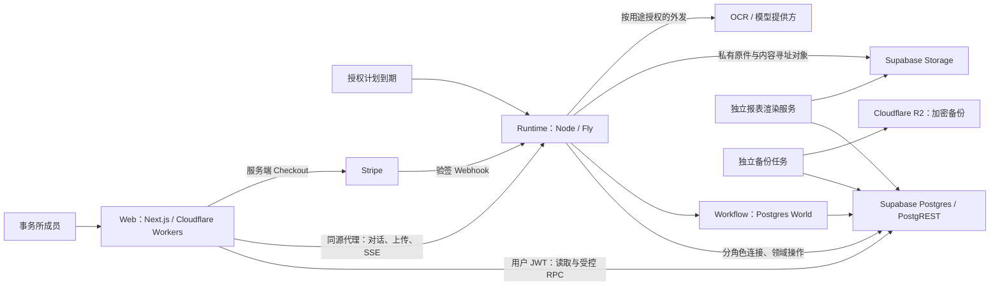

# Clara — 技术蓝图（Architecture）

> **维护约定（供未来的 wayfinder / to-spec session）**：本文件是技术蓝图，只在 wayfinder 或 to-spec 敲定新的技术决定后刷新；刷新时**覆盖旧内容而不是追加**，保持简洁。不记录 ticket 编号、"哪张票做了什么"或逐条测试证据——那些在 GitHub issue、代码、各模块 README 和 `docs/plan/` 的 runbook／report 里。已实现与已接受但未实现的目标要分开标记。每次刷新只回答：**技术栈及选择原因、系统边界、模块职责（含各模块 README 索引）、依赖关系、主要数据流、关键技术取舍**。

[PRD](PRD.md) 定义产品为何存在、服务谁、应如何工作；[CONTEXT](../CONTEXT.md) 统一领域用语；
本文只回答"技术上怎么成立"。精确 API、表结构与函数以源码为准（`codebase-memory-mcp` 帮助定位），
运行与部署操作以各模块 README 为准。标注 **[已实现]** 的部分可在仓库中逐条核对；
标注 **[目标]** 的部分是已接受的技术方向，尚未完整交付，集中列在 §7。

---

## 1. 技术栈及选择原因

| 层 | 当前选择 | 对 Clara 的作用与取舍 |
|---|---|---|
| Web | Next.js 16、React 19、TypeScript 5；OpenNext 部署 Cloudflare Workers（wrangler） | 统一路由、服务端会话与交互界面；边缘部署减少自维护面，代价是 OpenNext／Workers 的兼容边界要自己验证。[已实现] `apps/web/package.json` |
| UI | Tailwind 4、Base UI、shadcn、next-intl | 以可维护的组件源码与共享 tokens 构建密集会计界面；装上组件不等于完成业务状态、无障碍与恢复交互。[已实现] `apps/web/package.json` |
| 数据与身份 | Supabase Postgres + PostgREST + Auth + Storage（`@supabase/ssr`、`@supabase/supabase-js`） | 在一套数据库内完成事务、RLS 隔离、版本与审计；**受控函数承担业务边界**，因此 SQL、grants 与迁移是承重结构而非附属品。[已实现] |
| Agent | Vercel AI SDK 7（`ai`、`@ai-sdk/openai`）、zod 4 | 模型调用与业务领域分离：模型提出行动，受控工具执行，模型拿不到数据库任意写权限。[已实现] `packages/runtime/package.json` |
| 持久执行 | Workflow 4 + `@workflow/world-postgres` 4 | 把步骤、等待、重试与持久 stream 落在自管 Postgres 里；宿主、并发与恢复边界须自行验证，不是托管服务。[已实现] |
| Runtime 宿主 | Node 22、Nitro 3 构建、Express 5、Fly.io 常驻机器 | 承担长时执行、事件消费者、扫描与恢复；与 Web 独立发布，后台工作不绑定浏览器请求生命周期。[已实现] `packages/runtime/package.json`、`packages/runtime/fly.toml` |
| 报表 | 版本化计算定义 + 独立确定性渲染服务 | 从固定数据生成可复现的数字与文件；增加版本／制品管理，但避免模型重写正式金额。[服务已实现，覆盖面与首次部署见 §7] `packages/reporting-render/` |
| 备份 | 独立批处理任务，age 加密后上传 Cloudflare R2 | 异地副本与恢复清单独立于主运行路径。[代码已实现，部署与恢复证明见 §7] `packages/backup/README.md` |
| 工程 | pnpm 10 workspace、GitHub Actions 单一 `ci.yml`、renderer／backup 独立镜像 | 应用与数据接口一起验证，同时隔离渲染与备份的依赖生命周期。[已实现] `pnpm-workspace.yaml`、`.github/workflows/ci.yml` |

**版本钉在 manifest，不钉在本文。** 精确依赖由 `package.json`（根）、`apps/web/package.json`、
`packages/runtime/package.json` 与 `pnpm-lock.yaml` 固定；本文只解释选择理由。
Node 版本本身是承重约束，由根 `engines`（`>=22.11 <23`）与 `apps/web` 的 `devEngines.runtime`（22.23.2）共同限定。

`packages/backup` 与 `packages/reporting-render` 被 `pnpm-workspace.yaml` 以 `!` **刻意排除**在
workspace 之外：它们是各自独立成像、独立部署的批处理应用，依赖装在自己的 Docker 镜像里；
排除后 CI 首步的 `pnpm install --frozen-lockfile` 不会因为一个没有 lockfile 条目的 importer 而红。

---

## 2. 系统边界

**事实归属。** Postgres 保存账务、身份、权限、业务回执与持久运行记录；Storage 保存原始证据与生成文件。
浏览器、Clara 与报表读取同一套会计状态，不各自维护一本账。
Web 的请求生命周期与会计工作的生命周期分开——关闭页面不会终止后台执行。
尚未加入事务所的申请人处于独立准入域，不能假设其已具有 firm 身份。

<!-- #775 #776 -->
**准入域上的 operator 支持面（本地已验证，hosted evidence pending）。** operator 的三项受治理决定现在都留下审计行：
`clara.resolve_stripe_event_problem` 与 `clara.reject_firm_registration`、`clara.set_admission_capacity` 一样写入一条
`clara.audit_log`（operator 事务所、决定人、`{problem, event, resolution}`），且该写入位于操作回执之内，重放不会写第二行
（migration `0205_resolve_stripe_event_problem_audit.sql`；`packages/db/tests/operator-support.test.mjs` os.13）。
申请人的姓名由一扇专用的 operator-only 读门 `clara.resolve_operator_support_applicants(uuid[]) -> (applicant, display_name)`
解析（migration `0206_operator_support_applicant_name.sql`）：权限是 `clara.approve_firm_registration` 逐字节复制的
owner + operator-firm 判定，范围限定为支持案件的申请人（经 `firm_registration_requests.applicant` 与
`stripe_events.applicant`），因此它不是 `clara.users` 的存在性探针；解析不到的 id 不出现在结果里，界面继续显示截断的 uuid；
只返回 `display_name`，不返回邮箱（0137 的裁定不变），也不扩大 `clara.users_visible`。
<!-- #775 #776 END -->

**四个部署单元的形态。** 状态逐行标注，当前线上版本见 `docs/PROGRESS.md`：

| 单元 | 形态 | 关键约束 | 状态 |
|---|---|---|---|
| `clara-web` | Cloudflare Worker（`apps/web/wrangler.jsonc`） | 非机密配置在 `vars` 里提交（`CLARA_RUNTIME_URL`、`CLARA_PUBLIC_ORIGINS`、`CLARA_STRIPE_LIVEMODE`、`CLARA_TRUSTED_CLIENT_IP_HEADER` 共四项——最后一项是一堵墙的输入，只能取边缘自己写的头，绝不能取客户端可写的 `X-Forwarded-For`）；凭据是 Worker secret；当前未声明任何 KV／R2／D1／service binding | [已实现并部署] |
| `clara-runtime` | Fly app，`sin`，**单台常驻机器**（`min_machines_running = 1`、`auto_stop_machines = false`） | 挂载本地 spool 卷；`/ready`（依赖就绪）与 `/health`（存活）分离；secrets 由 `fly secrets set` 带入，不进文件 | [已实现并部署] |
| `clara-render` | Fly batch app，`sin`，无 HTTP 监听 | 由 runtime 的 `packages/runtime/lib/reconciler-render.mjs` 按需启动 | [配置已就位、镜像未部署，见 §7] |
| `clara-backup` | Fly batch app，`sin`，无 HTTP 服务 | 定时任务，以 dead-man switch 监控而非健康端点监控 | [配置已就位、镜像未部署，见 §7] |

**明确不是高可用。** 当前部署是一台持续运行的 Fly machine + 本地临时上传 spool；
`packages/runtime/fly.toml` 自己写明不得扩容或挂第二台机器。
数据库持久化能支持恢复，但本身不能证明多机分发、spool 转移与恢复流程已可用。[已实现的限制，见 §7]

---

## 3. 模块职责

| 模块 | 负责 | 不应承担 |
|---|---|---|
| `apps/web` | 会话与 scope、导航、业务读取、受控提交、实时消息与对象详情 | 在浏览器重建账务规则、预测已入账金额、持有后台服务密钥 |
| `packages/runtime` | 接收工作、构建上下文、模型／工具协调、Workflow 接入、外发、事件与恢复 | 通过 prompt 自创权限，或把一次模型回复当作会计提交记录 |
| `packages/db` | 会计状态、租户隔离、当前授权、事务、幂等、回执、事件与持久业务控制 | 持有 UI 临时布局状态，或把知识叙述当作可执行授权 |
| `packages/reporting-render` | 领取任务、读取封存数据、生成并保存制品、结算渲染状态 | 修改账本或自行推断正式报表数字 |
| `packages/backup` | 生成加密异地备份及恢复所需清单 | 用"备份成功"消息替代实际恢复证明 |

**`apps/web`** 是唯一的人机面。它以用户自身 JWT 直连 PostgREST 做读取与受控 RPC；
需要长时执行的能力（对话、上传、SSE）一律经同源代理 `apps/web/app/api/runtime/[...path]/route.ts`
转发到 runtime——这是一条请求期路由并显式 allowlist 转发头，不是构建期 rewrite，
因此 runtime 源在配置里可见可换，Web 也不必持有 runtime 的服务凭据。
生成式界面是"服务器注册的 typed part schema × Web reader"的协议；web 与 runtime 是两个独立发布单元，
因此字段与版本的兼容是一项发布义务而非同仓假设——当前 parity 校验主要比对 kind，完整协议兼容仍未实现（§7）。
README：`apps/web/README.md`。

**`packages/runtime`** 是长时执行的宿主：durable workflow、文件入库、agent 执行、HTTP/SSE。
它按用途分角色连接数据库（§4），驱动 Postgres World 引擎，写 Storage 的私有原件，
并在按用途授权下调用外部 OCR／模型提供方。单 leader 负责路由、drain 与 reconcile。
README：`packages/runtime/README.md`。

**`packages/db`** 是会计权威：迁移链、合成种子、DB 测试、备份／恢复工具。
表默认 FORCE RLS，应用角色不能直接触达；一切写入经固定 `search_path`、按角色授权的
SECURITY DEFINER 领域函数。迁移是**追加式**的：文件名为 `NNNN_name.sql`，已应用字节不可变，
当前 frontier 只能从 `clara.schema_migrations` 账本读出——绿色 exit 或 `OK` notice 都不等于已落地。
README：`packages/db/README.md`。

**`packages/reporting-render`** 是独立成像的批处理 worker，读封存数据生成确定性 PDF；
它直接读 DB 与 Storage，不经 runtime 的请求路径，也从不安装进 `@clara/runtime`。
README：`packages/reporting-render/README.md`。

**`packages/backup`** 是独立成像的定时任务：从 DB 取转储、以 age 加密、上传 R2，并留下恢复所需清单。
**文件对象镜像**是增量的（additive），快照过期由 R2 生命周期规则处理而不是由它删除，
默认滚动 DR 窗口 30 天。它不建立法定保存期，也不证明一份备份可被恢复。
README：`packages/backup/README.md`。

**目标领域模型 [目标]。** 蓝图区分以下记录；现有 task／chat／interruption 表是迁移基础，
尚不等同于完整 Work 模型：Accounting Work（客户归属、业务意图、发起人与授权依据、来源、依赖、问题、结果与回执）、
Conversation（对话及上下文边界，多段对话可讨论同一 Work）、Workflow run（某执行版本的一次运行）、
Question／answer（需要的事实或决定、问题与依据版本、被接受的回答与回答者）、
Accounting operation／receipt（一次逻辑业务行动及其已提交的完整影响）、
JE 与领域对象（JE 保存总账金额，open items／allocations／assets／plans／periods 保存额外业务关系）、
Knowledge 与 source（可追溯的事实、身份、偏好、政策、经验及来源版本）。
Firm workspace 可查询获准客户并组织批量工作，但**每一笔会计执行仍绑定一个明确客户**；
portfolio 不是合并账本，未能确定客户的输入可先持久接收为待归属请求，不能猜造 client ID。

### README 索引

| 路径 | 负责说明 |
|---|---|
| `apps/web/README.md` | Web 应用的安装、本地运行与 Cloudflare 部署；应用地图与关账／银行操作顺序 |
| `apps/web/e2e/live-stack/README.md` | 以真实一次性 Postgres／PostgREST／runtime 栈跑生产 web bundle 的两个 runner；对非一次性目标有拒绝闸门 |
| `packages/runtime/README.md` | 结构、本地命令、连接与服务配置、健康与 TLS、恢复清单、启动普查、部署与回退、评测 |
| `packages/db/README.md` | 迁移与部署行为、连接与破坏性操作、`interactive_client` wake kind、Storage grant/policy battery、operation-contract census、备份与恢复 |
| `packages/db/tests/README.md` | DB 测试套件：迁移链、租户隔离、审计写入者、会计约束、文件处理、准入、关账／报表、运维工具 |
| `packages/db/storage-battery/README.md` | 针对 `deploy/storage-provision.sql` 的允许／拒绝电池，跑在真实 Supabase Storage 上 |
| `packages/reporting-render/README.md` | 独立 Fly batch worker：确定性封存报表 PDF；排除在 pnpm workspace 之外 |
| `packages/backup/README.md` | 独立 Fly batch app：加密异地 DR 副本；排除在 pnpm workspace 之外 |

---

## 4. 依赖关系

**调用方向。** [已实现]

- `apps/web` → `packages/db`：用户 JWT 经 PostgREST 做读取与受控 RPC。Web 不向 runtime 要业务数据。
- `apps/web` → `packages/runtime`：只经同源代理（对话、上传、SSE）。
- `packages/runtime` → `packages/db`：按用途分角色的登录连接，执行领域操作。
- `packages/runtime` → Workflow／Postgres World 引擎；引擎自身也写同一个数据库。
- `packages/runtime` → Supabase Storage（私有原件与内容寻址对象）、→ 外部 OCR／模型提供方（按用途授权）。
- `packages/reporting-render` → `packages/db` + Storage，**不经** runtime。
- `packages/backup` → `packages/db`（读）+ Cloudflare R2（写）。
- `apps/web` → Stripe（服务端 Checkout）；Stripe → `packages/runtime`（验签 webhook）。

**连接按职责分权，不共用一个应用角色。** `packages/db/deploy/roles-bootstrap.sql`（DR 角色重建仪式，
其头部登记了对应的迁移来源）给出当前角色册：11 个 NOLOGIN 组角色
（`clara_fn_owner`、`clara_authenticated`、`clara_agent_ro`、`clara_wake_interactive`、`clara_wake_proactive`、
`clara_runtime`、`clara_freeform_ro`、`clara_wake_bank`、`clara_wake_filing`、`clara_stripe_webhook`、`clara_auth_wall`），
7 个登录壳（`clara_runtime_login`、`clara_agent_read_login`、`clara_wake_write_login`、`clara_freeform_login`、
`clara_wake_bank_login`、`clara_stripe_webhook_login`、`clara_auth_wall_login`；在仓库与 DR 仪式里是 NOLOGIN，
只在实际集群上带外翻成 LOGIN），外加一个只做存储的凭据 `clara_storage_docs`
（NOINHERIT，只授予 `authenticator` 供 Storage 自己 `SET ROLE`，对 `storage.objects` 只有 select+insert，
范围由 `packages/db/deploy/storage-provision.sql` 的 RLS 策略限定，UPDATE／DELETE 从未授予）。
人工与 agent 的会计写入只经被授予的领域函数；definer 函数的 owner、`search_path`、grants
与参数校验共同组成这道边界。

**跨表写入的全局取锁顺序**是 **accounting_plans → accounting_work → agent_tasks → agent_interruptions**，
任何新门都必须按这个方向取锁——方向相反的两扇门会把一次任务级取消与一次 Work 级取消撞成实测可达的死锁。
`40P01`／`40001` 到达 web 时是类型化的 transient 409，不是裸 500。[已实现]

**版本钉子。** 运行侧的"这镜像能跑什么"由 `packages/runtime/workflows/registry.ts` 单一来源决定：
`workflowBodies`（本镜像能运行的全部 body 标识符，当前 51 个）与 `workflowPins`（class → body）
都是冻结的字符串字面量，不是函数引用；当前 pin 为 `chatTurn → chatTurn_v19`、`claraWork → claraWork_v3`。
同一份名册被三个面读取且不得互相矛盾：world 启动的 provenance 日志、`/api/build-info`、
以及回退预检 `packages/runtime/lib/rollback-preflight.mjs`。

---

## 5. 主要数据流

### A. 文件入库 → 类型化事实 → 会计工作 → 过账 → 关账 → 报表

上传先落 runtime 本地 spool，检查媒体类型与恶意软件，再写成不可变私有对象并按内容 hash 建立保管。
保管提交前的任何失败（含 Storage 瞬时故障）不留 `clara.documents` 行、把 intake 终态化为失败、
删除已 spool 的字节——重新上传是唯一恢复路径，没有半成品。[已实现]

OCR／结构化抽取对发票、月结单、工资汇总表与协议合同走文本 + 图像双 witness，保留来源 hash、模型版本与一致性／算术校验；
不同格式的覆盖程度不同，由数据库里的能力目录 `clara.document_capabilities` 如实声明
（custody / byte_extraction / typed_facts / business_operation 四个正交轴，全局而非按租户，
未知方向取诚实默认而不是乐观默认）。[已实现，覆盖面见 §7]

<!-- #778 -->
同一次抽取内一个 `field_path` 只允许一条 region：`clara.document_regions` 在 `(extraction_id, field_path)` 上唯一，
第二次写入被吸收（`on conflict … do nothing`，保留第一条证据——该表只追加，UPDATE 会被 append-only belt 拒绝），
而不是静默留下两行争同一个字段。该键是**部分唯一索引**：`field_path` 为空的 region 不受约束，另有两个按字面排除的路径。
`opening_tb.line`——0017 的 `ck_document_regions_opening_fact_0017` 把每一条期初余额事实都钉在这一个字面量上，
而真实 producer（`opening-tb-cells.mjs`）对试算表的**每一行**各产出一条该路径的 region；
`prior_gl.line`——目前尚无 producer，但已上线的 reader（`seeding-parse.mjs` 的 `SELECT_PRIOR_GL_REGIONS_SQL`
与 `regionsToEntries`）会读取同一次抽取下的**全部**该路径 region，每条各生成一条 GL 分录。
所以一张四十行的试算表、一本多行的前期总账，本就是同一个键上的多条合法记录；若用全表唯一键则会静默吞掉其余各行。
[已实现，hosted evidence pending]
<!-- /#778 -->

<!-- #779 -->
能力目录的 `registry_version` 单调性由数据库强制，不再只是约定：0207 的 BEFORE UPDATE 触发器
`clara._tf_document_capabilities_version_monotone` 拒绝任何把同一 (format, document_kind) 行版本号
调低的更新（CLR08，`detail.reason = registry_version_monotone`），调高或保持不变仍照常通过；
先删后插到更低版本、以及"整批同号发布"的跨行一致性仍是约定（#779 明确不在范围内）。[已实现，本地验证]
<!-- /#779 -->

<!-- #780 -->
`clara.document_fact_validations` 的 firm 边界由 0208 的 migration tail 直接**读行**证明，而不再只靠
0191 的"策略条数为三"：tail 用 0191 自己的 deferred recorder 写出 firm A 的一行校验记录，先做正向对照
（firm A 的 human 与 agent 会话各读到该行），再断言 firm B 的 human 与 agent 各读到零、且把 firm A 的
wake secret 放进 firm B 的 human 会话仍读到零（两条 lane 不会退回彼此的 accessor）；探针无法运行时报
CLR10 中止而不是静默跳过，所有 fixture 通过 sentinel 回滚。[已实现，本地验证]
<!-- /#780 -->

金额一律是**整数最小货币单位**（DB 侧 bigint `*_cents`），余额、舍入、期间与关联对象检查都在这个单位上执行；
大整数穿过 JSON 与前端时必须保留精度——freeform 读路径已知的精度缺口仍未修（§7）。[已实现]

类型化事实进入 Accounting Work：准入分配稳定的逻辑操作身份（绑定 firm／client／Work／intent），
run 在冻结 bundle 下执行，调用受控领域 operation，**在同一事务内**提交完整会计影响 +
`clara.operation_receipts` + outbox。"完整影响是事务边界"是核心约束：确认一张发票需要相应总账与 open item，
收款分配必须维护余额，购置资产要同时保留资产记录。已入账历史不可原地改写——更正是有来源关联的
冲销／替代操作。同 key 同 payload 重放取回原回执，同 key 不同 payload 是类型化 conflict。[已实现]

<!-- #750 / #721 -->
Work 的**取消**与**改述**：`clara.cancel_accounting_work` 取消尚未过账的 Work（已持有 committed
回执的 Work 永远答 `already_completed`，不冲销已入账结果），并在真正取消的两条分支上追加**恰好一条**
`work.cancelled` 领域事件（payload `{work, from_status, author, outcome, superseded_by}`），
Activity feed 的 `work.%` 分支因此有了第二个生产者；B3 的 Cancelled 横幅从 run 行的
`cancelled_by`／`cancelled_at` 读出"由谁、何时"。Work 问答的回答**只补齐被问到的事**：
`clara.answer_work_question` 对声称改动已准入 basis 要素的回答答 `basis_change_not_allowed`
（detail 指名要素）；真正要改指令的回复走新门 `clara.restate_accounting_work`——在同一事务里
以同一扇准入门 `clara.admit_journal_work` 准入带 `supersedes` 的新 Work，并以
`superseded_by` 取消旧 Work，两列都是**一次性写入**（`t_accounting_work_immutable` 只允许
null→值一次，且只落在仍可取消或已取消的 Work 上）。没有 `work.superseded` 兄弟事件类型：
一个生产者，一个类型。[已实现，本地验证；hosted evidence pending]
<!-- #750 / #721 -->

<!-- #784 -->
**遗留 Client Knowledge 事实：一个表达式，一个答案。** 五个 legacy carried key
（`entity_type`、`msic`、`trade_nature`、`banking_arrangement`、`customer_identity_policy`）仍然存放在
`clara.client_facts`，写入的唯一门仍是 `clara.record_client_fact`（0055 签名不变）；0192 在它旁边建立了
知识登记簿，但不双写，所以对这五个 key，**整个系统实际据以行动的值仍是遗留行**。读取侧现在只有一个表达式：
`clara._knowledge_legacy_rows(firm, client)`——人读登记簿 `clara.list_client_knowledge`、runtime 知识包
`clara.get_knowledge_pack`（两者把每条遗留行标记为 `authoritative: true`），以及 0209 重接的三个消费点
`clara.get_context_pack`、`clara._close_gate_closing_stock`、`clara._bank_registry_ledger_state`，全部经由它。
三个重接点传入的是**客户自己的 firm**（从 `clara.clients` 查得，绝不是会话 firm）；因为
`clara.client_facts` 带有 `(client_id, firm_id) → clara.clients(id, firm_id)` 的外键，加上 firm 过滤不会
少读任何一行。该表达式从不查询 `clara.knowledge_records`，因此"知识记录不遮蔽遗留事实"是结构性的，而不是靠自觉。
[已实现，0209_knowledge_legacy_readers_converge.sql；本地证据 `packages/db/tests/knowledge-legacy-readers-converge.test.mjs` 8/8 通过；hosted evidence pending]

**唯一刻意保留直读的站点，及其理由。** `clara._tf_counterparty_name_only_guard()`（0062）是 counterparty
写路径上的**逐行触发器**，它读 `customer_identity_policy` 用的是 `uq_client_fact_live`
`(client_id, fact_key) WHERE superseded_at is null` 上的一次 `exists` 索引探测。实测（EXPLAIN ANALYZE，
PostgreSQL 17.6，2026-09-15，客户仅有五条 live 事实）：直读 0.011 ms；改走共享表达式则是对
per-client jsonb 聚合（每条事实还各带一次 `clara.users` 与 `clara.knowledge_keys` join）的 Function Scan，
2.027 ms——相差约 180 倍，且这已是可能最小的客户。为一次写路径探测支付整客户聚合的代价不划算，故该站点
**刻意保留直读**；0209 的 prestate 用 `sha256(prosrc)` 钉住了它的函数体，tail 也断言它仍然读
`clara.client_facts` 与 `uq_client_fact_live`，使"刻意未改"可审计、且这段理由不会比它所描述的代码活得更久。
它读的行与共享表达式读的行完全相同（同表、同 live 谓词），convergence 电池对这个 key 同样做了断言。
<!-- #784 -->

<!-- #821 -->
**一份凭证只背书一笔在账分录**，且三条通道互相看得见：工作／证据通道（`clara.entry_evidence_links`）
与文件编码通道（`clara.journal_entries.document_id` 上的审核过账）彼此互看；开账通道按设计允许
"一份 tie 凭证、多条开账明细"，因此兄弟开账明细不构成冲突，只有该凭证上已有**活的**证据链接
（`released_at is null`）时开账审核才被拒。三道墙的拒绝口径完全一致：`CLR13` +
`source_already_posted`，并指名冲突分录与凭证，不新增错误码或线上词汇；提问之前先锁 `clara.documents`
的同一行，读-改-写竞争因此串行化。[已实现，本地验证；hosted evidence pending]
<!-- #821 -->

关账按年度顺序串行，carry-forward 幂等，beginning-close 冻结期间内银行结算须先完成。
报表走 open → evaluate → seal → render：确定性计算、封存快照、独立渲染服务出文件，模型不重打金额。
指标携带 unit／currency、period／as-of、computed-at、定义版本、source watermark 与 coverage；
**无权限、缺覆盖、读取失败都必须如实表达，不能读成零**。探索性分析可以使用模型，
但必须与正式制品区分开，不得越过 seal 链。[部分已实现，见 §7]

### B. Chat turn（含澄清与知识捕获）

`chatTurn` class 在 registry 里始终指向最新 body（当前 `chatTurn_v19`），每次演进以新 `_vN` 交付
（v19 相对 v18 加了两个工具、一个 wire kind 与一个**并列的**新 step，而不是加宽一个已部署的旧 step），
旧版本保留导出供在途 run。对话可以发起会计 Work（与直接表单走同一扇准入门，不是第二套会计引擎），
也可以捕获客户知识——知识以服务器登记的 key 写入，trust 由来源种类派生，
对话车道只开放"用户陈述"与"模型推断"两档，读不到知识与没有知识必须被区分开。知识包 `clara.get_knowledge_pack`
只对 runtime 开门，人读原始登记簿（`list_client_knowledge`）；撤回知识是人类专属动作，runtime 没有撤回门——
两条均为 owner 2026-09-15 裁定（#783、#785）。[已实现]

共享问题有稳定身份与问题／依据版本：一个 Work 同时至多一个待答问题，数据库只接受当前获准的第一份答案，
重复提交回放同一结果；期限到期后问题失效而不是 Work 静默完成。
Work 详情、Needs you 与 chat rail 展示并回答**同一个**问题记录。[已实现]

<!-- #764 -->
**澄清送达在两条车道上语义一致**：控制监听器遇到 `HookNotFound` 时不再按车道分叉——它先向引擎求证
（run 已终态／已被遗忘，或 task 已离开 `awaiting_input`，都证明这次 resume 其实已经落地），
无法求证的行**停在** `delivery_state='hook_missing'` 并带上时刻，绝不被盖成 `delivered`。
chat 车道随之有了自己的 reconciler（`packages/runtime/lib/reconciler-chat-clarify.mjs`）：过了宽限期后
**以一次 resume 重新探测**——钩子重新可达就让该轮继续；钩子确认消失则把该 chat turn 结算为 `expired`，
写入 `clarify_closed` part，并释放会话唯一的 live-turn 槽位（`uq_agent_task_one_live_turn`）。
结算是**先看回执**的：turn 已经 checkpoint 的 parts 会被带进 assistant message，而不是被一条收尾 part 覆盖。
该 belt 同时覆盖 0198 §R 记下的历史状态（`status='expired'` + `delivery_state='delivered'` 而 task 仍 `awaiting_input`；
发布会话计数为 0，因为当时 chat 积压为 0，而非因为该缺口被验证过）。它在 leader 循环里**先于**
`runReconcilerSweep` 运行，因为 `reconcileTasks` 的通用引擎镜像会把同一行结算成 `cancelled/engine_lost`，
那不是这条 turn 应得的终态。[已实现，hosted evidence pending]
<!-- /#764 -->

**模型侧的修复与预算合同**由每个 successor 重新实现，不随冻结正文自动继承：错误按 (errcode, reason)
名册分为 invalid_input／state_changed／conflict／transient／refusal／cancelled／invariant 七档；
**refusal 与 conflict 对模型是终态，不得改参重试**；可安全重算的状态冲突重读，基础设施失败有限退避，
缺事实或决定才提问；每段模型／工具／重算／重试预算有限且被记录，耗尽结算为可恢复的 `failed/limit`。
具体名册以 `packages/runtime/workflows/claraWork.v*.errors.ts` 为准。[已实现]

### C. Wake／控制循环与心跳

控制监听器以 `LISTEN clara_runtime_ctl` + 轮询双保险，租约式投递澄清（exactly-once-or-provably-delivered），
取消走 abort-then-settle（取锁顺序见 §4），崩溃由 reconciler 修复
（`packages/runtime/lib/control.mjs`、`lib/reconciler*.mjs`）。
单一 leader 负责路由／drain／reconcile；`world` 心跳由**独立计时器**写入、从不由 leader 写，
因此 leader 状态不闸 `/ready`（`packages/runtime/plugins/startWorld.ts`）。
wake 任务的 workflow class 由数据库逐行决定而非静态硬编码，因此启停某条心跳是数据决定而非发版决定。
`/health`（存活）与 `/ready`（依赖与配置就绪）分离，且就绪读数是三态加"未配置"第四态——
"没测过"不得被读成"健康"。[已实现]

### D. 授权计划到期 → Work

计划授权是**库内可解析的显式指令**：计划行指向本库中一条 Work 或任务作为授权依据，开门时必须真的解析到——
Knowledge 偏好、计算政策与"观察到的重复扣款"都解析不到，按名拒绝。计划的三张关系不授予任何应用角色权限，
人类门（建立／修订／暂停／恢复／结束／补提／读取）与**唯一**的 runtime 扫描门分开授予；
术语见 [CONTEXT](../CONTEXT.md)。[已实现]

到期扫描**每个 leader cycle 跑一次**，每个计划每次只取一个到期事件；"计划 + 到期日"与
"计划 + leg + 会计期间"两条唯一键共同收敛重复扫描与改期修订，转回必须等本期计提**已入账**且该分录仍在世。
暂停只阻止未来接收，从不取消已接收的 Work；错过的期间一律走显式补提，扫描从不回填。
runtime 皮带不自行推导任何日期，也不读任何 operator 开关——**不存在"全局开启自动执行"开关**，
迁移尾部的普查对在世函数体断言了这一点。[已实现]

<!-- #787 -->
转回的"该分录仍在世"在**入账时再查一次**（不只在接收时）：由计划 reversal leg 发起的 Work 到达
`clara._record_journal_entry_core` 时，核心重新调用接收侧同一个在世判定（`clara._plan_primary_entry`：
已批准且自身未被冲销）；该分录已不在世（例如人类在接收与入账之间调用 `clara.reverse_entry` 冲销了计提）
即按 CLR10 `reversal_before_primary`（`primary_state = entry_not_live`）拒绝入账，账上只留人类那一笔冲销。
该臂与本函数体其余拒绝臂一样，只在该 Work **尚无已提交 operation receipt** 时生效，重放仍返回原结果。
[已实现（本地验证：migration 0204 + `p640.occ.reversal_post_liveness`）；hosted evidence pending]
<!-- #787 -->

### E. 模型外发（按用途授权 + 执行轨迹）

外发是类型化的 client 用途家族：prepare／consume 两阶段、单次使用、短 TTL、多项重绑定检查。
**Work 车道**的授权不是一个 per-client 开关，而是**推导**出来的：事务所当前接受的 Terms + DPA
且该 client 在世活跃；撤销可逆，且对已消耗的 dispatch 是追溯的——账务核心在提交时会再读一次授权是否仍在世。
其余五个 typed purpose 仍走人工 grant + activation（`clara.grant_client_egress_purpose`／
`activate_client_egress_purpose`），两套并存尚未统一。[已实现；激活基础由 owner 于 2026-09-15 确认（#825）]

执行轨迹表没有 payload 列、每列有文法校验、写入方做脱敏，且任何应用角色对它连 SELECT 都没有
（FORCE RLS + 无 policy）。承担轨迹与能力目录这两件事的模块随冻结版本一起锁定：
`packages/runtime/lib/work-trace.mjs` 是冻结正文的动态 import 入口，
`lib/capability-registry.mjs` 由它静态 import 带入闭包，两者都在闭包哈希内。
（`lib/egress.mjs` **不**在冻结闭包里：它是 OCR 提供方的适配器，兼一张 purpose 查表——
按它自己的注释是文档与查表、从不是授权；授权只由数据库动词判定。）
轨迹**没有导出路由**（by absence）：view-only，保留期由 prune lane 决定（owner 2026-09-15 确认，#802）；
对 `work-trace.mjs` 脱敏逻辑的任何加固只能随下一个冻结版本（`claraWork_v4`）交付，不做原地修改
（owner 2026-09-15 裁定，#815）。[已实现]

<!-- #811 #812 -->
**文法校验的边界，说准确（#811）。** 上一段"每列有文法校验"这句，在 0195 之后对两个字段只在**长度**上
成立、在**形状**上不成立：`observed_revisions` 的 number 值没有任何位数或量级测试，`run` 文法也没有
`id`／`model`／`token`／`rev` 都带的长数字排除。迁移 `0210_work_trace_shape_bounds.sql` 在**门（door）**
这一侧补齐：number 值受 `abs < 1e12` 且 `scale <= 6` 约束（指数写法 `1e30` 与 `1.5e-20` 同样被拒），
`run` 文法拒绝 13 位以上连续数字——除非该 id 正是 WDK 铸造的形状（`wrun_` + 26 位 Crockford base32
ULID，`@workflow/core` 4.8.4 `dist/runtime/start.js:121`），该豁免使这条子句**可证明**不会误伤真实
run id。两个谓词同时被关系的 CHECK 与写入动词调用，因此墙与诊断（CLR10 `invalid_trace`，点名
`p_observed_revisions`／`p_run`）一起收紧。**写入方仍未收紧**：`work-trace.mjs` 的 `traceRevisionOf`
仍接受任意有限数，`traceRunOf` 根本没有作用在 `recordTrace` 发送的值上；该模块在冻结闭包内，按 #815
的裁定只能随 `claraWork_v4` 交付，相应要求记在 `packages/runtime/README.md`。因此准确的说法是：
**门对这两个字段做形状约束，写入方没有，门就是那道墙**；已存储的行不回溯校验、不重写。
[已实现，本地已验证；hosted evidence pending]（artifacts：迁移 `packages/db/migrations/0210_work_trace_shape_bounds.sql`；cells `w811.trace.revision_bounds`／`w811.trace.run_grammar`，见 `packages/db/tests/work-egress-authority.test.mjs:800,839`）

**"撤销可逆"说准确：哪一种撤回，由哪一道门回来（#812）。** 上面"撤销可逆，且对已消耗的 dispatch
是追溯的"这句，现在按撤回的种类展开：

- `revoke_client_egress_purpose` 撤的是 **consent** → 由 `restore_client_egress_purpose` 回来
  （重新推导基础，铸一对**全新**的 consent+activation，被撤的那行留作历史）；
- `deactivate_client_egress_purpose` 撤的是 **activation**，consent 仍在世 → 由 #812 的
  `reactivate_client_egress_purpose` 回来（迁移 `0211_accounting_work_egress_recovery.sql`；
  owner floor，仅 `accounting_work`，仅 `clara_authenticated`）。它在库内解析**幸存的** consent
  再委托给 0195 的 `activate_client_egress_purpose`，因为 `client_egress_purpose_consents`
  是 FORCE RLS、对任何应用角色都没有表权限（0020），consent id 根本到不了浏览器。已测得该往返成立：
  deactivate → prepare 得 `unknown` → 用幸存 consent 激活 → prepare 重新 `granted`，consent 计数
  始终为 1（`w812.reactivate.round_trip`）；
- 法条发布了新版本而事务所尚未接受、或 client 不在世 → 只能去接受新版本／恢复 client，没有任何
  egress 门能恢复事务所当下并不持有的授权。

三种恢复都**只恢复未来的 dispatch**：在撤回之前就已消耗的授权，之后仍被账务核心拒绝
（`w631.write.withdrawn_after_consume`、`w812.reactivate.retroactive`）。

**live-at-write 由重算后的账务核心里的两个 join 实现**——在该 run 已消耗的 dispatch authorization
背后，再读一次 consent 的 `revoked_at is null` 与 activation 的 `deactivated_at is null`——而**不是**
把已消耗的那行作废：0020 的 `ck_egress_dispatch_authorizations_one_terminal`
（`consumed_at is null or invalidated_at is null`）使"已消耗又被作废"根本无法表示。这是**已接受的
做法**，0020 那条 CHECK **有意保持原样、不重切**（#812 裁定；0211 的 §0／§T 各测量它一次，所以
"有意保持"是可核查的说法而不是假设）。控制台侧：Work 详情的 `egress_not_authorized` 面孔对
**owner** 多出一个动作"Re-activate AI processing for this client"，文案同时说明它恢复的是新工作、
当前这条记录仍为 refused。
[已实现，本地已验证；hosted evidence pending]（artifacts：迁移 `packages/db/migrations/0211_accounting_work_egress_recovery.sql`；cells `w812.reactivate.round_trip`／`w812.reactivate.retroactive`／`w812.reactivate.door`，见 `packages/db/tests/work-egress-authority.test.mjs`）
<!-- #811 #812 -->

### F. 发布与回退

迁移运行器用会话连接 + 会话级 advisory lock + 每迁移一事务；已应用字节不可变，只能追加后继迁移；
部分迁移会**倒转**默认顺序（先部署 consumer 再迁移），该义务写在迁移文件头部。
唯一权威是 `clara.schema_migrations` 账本。[已实现，`packages/db/README.md`]

**版本、冻结与回退。** `scripts/check-frozen-workflows.mjs` 对冻结正文及其相对 import 闭包做 append-only
哈希校验；deploy-lock 是发布之后单独的一次仪式，与代码合并分开。法条三句：
**(a)** 已部署的 body 不可变，行为变更以新的 `_vN` 导出发布；**(b)** 入队站点经 registry 解析，
因此永远指向当前 pin；**(c)** 带在途 run 的导出不可改名或删除。
历史上冻结的 body 在自己的文件头引用"ARCHITECTURE Appendix A"；本仓库没有、也不会有 Appendix A——
那些文件是冻结的，**其引用永远不能被修改**，所以取代它的不是一次改名，而是本小节这个锚点
`#workflow-versioning-and-rollback`：任何读到该引用的人应当读这里（freeze-lint 失败时打印给人看的也是这一行）。[已实现]

<!-- #791 -->
**下一个冻结版本的清单摘要覆盖面（binding on `claraWork_v4`）。** `claraWork.v2.bundle.ts` 与
`claraWork.v3.bundle.ts` 的清单摘要哈希的形状是 `{id, instructions, skills, tools{id,names}, budgets}`——
`tools` 成员只带一个版本 id 与三个工具名的裸名单，从不带每个工具自己的 JSON schema，也不带它声明的
依赖。`ask_question` 的 schema 在 v1→v2 之间改过，靠的只是手工把 `tools.id` 递增来标记，摘要本身
测不出这个变化（#791）。这条口子无法对 v2 或 v3 收口：两者都是 `@frozen` 且在冻结清单中标记
`deployed: true`，本小节上面的法条 (a) 已经说得很清楚——已部署的 body 不可变，行为变更只能以新的
`_vN` 导出发布，从不原地编辑；freeze-lint 对任何一次改动都会拒绝（`BODY CHANGED` 或
`REHASHED-VS-BASE`），哪怕只是给 body 加一行注释。因此这条要求记在这里，binding 在下一个被铸造的
`claraWork_v4` 上：**`claraWork_v4` 的清单摘要必须同时覆盖每个工具的 JSON schema 与其声明的依赖，
不能只是工具集 id 加名单**——一次只改 schema、不改名单的工具变更必须被摘要测出来，而不是像
`ask_question` 那次一样只能靠人工递增 id 才留下痕迹。[已记录，未实现——铸造 `claraWork_v4` 时执行]

回退预检 `packages/runtime/lib/rollback-preflight.mjs` 回答三问：(1) 非终态 run 的 body 普查；
(2) 绑不到 run 的在世任务普查（未知 kind fail-closed）；(3) 数据库自身对目标镜像的 body 要求
（某些迁移之后，目标镜像必须携带指定 body，且这一条不能靠 drain 清除）。该 frontier 规则与 0195 的
pre-v3 grandfather arm 已实现并上线；owner 于 2026-09-15 裁定（#826）：beta 期间托管用户与数据均为测试数据，
停泊在 pre-v3 body 上的 Work 无需保全、经 Work 取消门清理即可（#820），两条规则保持已上线形状不动，
下一次 wall-raising 迁移采用 grandfather 还是 drain 届时再裁。同一天的第二条裁定（#810）：beta 期间被取代的
body 可以从代码树退役而**不要求 drain 证明**——停在其上的 run 先在托管清理（#820）中取消，否则下面的
stranded-body 闸门会拒绝启动；冻结清单为此保留一条 retired 记录而不是删除条目，法条 (c) 不变。
工具里这条记录就是 `frozen-workflows.json` 顶层的 `retired`（路径 → 该条目最后一次冻结的 `sha256` + 裁定出处），是 `MISSING`／`REMOVED-VS-BASE` 唯一接受的缺席；其余条目的 deploy-lock 语义不变，反向的 `RETIRED-PRESENT`（已退役却仍在树里）同样是 finding。[已实现，`scripts/check-frozen-workflows.mjs`；首批退役 `chatTurn_v1` 闭包三文件]
World 启动前另有一道 stranded-body 普查闸门：
发现缺口即拒绝启动 durable world（HTTP 仍服务，`/ready` 503），只能由显式操作者覆盖。该拒绝是
**database-wide** 的——同一个库上任何 lane 停泊的未导出 body 都会拒绝之后每一个 runtime 进程——owner 于
2026-09-15 确认为既定取舍（#793）；CI 因此给不能容忍他人停泊 run 的 leg 各自一份模板复制库，
按 lane 收窄留待 #792 的 park-and-warn。[已实现]

发布仪式的实际形状（写前备份 → probe 机器只读预检 → 按 digest 发布 runtime → 发布 web → 静默窗口内迁移 →
校验启动日志顺序 → smoke → 只读演示回退预检 → 事后单独锁定冻结清单）记在
`docs/plan/active/refresh-wave-2026-09-14/RELEASE-RUNBOOK.md`，不在本文。

---

## 6. 关键技术取舍

- **追加式迁移 + prestate 钉子 + tail 普查。** 已应用文件字节不可变，行为变化只加新迁移；
  被**重切**的受控函数须在同一迁移的 prestate 里以 **pre-image sha256** 钉住其在世函数体（漂移即拒绝应用），
  tail 再重读 owner／SECURITY DEFINER／固定 `search_path`／逐字 ACL 证明"没动别的"。
  取舍：牺牲编辑便利换可审计与可回退，代价是必须守 writer-quiescence 窗口纪律。
- **FORCE RLS + 受治理的 SECURITY DEFINER 门。** 应用角色不能直连表，一切经固定 `search_path`、
  按角色授权的门；`packages/db/scripts/operation-census.mjs` 对整个 `clara` schema 的 owner／definer／ACL／
  错误码／调用点做交叉校验。取舍：新增能力必须走门，开发成本更高，换来**"应用角色不能直连 clara 表"
  这一条**能被机器证明——可被证明的也只是这一条：托管 Supabase 的 provider-owned `pg_catalog` ACL
  不完全由项目控制，notification／advisory lock／sleep／XML helper 等残余能力经 PUBLIC grant 到达，
  逐角色 `REVOKE EXECUTE` 实测无效（唯一有效的关法需要 pg_catalog 所有权，属 owner 仪式而非迁移），
  因此不能仅凭 public schema grants 宣称全部封闭。受限 freeform 读是单独授权的**只读**能力，
  不能通过 `SELECT` 包装写函数取得写权限。
- **冻结不可变 workflow body + 钉住的 registry。** 入队点只解析 registry；行为变化发新 `_vN`。
  取舍：body 数量单调增长（当前 51 个），换来 replay 安全与可控回退。
- **单台 Fly machine + 常驻 Postgres World + 单 leader。** leader 崩溃即整进程退出由 Fly 重启（crash-only）。
  取舍：简单与成本优先，代价是没有多机分发与 spool 转移的证明。
  连接故障的现行契约（as built，裁-149；`l9-pool-contract-lane-probe.test.mjs` 钉住下面的措辞）：
  Idle pool errors log/recycle connections; relay-pool counters surface warnings（每条专用 login lane 的
  后台连接错误按 lane 计入 `checks.pool_errors`，未构造的 lazy pool 表示为缺席而不是零）。
  The leader's dedicated session detects failure, releases its advisory lock and reconnects——不是 crash-loud；
  其 acquire／lost／re-acquire 与 halt 记录在 `checks.leader`，held:false 是告警，halt 使该项 `ok:false`，
  但都不改变 `/ready` 的硬失败集合。Lane probes are asynchronous: `pending` 表示尚未测量，`stalled` 是警告，
  不可把尚未完成的探测当成健康证明。[已实现]
- **Web 经 OpenNext 部署 Cloudflare Workers，且从不持有 runtime 服务凭据。** 读走用户自己的 JWT，
  长时能力走同源 allowlisted-header 代理。取舍：边缘部署减小自维护面，但 OpenNext／Workers 的兼容边界仍需自验。
- **文件字节读取只用代理，不用签名 URL。** 代价是每次请求重读在世 membership，换来即时可撤销性。
- **刻意不做的事：**
  - 没有 per-client 的 AI 开关（Work 车道的外发授权由事务所级 Terms／DPA 接受与 client 活跃状态推导），
    也没有按操作粒度的外发 token 或配额：事务所注册时一次接受 Terms／DPA 即为全部授权，UX 保持最简
    （owner 2026-09-15，#800，见 `.out-of-scope/per-operation-egress-tokens.md`）；firm-narrow 外发家族保持只发不用；
  - 会计计划的建立／修订／补提以 bookkeeper 为下限，不复制 0045 调整模板的两签仪式——两条 lane 是不同产品
    （owner 2026-09-15 确认，#790）；
  - 没有"全局开启自动执行"开关；观察到重复扣款不自动创建计划，也不代表产品具有发起银行付款或管理 mandate 的权限；
  - 不承诺高可用；
  - 不发明税率、门槛或员工计算——税率、阈值与法律文字是**有生效日期的外部输入**，
    在实现或启用相应能力时验证，不固化为架构常量；这条限制针对推算，不针对阅读：文件自己印出的数字
    可以读取并记录，读到多深由能力目录按文件类型声明；算术只用来核对已经存在的数字——会计师自己供的，
    或文件自己印出的——并且由数据库里的确定性求值器执行，模型只引述、不加总；
  - 不把知识叙述当作可执行授权（知识记录里的 policy 是描述性的，不改变入账行为）；
  - 法律文本签署与 close evidence exception 是**人类专属动作**，结构上只对 `clara_authenticated` 开门，
    agent 车道永远取不到——收紧或放宽都要同时改这句话与对应的 grant；
  - 发票的**行项目**不抽取：这是被接受的限制，不是待办的目标。Clara 记录发票的表头事实及其来源位置，
    问卷、自动草稿与过账都只读这些表头事实；产品里没有任何消费者接受"每一行"的发票字段，这样一条事实
    无处可去——理由是结构性的，不是排期问题。能力目录对发票家族把它公布为 `accepted_limitation` 并附
    理由，界面照实呈现（owner 2026-09-18，#782）；
  - 一次事务一份对账回执是被接受的形状，不是缺陷：`clara.complete_bank_reconciliation` 每次调用只结一张对账单，
    事务本地 GUC `clara.completing_recon` 只容纳一个收据 id（migration 0040），因此同一事务内完成第二份对账会在
    settled-authority belt 上以 `recon_period_settled` 拒绝；今天没有任何已发布调用方能触及它（web 一次一个 RPC，
    chat 的 bank act 一次一张），不修（owner 2026-09-18，#886，历史上 Wave C-c 的 F-3）。

---

## 7. 已接受但未实现的目标

各项的交付范围、依赖与完成证据由 GitHub 上的 delivery spec 与票承接；本表只记"与当前实现的差别"。
曾待 owner 裁定的两项语义（#825、#826）已于 2026-09-15 裁定，记在 §5 E／F；本表不再单列。

| 目标 | 与当前实现的差别 |
|---|---|
| 完整 Accounting Work 领域模型（Work／Conversation／run／Q&A／receipt／JE 与领域对象／Knowledge） | `clara.accounting_work` + `operation_receipts` 已是该形状的首个持久化实现，但 Conversation 与 Knowledge 侧仍部分依赖既有 task／chat／interruption 表 |
| 统一能力目录覆盖全部 lane | `packages/runtime/lib/capability-registry.mjs` 已为 Work lane 落地并写入执行轨迹；documents／bank／close 三条 lane 尚未纳入 |
| 全量硬性 readiness 门（覆盖所有已配置连接通道与存储） | `/ready` 已分离依赖检查并支持三态读数，但尚未对每条已配置通道强制闸门 |
| 报表 metric pack 与 chart／表格读同一定义 | 渲染服务与封存流程存在；"金额／AR-AP 归桶在受信数据层统一定义"尚未全面落地 |
| typed part 的完整协议兼容（字段与版本，不只 kind） | web 与 runtime 是两个独立发布单元，当前 parity 校验主要比对 kind，部分 reader 只有 ID |
| freeform 读路径的大整数精度 | 金额在 DB 与领域函数里是整数最小货币单位；freeform 只读路径经 JSON 到前端的精度缺口仍未修 |
| 工资汇总表与协议合同的类型化事实，一路走到对话 | 读取与过账两侧已随本轮交付：这两类文件的类型化事实是从文件自己印出的数字读出来的（文本＋图像双 witness，算术全部由数据库里的确定性求值器完成，模型只引述），能力目录相应把它们的 typed_facts 轴从 stored_only 提为 supported。尚未实现的是对话一侧——把这些事实、它们的过账门与结算状态读给人听的聊天工具，仍是下一次 chatTurn／claraWork 切版的 successor contract，尚未建；工资家族的 business_operation 轴也还停在 stored_only |
| 批次 Work（95/5 部分推进）的完整 UI | 目标是"95 份可独立处理的继续、5 份等待"；生产者尚不存在时 UI 如实降级，不伪造 Batch 标签页 |
| SST／税务申报服务 | 税务期间与 watch 的基础结构存在，beta Tax 未激活；参考表不等于可用申报服务 |
| 异地备份的首次真实部署与恢复演练 | 脚本、age 加密与清单已实现，镜像未部署，restore 从未被证明（`packages/backup/README.md` 自己写明这一点） |
| 渲染器首次真实部署的验收门槛 | 镜像已统一 Node 22 并有确定性 drill，但"真实排队任务完成、内容哈希一致、manifest 记录实际镜像、替换前保留前一镜像"仍是待兑现义务 |
| 多机部署、spool 转移与恢复演练 | 当前明确是单机 + 本地 spool；数据库持久化能支持恢复，但流程未被证明可用 |
| 若干已知的单向缺口（期初余额车道的凭据绑定方向） | <!-- #764 -->主路径已串行化或已覆盖，仍剩一个方向未收口，由 GitHub 票承接。chat 车道 `HookNotFound` 的投递语义**已收口**（#764：`hook_missing` 停靠态 + chat reconciler 重探测，见 §5.B）——本地已验证，hosted evidence pending<!-- /#764 --> |
