# Documents → Work → accounting flow contract

**Date:** 2026-09-08

**Status:** bounded issue-610 research and interaction contract; implementation remains open
**Scope:** client Documents intake, source inspection/correction, clarification, supported accounting execution and the journal start seam. This is not a full backend audit and contains no hosted-database evidence.

## Evidence labels and boundary

- **Current** means behavior found in the checked-out application/runtime at baseline `68ab4323`, using direct source after graph discovery.
- **Accepted target** means product behavior already accepted in [PRD: Autonomy and professional control](../../PRD.md#autonomy-and-professional-control) and the [refresh product specification](refresh-2026-09-08-product-spec.md). It is not a claim that the behavior ships.
- **Gap** means the current source does not provide the accepted behavior in the inspected path, or the UI does not preserve its state and provenance coherently.
- `0177_classify_after_extraction.sql` is an **uncommitted local migration candidate** in this workspace. It is useful evidence of the intended recut, but it is not part of baseline `68ab4323` and its deployment/hosted state was not checked. The current checked-in migration frontier is `0176`.

Codebase Memory indexed this repository but reported changed metadata for the cited web/runtime paths and partial SQL parsing for migrations 0123, 0165, 0169 and 0177. The SQL conclusions below therefore come from direct reads of the latest definitions/recuts, not graph completeness. The bounded scope checked `apps/web/components/documents`, `apps/web/lib/documents`, the intake/classify/facts-gate runtime files, the document-kind router migrations, and the manual-journal compose seam. It does not enumerate every accounting operation executor.

## Product contract

An upload into an explicit client scope starts one durable Work item automatically after custody and attribution are established. Clara extracts what the file format supports, classifies the source, derives typed facts, and performs only a currently supported business operation when facts, authority, period and accounting constraints are sufficient. Missing facts, conflicting evidence or a decision produces a question on that same Work item. A technical fault remains a technical blocked/failed state.

The user never has to press **Request autodraft**, create a vendor binding, enable an automation preset, or approve an ordinary draft merely to start the work. Those current mechanisms may remain readable for old receipts during migration, but are not target entry gates. A direct authorised instruction may start the same Work with or without an attachment; an absent attachment does not become a fictitious source or an automatic hold. This follows PRD lines 80–109 and 173–190.

Every visible accounting result links its applicable durable identities: `work_id`, `document_id` when one exists, the business object/result, and the operation receipt/version. Reference-only intake does not fabricate an accounting object or JE. A conversation is a view/controller for Work. Starting a new chat, going offline or leaving the route cannot discard the work or its answered question.

## Current trace and target ownership

```mermaid
flowchart LR
  A[Client Documents upload] --> B[begin intake]
  B --> C[PUT bytes]
  C --> D[finalize: detect, scan, hash, custody]
  D --> E[documentIngest v2: OCR / structured parse / store only]
  E --> F[extraction_completed event]
  F --> G[facts gate / kind router]
  G --> H{Kind known?}
  H -- no --> I[classify task]
  I --> J{confidence sufficient?}
  J -- no --> K[open classification question]
  J -- yes --> L[document.classified]
  K --> M[Work question answered]
  M --> N[set_document_kind]
  N --> L
  H -- yes --> O[supported facts lane]
  L --> O
  O --> P{facts + authority sufficient?}
  P -- no --> Q[same Work: missing/conflict/decision]
  P -- yes --> R[supported business operation]
  R --> S[entry/open item/asset/etc. + receipt]
```

The boxes describe the target product flow; only the following concrete links are present in the inspected implementation.

| Stage | Current evidence | Target decision or gap |
|---|---|---|
| Route and list/detail | `/clients/[clientId]/documents` renders `DocumentsWorkbench` ([page.tsx:3-17](../../../apps/web/app/%28firm%29/clients/%5BclientId%5D/documents/page.tsx)); the workbench separately hydrates filed files, open attribution candidates, client list and selected detail, then mounts a coding lane ([documents-workbench.tsx:18-65](../../../apps/web/components/documents/documents-workbench.tsx), [77-145](../../../apps/web/components/documents/documents-workbench.tsx)). | **Gap:** several independently refreshed queues expose processing mechanics, but do not share one routed `work_id` with Work/Clara. Preserve the source-first master/detail shape and make Work the execution owner.
| Local upload queue | Multi-file drag/input, per-file status, retry, remove and clear are present ([upload-panel.tsx:19-63](../../../apps/web/components/documents/upload-panel.tsx)). Queue concurrency is 2; each item progresses through starting/uploading/verifying/filing/ready or explicit failure/stopped states ([useUploadQueue.ts:53-90](../../../apps/web/lib/documents/useUploadQueue.ts)). | **Accepted target:** each independent file continues even if another waits/fails. Never show an invented batch percentage; use per-file byte progress when known and a truthful completed/remaining count.
| Intake transport | Browser performs begin → byte PUT → finalize; canonical hash/storage credentials stay server-side ([intake.ts:1-17](../../../apps/web/lib/documents/intake.ts), [38-127](../../../apps/web/lib/documents/intake.ts)). Runtime allowlists PDF, PNG/JPEG/WebP/TIFF/HEIC, XML, CSV/TSV, OFX/QFX, XLSX and DOCX and caps declared bytes at 20 MiB ([intake.mjs:28-51](../../../packages/runtime/lib/intake.mjs), [85-103](../../../packages/runtime/lib/intake.mjs)). Finalize detects the actual file, checks declared MIME, scans, stores and verifies canonical bytes before final DB admission ([intake.mjs:252-365](../../../packages/runtime/lib/intake.mjs)). | **Current:** custody/dedupe is authoritative only after DB state is re-read. **Gap:** UI does not yet turn the adopted intake into a canonical user-facing Work receipt.
| Client attribution | Client-scoped queue waits for `document_intakes_visible` to report adopted/finalized plus `document_id`, then calls `fileToClient` ([useUploadQueue.ts:193-241](../../../apps/web/lib/documents/useUploadQueue.ts)). `fileToClient` currently calls `record_client_resolution` then `file_document` ([doors.ts:20-60](../../../apps/web/lib/documents/doors.ts)). | **Accepted target:** retain a persisted client-resolution record, but its creation is an automatic consequence of uploading inside an explicit client scope. Do not present a manual binding step. Ambiguous firm-wide intake asks once and keeps the document unassigned meanwhile.
| Byte extraction | Intake dispatch is format-based: OFX store-only; XLSX/DOCX/CSV/TSV structured values; XML MyInvois structured parse; other admitted formats OCR ([intake-lanes.mjs:31-59](../../../packages/runtime/lib/intake-lanes.mjs)). `documentIngest_v2` downloads by canonical key/hash, calls the selected parser, and settles through `persist_document_extraction`; it retries transient errors up to three retries and persists terminal failures ([documentIngest.behavior_v2.mjs:137-138](../../../packages/runtime/workflows/documentIngest.behavior_v2.mjs), [175-281](../../../packages/runtime/workflows/documentIngest.behavior_v2.mjs)). | **Gap:** “format admitted” does not mean its semantic fields or accounting executor are supported. UI must show those capabilities separately.
| Classify and downstream routing | Classifier reads the newest successful OCR/structured extraction, never guesses a kind on read/model error, and calls `classify_document` ([classify.mjs:87-138](../../../packages/runtime/lib/classify.mjs), [138-179](../../../packages/runtime/lib/classify.mjs)). High confidence sets kind/emits `document.classified`; low confidence leaves kind null and opens a question ([classify.mjs:1-20](../../../packages/runtime/lib/classify.mjs)). Facts gate listens to `document.extraction_completed` and `document.classified`, calls idempotent `enqueue_invoice_facts`, and dead-letters repeat failures ([facts-gate.mjs:7-30](../../../packages/runtime/lib/facts-gate.mjs), [53-76](../../../packages/runtime/lib/facts-gate.mjs), [117-172](../../../packages/runtime/lib/facts-gate.mjs)). | **Current limitation:** one non-exhausted poison event returns `blocked` for the firm consumer cycle; it is not proof that every independent batch item continues. **Accepted target:** isolate independent Work and preserve actual dependency order.
| Classification answer | Latest checked-in recut `set_document_kind` is human-only. Migration 0169 extends it to lock and resolve open `origin='classification'` questions for the document/client and emit `open_question.resolved`; it retires incompatible queued kind-bound tasks but explicitly does not re-enqueue ([0169:152-183](../../../packages/db/migrations/0169_set_document_kind_resolves_classification.sql), [211-287](../../../packages/db/migrations/0169_set_document_kind_resolves_classification.sql)). | **Target adapter:** answering in Documents, Work or Clara invokes the same typed answer and returns to the same Work. The ordinary router owns the subsequent enqueue. Old orphan questions for retired filings remain a known recovery gap.
| Facts/source inspection | Document detail shows metadata/tasks, filing history, source evidence, linked entries and extraction panel ([document-detail.tsx:29-118](../../../apps/web/components/documents/document-detail.tsx)). The extract panel renders facts first, page-grouped OCR layout second and raw engine envelopes last ([document-extract-panel.tsx:76-170](../../../apps/web/components/documents/document-extract-panel.tsx)). It reads only current successful, non-superseded extraction regions ([loaders.ts:91-126](../../../apps/web/lib/documents/loaders.ts)). | **Gap:** extracted facts are readable but have no inspected field-level correction writer. Accepted target requires an override/supersession with original value, source region, actor, reason, version and affected Work/results.
| Wrong-client correction | Current wizard reads an impact preview, records a destination resolution, proposes a books-version/hash-bound plan, then requires a distinct eligible checker or solo attestation before `approve_wrong_client_correction` ([correction-wizard.tsx:18-28](../../../apps/web/components/documents/correction-wizard.tsx), [134-168](../../../apps/web/components/documents/correction-wizard.tsx); [doors.ts:98-123](../../../apps/web/lib/documents/doors.ts)). | **Accepted target:** keep impact preview, stale checks, immutable history and correction receipt. Ordinary authorised correction must not add a redundant maker/checker ceremony. Locked-period or expanded-authority impact becomes a decision, not a silent refile.
| Accounting start/result | Current filing history exposes `request_autodraft` as a confirmable action ([document-filings-history.tsx:36-100](../../../apps/web/components/documents/document-filings-history.tsx); [doors.ts:127-150](../../../apps/web/lib/documents/doors.ts)). Linked journal entries are direct reads by both `document_id` and `client_id` ([reads.ts:121-128](../../../apps/web/lib/documents/reads.ts)). | **Accepted target:** remove Request autodraft as a start gate. Source adoption and supported facts route straight into Work; completion shows the supported business object and its accounting effects, not merely “task done.”
| Journal without a document | Current compose Dialog accepts date, memo and raw entry lines only ([compose-dialog.tsx:63-131](../../../apps/web/components/journals/compose-dialog.tsx)). It first calls `record_client_resolution(subject_kind='manual', method='human')`, then `draft_entry` with `p_document=null`, `p_sha256=null`, `p_evidence=null` ([api.ts:432-499](../../../apps/web/lib/journals/api.ts)). It has fresh op keys per submission, so an accidental later resubmit is not deduped ([api.ts:422-430](../../../apps/web/lib/journals/api.ts)). | **Accepted target:** a direct instruction with enough facts may execute an existing supported operation without a document. Record instruction, actor and asserted facts as basis; never call them independently verified evidence. Add one stable intent/work idempotency key. Raw JE remains an expert entry path, not the universal agent operation.

### Pending extraction-order recut

Baseline routing can enqueue classify from a null kind before a successful OCR/structured extraction. The local uncommitted `0177` candidate changes `_enqueue_invoice_facts_core` to return `awaiting_extraction` until a `done` `ocr` or `structured_parse` extraction exists ([0177:1-30](../../../packages/db/migrations/0177_classify_after_extraction.sql)). It also refuses cutover while unsafe classify tasks remain in flight and preserves the existing dedupe limbs ([0177:54-70](../../../packages/db/migrations/0177_classify_after_extraction.sql), [97-113](../../../packages/db/migrations/0177_classify_after_extraction.sql)). This is the correct accepted sequence for the contract, but implementation acceptance needs a committed migration, consumer-first rollout evidence, and hosted verification.

## File-kind and capability schema

The UI needs two orthogonal fields:

1. `document_kind`: what the source is.
2. `capability`: what Clara can currently do with this format/kind combination.

`codeable` only means a filed source should remain visible as uncoded work; it does not prove a typed facts lane or executor exists. Migration 0165 deliberately marks 12 of 20 kinds codeable and defaults null/unknown kinds to visible work ([0165:188-248](../../../packages/db/migrations/0165_document_kind_codeability.sql), [251-281](../../../packages/db/migrations/0165_document_kind_codeability.sql)). The actual inspected router handles invoice-shaped facts and bank statements; it gives other kinds a `skipped_kind` task receipt ([0123:1121-1193](../../../packages/db/migrations/0123_f_a7_gamma_egress.sql)).

| Kinds | Codeable today | Inspected semantic path | Honest product capability |
|---|---:|---|---|
| `invoice`, `credit_note`, `debit_note`, `receipt` | Yes | PDF/image → OCR then `llm_witness`; XML → local MyInvois facts where valid | **Extract + typed facts supported.** Do not claim automatic posting until the applicable supplier/sales/receipt operation and coupled records are verified for that case.
| `bank_statement` | No at document level | PDF/image → OCR then `statement_facts`; CSV/OFX → `statement_parse` after kind resolution | **Statement lines/reconciliation input supported.** The document itself must not create a duplicate journal; line actions use bank operation paths.
| `e_invoice_xml` | Yes | Intake has a MyInvois structured parser; the inspected general router’s explicit kind set does not independently prove every e-invoice execution path | **Structured extraction available; executor coverage needs a separate verified mapping.**
| `payment_voucher`, `claim_form`, `payroll_summary`, `handwritten_note`, `tax_correspondence`, `agreement_contract`, `other` | Yes | No specific typed facts/executor found in this bounded router trace; current path can end as visible uncoded/skipped-kind work | **Stored/source-viewable; accounting interpretation is pending/unsupported unless another verified operation owns it.** Do not invent voucher, payroll, tax, lease or claim executors.
| `ssm_company_doc`, `identity_document`, `knowledge_artifact` | No | Source custody may succeed; their own identity/knowledge workflows are outside this trace | **Reference/Knowledge input, not document-level posting.**
| `management_account` | No | Stored/viewable | **Derived artifact; never re-post it.**
| `opening_balance_doc`, `prior_gl` | No | Opening/migration workflows are separate | **Migration/opening evidence; never ordinary source posting.**
| `consent_evidence` | No | Dedicated owner-only consent classification door; ordinary set-kind/facts path refuses it | **Governance evidence only.**
| null/unclassified | Visible as work | Classify only after readable extraction in accepted sequence; low confidence asks | **Needs classification**, not “unsupported” and not “ready.”

Format capability is similarly explicit: `custody_supported`, `byte_extraction_supported`, `typed_facts_supported`, and `operation_supported` must be separate booleans/statuses. DOCX/XLSX/CSV admission only proves values-only structured extraction; Architecture states CSV/OFX and office semantics remain incomplete ([ARCHITECTURE.md:196-205](../../ARCHITECTURE.md)).

## Detailed UI and interaction contract

### Documents route

Use the accepted client shell: native shadcn `Sidebar` for destinations, `Breadcrumb` for client → Documents → file, and a persistent scope header. At desktop, keep the source viewer beside the typed facts/result pane. The full detail has a stable address; at narrow widths it occupies the primary page region with Back restoring list position. A Sheet is reserved for a bounded supporting action, not the only way to read the entire document. This follows the [shared interaction contract](refresh-2026-09-08-frontend-interaction-contract.md).

1. **Attention strip.** Show counts derived from canonical items: Uploading, Needs you, Processing, Failed, Complete. “Needs you” links directly to the first pending Work question. Never mix technical failures into this count.
2. **Upload area.** Use `Field` + visually clear drop target/`Input`, `Button`, `Attachment` rows and `Badge`. Each row shows filename, detected format, byte progress if measurable, current durable phase, and one meaningful action. `Progress` appears only for measured bytes or exact item counts.
3. **Document list (`Data Table`).** Columns: source name, detected format, document kind, client attribution, source date, current processing state, linked Work state, accounting result and last change. Filters are native `Select`/`DropdownMenu`; active filters remain visible. Duplicate/adopted rows link to the canonical document rather than appearing complete independently.
4. **Detail header.** Filename, immutable document ID short form, client, source date/hash availability, kind, status, Work link, and an action `DropdownMenu`. “Correct type,” “Correct client,” “Re-extract” and “View history” are explicit actions; destructive-sounding removal explains whether it only removes a local queue row, retires a filing, or is unavailable after custody.
5. **Source and detail views.** On desktop the Original viewer remains beside native **Recognised information / Accounting / Activity** Tabs; selecting a fact focuses its cited source region without hiding the fact. On narrow layouts **Original / Recognised information / Accounting / Activity** are adjacent views of the same routed document. Keep its pending question above the detail tabs, using Field for one fact or Questionnaire for related inputs. Recognised information shows value/status and source location; technical engine/version and history are accessible supporting detail. Accounting shows applicable business objects, journal lines, open-item/asset consequences and receipt. Activity is attributable event history.
6. **Correction.** Native `Dialog` for one field/type; `Sheet` for the broader wrong-client impact preview. Show current and proposed values, source excerpt, affected Work/entry/open items/reports, period state, actor and reason. Submit with expected source/facts/books version. On stale refusal keep the entered proposal, refresh the comparison, and require the person to resubmit against the new basis.
7. **Durable result feedback.** Use inline `Alert`/status row for refusals and final receipts; a `Toast` may acknowledge a saved action but never be the only record. Use `Skeleton` only during an actual read. `Empty` says whether no documents exist, filters removed all rows, or permission prevents reading.

### Work and Clara continuation

- One source has one current Work item per intended business outcome, with independent children only where effects really are independent. Work detail owns the question, current phase, facts/basis, activity and results.
- Documents and Clara deep-link to that same `work_id`. Answering a question in any surface updates all projections. `New chat` starts an empty conversation context; it does not delete history. Actual conversation-text deletion is a separate operation with the accepted minimum retained Work basis.
- A classification answer invokes the typed kind action; a missing accounting fact invokes a field-specific fact answer/correction; a business decision invokes the applicable operation. Do not funnel all answers into a manual vendor-binding or raw journal form.
- On sufficient facts, dispatch the supported business operation immediately. “Draft” may be the database’s internal transition, but the product does not ask the user to request a draft or approve ordinary work again.

### Journal start, with or without attachment

Offer **Record an accounting item** in Work/Clara and keep **Manual journal** under Accounting/Journals for expert input.

- With attachment: attach/upload through the same intake, then bind the canonical `document_id` and hash to the Work basis. Execution waits only for facts actually required by the selected supported operation.
- Without attachment: capture instruction text, actor, explicit client, asserted facts, posting date/period and intent in Work. Display “Basis: user instruction” and no document thumbnail. Do not label it source-verified.
- If an attachment is optional, adding it later creates a new source version/basis link and triggers impact evaluation; it must not duplicate an already completed effect.
- The business operation, not `draft_entry`, owns atomic consequences. Use raw balanced lines only when the user deliberately chooses expert Manual journal and the existing door supports them.

## Failure, cancellation and concurrency behavior

| Condition | Required visible state and recovery |
|---|---|
| Local duplicate selection | Reject only the same live local file identity; identify that this check is local. Permit intentional re-upload after a terminal local failure.
| Canonical duplicate/hash replay | Adopt/link the existing canonical document and show “Already uploaded” plus its client/Work links. Do not start a second extraction or accounting effect. A wrong-client conflict asks before filing.
| Offline before begin/PUT | Keep the local queue row and retry action; no Work/document claim yet.
| Lost response during/after finalize | Show “Verifying server state,” re-read the intake by ID, and follow the returned canonical document/task. Never assume failure and resubmit bytes blindly.
| User cancels before finalize | Abort remaining transport, keep no completion claim, allow retry/removal.
| User removes after finalize | Stop local waiting only. State that custody/processing may continue and link the adopted Work once known. Cancellation of that Work is a separate explicit action.
| Cancel Work after some independent effects | Stop remaining executable steps, keep completed receipts and their accounting effects, and report what remains. Never relabel completed work cancelled.
| Unsupported/unsafe/corrupt/encrypted file | Preserve a durable failed source/intake row with typed reason and retry/replace route. Malware/quarantine must not expose bytes in the viewer.
| Partial batch | Each item owns its state. A question/failure for one item does not mark siblings failed or erase their completed results; actual shared dependencies remain explicit.
| Low-confidence or conflicting facts | Same Work becomes Needs you with the original and competing values, source regions and exact missing decision. No guessed posting or suspense entry.
| Stale source/facts/books version | Door refuses without side effect. Preserve the proposed answer/correction, reload current versions and show a comparison before retry.
| Permission loss/session expiry | Preserve server Work and local unsent input where safe; show read-only or sign-in/authorised-owner route. Recheck current authority before resumption.
| Open-period erroneous posting | When the original authority still holds and treatment is certain, reverse/correct with source linkage and notify; retain original history.
| Locked period or widened impact | Show impact and ask the explicit reopen/later-period decision. Do not post silently and do not turn the question into permission.
| Technical retry exhausted/dead letter | Work is Blocked/Failed with retry/escalation state and last confirmed durable phase. It is not a user question.

## Acceptance scenarios

1. **One attributed invoice, sufficient facts.** Uploading a supported PDF under Client A creates/adopts one canonical document and one Work, performs OCR/classification/facts, calls the verified supplier/sales operation within authority, and links the source, receipt, entry and required open item. No Request autodraft, vendor binding or ordinary approval button appears.
2. **Classification needs a person.** A readable null-kind document with low confidence produces one classification question on its Work. Answering in Documents resolves the same question visible in Work/Clara, records the human classification version, lets the ordinary router continue, and never asks it twice.
3. **Facts conflict.** OCR text and source-image facts disagree on amount/counterparty. The Work shows both values and regions, posts nothing, and asks one targeted question. A correction records supersession/history and reruns only affected downstream evaluation.
4. **Mixed batch.** Five files include two successful invoices, one encrypted file, one ambiguous client and one unsupported payroll semantic path. Successful effects complete; encrypted is Failed, ambiguous is Needs you, and payroll is honestly unsupported/pending. Counts and rows reconcile without a fabricated total percentage.
5. **Duplicate and lost finalize response.** Re-uploading the same bytes after a network timeout re-reads the intake/canonical hash, links the existing document/Work and creates no second extraction, journal or open item. A same-name/different-content file is not rejected as a canonical duplicate.
6. **Cancel at two boundaries.** Cancelling byte upload stops the transport. Removing a row after finalize only stops local observation and explains that server work may continue. Explicit Work cancellation stops remaining steps while preserving already completed receipts.
7. **Wrong client with stale preview.** Refiling previews affected entries/questions/reports and submits against document hash/books version. A concurrent change yields a stale comparison without side effect. An authorised retry corrects attribution with one target-level confirmation and preserved history; no routine second-person ceremony is added.
8. **Direct instruction without attachment.** An authorised user says “Record August office rent RM2,500 payable to X on 31 Aug” under an explicit client. If the applicable operation and facts are supported, Work records the user-stated basis and executes; otherwise it asks only the missing accounting fact. No document is invented and absence alone does not force a draft.
9. **Attachment added after instruction.** A source attached later links to the same intent. Matching facts corroborate the existing result; conflicting facts open an impact question/correction. The system does not post the transaction twice.
10. **Open versus locked correction.** A definite source-backed error in an open period reverses and corrects within original authority and keeps the old entry. The equivalent locked-period case waits on an explicit reopen/later-period decision and marks dependent reports stale/superseded as appropriate.
11. **Permission loss and resume.** A bookkeeper loses access while Work waits. The Work persists; unsent input is not claimed as accepted. A currently authorised member resumes after facts/authority/version recheck, and completed independent effects remain.
12. **Source inspection completeness.** For a completed document the source viewer can focus every cited page/region beside desktop facts, with a usable narrow source/facts switch. Recognised information exposes value/status/source with version and correction history available; Accounting ties applicable business object, debit/credit, open item/asset consequences and receipt; Activity identifies the actor and timestamps. If any read is unavailable, the UI says unavailable rather than empty.

## Implementation obligations before promotion

1. Define a canonical Documents ↔ Work projection and stable idempotency key spanning upload replay, direct instruction and late attachment.
2. Commit and deploy the extraction-before-classification recut in the documented consumer-first order, then verify hosted behavior; do not treat the local `0177` file as deployed evidence.
3. Replace the `request_autodraft` UI entry with automatic Work admission while retaining legacy receipt/history readability.
4. Add a typed, version-bound field correction/supersession door and route answers from Documents, Work and Clara to it.
5. Recut ordinary human correction/posting gates to the accepted role model while preserving period, evidence, atomic consequence, revision and permission checks.
6. Publish a generated capability registry that joins file format, document kind, extractor, fact schema and supported business operation. Until then, use the conservative matrix above.
7. Prove independent batch progress around facts-gate failures and define durable Work cancellation after intake adoption.
8. Verify each claimed executor separately before product copy says Clara can post that file kind; the bounded trace proves no complete executor roster.

## Primary sources

- [PRD](../../PRD.md), especially lines 80–109, 131–144, 158–190 and 196–207.
- [Architecture](../../ARCHITECTURE.md), especially lines 91–131, 155–182 and 184–229.
- [Frontend flow coverage C1–C3 and D6](refresh-2026-09-08-frontend-flow-coverage.md#c-sources-books-and-accounting-objects).
- [Accepted product specification](refresh-2026-09-08-product-spec.md), especially sections 1–3 and the document/Work acceptance matrix.
