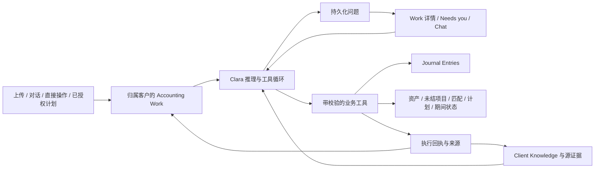

# Clara refresh — 产品与执行契约草案

日期：2026-09-08。状态：v0.1，已确认的产品行为＋待验证的实现方案。本文不是全量重构已完成的声明。

2026-09-09：最后的定期扣款范围已确认，Wayfinder 决策阶段完成。本文仍是正式 `/to-spec` 的输入，尚不是 tracker 发布的正式 spec。

决策状态以 [Clara refresh map](https://github.com/BELCORT-SDN-BHD/clara/issues/597) 为准；产品意图已同步到 [PRD](../../PRD.md)，当前实现见 [Architecture](../../ARCHITECTURE.md) 和 [后端证据](refresh-2026-09-08-backend-evidence.md)。此草案将讨论转成可审阅的场景与验收，不替代各决策票中的确认记录。

## 1. 已确认的产品行为

| 场景 | 已确认结果 |
| --- | --- |
| Clara 的正常模式 | 所有 firm/user 默认使用自主执行的 Clara；资料与权限足够就执行，无须先开启自动入账、逐项能力或全自动预设。 |
| 上传已归属客户的文件 | 自动开始处理；资料充分且在授权范围内可入账／匹配，缺信息或需要决定时提问。 |
| 用户直接交办，有附件或无附件 | 具备权限且事实充分就执行；对话中的明确事实可作为记录的依据，附件缺席本身不构成停止理由，不伪造文件或来源。 |
| 新建／重置 chat | 清空该次对话上下文，保留工作、账务与已确认客户知识。 |
| Firm chat | 可跨客户查询和指挥；每一笔 accounting execution 记录明确客户，归属不唯一时澄清。 |
| 对账／close | 正常自主执行可完成对账、锁期，仍须满足实际完整性与授权条件；不另设全自动启用步骤。 |
| 不明银行收款 | 保持待处理并提问，不猜清账、不默认记 suspense。 |
| 查看及继续工作 | 可筛选 Work 列表 → 详情 → 就地回答／对话；rail 指向同一件工作。 |
| 取消处理了 20／100 份的工作 | 停止余下工作，保留已完成结果；撤销账务效果是独立更正／冲销。 |
| 批次中部分项目缺资料 | 独立且资料充分的项目继续；只暂停受影响项目及其依赖，整批显示完成及待处理数量。 |
| 按计划结账 | 明确授权的客户月结／年结计划到期自动准备，满足完成与权限条件才完成／锁期；也可随时在 chat 或 Work 发起。 |
| 锁期前的资料完整性 | 按客户已确定的应收资料、账户、期间覆盖和结账要求检查；有缺口／异常才问，不要求每期重复确认资料已齐。 |
| 对话历史管理 | 提供新建、切换、归档／恢复，本轮也要真正删除普通对话文字；必要工作依据和账务决定记录保留。 |
| 锁期后收到迟到单据 | 说明影响，提出重开或允许的后续期间调整方案，由用户决定。 |
| KB 学习 | 明确提供的信息／长期偏好自动保存、可纠正或撤回；提取事实保留来源；推测待证实，重大矛盾提问。 |
| 客户偏好的适用范围 | 当前客户内的指令默认只用于该客户；明确指定且权限足够才设为 firm 通用规则，保留客户例外，重大冲突澄清。 |
| 从工作中学习 | 自动积累有来源、结果及适用条件的处理经验，后续可参考；重复做法不自动升级为已确认政策或未来计划授权。 |
| 开放期间内，Clara 发现自己记错 | 原授权内、有依据地冲销＋更正并通知；锁期、授权变化或处理不确定时提问。 |
| 新的未来分录计划 | 按既定政策处理业务记录；新建会持续产生分录的计划须有明确指令或已有授权规则。 |
| 定期扣款 | 本轮包含已发生银行扣款的自动记账／核销，以及明确授权的周期会计计划；实际发起银行支付、创建／取消 bank mandate 留作后续支付能力。[确认记录](https://github.com/BELCORT-SDN-BHD/clara/issues/611#issuecomment-5588831144)。 |
| 购置资料充分，折旧方法／年限缺失 | 先完成购置入账及关联资产登记；折旧设置待补充，Clara 提问，不编造政策、不把所有依赖显示为完成。 |
| 用户手动记账 | 事实、权限与会计校验通过即可完成；移除默认第二人复核／额外 attestation 仪式，与 agent 保持同一业务后果。 |
| 结账仍缺个别必需资料 | 有权限的人可逐项说明理由并接受资料例外，结账结果保留例外；Clara 不自行豁免，硬性账务勾稽不能豁免。 |
| 会计动作及其波及范围 | Clara 识别并处理关联分录、清账、未结余额、资产、计划、期间和报告状态；只有真实结果及依赖状态满足目标才声称工作完成。 |
| Client home 的优先级 | 工作优先：需要你、正在处理、近期完成，辅以简洁财务摘要；完整 Work 和报表可直接进入（Q24）。 |
| Accounting、Work、Reports | 账务对象按业务归入 Accounting；Work 追踪执行和问题，Reports 展示输出，各自连接同一工作与记录（Q25）。 |

客户 workspace 是事务所员工处理该客户的上下文；当前产品没有客户企业独立登录。客户的会计政策、所需资料和计划仍须明确；它们用于表达要做什么和完成条件，不是先开启 Clara 才能工作的自动化设置。

Q16/Q17 修正了前轮提问的前提：默认就是 agentic，撤回“未启用自动入账时是否允许当次执行”和“逐能力开关还是全自动预设”的产品分支。后台的权限校验继续存在，不能把产品默认自主执行解释为所有成员有相同权限。

## 2. 三个核心对象与账务边界

**Client Knowledge** 保存客户事实、身份／别名、偏好和政策依据。**Accounting Work** 保存要完成什么、证据、执行结果与待答问题。**Journal Entries** 保存已入账的 GL 金额变化。

箭头表示受校验的读取或更新：执行回执不会将所有模型推测自动变成已确认知识。

| 操作 | 分录及其他必需记录 |
| --- | --- |
| 发票、账单、claim form | 确认的经济事项产生分录；赊销／赊购需要相应未结项目，员工 claim 需要关联员工／应付款及来源。文件类型本身不决定已入账。 |
| 固定资产购置 | 需要资产登记资料及对应采购／付款账务；仅录入一张借固定资产的 JE 不足以自动证明折旧资料齐全。 |
| 折旧／摊销 | 政策、起止期间、方法、金额基数和已执行期间属于计划；到期执行才产生相应分录与运行回执。 |
| 变更折旧方法或使用年限 | 更新有生效日期的政策／估计；是否需要会计调整取决于具体事项，不能把改配置等同于立即新增 JE。 |
| Accrual、recurring adjustment、反转计划 | 模板、频率、有效期、授权与去重运行记录独立保存；每期执行生成分录，需要时产生关联反转。 |
| 新增 account／control account | 更新科目配置及适用约束；没有经济事项时不凭空产生金额分录。 |
| 银行 statement／非银行还款凭证 | 文件产生证据与交易事实；若账上已有付款，匹配／分配通常关联现有记录；遗漏的费用、利息等才按证据记账，避免重复记账。 |
| 已发生银行扣款／周期会计计划 | Chat、文件／银行流水和 Accounting 使用相同记账／分配能力；已入账付款不重复记现金。获明确授权的计划到期产生会计结果；仅观察到重复扣款不建立计划，也不发起实际支付或建立 bank mandate。 |
| 应收应付清账、抵消 | 要更新被清偿的具体未结项目及分配关系；是否需要新的 GL 分录由实际经济事项决定。 |
| Close | 核对完整性、处理例外、生成必要结转、锁期并关联报告结果；报表种类不是 close 的工作类型。 |

这里定义的是目标契约，不能据此宣称所有 document kind、员工 claim 或业务工具已经实现。代表性数据集与各功能覆盖仍需逐项验证。

确定性代码保留金额精度、借贷平衡、租户／客户、权限、期间、幂等和业务对象一致性等约束。LLM 可以误读数字、选错对象或给出格式正确但经济含义错误的结果；schema 通过不等于账正确。应简化重复的模型判断与仪式性确认，保留这些可检验的约束。

### 2.1 业务操作与校验边界（产品决策已确认，待实现）

承接 [确定分录、业务对象与确定性校验的边界](https://github.com/BELCORT-SDN-BHD/clara/issues/602#issuecomment-5582778719)。[本轮证据](refresh-2026-09-08-accounting-boundaries-evidence.md)区分官方来源、当前代码与目标契约；owner 已接受 Q19/Q20/Q21 的建议，并确认自主执行涵盖完整会计目的及其波及范围。具体工具与事务设计仍需实现验证。

将用户的会计目的作为业务操作：记录一项购置、确认一笔应付、将已记账付款分配到未结款项、执行某期折旧、修改一个计划、纠正既有事项。Chat、文件处理与手动表单都调用这些能力，返回分录和业务对象的关联结果。手动借贷行仍是可用输入方式；涉及 control account、资产或结算时，需要相关业务字段，不能只改 GL 而让明细账失配。

同一次业务操作必须保持的主账／明细状态一起提交或一起失败；相互独立、事实充分的后续或前置动作可以单独完成并留下工作状态。Wiki、搜索索引和图表投影可以异步更新并展示 freshness，不能让它们成为一套独立账簿。Q19 已确认：购置事实充分时完成入账及关联资产，缺少折旧方法／年限则仅挂起依赖这些信息的设置与执行，并提出问题。购置完成不代表折旧设置也完成。

| 检查职责 | 目标归属与失败反馈 |
| --- | --- |
| 字段结构、精度与枚举 | 结构化工具输入和精确数值解析；将可修正错误返回 Clara，不能用错误单位／自动四舍五入掩盖差异。 |
| 原始事实与金额依据 | 文档事项校验对应来源与关键事实；用户明确提供的事实保存其来源身份，不强制伪造文档或重复走 OCR。事实冲突才向用户澄清。 |
| 业务意义与关联状态 | 由业务操作检查适用客户、未结项目、剩余额、资产／计划状态及原子后果。模型修正选择或补资料，不能靠任意 SQL 绕过。 |
| 当前权限、期间与并发 | 在实际写入时校验当前状态与关联对象；失败时区分权限已变、期间已锁和可重读重试的并发变化。 |
| 去重与重试 | 同一经济动作重发仍指向原结果；有新的业务意图时使用新操作并明确与原结果的关系。 |
| 模型判断／分类 | 审查是否提供独立、可行动的信息；不因为目前存在多个 evaluator 就把每个模型意见永久设为必经审批。具体保留／合并项需源码和代表性失败样例支持。 |
| 人工确认／第二人复核 | Q20 已确认移除正常授权手动记账的默认第二人复核及额外 attestation 仪式；保留当次业务意图、当前角色、事实、修订、金额、期间与业务后果校验。与明确接受结账资料例外等人类决定分开。 |

格式正确只说明输入能被读懂；它不能证明金额来自正确事实、选中了正确发票、尚未重复记账或期间仍然开放。工具应返回稳定错误类别、相关对象与可行动的信息，使 Clara 能重读、修正或提问；不得无限重试或修改参数直到绕过拒绝。

结账需要区分不能豁免的账务勾稽、适用的资料／处理完整性，以及提示性信息。尚未能测量的结果显示待最终校验，不能提前显示已通过。客户预期应收资料必须可版本化并覆盖尚未上传的文件；仅检查已存在的文件不等于资料齐备。Q21 已确认：有权限的人可逐项说明理由并接受缺失资料的 readiness 例外，记录所涉期间／要求、决定者、依据与理由，并在 close 结果中持续可见。Clara 可以在其他条件成立时继续，但不自行把缺失改成通过，不把当次例外扩成未来的常设豁免；硬性账务勾稽不能豁免。

更正一次既有事项须处理相关未结款项／资产／分配结果，不能只生成镜像分录就声称完成。处理还款先识别是否已有同一经济事项：已有且具有可用未结项目时分配，不重复记账；尚未记录时才产生所需新分录与清账关系。具体原子事务与多步恢复边界须复用并验证现有约束。

“涵盖波及范围”是完成标准：执行或更正前识别受到影响的 GL、未结项目、分配、资产、计划、期间与报告依据，按当前权限和状态处理必要关联动作。事务内不变量一起提交；分步工作保留依赖、真实完成结果与恢复位置。独立项目继续，失败或待答项不伪装成成功；可恢复的技术错误由系统在预算内重试，不要求用户回答基础设施问题。无法恢复的技术失败显示受阻／失败及恢复途径。

资料不足、事实冲突及需要由人决定的范围通过同一澄清交互处理。已有锁期、新的未授权计划或当前权限限制仍适用，不能因纠正一个对象就自动扩大授权。保留已入账历史；投影显示 freshness，已出具报告保留原内容和来源快照，受影响时显示过时／被替代并在支持且获授权的范围生成新版本。完成回执须列出所达成的业务结果、关联对象和仍未完成的依赖，不能仅以工具成功次数计数。

代表性验收至少覆盖：已记账付款再匹配不重复记现金；付款更正处理相应分配及未结余额；资产购置完成但缺失折旧资料仍可见；影响已锁期间时停在期间决定；重试不重复产生分录／计划运行；更正后报告过时状态和新旧版本可追溯。具体样例金额、原子边界和 hosted 证据由实现切片落实。

计划变更、会计估计变更与原始错误更正需要不同的生效范围；保留已发生记录，并按适用框架与事实明确后续或更正处理。不能因字段改了就静默重算历史，也不能一概认定所有会计政策变化只影响未来。

## 3. Accounting Work 的实现提案

这是逻辑契约；优先复用和演进现有 task／interruption／receipt 数据，不预先新增一套平行任务库。

- 每件工作有稳定 ID、firm/client、目的、触发来源、授权依据、输入引用、输出引用和当前版本。跨客户批量指令拆成明确归属的子工作，父级汇总进度。
- 建议用户状态为排队、处理中、需要你、受阻、完成、失败、已取消。部分完成是结果摘要：取消后已完成 20 项仍可查看，不把整体显示为“全部完成”。最终状态来自服务器记录。
- 同一个问题只有一个持久化身份，包含所需信息、适用工作／客户、有效版本及回答记录。Work、Needs you、对象详情和 rail 显示同一个问题；任意入口提交都调用相同回答接口。
- 同时回答或引用旧问题时，服务器返回已回答／已过期／状态已变化，并显示当前结果。用户不用在多个页面重复回答。
- 新 chat 使用新的对话上下文。工作自己的证据、摘要、问题和恢复位置仍在；任何后续交互都能重新打开工作。
- 取消会阻止后续新动作；取消前已接纳的原子操作仍在结算时显示「正在停止」，结算结束、服务器确认最终边界后才显示已取消。保留所有真实完成回执。不能只中断浏览器请求，也不能把已经入账的记录静默删除。
- 普通解释可以流式输出；“已入账”“已锁期”只在对应回执后显示。重新连接从持久状态与流游标恢复，不能仅依赖浏览器内存。

Q15 已确认本轮需要真正删除普通对话文字，不能只用归档满足该需求；Q2 的新对话仍负责上下文重置。必要依据包括相关指令／明确事实、已接受的回答、授权、来源引用与结果，不用完整旧对话代替最小依据。删除入口说明保留什么及原因。实际存储／索引／运行上下文中的删除传播属于实现设计，必须在实现票中验收。普通执行没有待设计的自动化启用页面。

### 3.1 Accounting Work 决策契约

本轮承接 [Accounting Work 契约](https://github.com/BELCORT-SDN-BHD/clara/issues/601)。以下是 owner 已确认选择及其可检查边界。具体 SQL、SDK、权限凭证、接口和存储方案仍由技术设计落实；整份文件仍是跨领域 v0.1 草案，不等于正式全量 spec 或实现证明。

| 阶段／边界 | 建议的可见行为与验收 | 依据与状态 |
| --- | --- | --- |
| 接收已归属请求 | 接收成功后可从 Work 找到所属客户、目的、来源及当前状态。浏览器断连或新开对话不撤销已接收工作。 | Q1/Q2/Q3/Q6 已确认；恢复与幂等来自 PRD。接收与提交的原子边界待技术设计。 |
| 尚未确定客户 | Firm 入口保留待归属请求并提出问题；在明确客户前不创建假归属的 accounting execution，也不把其他客户的知识或账簿作为默认上下文。明确后再产生归属客户的工作；跨客户批量指令可有组合层的请求摘要。 | Q3 已确认；接收请求与 client-attributed Work 的区分为实现提案。 |
| 开始或恢复执行 | 重新检查当前客户权限、工作授权依据及相关账务状态。曾经获准的旧对话、旧答案或旧任务不能扩大当前授权；不存在正常工作必须通过的额外自动化开关。 | PRD 角色变化要求及 Q11/Q16/Q17；具体恢复机制为技术设计。 |
| 原发起人离职／降权 | 工作保留并可由有权限的人员查看。事务所／客户层面的有效自主授权仍可支持执行；依赖已失效个人委托的动作等待当前有权限人员接手。任何人回答问题都不能自动取得额外执行权。 | 默认自主执行、当前权限检查和工作独立生命周期的推导；不沿用离职者的旧身份。 |
| 需要信息 | 展示缺什么、为什么影响当前工作、可用来源和可接受的回答。回答可含结构化字段、文字或附件，不要求用户懂内部工具。 | Q6 已确认就地问答；统一问题和回答接口为实现提案。 |
| 一直未答／问题过期 | 受影响工作继续处于 Needs you，不猜测答案、不自动完成或取消。回来时重新核实相关事实并刷新必要问题；若新资料已经解决缺口，在当前授权有效时继续。站内 Needs you／Activity 保持可见。 | 缺资料提问、独立工作生命周期和取消语义的推导；提醒频率与技术 hook 时限不改变工作结果。 |
| 两处同时回答 | 第一个仍适用且合法的答案被接受；另一个入口显示当前结果和补充／更正途径。网络重发同一答案不再次执行。若新内容会改变已发生结果，进入显式更正流程。 | 并发和恢复语义提案；不是让模型自行覆盖另一人的答案。 |
| 回答时依据已经变化 | 保留原问题及回答历史，说明变化并重新评估受影响工作。若旧答案已不适用，提示更新后的问题；不能只显示失败代码，也不能静默套用旧答案。 | 当前状态检查与可解释恢复提案；问题失效与无关更新须区分。 |
| 明确取消与正在提交的动作相遇 | 阻止取消排序点之后的新动作；此前已接纳的原子操作结算时显示正在停止，保留完成结果，确认结算与最终边界后才显示已取消。 | Q8 已确认保留完成结果；取消与动作接纳排序的实现验收。 |
| 工作失败或暂时受阻 | 区分可以重试的技术中断、缺资料／决策和不允许的业务动作。重试保留证据和成功结果，不重复入账；不可通过更换参数来绕过授权拒绝。 | PRD 可恢复性和既有授权边界；错误分类及预算待技术设计。 |
| 完成并重新打开 | 结果引用真实分录、匹配、资产／计划或期间记录；展示来源和简洁解释。后续更正、撤回或权限变化后重新读取当前状态，不能沿用旧卡片的成功文字。 | PRD 对象状态及 Q11；具体关联对象契约由分录／业务对象决策承接。 |
| 删除工作来源对话 | 删除普通对话文字；工作只保留所需指令、有效回答、授权及证据引用，不把完整旧对话改名为工作依据后继续保存。删除后工作仍可回答／恢复，已确认 KB 有独立纠正／撤回入口。 | Q2/Q15 已确认；最小依据清单、删除传播和用户可见说明为技术及 UX 提案。 |

本轮 owner 已确认：Q13，混合批次中独立项目继续、受影响项目及依赖等待；Q14，已授权的 close 计划自动启动，也可随时发起；Q15，本轮需要真正删除普通对话文字并保留必要工作依据。答案及最终决策状态由承接票记录，本文件与 PRD 同步产品含义。

Q16/Q17 已确认默认自主执行，以及有／无文件都可依据用户提供的充分事实完成当次工作。Q18 已确认按客户已确定的资料与结账要求检查，异常才问。到计划时间自动开始，检查通过后自动完成／锁期；若问题未解决，不因日期已到而锁期。应收资料范围本身不明确时是缺失条件，不能当作全部通过。

后续 Q21 补充了资料例外的处理：有权限的人可明确接受某项例外，使该待决定事项得到处理；结果仍显示例外，不能把缺失资料显示为已收到。硬性账务勾稽与最终校验继续适用。

本契约交给后续决策的条件：分录／业务对象决策必须给出各动作所需事实、原子业务后果与 close 的完整性检查；KB 决策必须提供按来源／版本读取和纠正的依据；导航决策必须让 Work、Needs you、对象详情和 rail 读写同一工作与问题，并落实删除说明。不同入口不得重新发起同一经济事项或要求重复答题。

技术实施仍需证明权限接手、问题版本、并发答案、重试、删除传播和旧运行迁移；这些是实现与验收工作，不是尚待 owner 选择的自动化产品模式。当前决策状态以承接票为准。

### 3.2 当前实现对本契约的约束

这是本轮对既有报告的有限源码补查，不是全量部署验收。图索引对引用路径均报告 metadata changed，大型 SQL 另有部分解析缺口，因此以下以直接源码读取为准。对点名的 interruption、authority 和 close 函数做了全 migrations 定义／重定义检索；这不构成对所有别名、间接接口或 hosted 调用的排除证明。

- 当前 interruption 为 pending/answered/expired/cancelled；答案通过行锁串行化，同一幂等键去重。没有问题版本字段或 expected-version 比较，也不在原问题上重新打开。因此“第一有效答案被接受”已有基础，“依据变动后的适用性判断”仍须设计。（`packages/db/migrations/0006_runtime_core.sql:188-212,511-549,861-890`）
- 回答时检查回答者当前 firm 的 bookkeeper+ 权限；`asked_of` 不构成专属回答权。恢复的 chat turn 仍取任务原始 `created_by`，不会因另一人回答而自动转交授权。执行凭证会重新核实原发起人的有效成员身份，移除或降权后的受控调用会失败。（`0006_runtime_core.sql:861-890`；`0011_daily_loop.sql:1133-1152`；`packages/runtime/workflows/chatTurn.v10.impl.ts:85-139,278`）
- 当前问题默认 14 天过期，reconciler 将其置为 expired，再由 control 恢复 hook。技术问题记录的过期不应被误显示为工作完成；工作是否重新提问、由谁接手需要在恢复契约中处理。（`0006_runtime_core.sql:1069-1124`；`packages/runtime/lib/reconciler.mjs:87-108`；`control.mjs:49-114`）
- 当前 close wake oracle 在财年结束后按每日条件检查是否可唤醒，不是客户可配置的月结／年结计划，也不代表完成条件已满足。源码将相应来源种子设为 disabled，hosted 是否开启未核实。（`packages/db/migrations/0138_f_a4_pr_1c_close_agent_limb.sql:1161-1225`；`0133_g1_wake_engine.sql:38-45`；`packages/runtime/plugins/startWorld.ts:254-265`）
- 当前 closePrep 目标是准备 human proposal，prompt 排除 finalize/attest/reopen；attended close 的数据库能力也仍保留 agent finalize 限制。数据库存在部分 attended 能力不代表当前注册的 chat 版本已暴露整条 close 路径。Q4/Q14 的自动完成／锁期仍是目标差距。（`packages/runtime/workflows/closePrep.v1.prompt.ts:55-69`；`packages/db/migrations/0159_f_a4_pr_2c_close_chat_lane.sql:344-369`）
- 当前每份 intake 分别启动 documentIngest，但 facts-gate 在未达到重试上限的错误处会返回 blocked，暂停该 firm 的后续事件。逐文件任务因此不自动满足 Q13 的独立项目继续契约；后续切片须验证技术重试不会不必要地阻塞无依赖项目，并保留真正的业务依赖顺序。（`packages/runtime/src/intakeRoutes.ts:126-144`；`packages/runtime/lib/facts-gate.mjs:117-172`）

Q16–Q18 的 owner 回答已记录在前文；旧实现与先前提问中的自动化启用前提不会自动成为新方案的限制，也不能因 SDK 支持持久化就假定上述差距已经解决。

## 4. 一个 Clara agent，多个受控能力

推荐统一的是 Clara 的推理、知识读取、工具契约和用户交互；每个客户／工作仍有隔离的执行上下文。不要把所有客户塞进一个永久增长的模型对话。

建议由同一版本化 agent 配置装配 instructions、会计技能、工具注册表、上下文构建器和循环预算。按当前客户、授权、工作类型和状态暴露可用工具。`AGENTS.md`／技能文件只有被 runtime 明确加载才会成为产品 agent 的输入；仓库 coding-agent 的文件不会自动生效。

典型循环：读取工作及相关知识 → 获取证据／账务 → 选择业务工具 → 校验并执行 → 读取回执 → 必要时修正参数／补充证据 → 完成或持久化提问。schema 错误、状态冲突、业务拒绝和基础设施重试需要不同的处理；设定明确预算，不能无限重试，也不能修到“通过”为止而绕过约束。

数据库交互继续走有类型、可审计的业务接口。自动 agent、chat 和用户表单复用同一业务能力。可以有 `record_acquisition`、`allocate_payment`、`configure_recurring_plan` 这类完整业务动作；把所有能力退化为任意 SQL 或裸 `insert journal` 会遗漏业务后果。

OCR、解析与分类可作为明确的输入处理步骤；没有必要仅为保持“一个 agent”的外观去删除可靠解析器。需要审查的是重复推理、互不共享问题的多个 agent 和难以纠错的硬路由。

2026-09-09 的[技术路线决议](https://github.com/BELCORT-SDN-BHD/clara/issues/607#issuecomment-5588548302)已选择首轮采用 Node 22、Workflow 4.8.4／Postgres World 4.3.4 和现有 AI SDK 7.0.77 ToolLoopAgent，以新的冻结 successor 承接统一 harness，保留旧 v1–v17 的可执行绑定。这是待实施目标，不是当前生产状态。澄清继续保存为服务器端持久问题，`needsApproval` 不自动等于持久等待。

[公平比较](refresh-2026-09-08-runtime-route-audit.md)确认 WorkflowAgent 1.0.70 支持 Workflow 4，且模型调用与 step 标记工具可分别 checkpoint；其精确 AI7.0.69 依赖缺少后续流式重试／消息修正，需要额外依赖隔离和维护。WorkflowAgent 2.x 有 Workflow 5 的可安装候选，但仍须验证 runtime/world/compiler 迁移和旧运行切换。首轮选定路线接受较粗的 ToolLoop 段重放成本，必须验证有界预算、部分文本重建和 receipt-backed 结果，而不是把这个取舍隐藏起来。

[新增边界证明](refresh-2026-09-08-runtime-boundary-proof.md)在真实 PG17／Workflow4 下验证了 effect 提交后、步骤 checkpoint 前中断并恢复同一 receipt，以及合成取消／权限／期间事务顺序、KB-only 重评和删除聊天后保留 Work 依据。原生 WorkflowAgent 比较另有 Node22 typecheck 与 Workflow Vitest 2/2，使用 local world，不能冒充原生路线的 PG restart 证明。

[现有答案接纳走查](refresh-2026-09-08-answer-admission-evidence.md)确认 Clara 已有数据库第一回答门和持久投递记录，可复用；原始 resumeHook 接受并发答案不是已证明的 Clara 缺陷。真实业务门的权限到提交、稳定逻辑操作与 payload 绑定、投递领取者／lease 崩溃窗口、取消终态、KB/聊天真实存储传播、Linux/hosted 和两次构建的切换／回退，均是正式 spec 与实现票的明确验收。取消沿用 Q8：阻止后续新动作，已接纳的原子操作结算期间显示「正在停止」，保留完成回执后才显示终态。

## 5. Client KB：统一所有权，保留可验证的结构

承接 [确定客户知识、身份与 agent context 的维护契约](https://github.com/BELCORT-SDN-BHD/clara/issues/603#issuecomment-5583365852)。本轮 Q22 已确认偏好的客户默认范围，Q23 已确认自动积累可追溯处理经验作为参考。以下产品契约与技术方向已收敛；具体 schema、接口和迁移仍需设计验证，不能视为已实现。当前源码与研究依据见 [KB 契约证据](refresh-2026-09-08-kb-contract-evidence.md)及 [OKF 现行规范复查](refresh-2026-09-08-kb-format-recheck.md)。

采用一个 Client KB 服务／产品界面，底层优先整合已有结构化记录及版本，生成 OKF 兼容知识页面。用户不需要另走“先登记 vendor binding 才能处理文件”的流程。

- 客户事实、counterparty 身份／别名、政策和偏好属于同一知识领域；结构化 ID 用于引用、消歧和一致性。账务历史继续引用稳定对象，不能因改了 Markdown 名称就指向另一家公司。
- 数据库中的受控记录与版本作为规范写入入口；OKF 页面是有来源、版本、生效日期的可重建投影。导入的 Markdown 作为资料进入同一验证路径，避免数据库和可编辑页面各自为真。
- 明确用户资料／偏好自动保存；冲突信息不覆盖既有事实。文件提取事实带来源和提取状态；模型推测保持待证实。一次成功 posting 只证明该次事务通过约束，不足以证明模型猜测的身份一定正确。
- 当前客户内的持久指令默认只用于当前客户。只有明确指定 firm 范围且具备对应权限才建立通用规则；客户端例外继续保留，重大冲突澄清。客户私有事实不会因为相似业务就变成其他客户的知识。
- 执行时按客户、期间和目的读取相关知识，记录用到的版本／引用。写入前复核相关依据及账务状态；不因无关知识更新而无差别阻断所有工作。
- 来源或已确认事实改变后，由持久事件触发编译、索引和 lint；可重试、可重建、可看 freshness。检查断链、矛盾、过期事实及无来源断言。
- 撤回知识产生修订记录与影响提示；已入账错误按更正规则处理，不能通过修改 KB 静默重写历史。

Karpathy 的 source／wiki／ingest-query-lint 模式适合维护思路，Google OKF 适合结构、来源、可信度和交换。它们不替代数据库权限、账务事务或 tenant isolation。迁移应证明现有 facts、wiki、aliases、bindings 都能归入这一入口，不能先删旧表再处理引用。

### 5.1 统一 KB 契约

统一的是知识的写入、读取、纠正和解释入口，而非要求全部内容放在一个 Markdown 文件。优先复用现有事实与身份记录，由同一受控知识服务协调；没有必要再建立一套平行 vendor registry。原始文件与用户提供的依据保存来源版本，规范化事实及身份保留稳定引用，wiki／OKF 页面承担可阅读、可重建的综合视图。

| 知识类别 | 记录与使用方式 |
| --- | --- |
| 用户明确提供的资料 | 保存当前客户／明确 firm 范围、具体内容、提出者和来源；记录为该用户的声明，不伪称独立核实。已有重大矛盾时保留两方依据并提问。 |
| 文件提取事实 | 保存来源文件／版本／字段依据及提取状态；成功解析并不等于所有业务解释已经成立。来源更正或重分类要重评相关知识。 |
| 身份与别名 | 证据充分且无关键冲突时，Clara 在当前权限内维护身份与别名，无须先人工绑定。稳定对象承载名称、别名和来源；同名不是同一主体的充分证据。改名不改变历史身份；归并保留旧引用及来源，不重新记账。 |
| 政策与长期偏好 | 保存范围、适用条件、生效区间及提出者；会计政策配置和未来计划仍执行对应权限与明确授权，不因写进 KB 就获得执行权。 |
| 叙述知识／经验 | Q23 已确认自动积累：由可追溯事实、工作结果与纠正综合，并保留适用条件；模型假设与已确认政策分开，不能以模型反复引用自己作为独立证据。 |
| 工作临时上下文 | 当前目的、待答问题、已用依据和工具结果属于具体 Work；筛选有长期意义的明确资料或可追溯经验进入持久知识，完整聊天不会自动变成 KB。 |

每条可影响执行的知识至少能解释适用主体／范围、依据、来源版本、确认或推测状态、当前有效性，以及谁在什么时候变更了什么。源码中的固定少量 fact keys 不应被当作产品知识能力的上限；扩展方式由类型化业务事实和可扩展知识记录共同承接。

推测／经验未被确认为政策，不等于每次使用前都必须让人打勾。Clara 可以据此寻找资料并辅助判断；当次会计动作仍按充分事实和权限执行，只有关键歧义、冲突或必要决定未解决才澄清。

区分业务生效时间与系统记录时间：解释历史工作时可读取当时实际使用的版本；处理更正时读取当前已知事实并说明差异，不能只按最新页面覆盖过去的政策或处理。客户预期应收资料、账户覆盖和结账要求也归入有版本的客户政策／要求，供 close 读取；wiki 中的一段描述不替代可检查的完成条件。

技术取舍是复用受控 DB 记录作为规范事实／身份写入，wiki／OKF 页面作为综合投影。让 Markdown 成为唯一可编辑权威也能设计，但需要额外解决编译与账务事务之间的同步、引用和并发变更；这次优先演进现有业务约束。该选择统一写入责任，具体表结构、索引与编译实现不在这里预先复制一套。

同一家公司同时有 vendor/customer 角色时，可关联其身份知识，但保留各自账务角色、稳定引用与未结项目，不自动抵消 AR/AP。归并只改变规范身份的解析关系时不应重写原分录／未结项目的 recorded identity。错误归并需要显式纠正链和影响重评；旧数据缺乏足够 lineage 时显示需要进一步处理，不能承诺当前数据库已经具有通用一键 unmerge。

### 5.2 读取、维护与纠正闭环

执行时先取得客户、期间、业务目标与必要核心事实，再按问题检索相关知识摘要；Clara 可继续读取完整概念、关联来源和账务对象。限制初始上下文大小，并明确还有哪些内容可以读取；不依赖固定前几页覆盖所有任务，也不把整个客户 KB 塞进每次调用。精确身份与金额读取走对应业务对象，叙述检索不能替代它们。

当次 Work 记录实际用到的知识／来源版本与必要依据；实际写入重查相关事实和状态。修改无关偏好不应暂停所有工作。知识投影或搜索索引落后时，可以在规范事实和来源仍可可靠读取的前提下继续，并修复投影；必需依据的读取服务失败则技术重试／受阻，不能静默当作客户没有知识，也不能让用户重复提供系统已有的信息。

明确资料进入受控写入后，来源变化、工作完成或用户纠正触发持久维护事件，更新受影响概念、索引、引用与日志。事件去重、可重试且有失败状态；知识维护失败不回滚已经合法提交的账务结果。维护检查应确实使用写入方提供的主体／来源关联，识别矛盾、断链、过时依据和无来源断言；可确定的投影问题自动修复，实质矛盾提出同一持久化问题，只影响相关工作。

纠正或撤回产生新版本与影响评估，阻止后续执行继续引用已撤回的依据作为有效事实；依赖它的综合内容须重建、降为待证实或撤回。仍有独立有效来源支持的事实可以继续保留，并说明现有依据。保留历史账务使用过的必要依据与更正链；不得因删除 chat、修改 KB 或归并名称静默改写分录。发现既有账务错误时按已确认的开放期更正／锁期决定契约处理，不从 KB 文字直接重写账簿。

用户明确表达“前一条错了，改为这一条”，且来源、范围与适用时间足够时，直接记录纠正，无须为了已有取代意图再问一遍；只澄清仍未解决的实质冲突。普通对话删除后，已确认知识引用保留的最小声明／工作依据，不能只留下失效 message ID，也不能为保住引用而暗中保存完整聊天。

同一个 Clara harness 暴露知识查找、来源读取、明确事实记录、纠正／撤回、身份消歧和影响查询能力。后台编译或 lint 可以是持久步骤或工作，但用户看到的是同一 Clara、同一 Knowledge、同一待答问题。版本化运行指引描述如何使用这些能力，频繁变动的客户事实通过检索读取；仓库 coding-agent 的 AGENTS.md 不会自动成为产品 agent 的指令。

版本化运行指引与外部知识分开加载；源文件、wiki 和导入包中的指令性文字作为待解释资料，不取得系统指令优先级。工具仍在服务器验证作用域和业务权限。知识服务对事实、身份、政策、经验使用对应类型的受控操作，不能把一个任意键值写入工具变成修改全部客户配置和账簿的入口。

### 5.3 迁移与验收边界

先清点现有 facts、counterparties、aliases、identity bindings、wiki 版本／来源及读写路径，逐类定义规范写入归属；保留旧 ID、引用、来源与历史，缺失依据标为未知。新读写入口先能提供同一业务结果，再迁移调用方和停止旧的独立维护路径。不能仅因旧表名称包含 binding 就整表淘汰，也不能把旧页面一律标为 verified。

已存在的 identity binding 证据与已退役的 vendor posting rules 分开处理。目标取消的是必须先人工预绑定／签字才可处理充分资料的仪式，原有签名与字段历史仍作为历史依据保留。新的 agent 写入须有真实 actor、来源、幂等和当前权限校验，不冒充 `human` 来源或借用旧人工函数身份。已有按有效分录重算的 `approved_coding_patterns` 是经验检索的可复用输入，无需为同一事件再积累一套漂移的统计真相。

OKF 兼容优先用于可阅读投影和受控交换；格式可读不意味着导入内容可作为已验证事实或指令。外部声明的 verified、人名或 SQL 片段都不能自行取得 Clara 的执行权限。需要往返导入时应进入同一来源与修订流程，不能形成“改 Markdown 和改 DB 都算最终事实”的双重写入。

兼容目标以当前维护的 OKF v0.2 规范为基线，Clara 在格式读取与事实接纳之间保留自己的检查；metadata 可以描述核实事件，实际信任仍绑定来源和具体版本。此处规定接收外部知识时的约束，不额外承诺新的独立 bundle 导入／导出产品模块或 Google 托管服务。

验收应覆盖：新 chat 仍能使用已确认资料，删除普通文字后仍有最小可读依据；客户偏好不外溢；身份改名保留历史、同名不同主体保持区分；用户明确更正无需重复确认，未来执行与相关综合内容更新；同一事件重复投递不复制事实／经验；来源撤回与独立支持来源并存；相关 KB 变更使待执行工作重评；投影延迟可恢复且关键读取失败不静默忽略；导入内容不能伪造人类核实或执行授权。精确搜索实现、存储字段、导入 UI 与跨工作兼容性需在技术切片中验证。

## 6. 页面职责与组件提案

| 页面／入口 | 用户主要目的 | 组件方向 |
| --- | --- | --- |
| Firm home | 看客户组合、需要介入的工作及近期变化 | 有明确定义的 summary、可筛选表格、紧凑 activity；避免装饰性 charts。 |
| Client home | 看该客户当前期间、账务进度、异常及财务摘要 | 同一工作统计＋可解释的金融数据，显示期间与 freshness。 |
| Work | 找到、跟踪、继续工作 | Linear 式 list/detail；Table、filters、Badge；详情有结果、证据、问题与活动。 |
| Needs you | 处理待答／待决定事项 | 同一 Work 的 attention view；Questionnaire／Field 处理结构化问题，补充说明仍可自由输入。 |
| Documents | 上传、阅读和纠正来源及 facts | Attachment 表示文件／上传状态；独立的原件及类型化 facts viewer 并列展示；次要管理动作放可发现的 menu／Sheet。 |
| Journals | 检查金额影响、分录与更正链 | Table、分录详情、来源及关联 Work；不再承载整个产品的所有问答。 |
| Bank | 检查交易、匹配、差异与对账 | transaction table＋证据／匹配详情＋真实完整性状态。 |
| Registers | 资产、未结项目、计划与其他业务记录 | 类型化列表／详情／表单；可直接操作或请求 Clara 执行同一动作。 |
| Close | 查看期间准备、剩余问题、结转和锁期结果 | 带实际 readiness 的工作详情；必要的报告是输出引用。 |
| Reports | 选择、生成、阅读和导出报告 | 报告列表、参数表单、结果查看；生成进度连接 Work。 |
| Knowledge | 查看和纠正客户知识与来源 | 搜索／分类／详情／版本及冲突状态，不要求用户理解内部存储表。 |
| Chat rail | 发起指令、解释和继续工作 | Message／MessageScroller／Attachment＋类型化结果；流式文本与真实工具状态；新建／切换对话。 |
| Settings | 人员、账号、工作区、商业管理、界面和通知偏好 | 分组 navigation、Field、Dialog／Sheet；会计政策深链接 Knowledge，未来执行计划深链接 Plans，不维护副本或增加普通记账的自动化启用流程。 |

Q24/Q25 已确认工作优先的 Client home 和 Accounting 分组。下面的细化契约承接这些选择，仍由 [导航与组件契约](https://github.com/BELCORT-SDN-BHD/clara/issues/604) 记录最终 resolution；具体视觉和响应式原型另行验收。Work 队列不采用 carousel；卡片适合问题、结果与摘要。

使用现有 Base UI／shadcn、Source Sans／Source Serif 和 semantic tokens；不覆盖 preset。Alert 用于需要注意的条件，不为每次普通启动常驻弹一条。Progress 只展示有真实分母的进度。Context menu 不能是唯一入口。动画需保持焦点、尊重 reduced motion，不遮蔽金额变化。

### 6.1 导航与页面交互契约（已决策，待实现）

以 [确定整体导航、页面职责与 shadcn 组件契约 resolution](https://github.com/BELCORT-SDN-BHD/clara/issues/604#issuecomment-5583995499) 为准。以下职责和交互已收敛；确切首页指标及视觉／响应式／动效方案分别由 [指标决策](https://github.com/BELCORT-SDN-BHD/clara/issues/608)与[可比较原型](https://github.com/BELCORT-SDN-BHD/clara/issues/609)承接。

[已完成的 UI 研究](https://github.com/BELCORT-SDN-BHD/clara/issues/600#issuecomment-5583876289)和[组件核对](refresh-2026-09-08-component-contract-research.md)支持以下方案。Owner 新增的 [Efferd Dashboard 2 偏好](refresh-2026-09-08-efferd-reference.md)是视觉输入，未改变页面职责。[交互原型](prototypes/accounting-work-interaction.html)用合成内存状态讨论 Work 行为；刷新会重置，不能作为真实持久化或成品 UI 的证明。

本轮新增的[首页数据证据](refresh-2026-09-08-dashboard-data-evidence.md)核对了真实来源、计算口径及缺口。工作去重统计、现金科目覆盖、按到期日的逾期金额，以及保持同一期间／年结处理口径的收入费用读取，都不能从现有首页展示推定为已实现。Q27 中 owner 已选择 A 的 dashboard 搭配 B 的 Work 组件，并要求更多会计师关注的图表、直接可见的待答工作数和适合的原生 shadcn 组件。独立分支 `codex/prototype-clara-visual` 的本地 commit `8f72de0dd39fca702eb0c9cacd8fab5de8982223` 已细化这一方向，包含四个财务摘要、三组 Chart、原生 shell／Tabs 和合成流式 Clara 问答；README 及已更新 A 桌面／窄屏截图位于该分支 `docs/plan/active/prototypes/clara-visual/`。局部浏览器行为、TypeScript 与针对性 ESLint 已验证；真实账务、持久化、完整无障碍及全量页面仍未实现或验收。具体数据合同由指标决策记录。

**范围与导航。** Firm shell 提供 Home、Clients、Work 和 Activity，Settings 按账号／事务所／成员权限／商业管理组织。Needs you 是 Work 的常驻快捷视图及首页待办入口，读取同一组问题，不再建独立处理队列。Client shell 提供 Home、Work、Documents、Accounting、Knowledge、Reports；Accounting 下按业务列出 Journals、Bank、Receivables & payables、Assets、Plans、Accounts 和 Close。名称和折叠方式可随视觉原型优化，但不能把所有对象塞进一条横向 tab 栏。路由目的地使用 links，页面内的相邻视图才用 Tabs。原有链接迁移后仍能到达对应对象。

Accounting 分组保留可发现的 Tax 目的地，按 PRD 清楚标示 beta 未启用及已有只读资料，不提供实际不可执行的准备／申报按钮。其他暂未启用能力同样按既有范围呈现，不因分组而被偷偷删除或自动启用。Client workspace 仍是事务所成员的客户上下文，不新增客户企业登录。

范围切换保留旧工作的真实归属，并进入新范围的页面／对话上下文。现有 client epoch、按范围重新挂载和拒绝陈旧写入的保护必须保留；不能仅把旧聊天标题换成新客户名。Firm chat 可带多个明确客户的结果；每个问题、附件目标、操作及回执都显示自己的客户。尚未归属的文件保留在 Firm Work 的「待归属」接收视图，并在首页需要你中可达；这里展示接收请求，不伪造 client-attributed accounting work。确认客户后产生归属工作并连接其 Documents。

**首页。** Client home 首屏回答哪些工作需要人、Clara 正在处理什么、最近完成了什么；每项可进入同一 Work 详情。当前会计期间与 close 状态明确。财务摘要用于辅助理解，标示期间、币种／单位和更新时间，能进入对应账簿或报表。Firm home 显示获准查看的客户组合与跨客户工作负担；不能把不同客户账簿自动相加成一份合并财务报表。确切指标、聚合和 freshness 是可独立验证的数据契约，不能先填示意图再把它当实数。

**Work 与 Needs you。** 列表可按状态、客户（firm 范围）、期间、业务类型、发起来源筛选；当前筛选可读、可清除且能恢复位置。详情有稳定链接，优先展示结果或当前问题，其后展示输入、关联对象、进度和简洁活动。批次显示已完成／处理中／待答／受阻／取消数量，只有真实总数时才显示比例。技术重试、澄清、业务拒绝分开表达；可恢复技术问题由系统处理，不让人回答基础设施问题。

同一问题在详情、Needs you、相关对象和 rail 中共用身份、版本和提交结果。单个金额／日期／主体问题用恰当 Field；一组有关联的问题或 onboarding 可用 Questionnaire。支持说明、文字和附件；问题必须解释所缺信息及其作用。保存中的答案不先显示已执行，已过期／已回答／权限改变时保留输入并展示当前结果及可用后续动作。更正一个旧答案可能产生新的更正工作，而非静默覆盖历史。

**Documents。** 上传一次即显示接收、处理和所属 Work；充分资料自动继续，不以 Request autodraft 作为正常启动按钮。列表区分输入处理与账务结果，详情并列原件、类型化 facts 和关联工作／结果。发票展示主体、编号、日期、币种、行项、税和总额；银行 statement 展示账户标识、覆盖期间、期初／期末余额和交易；其他支持类型按其真实 schema 展示，不用一块 raw text 代替结构化资料。缺失值显示未知及原因，不显示 0 或编造字段。原件页码／来源位置可从字段访问。

“纠正文件类型”、归属修正和其他管理动作放在可发现的菜单／Sheet 中；在提交前说明对已有工作和结果的影响。已入账事项走完整更正契约，不重新处理后重复入账。失败的处理阶段不能因 OCR 完成就显示全流程完成。技术阶段详情可展开，主要文案使用会计用户理解的结果与下一步。

**Accounting 对象。** Journals 展示分录行、关联业务记录、来源、当前状态与更正链。手动输入借贷行仍可用；涉及资产、control account 或清账时收集相应业务字段。Bank 将 statement 来源、交易事实、已记账付款、分配和对账结果相互链接，匹配已有事项不会重复新增现金分录。Receivables/payables 可查看具体未结项目、分配、余额和往来身份；身份资料由 Knowledge 管理，不要求先预绑定才能执行。

Assets 显示购置、金额基础、在用日期、折旧计划及缺失设置；购置完成而折旧等待是正常可见状态。Plans 显示目的、适用期间、频率、下一次执行、计算依据、授权来源、已运行记录及修订历史；直接表单和 Clara 指令采用同一计划操作。Accounts 显示科目与控制关系；没有经济事项的配置变更不凭空新增 JE。每个对象提供清楚的直接操作和“交给 Clara”入口，二者遵循相同权限、业务检查和结果关联。

**Close 与 Reports。** Close 按客户期间呈现准备、检查、问题／资料例外、必要结转、锁定结果与相关报告。用户可从 chat、Work 或 Accounting/Close 发起；已授权计划可到期发起。报告种类是输出选择，不是用多种 report form 代替 close。接受单项资料例外时显示该要求、范围、理由及有权限的人；缺失仍为缺失，不能包装成通过。

Reports 负责选择、生成、查看和导出有版本及依据的输出；生成过程连接 Work，受影响旧报告显示过时或被替代。模型探索性分析与正式可复算报告标识清楚。wiki seeding、引擎表名、migration 和内部 render queue 不进入正常报表导航。空报表列表、生成失败、尚不支持、数据过时分别有正确说明和可用下一步。

**Knowledge、Activity、Settings 与 onboarding。** Knowledge 提供按主题／主体搜索、事实和来源、明确资料／推测／经验状态、有效范围、修订及冲突；纠正已有事实使用已确认的知识修订流程。Activity 提供有归属的结果摘要及事件时间，可回到 Work／来源／对象；它不替代需要回答的问题队列。界面和通知偏好放 Settings，客户事实与政策从 Knowledge 管理，未来执行计划从 Plans 管理；不同入口深链接同一对象，不维护冲突副本。

Firm admission 沿用 PRD 的 email、法律文件、付费／admission 与 workspace claim 条件，呈现短而清晰、可恢复的阶段。邀请成员回到带角色／范围／待接受状态的 roster；到期、撤销、重发与无权限状态可理解。Client onboarding 是可保存继续的资料收集工作；已提供的事实进 canonical records，依赖不足只阻塞相关会计动作。开账仍要按 GL、AR/AP、资产与试算表核对；可稍后完成的偏好或教学不假装成会计前提。

**Chat、组件及通用状态。** Chat 可新建、切换、归档／恢复并删除普通文字；删除说明保留的必要工作依据，取消工作和撤回知识有各自入口。Message／MessageScroller／Attachment 和 typed cards 共用工作问题／回执呈现，正确处理流式文字、用户阅读旧消息时的滚动、断连恢复、重复事件和最新状态。关闭 rail 后所有工作仍能查看和继续。

沿用 Base UI 的实际生成 API，并逐组件 review；MCP 列表、CLI 搜索和官方 catalog 的不一致不是批量覆盖本地组件的理由。Dialog/Sheet 需要标题、焦点与 Escape；Context menu 不是唯一入口。图表提供可读数值／表格、金额精度和色彩之外的区别。loading、局部 empty、筛选 empty、stale、失败、无权限与只读状态各自明确。原型比较需涵盖 desktop、窄屏、键盘、缩放及 reduced motion；玻璃效果只能在金额与操作可读的条件下采用。

### 6.2 页面契约的验收场景

1. 从已归属 Documents 上传：在 Work 自动出现，关闭 rail／新建 chat 后仍可找到；无需再次申请 autodraft。
2. 同一批次部分缺资料：其他项目继续，详情和首页计数一致；从任一入口回答后所有入口反映同一结果。
3. 问题被另一人回答或依据已变：旧页面不重复执行，给出当前结果及补充／更正途径。
4. 取消时已有提交：保留真实完成记录，明确停止剩余工作的状态；不会误称撤销了分录。
5. 购置完成但折旧信息不足：Journals 与 Assets 可查看购置，Work 仅对依赖设置提问。
6. Bank 匹配已经入账的付款：可从匹配看到原 JE 和分配，现金不重复记账。
7. Close 到期准备但资料缺失：仅对缺口提问；明确资料例外后仍显示例外，回执后才显示锁定，迟到单据进入期间决定。
8. 纠正知识／业务记录后：来源与历史可见，关联工作和受影响报告更新状态，不静默改写已出具内容。
9. 切换客户、角色被撤销、刷新和断线：范围与访问检查生效，旧上下文不写入新客户，不产生重复结果。
10. 新用户、无待答、无匹配筛选、失败或延迟：首页、列表和详情显示各自真实状态，关键动作在键盘和窄屏上仍可用。

### 6.3 首页指标、期间与数据新鲜度（产品合同，待实现）

承接 Q24 的工作优先首页，以及 Q27 的「A dashboard＋B 工作详情、更多会计师关注的图表、直接可见的待答数量」。Owner 将具体指标的取舍交给产品设计判断；以下选择由[确定首页财务指标、聚合口径与数据新鲜度](https://github.com/BELCORT-SDN-BHD/clara/issues/608)记录，源码依据见[首页数据证据](refresh-2026-09-08-dashboard-data-evidence.md)。这不是现有首页已具备这些读取的声明。

**层次与工作计数。** 首页先展示「需要你」及可直接回答的问题，随后是 Clara 正在处理和近 7 个马来西亚日历日（含今天）完成的工作。每个计数按当前客户、当前权限下的唯一 `work_id` 去重；同一问题出现在 rail、详情和首页不会重复计数。Needs you 指有当前待答／待决定问题的工作；active 指有可运行、正在执行或技术重试中的项目，单纯等人不算正在执行。混合批次可能同时出现在两个视图，不能把两张卡相加或画成互斥占比。近期完成只计算在窗口内进入成功终态的工作，部分完成、失败、取消不冒充成功。所有问题跨期间可见，财务期间选择不会隐藏旧期间仍需回答的工作。未归属的 Firm intake 单列「待归属」，不虚构 client Work。

**财务摘要。** 首页提供四项：账面现金及银行、应收未结、应付未结、期间利润；利润同时给出同口径的收入和费用。下方三组图表是近六个月收入／费用、账面现金余额趋势、按到期日分组的应收／应付未结。另有紧凑的对账／关账准备情况，列出所选期间已实际核查的要求、剩余问题和前往 Close 的入口。准备情况不生成主观百分比；有完整适用检查集时才允许展示「已满足 X／Y 项」，已接受的缺证例外单列，不能伪装成证据检查通过。

| 指标 | 精确业务口径 | 对应明细 |
| --- | --- | --- |
| 账面现金及银行 | 截至 `as_of`，获确认的现金／银行科目集合内已入账借方减贷方。包含有余额的历史／停用科目、已归类零用现金、客户初始余额及有效冲销。Clara 是连续客户账簿：直接取累计 TB，不另加年度期初或再次加本年发生额。 | 同一客户、科目集合和截止日的现金／银行账簿；银行账户另显示各自最近有效月结单日期及余额。 |
| 应收／应付未结 | 截至同一 `as_of` 的有符号未结金额，计入部分核销、反核销、贷项和更正，不截掉负余额，也不自动抵消同一主体的 AR 与 AP。 | 对应角色的 open items，保留截止日及筛选。 |
| 到期日分组 | 未到期含当日到期；逾期按 `as_of - due_date` 分 1–30、31–60、61–90、90 天以上；无到期日单列金额和数量。数量按截止日余额非零的唯一 open_item_id 计算，包含负余额贷项；每项只属于一个桶，核销行不额外计数。桶采用同一未结口径，其和能与卡片勾稽。 | 该组的具体 open items。按单据年龄的 aging 不能标成逾期。 |
| 收入／费用／利润 | 精确日期区间内已入账发生额；所有 income 科目贷减借、expense 科目借减贷，利润为两者之差。排除 `is_year_end AND closing_transfer` 的结转及其同标记冲销，保留普通原分录与冲销使其自然相抵。收入含其他收入，不标成仅主营收入。 | 同期间、相同科目／过账口径的损益明细和报表。 |

**期间与比较。** 默认财务视图是 Asia/Kuala_Lumpur 当月月初至业务当日，明确显示起止日期和余额截止日。选择已结束月份则使用完整自然月；其所属财年是期间身份，不令现金在年初归零。未来月份不能伪装成实际财务结果。收入／费用图显示截至选定月的六个自然月；当月仅含已过日期并标「截至某日」。现金图为前五个月末及选定截止日的独立累计余额，固定同一现金科目集合版本以保持可比性。早于已知开户／导入覆盖的点显示无资料，不补零。

完整月份与上一完整月份比较；当月累计与上月相同已过天数比较，超过上月月底则截到月底，两个区间均可查看。金额比较显示差额；比例采用 `(本期－比较期) / abs(比较期)` 并明确比较值，比较期为零不显示比例，出现正负转折时优先显示「转盈／转亏」及金额。余额卡比较所选截止日与上一月底的余额。不能将未完整当前月与完整上月画成无说明的同比／环比。

**可读、可复算的状态。** 金额以整数分计算和传输，显示 MYR／RM 与单位；当前仅支持 MYR 的事实不意味着可静默换算外币。图表使用同一读取包的值，Tooltip／Legend 与可展开的精确数据表一致，键盘和触屏也能读取数值。每组返回客户、截止日或日期区间、计算时间、定义版本、来源水位及覆盖情况；相关财务单元在同一数据库可见性边界计算。需要以后精确重现的正式快照另存输入依据或数据哈希，不能把 PostgreSQL snapshot 标识当永久可重放数据。

完整成功读取才能显示 0。缺现金科目映射、导入覆盖或到期日分别显示该指标的未知／部分覆盖；已知逾期金额不能因无日期项目而被呈现为「确定没有逾期」。仍有未处理来源时，账面金额可展示但明确其已入账范围；不能把它描述为资料已齐或期间已完成。草稿、提议分录、未确认工具结果不提前改变财务数字。

首次进入／切换客户或期间重新读取；相关已提交事件触发失效重读，窗口重新可见时重读，页面可见期间以最多 30 秒间隔补偿漏事件。这是实现目标，不是已有 hosted SLA。超过 60 秒没有成功读取则显示更新延迟及最近成功时间。暂时失败可保留标明时间的上次值并提供重试，首次失败不填 0；客户／权限改变立即清理已失去授权的值，不能以缓存继续展示。Work 与财务包各有水位，更新中的一个不能冒充另一个也已更新。

**Firm 与权限。** Firm home 按当前可访问客户聚合工作负担、待归属接收、客户列表和近期活动，可进入各客户同一 Work。它不汇总客户货币金额。指标权限遵守对应账簿与对象的读取权限；落实 PRD 的 Viewer 阅读能力时，应明确修正当前较严格的源读取门，不能用聚合接口绕过它，也不能反过来把现有缺口变成新的产品限制。

**必要验收。** 同一问题多入口去重；部分批次同时待答和执行；跨财年现金和单次期初不重计；普通冲销与年结／重开不扭曲损益；部分核销、贷项及无到期日能与未结总数勾稽；当前月、短上月、零或负比较基数正确；未覆盖／失败／受限不显示零；切客户无旧金额泄漏；事件丢失后能重读；图表、精确表和明细可复算一致。这些读取与测试仍需在实施切片中完成。

### 6.4 原生组件与 AI 交互的落地边界

前端范围是所有 in-scope 用户流及细节的重建，首页／Work／Documents／Journals 原型只是方向样本。以[全量前端用户流与证据票](https://github.com/BELCORT-SDN-BHD/clara/issues/610)追踪每条路径的入口、后端状态、Mobbin 对照、布局／组件、成功和异常、恢复／焦点／窄屏／动效及实施验收；现有被迁移或淘汰的入口也须注明去处。[全量路径清单](refresh-2026-09-08-frontend-flow-coverage.md)已展开 34 组用户旅程，逐项区分源码、已浏览参考、局部原型与剩余缺口。不能以通用组件规范替代 onboarding、成员、银行、资产、计划、Close、Knowledge、Reports 和设置等页面各自的完成验收。

Owner 要求逐一衡量 shadcn 的组件及细节状态，特别包括 Tabs、Drawer、Empty、Dropdown Menu、Menubar、Sheet、Spinner、Toast，以及 Questionnaire、Shimmer、Marker、Message、Message Scroller 和 AI SDK helpers。完整目录的用途／不采用理由与状态验收放在现有[组件契约研究](refresh-2026-09-08-component-contract-research.md)中；不能把「研究过」「隔离原型采用」和「正式产品已实现」写成同一个完成状态。

Work 详情的结果、来源、活动是同一工作的相邻视图，适用原生 Tabs；当前待答问题持续可见，切 Tab 不取消工作、不提交答案、不丢失未提交输入。客户、Work、Documents 等路由目的地仍使用 Sidebar links。Sheet／Drawer 保留主任务上下文，完整 Work 有稳定详情地址；额外审批不能仅因组件库提供 AlertDialog 或 approval 示例而进入普通自动记账流程。

Chat 使用 Message／Bubble 呈现消息、Message Scroller 管理流式跟随和跳到最新、Marker 呈现简短可观察事件、Attachment 呈现文件的真实接收状态。工作状态／问题／结果由类型化卡片呈现，链接到同一 Work。Shimmer 用于正在生成或短暂处理的文案，reduced motion 下停用；它不能替代长时间运行工作的状态、失败说明或可继续的问题。进度只描述可观察动作和结果，不展示模型私有推理过程。

Questionnaire 的本地题目导航和验证不拥有工作生命周期。单个事实问题可使用 Field，相关的一组问题可使用 Questionnaire；保留 question_id、版本和当前工作归属。用户提交后先走服务器的同一答案接纳门，收到接纳结果才标记已答并继续。已答／过期／冲突／权限改变时，所有入口显示当前状态；不能仅凭浏览器 `addToolOutput` 就当作真实账务授权或执行成功。

[官方 AI SDK helpers](https://ui.shadcn.com/docs/helpers/ai-sdk)提供预设本地对话的 `createChat`／transport，驱动实际 `useChat` 消息和工具生命周期，适合确定性的原型与测试。它不调用模型或真实业务后端；`reconnectToStream()` 返回 null，不证明持久恢复。隔离原型可用它验证「开始处理 → 流式解释／工具状态 → 问题 → 接纳答案 → 继续」；正式产品仍需适配 Clara 的持久工作、消息事件和服务器回执。断线后读取当前工作状态，关闭或新建聊天不取消工作；恢复机制不能由 helpers 的演示能力推定存在。

AI 交互验收包含：流式输出时不抢走正在阅读旧消息的滚动位置；跳到最新可用；停止当前文本流与取消工作区别清楚；用户从另一入口回答后更新同一问题；新会话保留工作／依据；重复提交不重复执行；键盘焦点和窄屏输入可用；生成、等待人、技术重试、失败与完成各有可理解状态。原型验证本地 UI 行为，真实鉴权、并发接纳、重连和账务提交另须集成验收。

### 6.5 全量用户旅程与细节契约

[前端交互契约](refresh-2026-09-08-frontend-interaction-contract.md)把全部 34 组旅程展开为具体步骤、主要布局、下一动作和恢复路径，并统一加载／刷新／空结果、字段错误、保存中、丢失回执、陈旧答案、部分批次、取消收尾、权限变化及成功反馈。它与 64 组件处置共同成为每个实现切片的验收输入；不以组件安装数或四个原型页面代替全产品完成。

文件详情以原件和类型化资料为核心，银行详情以流水证据、已有账簿及匹配差异为核心，报表详情保留实际支持的类型、期间与计算依据。[新增 Mobbin 参考](refresh-2026-09-08-frontend-reference-supplement.md)支持这些布局；参考产品的默认审批步骤、现金制选项、税种或未知功能不自动进入 Clara。未观察到的错误／恢复状态由本产品契约定义并在实现时验证。

[文件进入与纠正契约](refresh-2026-09-08-document-flow-contract.md)及[银行匹配、清账与对账契约](refresh-2026-09-08-bank-flow-contract.md)分别提供当前源码路径、目标步骤、明确缺口和 12 个验收场景。尤其要区分「关联已有入账」与「新建收付款后分配／匹配」；`resolve_and_book_bank_line` 中的 `matched_booking` 需要新建 booking leg，不能被当作关联既有 JE 的接口。文件类型可被接收不等于该类型已经拥有完整的 facts／会计执行路径。

新对话保持空白上下文，未发送草稿留在原对话；真正删除对话同时清理该对话的草稿和已有恢复副本，不能在刷新或恢复归档时重新出现。必要工作依据仍按既定最小化规则保留。计划授权必须来自明确指令或覆盖该计划的既有明确授权规则，Knowledge 中的计算政策／偏好本身不扩大执行权限。

前端研究的完成标准是路径、取舍、证据及后续验收责任明确；正式 SQL／运行时接通、完整无障碍、重连、权限和账务结果仍须在后续切片中通过。没有厂商截图的状态不被捏造为已看过，也不把生产验收尚未执行一概当作无法结束研究的理由。

## 7. 实施与验收

当前已切出独立修复：[等待成功提取后再分类文件](https://github.com/BELCORT-SDN-BHD/clara/issues/606)。它不等待视觉设计，也不替代完整 intake 重构。

后续按已确认依赖切片：统一工作／问题契约 → agent 工具及 KB 入口 → 代表性 invoice／bank／资产／close 路径 → 页面职责与共享交互 → 视觉及 motion。每个切片的验收都要覆盖成功、缺信息、拒绝、重试、刷新／断连和适用的跨客户边界；不把全部重构堆成一个不可验证的大票。

必须通过的产品场景包括：上传后立即重置 chat；同一问题从两处同时回答；100 份工作中途取消；银行不明收款；锁期后迟到单据；开放期自动更正；重复定时触发；身份改名／合并后的历史引用；KB 来源冲突；有 OCR 但 facts 失败时的真实状态。正式报告要从确定输入复算并与账簿勾稽。

本轮的代码修复证据、数据库测试、部署和浏览器验收分别记录。未运行的 hosted journey 不能被本地单测替代。
