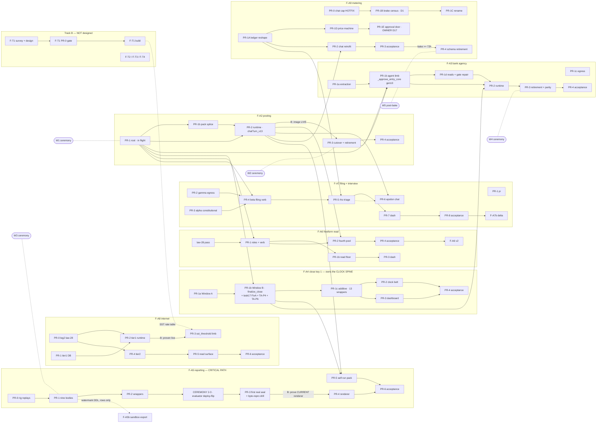

# Wave F — max-parallel finish plan (DAG · critical path · waves · merge train · ceremonies)

Planner output, 2026-08-23. Clock origin **T0 = the moment F-A2/PR-1 merges to `main`**
(it is in final fix rounds tonight; ~3.5 h to land from now). All hours are wall clock after T0
unless marked "from now". Zero quality reduction assumed: every code PR takes the full ADR-061
ladder (design → delta → as-built + a cross-model pass) in **parallel review lanes**, never skipped.

## 0. The headline, stated honestly before the detail

- **Track A (F-A2 remainder, F-A3…F-A9) can finish in ~30 h after T0** — critical path 30.0 h, co-critical
  shadow 29.3 h. p50 with real friction: **T0 + 48 h** (52 h from now).
- **F-A9/PR-4 cannot land inside 48 h without weakening its own gate.** Its third condition is "a bake
  period has passed with the new ledger's monthly numbers cross-checked against the old one's last live
  figures". Shortening the bake IS a quality reduction. Scheduled at **T0 + ≥96 h**.
  **RULED 2026-08-23 (owner): the third condition is REPLACED, not shortened** — PR-4 rides the Wave-G
  factory-reset ceremony (legacy data dies there anyway) and verification becomes a controlled-denominator
  assertion during the Wave-G e2e corpus run, strictly stronger evidence than the old bake+cross-check.
  **W5 is removed from the sprint's ceremony set** (§5, `metering-gate-record.md` §7 item 4).
- **RULED 2026-08-23 (owner): the R1 authoring-gate relaxation is APPROVED** (§7) — F-A2/PR-3 authors in
  wave 0 now (a lane is opening); only the MERGE and the ceremony stay hard-gated on F-A2/PR-2-live.
- **Track B (F-T1…F-T4) cannot finish in 48 h, or in 96.** It has no survey, no design, no annexes, no PR-0
  gate and therefore no PR list — unlike every Track-A lane. Design → PR-0 gate → ADR-061 ladder for four
  tax engines is **≈ 250–400 agent-lane hours, 14–21 days**. The gate and the ladder ARE the quality.
- **F-A5b** (no design doc) and **F-A6 v2** (blocked on the D-22 owner ruling) each need a design pass plus
  their own law-28 cross-model pass before a single line is written.

So: **"all of Wave F"** splits into a 48-hour half (Track A) and a three-week half (Track B).
The plan below maximises the first and starts the second in wave 0 so it is not serialised behind it.

---

## 1. The DAG — adjacency list

Edge types: **B** = build-dep (the successor's *authoring* cannot honestly start) · **M** = merge-dep
(build may stack on an unmerged branch; only the merge is ordered) · **C** = ceremony-dep (needs a
D1 window or a deploy applied to the LIVE estate) · **O** = owner-act.

```
F-A2/PR-1 (root, in flight)      -> F-A2/PR-1b [M] ; F-A2/PR-2 [M] ; F-A3/PR-1b [M] ;
                                    F-A4/PR-1b [M] ; F-A6/PR-1 [M] ; F-A7/PR-4B [M]
F-A2/PR-1b                       -> F-A2/PR-2 [M]
F-A2/PR-2                        -> F-A2/PR-3 [B+C: "image verified LIVE"] ; F-A6/PR-2 [M chatTurn] ;
                                    F-A7/PR-6eps [M chatTurn] ; F-A9/PR-2 [M chatTurn] ;
                                    F-A5/PR-5 [M chatTurn] ; F-A3/PR-3 [M chatTurn]
F-A2/PR-3                        -> F-A3/PR-1b [M] ; F-A2/PR-4 [C: W2]
F-A2/PR-4 (acceptance, 0 code)   -> terminal; re-extract 20 docs AFTER W2 (law 29 forced order)

F-A3/PR-1a                       -> F-A3/PR-1b [M]
F-A3/PR-1b                       -> F-A3/PR-1d [M] ; F-A3/PR-2 [M] ; F-A3/PR-3 [M]
F-A3/PR-1c (egress)              -> independent; rides W2 if C6-activated, else its own window
F-A3/PR-1d                       -> F-A3/PR-2 [M]
F-A3/PR-2 (runtime)              -> F-A3/PR-3 [M] ; deps: G1 ruling [O*], clara_wake_bank_login [O]
F-A3/PR-3                        -> F-A3/PR-4 [C: W4]

F-A4/PR-1a                       -> F-A4/PR-1b [M]  (A before B: shares _gate_outstanding_items)
F-A4/PR-1b (finalize_close)      -> F-A4/PR-1c [M] ; F-A5/PR-5 [C: clock spine live] ;
                                    F-A3/PR-2 [C: adopts the close_prep agent_tasks arm] ;
                                    TrackB task#17 13-cell battery rides this PR
F-A4/PR-1c                       -> F-A4/PR-2 [M] ; F-A4/PR-3 [M]
F-A4/PR-2, F-A4/PR-3             -> F-A4/PR-4 [C]

F-A5/PR-0 (rig replays P1-P15)   -> F-A5/PR-1 [B]
F-A5/PR-1                        -> F-A5/PR-2 [M] ; F-A5b watermark rows [M]
F-A5/PR-2                        -> F-A5/CEREMONY-2-3 [C evaluator deploy-flip]
F-A5/CEREMONY-2-3                -> F-A5/PR-3 [B: the core refuses evaluator_undeployed]
F-A5/PR-3 (first real seal+drill)-> F-A5/PR-4 [B: drill must prove the CURRENT renderer first]
F-A5/PR-4 (renderer, fly deploy) -> F-A5/PR-6 [C]
F-A5/PR-5 (self-run pack)        -> F-A5/PR-6 [M] ; deps: F-A4 clock spine [C], F-A2/PR-2 [M]

F-A6/law28-pass (review lane)    -> F-A6/PR-1 [merge gate]
F-A6/PR-1                        -> F-A6/PR-1b [M] ; F-A6/PR-2 [M]
F-A6/PR-1b                       -> F-A6/PR-3 [M]
F-A6/PR-2                        -> F-A6/PR-4 [C] ; deps: clara_freeform_login secret [O]
F-A6/PR-1..4                     -> F-A6v2 [B] ; deps: D-22 ruling [O], its own law-28 pass

F-A7/PR-1pi                      -> independent, additive, no D1
F-A7/PR-2gam                     -> F-A7/PR-4B [M] ; F-A7/PR-5rho [M]
F-A7/PR-3alp                     -> F-A7/PR-4B [M]
F-A7/PR-4B                       -> F-A7/PR-5rho [M]   (extends the wake CHECK family LAST)
F-A9/PR-1A                       -> F-A7/PR-5rho [M: llm_usage_events prestate probe]
F-A7/PR-5rho                     -> F-A7/PR-7dash [M] ; F-A7/PR-8acc [C]
F-A7/PR-7dash                    -> F-A7/PR-8acc [M]
F-A7/PR-8acc                     -> F-A7b/PR-1del [B: own item, opened after F-A7a acceptance]

F-A8/PR-0 leg2 (law-28)          -> F-A8/PR-2 [merge gate] ; F-A8/PR-4 [merge gate, EXTENDED pass]
F-A8/PR-1                        -> F-A8/PR-2 [M] ; F-A8/PR-5 [M]
F-A8/PR-2                        -> F-A8/PR-3 [B+C: proven live first]
F-A8/PR-4                        -> F-A8/PR-5 [M]
F-A8/PR-1..5                     -> F-A8/PR-6 [C] ; deps: owner one-click approve+override [O]

F-A9/PR-0 (chat cap hotfix)      -> F-A9/PR-1B [M]
F-A9/PR-1A (ledger reshape)      -> F-A9/PR-1D [M] ; F-A7/PR-5rho [M] ; every item's call_kind row
F-A9/PR-1B                       -> F-A9/PR-1C [M] ; F-A9/PR-4 [C+bake]
F-A9/PR-1D                       -> F-A9/PR-1E [B+O: D17 "which firm's owner"]
F-A9/PR-1A..1D,PR-2              -> F-A9/PR-3 [C]
F-A9/PR-3 + bake >= 72h          -> F-A9/PR-4 [C: W5, its own D1 window]

TrackB/F-T1 design -> F-T1 PR-0 gate -> F-T1 PRs -> F-A8 SST-rate case arm
TrackB/F-T4        -> task#17 battery rides F-A4/PR-1b; the P-3 census is its own
F-A5b design       -> F-A5b PR-0 (law-28) -> F-A5b build ; needs F-A5/PR-1's DDL [M]
```

`G1 [O*]` — see §6: I assess this as **already ruled by R-L7** (F-A4 owns the clock spine; F-A3/F-A5/F-A8
adopt it). It needs a one-line record, not a new sitting.

### Mermaid



---

## 2. Critical path — 30.0 h after T0

**The chain (F-A5's reporting spine):**

| # | Step | h | cum |
|---|---|---|---|
| 1 | F-A2/PR-1 merges = **T0**; W1 runs in parallel with the F-A5 lane | 0 | 0.0 |
| 2 | F-A5/PR-0 (rig replays P1-P15) merged — built in wave 0, docs-only CI | 0.4 | 0.4 |
| 3 | F-A5/PR-1 nine CoR'd bodies — built in wave 0; queue slot + CI + merge | 5.6 | 6.0 |
| 4 | F-A5/PR-2 wrappers / grants / census — built in wave 0; CI + merge | 2.0 | 8.0 |
| 5 | **CEREMONY 2-3** — `_tf_evaluator_deploy_once` flip from merged main (+ RPR `reporting_period` mint) | 1.0 | 9.0 |
| 6 | **F-A5/PR-3 — first real seal + three-arm byte-reproduction drill + the crude /reports doors** | 11.0 | 20.0 |
| 7 | PR-3 review tail + CI + merge | 2.0 | 22.0 |
| 8 | F-A5/PR-4 renderer — code pre-built; fly deploy, fresh digest, DR-render recipe, re-verify | 2.5 | 24.5 |
| 9 | F-A5/PR-6 acceptance — real books run+seal+render+issue, **both polarities of every wall** (law 31), synthetic round per ADR-048 | 5.0 | 29.5 |
| 10 | PR-6 docs merge | 0.5 | **30.0** |

**Co-critical shadow (F-A3's bank spine) — 29.3 h.** F-A2/PR-1 → W1 (2.0) → F-A2/PR-2 CI+merge+fly
deploy+live verify (1.6) → **F-A2/PR-3 build 8.0** (3 sub-lanes; **12.0 unsplit** — this is the design's
*build-time* gate on "PR-2's image verified live") → review tail+CI+merge (2.9) → **W2** (2.5) →
F-A3/PR-1d+`PR-2` merge & deploy (2.5) → F-A3/PR-3 re-derive against the merged tips (3.0) + CI/merge
(0.9) → **W4** (1.5) → F-A3/PR-4 acceptance run (4.0) + merge (0.4) = **29.3 h**.

The two chains sit 0.7 h apart. **Both must be driven; slipping either slips the wave.**

**Resource co-constraints (they do not extend the path, but they leave <40 % slack):** **CI** — 48 code PRs
× ~5 jobs × ~8 min ≈ **1 920 job-min ÷ 2 runners ≈ 16 h of runner wall clock**; per-PR latency 25–45 min,
degrading to the 45-min end whenever more than two PRs queue; fits under 30 h at ~55 % duty, **with no room
for a re-run storm**. **Merges** — 58 × 15 min = **14.5 h serialized** (~50 % duty), needing a dedicated
merge-conductor lane held for the whole window; no builder ever merges its own PR.

---

## 3. Waves of parallel build lanes

Every lane gets its own git worktree, its own throwaway Postgres on its own port, its own container name.
Port bands: **F-A2 5541x · F-A3 5551x/5552x · F-A4 5561x · F-A5 5571x/5572x · F-A6 5581x · F-A7 5591x/5592x
· F-A8 5601x · F-A9 5611x · severed + Track-B 5621x/5622x.**

### Wave 0 — starts NOW, before F-A2/PR-1 merges (25 lanes)

| Lane | Item / PR | Base branch | Port | Shared-surface conflicts | Resolved at merge by |
|---|---|---|---|---|---|
| L00 | **State truing** — PROGRESS.md + `docs/adr/README.md` still read laws 78-81 "PENDING sign-off"; the owner ratified 2026-08-22 | `main` | — | PROGRESS.md (contended by every lane) | conductor; **must land first or a correct reviewer blocks every PR-1** |
| L01 | F-A2/PR-1b | f-a2/pr-1 | 55411 | `get_context_pack` splice chain | self — no other consumer |
| L02 | F-A2/PR-2 | f-a2/pr-1 + L01 | 55412 | `registry.ts` · `pools.mjs` · chatTurn `_vN` (**claims v13**) · `llm_usage_events` | conductor: **first claim on the chain** |
| L03 | F-A3/PR-1a (sha-pin `match_bank_line/6` first) | `main` | 55511 | none | — |
| L04 | F-A3/PR-1b — **3 sub-lanes** (24 h) | f-a2/pr-1 | 55512-14 | `wake_credentials` CHECK ×2 · `mint_wake_credential` ×2 · `_approve_entry_core` **gen 10** | conductor; re-read live text via `pg_get_constraintdef`, never the migration file; rig-replay P-14 decides 23 vs 24 bodies |
| L05 | F-A3/PR-1c egress | `main` | 55515 | `egress purpose CHECK`s ×3 + the doc-sha conjunct · `GOVERNED_EGRESS_PURPOSES` | collides with F-A7/gamma — **gamma merges second and re-reads** |
| L06 | F-A4/PR-1a Window A | `main` | 55611 | `_gate_outstanding_items` (read inside `finalize_close`) | **A merges before B** — that is why A exists |
| L07 | F-A4/PR-1b Window B — 2 sub-lanes | `main` + L06 | 55612-13 | `finalize_close` · `reopen_fiscal_year` · `wake_credentials` CHECK (`close_prep`) · `agent_tasks` trigger arms | **sole owner of task#17 Fix A + TA-P4 receipt cols + TA-P6 segregation** (the contract's one-window rule) |
| L08 | F-A4/PR-1c additive — 13 wrappers, UNGRANTED | L07 | 55614 | `mint_wake_credential` sibling (the live 5-arg body untouched) | grants ride PR-2 / PR-3, never here |
| L09 | F-A5/PR-0 rig replays P1-P15 | `main` | 55711 | none | — |
| L10 | F-A5/PR-1 nine bodies — 2 sub-lanes | L09 | 55712-13 | none — **disjoint from F-A2's list, `finalize_close` untouched** (re-proved, not assumed) | — |
| L11 | F-A5/PR-2 wrappers + census | L10 | 55714 | `wake_fn_allowlist` (`interactive` kind) | roster census C.2 in both directions |
| L12 | **F-A6 law-28 cross-model pass** (review lane, no build) | — | — | merge gate on F-A6/PR-1 | non-negotiable; the contract imposes it |
| L13 | F-A6/PR-1 — 35 relations, 2 roles, RLS | f-a2/pr-1 | 55811 | `wake_credentials` CHECK (consumed) · wiki dynamic-SQL allowlist · `rig-meta.mjs` T17/T18 | conductor; F-A6 adds **no** wake kind |
| L14 | F-A6/PR-1b read floor | L13 | 55812 | `audit_log` policy idiom | — |
| L15 | F-A7/PR-1 pi additive | `main` | 55911 | `agent_receipts_visible` common-column contract (binds F-A2/4/5/6/8) | each item conforms; pi's view unions |
| L16 | F-A7/PR-2 gamma egress | `main` | 55912 | egress purpose CHECKs · `_enqueue_invoice_facts_core` · `prepare_egress_dispatch` · `persist_document_extraction` | **re-derive against F-A3/PR-1c before authoring — one CoR or a strict ordering, never two** |
| L17 | F-A7/PR-3 alpha constitutional — 2 sub-lanes | `main` | 55913-14 | 7 re-derivation bodies (`assert_client_resolved`, `_tf_stamp_document_pipeline`, `file_document`, …) | two independently-revertable files |
| L18 | **F-A8/PR-0 leg 2** — law-28 on the Tier-2 injection surface | — | — | merge gate on F-A8/PR-2 **and**, extended, on PR-4 | scope is wider than v1 framed: Tier-1 reads attacker text too |
| L19 | F-A8/PR-1 Tier-1 DB, greenfield | `main` | 56011 | `wake_fn_allowlist` (1 row) · T17 / T18 / DEFINER rosters | rosters must be **RED before, green after** the lane's own edit |
| L20 | F-A9/PR-0 chat token-cap hotfix | `main` | 56111 | `begin_chat_turn` shared limits SELECT | keeps `max_concurrent_runs`; drops only the token block |
| L21 | F-A9/PR-1A ledger reshape | `main` | 56112 | **`llm_usage_events`** (3 nullable, +5 cols, +2 CHECKs) · `agent_tasks` FK | **must precede F-A7/rho and every item's first usage row** |
| L22 | F-A9/PR-1D price machine | L21 | 56113 | `llm_usage_events` read-only | — |
| L23 | **F-T1 survey + design** (SST engine; F-A8 waits on its rate table) | `main` | 56211 | Track B has no PR list — this lane creates one | its own PR-0 gate follows |
| L24 | **F-A5b design pass** + **F-A6 v2 survey** (v2 blocked on D-22) | `main` | 56221 | `watermark_policy_versions` — **rows only, never DDL** | F-A5/PR-1 owns the DDL |

### Wave 1 — opens at T0 (22 lanes)

F-A2/PR-3 (3 sub-lanes; opens T+3.6 when PR-2 is live) · F-A3/PR-1d · F-A3/PR-2 (needs G1 recorded)
· **F-A3/PR-3 (3 sub-lanes, 20 h)** · F-A4/PR-2 · F-A4/PR-3 · F-A5/PR-4 renderer code ·
F-A5/PR-5 self-run pack · F-A6/PR-2 · F-A6/PR-3 · F-A7/PR-4beta (2 sub-lanes) · F-A7/PR-5rho ·
F-A7/PR-6eps · F-A7/PR-7dash · F-A7b/PR-1delta (2 sub-lanes) · F-A8/PR-2 · F-A8/PR-4 ·
F-A8/PR-5 · F-A9/PR-1B · F-A9/PR-1C · F-A9/PR-2 · F-A9/PR-1E (only if D17 rules; otherwise the
fail-closed default ships and the lane closes).

Bases are stacked branches over the predecessor's unmerged tip — legitimate because **migration numbers are
claimed at MERGE** (`UNNUMBERED_*` files) and every DB lane re-derives its target body by **rig replay
against the merged tip** before its PR opens, never from migration text.

### Wave 2 — live-gated and acceptance (12 lanes)
F-A8/PR-3 (T+6, needs PR-2 live) · F-A5/PR-3 (T+9, needs the deploy-flip) · then the eight acceptance
lanes — F-A2/PR-4, F-A3/PR-4, F-A4/PR-4, F-A5/PR-6, F-A6/PR-4, F-A7/PR-8, F-A8/PR-6,
F-A9/PR-3 — plus the `F-A6v2` and `F-A5b` builds.

### Wave 3 — outside the 48 h by construction
F-A9/PR-4 (after a ≥72 h bake) · Track B `F-T1` PR-0 gate + build · `F-T2` / `F-T3` / `F-T4` design.

---

## 4. Merge train — order and the reason for each position

**One line:**
`L00-state-truing` → F-A4/PR-1a → F-A9/PR-0 → **F-A2/PR-1** → **[W1]** → F-A2/PR-1b → F-A9/PR-1A
→ F-A2/PR-2 → F-A5/PR-0 → F-A5/PR-1 → F-A5/PR-2 → **[C-flip]** → F-A8/PR-0 → F-A8/PR-1 →
F-A8/PR-2 → F-A7/PR-1pi → F-A6/PR-1 → F-A6/PR-1b → F-A6/PR-2 → F-A6/PR-3 → F-A8/PR-3 →
F-A4/PR-1b → F-A4/PR-1c → F-A4/PR-2 → F-A4/PR-3 → F-A2/PR-3 → F-A3/PR-1a → F-A3/PR-1b →
F-A3/PR-1c → F-A7/PR-2gam → F-A7/PR-3alp → F-A7/PR-4beta → **[W2]** → F-A3/PR-1d → F-A3/PR-2 →
F-A7/PR-5rho → F-A7/PR-6eps → F-A9/PR-1C → F-A9/PR-1D → F-A9/PR-1E → F-A9/PR-2 → F-A8/PR-4 →
F-A8/PR-5 → F-A5/PR-5 → F-A9/PR-1B → F-A6/PR-4 → F-A7/PR-7dash → F-A7b/PR-1delta → **[W3]** →
F-A5/PR-3 → F-A5/PR-4 → F-A3/PR-3 → **[W4]** → F-A8/PR-6 → F-A2/PR-4 → F-A9/PR-3 →
F-A7/PR-8acc → F-A4/PR-4 → F-A3/PR-4 → F-A5/PR-6 → `F-A6v2` → `F-A5b` → **[W5, post-bake]**
F-A9/PR-4.

**Why each contested position:**
1. `L00` first — the on-disk state authority still says laws 78-81 are pending; a correct reviewer blocks
   every PR-1 until it is trued. The cheapest unblock in the whole plan.
2. F-A4/PR-1a before F-A2/PR-1 — it depends on nothing from F-A2, and putting it in W1 buys a free
   ceremony slot for its three D1 rows.
3. F-A9/PR-0 third — the chat cap is **live behaviour already in violation of a ruling**; the contract
   ships it ahead of its own parent, so it ships ahead of everything.
4. F-A9/PR-1A before F-A2/PR-2 — PR-2's go-live is the first F-A2 lane to emit usage rows, and
   `client_id` + triggering actor must exist **before the first production row** (append-only, irreversible).
5. **wake_credentials CHECK order = merge order**: F-A2/PR-1 (`interactive_client`) → F-A4/PR-1b
   (`close_prep`) → F-A3/PR-1b (`bank_agent`) → F-A7/PR-4beta (`filing`). Extend-only; each later
   migration re-reads the LIVE text with `pg_get_constraintdef` and carries a prestate probe that **aborts
   loudly** if its predecessor's value is absent. Conflicts here are mechanical, never semantic.
6. **chatTurn `_vN` order**: F-A2/PR-2 claims v13 first (owner-ruled D34). Every later claimant —
   F-A6/PR-2, F-A7/PR-6eps, F-A9/PR-2, F-A5/PR-5, F-A3/PR-3 — reads the **live registry at merge**
   and takes the next free number. No number named in a design doc is ever trusted.
7. F-A2/PR-3 after the whole F-A4 block — F-A4's Window B and F-A2's cutover are disjoint, and putting
   F-A4 first lets its 16 D1 rows and F-A2's DROPs share W2 with no ordering argument.
8. F-A3/PR-1a/1b/1c after F-A2/PR-3 — F-A3's own annex sequences it there, and `_approve_entry_core`
   gen 10 must be authored against F-A2's **merged** prosrc with its sha pinned.
9. F-A7/PR-2gam after F-A3/PR-1c — both touch the egress purpose CHECK family; second re-reads.
10. F-A9/PR-1B late — it is F-A9's only D1 body, so it merges adjacent to W3.
11. Acceptance PRs last, each behind its own item's final ceremony: **law 29's forced order — ceremony →
    re-extract → evaluate**, never the reverse.

---

## 5. Consolidated ceremony windows

| Window | T | len | Bodies |
|---|---|---|---|
| **W1** | T0+0.5 | 2.0 h | **F-A2/PR-1**: `_approve_entry_core` gen 9 · `entry_post_receipts` + `t_je_agent_post_receipt` · both `wake_credentials` CHECKs + both `mint_wake_credential` gates for `interactive_client` · the 8th-body sighting excision · B15's `_document_direction` recut · **F-A4/PR-1a**: `_evaluate_one_gate`, `_gate_outstanding_items`, the 14th `close_gate_checks` row · **F-A9/PR-0**: `begin_chat_turn` |
| **C-flip** | T0+9 | 0.5 h | Not a quiesce. `_tf_evaluator_deploy_once` flips `evaluator_versions.deployed` for `evaluate_fs_pack_agent v1`, from merged main; plus the RPR `reporting_period` mint (OQ-4) |
| **W2** | T0+16 | 2.5 h | Strict order — **F-A2/PR-3** (cutover: `execute_rule_post` + the rule_post consumer, the coding/autopost rule verbs, the expiry belt, the binding-post-control CI gate) → **F-A4/PR-1b** (16 rows: 6 ALTERs, `finalize_close`, `reopen_fiscal_year`, `attest_close_exception`, begin/abandon_close, open/propose_fiscal_year, `mint_month_snapshot`, both `_tf_agent_task_*` — **carrying task #17 Fix A + TA-P4's close-side receipt columns + TA-P6's `segregation_mode`, the contract's mandated ONE window**) → **F-A3/PR-1a** (9 extractions) → **F-A3/PR-1b** (10 bodies + 7 DDL groups, `_approve_entry_core` gen 10, `bank_agent`) → **F-A3/PR-1c** (5 egress bodies + 4 ACCESS EXCLUSIVE CHECK swaps) → **F-A7/gamma** → **F-A7/alpha** (2 files) → **F-A7/beta** (`filing` kind, 2 deferred triggers) |
| **W3** | T0+22 | 2.0 h | **F-A5/PR-1** (9 report bodies + 2 CHECK swaps) · **F-A9/PR-1B** (`admit_autodraft_task`, `sweep_run_items` CHECK, `firm_limits` column disposals) · **F-A6/PR-1** (35 brief ACCESS EXCLUSIVE `CREATE POLICY` locks — additive under load, rides for free) · **F-A7b/delta** (`update_onboarding_plan`, `begin_client_onboarding`) |
| **W4** | T0+25 | 1.5 h | **F-A3/PR-3** retirement drops (the bank rules machine whole) plus any late additive |
| **W5** | ≥T0+96 | 1.5 h | **F-A9/PR-4** — `admit_autodraft_task`, both `settle_autodraft_task` overloads, `settle_chat_turn`, the three retry-door refund blocks, and the disposal of `firm_usage_daily` / `task_usage`. **This removes live real data**; the owner's ruling is already recorded as that sentence. **REMOVED 2026-08-23 (owner ruling) — PR-4 no longer waits on this window.** It rides the Wave-G factory-reset ceremony instead (legacy data dies there anyway, ADR-0072 ①/ADR-0075); verification is a controlled-denominator assertion during the Wave-G e2e corpus run, not a standalone bake. Detail: `metering-gate-record.md` §7 item 4. |

Standing runbook hazards apply to every quiesce window: the backup-app DSN bridge, a **split-argv**
`sleep 5400` (quoted, it flaps argv-0), the 110 s quiesce, `fly.exe`'s non-zero exit after a *successful*
non-tty `ssh -C`, the post-restart zombie-pooler sweep (terminate idle runtime-login sessions), `PG*` vars
for rig runs and never `DATABASE_URL`, the reconciler herd against two lane slots, and a **pre-quiesce
prosrc sha tripwire** on every body about to be replaced.

Deploy slots (fly images, not quiesce): **D-a** T0+3.6 (F-A2/PR-2) · **D-b** T0+11 (F-A6/PR-2, F-A8/PR-2,
F-A9/PR-2) · **D-c** T0+19 (F-A3/PR-2, F-A7/rho + eps, F-A5/PR-5) · **D-d** T0+24 (F-A5/PR-4 renderer,
fresh digest + DR-render recipe update). Bundle-grep the built bundle after **every** workflow-file edit.

---

## 6. Owner acts — the honest list

The owner wants zero. Here is what survives scrutiny.

**Removable — do not ask (4):**
- **G1, the wake-execution mechanism ruling.** Already answered by **R-L7**: F-A4 owns the clock spine and
  mints the `close_prep` `agent_tasks` arm; F-A3 / F-A5 / F-A8 **adopt** it. F-A3's own design says it
  "assumes nothing and bakes no kind" — adopting F-A4's arm satisfies that literally. **Action: record G1 as
  resolved-by-R-L7 in F-A3's annex; no sitting.** A wrong reading costs a D1 window, so pair the record with
  a two-minute owner confirmation, not a grilling round.
- **F-A5's evaluator deploy-flip (CEREMONY 2-3).** Not password-bearing, so the standing ceremony-run grant
  covers it. The agent executes it.
- **OQ-4, minting a `reporting_period`.** On ROME PUBLIC ADVISORY (the synthetic sandbox) the agent exercises
  the real audited door as the owner's delegate and ledgers it (the 2026-08-22 widening).
- **The `artifact_watermark` wording, three languages (OQ-1/OQ-2).** The fail-closed default already ships
  (no row seeded, S7's literals stay, R-N1 registered). Off the path entirely.

**Not removable — 3, and why:**
1. **`clara_wake_bank_login` — role + password + Fly secret** (F-A3/PR-2, on the co-critical path).
   Password-bearing. Schedule **T0 + 14**, ~10 min. Verify with a **process read** (`printenv` in the VM)
   after `fly secrets deploy` — a plain restart does not bind a staged secret, and `fly secrets list` is an
   app-level read that will lie to you.
2. **`clara_freeform_login` — LOGIN + password + `CLARA_FREEFORM_DATABASE_URL`** (F-A6/PR-2). Same class,
   same reason, same verification. Schedule **T0 + 9**, ~10 min.
3. **F-A8/PR-6's real owner one-click APPROVE and one-click OVERRIDE on real drafts.** The item's entire
   claim is *an audited owner door, not a PR*. An agent-delegate click proves the mechanism; it does not
   prove the door. Mitigation: prove **both polarities on `fx_rates` under RPR as the delegate** (agent,
   ledgered) and reserve **two real clicks, ~5 min**, at T0+19. That is the irreducible floor.

**Off the critical path but still owner-only (2):** **D17** — which firm's owner may approve a firm-agnostic
price row (F-A9/PR-1E; the fail-closed default ships without it). **D-22** — may a client-pinned session
wait for v2 (`F-A6 v2`'s design pass cannot open without it). Batch both into one 10-minute sitting at
T0+2 so neither becomes a path item later.

**Total irreducible owner time on the critical path: about 25 minutes, in three slots.**

---

## 7. Top risks to a 48-hour finish, and the mitigation

| # | Risk | Mitigation |
|---|---|---|
| R1 | **F-A2/PR-3's build-time gate on "PR-2 image verified live"** puts 8–12 h of authoring *after* T0+3.6 and is what makes F-A3 co-critical. | Ask the owner for one narrow relaxation: **author PR-3 in wave 0, gate only the MERGE and the ceremony on PR-2-live**. The stranding hazard the gate exists to prevent is an *apply*-time hazard, not an authoring one. Saves 8 h. If declined: three sub-lanes (drops / consumer + roster / the dashboard `kb_rule_proposal` part), 8 h. **RULED 2026-08-23 (owner): APPROVED as specified.** Authoring proceeds in wave 0 — a lane is opening now. Protection unchanged; only the authoring serialization is removed. |
| R2 | **CI capacity.** ~16 h of 2-runner wall clock with no slack; one re-run storm (a flaky e2e, a rebase cascade) turns 30 h into 45. | **Stand up `clara-wsl-3` (and -4) before wave 0 opens** — same labels, same workflows, no quality change, halves CI wall clock. Plus the shared-host race discipline already learned: run-scoped docker tags, per-instance action dest, one flock per resource. Batch docs-only PRs (lint-only, ~5 min). |
| R3 | **W2 is an eight-migration mega-window.** One failure mid-window extends the quiesce with eight lanes' work in the air. | Pre-flight the **entire** W2 sequence on a throwaway rig as one apply-onto-existing run, in order, twice. Carry a per-migration **prosrc sha tripwire**; a mismatch aborts before the quiesce, never during it. Keep W3 as the designated overflow slot — if W2 runs long, F-A7/alpha+beta roll to W3 rather than extending the window. |
| R4 | **Rig-replay prediction misses.** F-A9's `admit_autodraft_task` (7 generations, 3 splices), F-A3's P-14 (`_approve_entry_core` accepts the bank ctx keys → 23 vs 24 bodies), F-A7's four **0038-spliced** bodies whose live text exists in no file in the repo. | Every DB lane's **first hour** is a rig replay of `pg_get_functiondef` against the frontier, never a read of migration text. Budget the miss: F-A9/PR-1B's 8 h is a **floor**, not a ceiling. Lanes report the replay result as a settle-event before authoring a line. |
| R5 | **Cross-item CHECK / registry collisions** (wake CHECK ×4 claimants, chatTurn `_vN` ×6, `registry.ts` ×7, egress purpose ×2, `llm_usage_events` ×5). | The merge-train order in §4 **is** the resolution, and it is mechanical: prestate probes that abort loudly, live-text re-reads via `pg_get_constraintdef`, `_vN` numbers claimed only at merge. One dedicated merge conductor owns the train end to end. |
| R6 | **Review throughput, not build throughput, becomes the wall.** ~331 review hours across 48 code PRs, each needing design + delta + as-built + a cross-model pass, plus **three mandatory law-28 cross-model passes** (F-A6/PR-1, F-A8 PR-2 and PR-4, F-A5b) that are contract obligations, not discretion. | Stand up review lanes **1:1 with build lanes from wave 0**, models pinned (`sonnet-5` xhigh default, `claude-opus-5` xhigh for judgement-logic PRs, Codex `gpt-5.6-sol` xhigh for the cross-model leg; native fresh-context lanes substitute when Codex is limit-blocked — the standing ruling is WHICH lane, not WHETHER). Open the three law-28 passes in wave 0; they gate merges, not builds. |
| R7 | **Acceptance is wall-clock-bound and cannot be parallelised away.** F-A2's 20-document re-extract (law 29's forced order), F-A5's real seal + byte-repro drill, F-A3's unattended bank round, F-A8's live fetch cycle — roughly 30 of the 48 hours. | Sequence acceptance runs against **different clients** so they overlap: RPR for F-A5 and F-A8, the F-A2 corpus for F-A2/PR-4, a seeded BELCORT fixture for F-A3/F-A4. State the denominator every time (D37). Never compress the re-extract to make a number look better — that is the one shortcut that destroys the point of the exercise. |
| R8 | **WSL split-brain / runner death.** Seen twice: `wsl -l -v` shows Stopped while `vmmem` lives → two userlands fight one registration; zero failing steps plus vanished logs means runner death, not a test failure. | Shutdown-when-idle only, never `wsl --shutdown` with busy runners; a detached keeper for the NAT; a watchdog lane that polls checks itself — **the gh-watch family has lied four times, so poll, do not trust**. |
| R9 | **Track B is presented as "remaining work" but has no design.** Treating it as schedulable inside 48 h is the largest planning error available here. | Say it out loud (§0). Start F-T1's survey + design in **wave 0** (lane L23) so its PR-0 gate can run while Track A merges — the only compression available that does not cut the gate. |
| R10 | **~25 concurrent lanes exceed coherent orchestration.** Lanes drift, report into the void (a lane's plain assistant text is invisible to the lead), or silently duplicate a shared body. | Every lane reports **settle-events only, via SendMessage**, never plain text. One shared-surface ledger owned by the conductor; a lane touching a listed surface announces it **before** authoring. An isolated worktree per git-active lane — the shared tree has already bitten a builder. |

---

## 8. Honest hour range

| Scope | Best | p50 | p90 |
|---|---|---|---|
| **Track A merged + W1–W4 run + acceptance recorded** (F-A2 rem., F-A3, F-A4, F-A5, F-A6, F-A7, F-A7b, F-A8, F-A9 except PR-4) — from **now** | **34 h** | **52 h** | **76 h** |
| …the same, from **T0** | 30 h | 48 h | 72 h |
| F-A9/PR-4 (W5) — gated on a ≥72 h bake it must not skip. **RULED 2026-08-23 (owner): re-homed to the Wave-G factory-reset ceremony instead, W5 removed — this row's figures are STALE pending the conductor's re-total** (§0, §5; detail `metering-gate-record.md` §7 item 4) | +96 h | +7 d | +7 d |
| **F-A5b** (design + law-28 + build + ladder) | +45 h | +60 h | +90 h |
| **F-A6 v2** (needs D-22 first) | +25 h | +35 h | +50 h |
| **Track B F-T1** (survey → design → PR-0 gate → build → ladder) | +90 h | +140 h | +200 h |
| **Track B F-T2 / F-T3 / F-T4** | +160 h | +260 h | +380 h |
| **ALL of Wave F, everything above, zero quality reduction** | **~12 d** | **~19 d** | **~28 d** |

Underlying volume: **≈ 449 build hours + ≈ 331 review hours ≈ 780 agent-lane hours for Track A alone**,
across ~22 concurrent lanes for ~35 h. Track B adds another 250–400.

**One sentence:** Track A finishes in a long day and a half if the runners are widened, the merge conductor
never leaves the chair, and R1's authoring gate is relaxed — but "all of Wave F" is a three-week number,
because Track B has never been designed and the PR-0 gate is exactly the quality this plan may not reduce.
